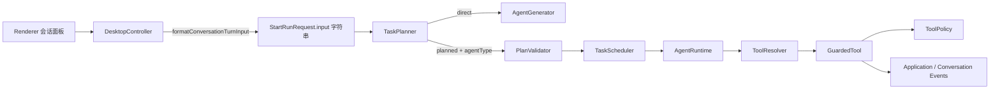
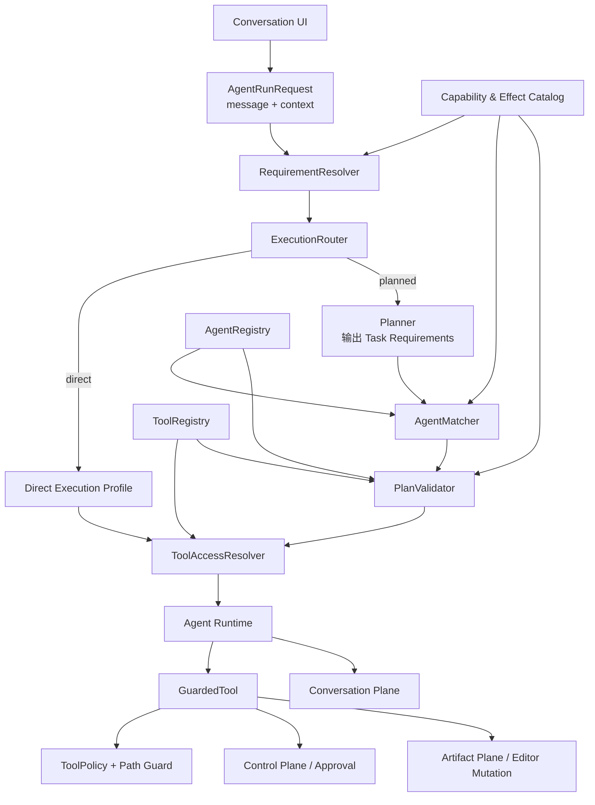

# StoryOS Agent 平台架构升级设计报告

> 状态：已实施  
> 日期：2026-08-24  
> 范围：升级现有 Agent、工具、调度与 UI 事件链的基础架构，不新增业务 Agent 或业务工具。

> 实施记录：结构化运行请求、Agent/Tool Manifest、能力目录、确定性路由、AgentMatcher、语义计划校验、Execution Grant、类型化失败和任务级会话事件均已接入生产入口；旧 marker 分流、旧 `input: string` 入口、Planner 指定 Agent 和旧 UI 事件兼容消费者已删除。

## 1. 执行摘要

StoryOS 目前已经具备 Agent 注册、任务规划、子 Agent 运行、工具解析、权限审批、工作区路径隔离和结构化会话事件等基础模块。这些模块不是推倒重来的对象。真正需要重构的是它们之间的契约：当前请求在进入运行时前被压平成 prompt 字符串，规划模型可以直接指定 Agent，Agent 的能力与副作用只存在于松散的 `metadata` 和工具名称中，计划校验器也没有验证“这个任务是否真的能由该 Agent 完成”。

这会导致一个典型错误：用户要求修改小说章节，规划器却把任务分给只拥有 `list_files`、`search_text`、`read_file` 的只读文本 Agent。该 Agent 只能反复探索文件路径，最终出现工作区越界提示并因审查失败结束。问题的根因不是某个路径参数写错，也不是缺少一句 prompt，而是架构没有把以下四件事建立成可校验的关系：

1. 用户本次请求需要什么能力；
2. 请求是否会产生副作用；
3. 哪个 Agent 声明并实际具备这些能力；
4. 哪些工具能在当前上下文中安全地完成任务。

推荐目标是建立一条类型化、可验证且不依赖字符串猜测的执行链：

```text
结构化请求
  -> RequirementResolver（需求解析）
  -> ExecutionRouter（direct / planned 决策）
  -> Planner（仅提出任务需求）
  -> AgentMatcher（匹配 Agent）
  -> PlanValidator（能力、上下文、副作用与依赖校验）
  -> ToolAccessResolver（计算本次可用工具）
  -> GuardedTool（审批、路径和执行边界）
  -> 结构化事件 / 结构化失败
```

本阶段只迁移现有 Agent 和现有工具到新契约。迁移完成后，删除临时的 `<storyos_workspace_context>` 字符串分流、旧的 `input: string` 运行入口以及依赖 `metadata.readOnly` 的隐式判断，不保留双路由或旧逻辑兜底。

## 2. 本次范围与非目标

### 2.1 本次必须完成

- 保持用户消息与编辑器上下文为结构化数据，直到模型适配边界才编译为 prompt。
- 建立强类型的 Agent Manifest、Tool Manifest、Execution Requirements 和 Task Failure。
- 将“任务需要什么”和“由谁执行”分离。
- 引入确定性的 ExecutionRouter、AgentMatcher 和增强版 PlanValidator。
- 让工具权限以 Tool Manifest 为事实来源，保留 `GuardedTool` 作为最终强制执行边界。
- 让 direct 与 planned 两条路径遵循同一套能力、副作用、上下文和工具规则。
- 保持 UI 的会话流、控制流和作品写入流彼此独立。
- 以一次内部契约切换完成迁移，删除旧实现，不运行长期兼容层。

### 2.2 本次明确不做

- 不新增业务 Agent、业务工具或对应业务流程。
- 不引入动态 Agent 商店、远程插件协议或多模型调度。
- 不重写现有书籍、章节、编辑器等业务服务。
- 不把小说正文重新复制到聊天消息中；作品内容仍应通过编辑器/作品流更新。
- 不公开模型的原始私有思维链。UI 展示的是可审计的阶段摘要、工具动作和结果状态，而不是内部推理原文。

## 3. 当前实现的结构与可保留部分

### 3.1 当前执行链



### 3.2 应保留并升级的基础

| 当前模块 | 价值 | 推荐处理 |
| --- | --- | --- |
| `AgentRegistry` | 已形成 Agent 的集中注册入口 | 升级为注册 `AgentManifest`，增加跨 Manifest 校验 |
| `ToolResolver` | 已集中管理工具实例 | 拆分“工具定义注册”和“本次实例解析”，保留实例解析职责 |
| `GuardedTool` | 工具调用前的统一强制执行点 | 保留；改为消费 Tool Manifest 与本次执行授权 |
| `ToolPolicy` | 已支持 allow / ask / deny 与会话授权 | 去除工具名硬编码，改为 Manifest 默认规则加输入级规则 |
| `AgentRuntime` | 已按 Agent 的工具列表隔离子 Agent | 升级为按已验证的 Execution Grant 解析工具 |
| `TaskPlanner` / `TaskScheduler` | 已具备 direct、planned、依赖和重试骨架 | 限制 Planner 权力；Scheduler 消费已验证任务与类型化失败 |
| `PlanValidator` | 已校验重复任务、依赖、环和深度 | 扩展为能力、上下文、副作用、Agent 和工具闭包校验 |
| 结构化 Conversation Events | 已支持 reasoning、assistant、tool、approval 等节点 | 继续作为 UI 唯一事实来源，并补齐 task/failure 事件 |
| 工作区路径保护 | 能正确拒绝 `/` 等越界目标 | 保留；改善上游参数生成与错误分类，而不是放松边界 |

结论：不需要重写整个 Agent 系统，应该重构核心契约和决策边界。

### 3.3 代码依据与文档关系

本报告基于以下当前实现，而不是仅依据 UI 截图推测：

| 代码位置 | 当前观察 |
| --- | --- |
| [`application/conversationContracts.ts`](../src/main/agent/application/conversationContracts.ts) | Renderer 到主进程的发送请求仍保留结构化 `context` |
| [`application/conversationTurnContext.ts`](../src/main/agent/application/conversationTurnContext.ts) | 负责将结构化上下文序列化为 `<storyos_workspace_context>` 文本 |
| [`electron/DesktopController.ts`](../src/main/agent/electron/DesktopController.ts) | 在启动 Agent 前调用格式化函数，成为结构丢失的位置 |
| [`application/contracts.ts`](../src/main/agent/application/contracts.ts) | `StartRunRequest` 仍以 `input: string` 作为运行协议 |
| [`Agent/types.ts`](../src/main/agent/Agent/types.ts) | Agent 主要声明工具列表，能力和副作用尚无强类型合同 |
| [`Agent/AgentRegistry.ts`](../src/main/agent/Agent/AgentRegistry.ts) | 提供集中注册，但尚不校验能力、工具、上下文与副作用闭包 |
| [`Agent/builtInAgents.ts`](../src/main/agent/Agent/builtInAgents.ts) | 三个内置文本 Agent 使用相同的只读文件工具，资格信息位于 metadata |
| [`Agent/orchestration/TaskPlanner.ts`](../src/main/agent/Agent/orchestration/TaskPlanner.ts) | 当前包含 marker 驱动的临时 direct 判定，Planner 仍能输出 Agent 类型 |
| [`Agent/orchestration/PlanValidator.ts`](../src/main/agent/Agent/orchestration/PlanValidator.ts) | 当前重点校验任务图结构，缺少语义授权校验 |
| [`tools/ToolResolver.ts`](../src/main/agent/tools/ToolResolver.ts) | 工具实例按名称解析，尚无独立 Tool Manifest 注册表 |
| [`security/ToolPolicy.ts`](../src/main/agent/security/ToolPolicy.ts) | 默认权限以工具名硬编码 |
| [`security/GuardedTool.ts`](../src/main/agent/security/GuardedTool.ts) | 已是正确的统一执行防线，推荐保留并升级输入合同 |
| [`Agent/AgentRuntime.ts`](../src/main/agent/Agent/AgentRuntime.ts) | planned 子 Agent 已按定义限制工具，是 Execution Grant 的良好落点 |
| [`Agent/AgentGenerator.ts`](../src/main/agent/Agent/AgentGenerator.ts) | direct 主 Agent 当前可解析全部工具，需要改为显式执行配置 |

仓库已有的 [`single-model-multi-agent-todo.md`](single-model-multi-agent-todo.md) 记录了运行恢复、取消、预算、权限、路径隔离和 E2E 等基础能力。本报告不否定这些成果，而是在其上补齐“结构化需求—能力匹配—确定性授权”这一层。已有安全与运行能力应迁移到新合同，不应重复实现。

## 4. 当前问题的根因分析

### 4.1 结构化上下文过早丢失

Renderer 发出的 `SendConversationMessageRequest` 已经包含 `content` 与 `ConversationTurnContext`。但 `DesktopController` 很快调用 `formatConversationTurnInput`，将项目、书籍、章节、选区和章节正文拼接到 `<storyos_workspace_context>` 标签中，再以 `StartRunRequest.input: string` 传入运行时。

直接后果：

- 路由器看不到可靠的 `context.kind`、`bookId`、`chapterId` 等字段；
- 无法区分“上下文里存在章节”和“用户要求修改章节”；
- 权限、数据最小化和测试都只能围绕字符串展开；
- 临时逻辑只能通过查找标签强制 direct，任何带书籍上下文的请求都会被粗略归类。

该标签可以作为最终模型 prompt 的序列化格式，但不能作为应用层和调度层的协议。

### 4.2 规划模型同时决定任务与执行者

当前 planned 计划中的任务直接包含 `agentType`。这意味着 Planner 不只是拆解任务，还决定了哪个 Agent 可执行任务。模型做出的选择随后只经过“Agent 是否存在、是否允许参与规划”的校验，没有验证能力、工具、副作用和上下文。

模型适合提出任务分解，不适合成为授权系统。执行者选择必须由确定性代码基于 Manifest 完成。

### 4.3 AgentDefinition 只描述工具名，不描述语义能力

当前 `AgentDefinition` 的关键字段是 `tools: string[]`，而 `readOnly`、`planningEligible`、`category` 等存在于开放的 `metadata` 中。工具列表能限制运行时调用，却不能回答：

- Agent 擅长什么任务；
- 需要哪类上下文；
- 是否允许产生某类副作用；
- 输出是什么形态；
- 为什么适合或不适合某个计划任务。

仅靠 Agent 名称、描述和 prompt 让模型猜测，无法稳定约束当前执行链，容易产生误路由。

### 4.4 工具语义分散在硬编码中

`ToolPolicy` 当前使用工具名到 `allow / ask / deny` 的硬编码映射；工具描述、参数 schema、实现和权限语义不在同一个定义中。新增工具时很容易出现：工具已经注册，但权限、副作用、上下文要求或审批摘要没有同步登记。

### 4.5 direct 与 planned 的授权模型不一致

planned 子 Agent 通过 `AgentDefinition.tools` 获得有限工具；direct 主 Agent 则可以看到解析器中的全部工具，再依赖审批和路径规则兜底。两者虽然都经过 `GuardedTool`，但“为什么本次能看到这个工具”没有统一的计算模型。

### 4.6 PlanValidator 只校验图结构

当前校验覆盖任务数量、Agent 存在性、planning eligibility、重复依赖、未知依赖、循环和深度。这些校验必要但不充分。它没有回答：

- 任务要求是否与 Agent 能力匹配；
- 任务声明只读但工具集合中是否含写工具；
- 当前上下文是否满足 Agent 或工具要求；
- 计划是否把有副作用的操作放入当前禁止写入的 planned 模式；
- 依赖结果是否能满足下游任务输入。

### 4.7 失败是文本，不是稳定协议

诸如 `Required task failed review: task_a` 的字符串无法让 UI、重试器和日志系统可靠区分：路由失败、参数错误、路径越界、用户拒绝、工具执行失败、审查不通过或模型中止。错误文本可以展示给用户，但内部必须先有稳定的失败码、阶段、可重试性和关联标识。

## 5. 设计原则与系统不变量

1. **结构化数据保持到边界**：只有 PromptCompiler 可以把结构化请求转换成模型文本。
2. **模型提出，系统裁决**：Planner 可以建议任务，不能授予 Agent 或工具权限。
3. **能力用于匹配，工具用于执行**：`capabilities` 描述“能做什么”，`tools` 描述“如何做”。
4. **副作用显式声明**：请求、任务、Agent 和工具都必须参与副作用校验。
5. **默认不扩大权限**：找不到匹配 Agent 时，不得静默选择一个名字相似的 Agent。
6. **上下文最小投影**：每个 Agent 只接收完成任务所需的上下文字段。
7. **所有工具调用经过同一执行边界**：direct 与 planned 均经过 ToolAccessResolver 与 GuardedTool。
8. **审批属于控制流**：审批 UI 不嵌入思考节点或普通工具详情。
9. **作品写入属于作品流**：章节生成增量进入编辑器，不作为聊天回答重复显示。
10. **无旧逻辑兜底**：新契约切换后删除 marker 路由、旧 `input` 入口和旧权限事实来源。
11. **声明驱动、核心稳定**：路由依赖 Manifest 和统一规则，不增加针对具体 Agent 名称的领域 `if/else`。

## 6. 目标架构



### 6.1 三个平面必须保持分离

| 平面 | 包含内容 | UI 位置 | 禁止混入 |
| --- | --- | --- | --- |
| Conversation Plane | 阶段摘要、工具动作状态、助手最终答复 | 对话时间线 | 原始私有思维链、完整作品正文写入流 |
| Control Plane | 审批、澄清、用户选择、取消 | 输入框接管区或固定控制区 | 思考节点、折叠的工具详情 |
| Artifact Plane | 章节增量、编辑器 patch、保存状态 | 小说编辑器与作品状态栏 | 同一正文在聊天区再次流式复制 |

这种分离正是 DeepSeek Harness 类产品显得“过程优雅”的关键：页面展示的是可理解的执行轨迹，不是把所有内部数据堆在同一种消息卡片里。

## 7. 核心类型设计

以下为推荐契约示意。名称可随项目风格调整，但字段语义应保留。

### 7.1 结构化运行请求

```ts
export type AgentRunRequest = {
  readonly threadId: string;
  readonly message: {
    readonly id: string;
    readonly role: "user";
    readonly content: string;
  };
  readonly context: ConversationTurnContext;
};
```

`StartRunRequest.input` 应删除。`PromptCompiler` 在真正调用某个模型前，根据该 Agent 获得的 Context Projection 生成文本或模型消息数组。

### 7.2 可扩展标识，而不是巨型枚举

能力和副作用应由统一目录管理，不建议把所有值写死在一个频繁修改的核心联合类型中。可使用 branded string 配合注册目录校验：

```ts
export type CapabilityId = string & { readonly __brand: "CapabilityId" };
export type EffectId = string & { readonly __brand: "EffectId" };
export type ContextKind = "global" | "project" | "book-editor";
```

首批目录只登记当前真实存在的能力，例如：

- `text.inspect`
- `text.search`
- `text.rewrite`
- `text.review`
- `workspace.read`
- `book.read`
- `book.write`
- `editor.write`

`book.write` 用于准确描述现有主 Agent 与现有书籍工具的能力和副作用。

### 7.3 Agent Manifest

```ts
export type AgentManifest = {
  readonly id: string;
  readonly name: string;
  readonly description: string;
  readonly systemPrompt: string;
  readonly capabilities: readonly CapabilityId[];
  readonly allowedToolIds: readonly string[];
  readonly allowedEffects: readonly EffectId[];
  readonly acceptedContexts: readonly ContextKind[];
  readonly executionModes: readonly ("direct" | "planned")[];
  readonly outputKinds: readonly string[];
  readonly model?: "inherit" | string;
  readonly limits: {
    readonly maxTurns: number;
  };
};
```

`planningEligible` 不再从任意 metadata 读取，而由 `executionModes` 明确表达；`readOnly` 不再作为布尔真相，而由 `allowedEffects` 是否为空推导。

### 7.4 Tool Manifest

```ts
export type ToolManifest = {
  readonly id: string;
  readonly title: string;
  readonly description: string;
  readonly provides: readonly CapabilityId[];
  readonly effects: readonly EffectId[];
  readonly requiredContexts: readonly ContextKind[];
  readonly approval: "allow" | "ask" | "deny";
  readonly risk: "low" | "medium" | "high";
  readonly inputSchema: unknown;
};

export type RegisteredTool = {
  readonly manifest: ToolManifest;
  readonly create: (context: ToolRuntimeContext) => ClientTool;
};
```

ToolRegistry 保存 `RegisteredTool`。ToolResolver 只负责在本次运行上下文中实例化已授权工具，不再承担工具语义目录的职责。

### 7.5 执行需求

```ts
export type ExecutionRequirements = {
  readonly capabilities: readonly CapabilityId[];
  readonly effects: readonly EffectId[];
  readonly contextKinds: readonly ContextKind[];
  readonly outputKind: string;
  readonly decomposition: "forbidden" | "optional" | "required";
};
```

需求来自两部分：

- 确定性事实：UI 上下文、明确命令、调用入口、当前选择、系统支持的动作类型；
- 语义建议：模型对开放文本意图的分类。

语义建议不能降低确定性事实声明的副作用。例如，当前动作入口是“写入章节”，模型不能把它降级为只读分析。

### 7.6 计划任务

Planner 输出任务需求，不直接输出最终 Agent：

```ts
export type ProposedTask = {
  readonly id: string;
  readonly objective: string;
  readonly dependsOn: readonly string[];
  readonly requirements: ExecutionRequirements;
  readonly required: boolean;
};

export type AssignedTask = ProposedTask & {
  readonly assignedAgentId: string;
  readonly grantedToolIds: readonly string[];
};
```

`AgentMatcher` 将 ProposedTask 转成 AssignedTask，`PlanValidator` 验证后才允许 Scheduler 执行。

### 7.7 类型化失败

```ts
export type TaskFailure = {
  readonly code:
    | "routing.no_capable_agent"
    | "planning.invalid_plan"
    | "planning.effect_not_allowed"
    | "tool.invalid_input"
    | "tool.path_outside_workspace"
    | "tool.permission_denied"
    | "tool.execution_failed"
    | "review.criteria_failed"
    | "run.cancelled";
  readonly phase: "routing" | "planning" | "execution" | "review";
  readonly message: string;
  readonly retryable: boolean;
  readonly taskId?: string;
  readonly agentId?: string;
  readonly toolId?: string;
  readonly cause?: unknown;
};
```

UI 根据 `code` 决定呈现方式，`message` 只用于用户可读说明。日志保留关联 ID，但不得把原始 prompt、完整章节或敏感工具输入无条件写入。

## 8. 注册阶段的强校验

Agent 和工具应在应用启动时完成一次完整校验，错误应阻止错误定义进入运行时。

### 8.1 ToolRegistry 校验

- 工具 ID 唯一；
- 能力和副作用均已在目录登记；
- input schema 存在且可解析；
- 有写入副作用的工具不能默认 `allow`，除非存在明确的产品级例外；
- 需要 book/editor 上下文的工具必须声明 requiredContexts；
- 工具工厂不得绕开 GuardedTool 直接暴露给模型。

### 8.2 AgentRegistry 校验

- Agent ID 唯一；
- `allowedToolIds` 全部存在；
- Agent 声明的能力能由其 prompt 内生能力或允许工具提供；
- 工具 effects 必须是 Agent `allowedEffects` 的子集；
- `allowedEffects` 为空的 Agent 不得包含写工具；
- planned Agent 必须满足当前 planned 策略，例如本阶段只允许无副作用任务；
- acceptedContexts 必须覆盖其工具所需上下文；
- outputKinds、maxTurns 和 executionModes 必须非空且合法。

### 8.3 Skill 编译

`SkillAgentCompiler` 不再从 `metadata.readOnly` 推导规划资格。Skill 若要编译为 Agent，必须提供或由受控规则生成完整 Manifest；缺少能力、上下文或副作用信息时直接拒绝注册，不自动赋予宽泛权限。

## 9. 路由与匹配算法

### 9.1 RequirementResolver

处理步骤：

1. 读取结构化 `message` 和 `context`；
2. 提取确定性上下文：global、project 或 book-editor；
3. 根据显式应用动作和用户意图生成候选 requirements；
4. 合并规则与模型语义建议；
5. 采用“权限只升不降”合并：任一可靠信号表明存在写入，就不能归为无副作用；
6. 输出带来源说明的 ExecutionRequirements，便于调试与测试。

建议在 requirements 中保留内部 `evidence`，但不要将它作为模型可修改的字段。

### 9.2 ExecutionRouter

本阶段规则应简单、确定：

```text
若 effects 非空                         -> direct
否则 decomposition = forbidden          -> direct
否则 decomposition = required           -> planned
否则存在满足全部需求的 planned Agent 组合 -> planned
否则                                     -> direct
```

重要区别：**存在 book-editor 上下文不等于必须 direct**。分析章节的请求可以是只读；修改章节的请求才具有写入副作用。临时 marker 逻辑将二者混为一谈，必须移除。

### 9.3 Planner

Planner 接收：

- 用户目标；
- 已裁决的顶层 requirements；
- 允许的 capability、effect 和 context 目录；
- 计划大小、深度和副作用限制。

Planner 输出 ProposedTask，不接收“选择任意 Agent”的权限。若输出的子任务 effects 超过顶层需求或当前 planned 策略，立即拒绝计划，而不是依赖 reviewer 事后发现。

### 9.4 AgentMatcher

候选 Agent 必须同时满足：

```text
task.capabilities ⊆ agent.capabilities
task.effects      ⊆ agent.allowedEffects
task.contextKinds ⊆ agent.acceptedContexts
"planned"        ∈ agent.executionModes
task.outputKind   ∈ agent.outputKinds
```

多个候选者可按以下稳定分数排序：

1. 完整能力覆盖是硬门槛；
2. 额外权限越少越优先；
3. 上下文匹配越精确越优先；
4. 专用能力匹配优先于宽泛能力；
5. 最后按固定 priority 和 Agent ID 保证结果可复现。

如果没有候选，返回 `routing.no_capable_agent` 或让 Router 在执行计划前重新选择 direct。不得默认回退到 `text-analyzer`。

### 9.5 PlanValidator

在现有图结构校验之外，增加：

- 每个任务的 requirements 均为已登记值；
- Assigned Agent 满足全部能力、上下文、effect、mode 和 output 要求；
- granted tools 是 Agent 允许工具的子集；
- granted tools 足以覆盖工具型能力；
- granted tools 的 effects 不超过任务和 Agent 声明；
- planned 模式不能包含当前策略禁止的写入；
- required 任务失败不能被 synthesis 掩盖；
- 可选任务失败必须以结构化 warning 进入结果；
- 依赖任务的 outputKind 与下游输入要求兼容。

## 10. 工具授权与审批架构

### 10.1 ToolAccessResolver 的交集模型

本次运行可见工具应由以下交集计算：

```text
Agent Manifest 允许的工具
∩ 当前任务 requirements 所需的工具
∩ 当前上下文可实例化的工具
∩ 当前执行模式允许的副作用
∩ 系统级启用工具
= Execution Grant
```

Runtime 只接收 Execution Grant，不自行扩大列表。direct 主 Agent 也应使用一个显式的 Direct Execution Profile，不再天然获得 Resolver 中的全部工具。

### 10.2 ToolPolicy 的新职责

Tool Manifest 提供默认 approval 与 risk，ToolPolicy 负责结合具体输入做动态裁决。例如：

- 读取当前项目内文件：默认 allow；
- 写入书籍或编辑器：默认 ask；
- 已由用户在本次会话批准的同类工具：按会话授权规则 allow；
- 路径越界：无论模型、Agent 或用户会话授权如何，始终 deny；
- preview 类操作：可基于输入语义降低风险，但不能改变 Manifest 声明的 effect。

### 10.3 审批 UI

审批请求继续由 `GuardedTool` 发出，但进入独立 Control Plane：

- 输入框区域显示“拒绝 / 允许一次 / 本次会话允许”；
- 对话时间线只显示“等待批准”“已允许”“已拒绝”等状态节点；
- 折叠工具节点不能成为唯一的操作入口；
- Agent 在审批未决时暂停，不继续输出伪完成内容。

## 11. 上下文投影与 Prompt 编译

### 11.1 ContextProjection

不同 Agent 不应默认收到整个章节。建议根据 requirements 和 Manifest 投影：

```ts
export type AgentInvocation = {
  readonly objective: string;
  readonly context: ProjectedAgentContext;
  readonly dependencyResults: readonly TaskResult[];
  readonly grant: ExecutionGrant;
};
```

示例：

- 普通文本审查只接收目标文本，不接收项目路径；
- 文件搜索 Agent 只接收已规范化的工作区根和相对路径约束；
- 当前主执行路径可接收 bookId/chapterId，但是否接收全文由能力需求决定。

### 11.2 PromptCompiler

PromptCompiler 是唯一允许把结构化字段转换成模型消息的位置。它应：

- 对字段进行明确分区，避免用户文本伪造系统上下文；
- 只输出投影后的字段；
- 对路径使用规范化相对表示；
- 不让 Planner 通过解析自定义 XML 标签承担业务路由；
- 允许不同 Agent 使用不同 prompt 模板，但输入合同一致。

## 12. UI 事件协议建议

现有 reasoning、assistant、tool、approval 结构化事件方向正确。为 planned 执行补充任务级事件：

```ts
type TaskEvent =
  | { type: "task_started"; taskId: string; title: string; agentId: string }
  | { type: "task_progress"; taskId: string; summary: string }
  | { type: "task_completed"; taskId: string; summary: string }
  | { type: "task_failed"; taskId: string; failure: TaskFailure };
```

展示规则：

- reasoning 节点只显示简短阶段摘要，如“正在检查章节结构”；
- 工具调用以一行快速状态闪过，必要时可展开查看输入摘要和结果摘要；
- 审批在输入区接管；
- 章节生成增量只进入编辑器；
- assistant 节点只输出结论、说明和必要的变更摘要；
- 不显示或持久化原始私有思维链。

这样可以稳定支持三种自然时序：

1. 思考摘要 → 最终答复；
2. 思考摘要 → 工具动作 → 最终答复；
3. 阶段性答复 → 工具动作 → 后续答复。

UI 不需要猜消息顺序，只需按带 sequence 的事件追加和更新节点。

## 13. 现有 Agent 的迁移方式

本阶段仅迁移现有 `text-analyzer`、`text-rewriter`、`text-reviewer`。

| Agent | 建议能力 | 工具 | 副作用 | 模式 |
| --- | --- | --- | --- | --- |
| text-analyzer | `text.inspect`、`text.search`、`workspace.read` | list_files、search_text、read_file | 无 | planned |
| text-rewriter | `text.rewrite`、`workspace.read` | 现有只读文本工具；改写结果作为文本返回 | 无 | planned |
| text-reviewer | `text.review`、`workspace.read` | 现有只读文本工具 | 无 | planned |
| main/supervisor profile | 当前系统已支持的全局能力 | 按 requirements 动态授予 | 可包含经审批的写入 | direct |

`text-rewriter` 的“改写”是生成返回文本，不等同于写入项目文件；因此仍可声明无副作用。真正调用 editor/book 写工具时才声明相应 effect。

对于“帮我完成第三章内容”这一请求，当前 planned Agent 均不具备书籍写入能力，因此正确行为是 direct 主执行路径，通过现有书籍/编辑器工具和审批完成，而不是分配给只读文本 Agent。

## 14. 推荐目录与模块边界

在保持现有目录风格的前提下，建议逐步整理为：

```text
src/main/agent/
  application/
    contracts.ts                 # AgentRunRequest、ApplicationEvent
    conversationContracts.ts
  Agent/
    types.ts                     # AgentManifest
    AgentDefinition.ts           # define + 单体校验
    AgentRegistry.ts             # 注册 + 跨 Manifest 校验
    capabilities.ts              # Capability/Effect/Context 目录
    orchestration/
      RequirementResolver.ts
      ExecutionRouter.ts
      TaskPlanner.ts
      AgentMatcher.ts
      PlanValidator.ts
      TaskScheduler.ts
      contracts.ts
  tools/
    ToolManifest.ts
    ToolRegistry.ts
    ToolResolver.ts
    ToolAccessResolver.ts
    ToolPolicy.ts
    GuardedTool.ts
  runtime/
    ContextProjector.ts
    PromptCompiler.ts
    AgentRuntime.ts
  errors/
    AgentFailure.ts
```

不必为了目录整齐进行一次大规模移动。优先落地新契约和新决策点，再在触及文件时整理位置，避免无业务价值的重命名噪音。

## 15. 分阶段修改步骤

### 阶段 0：冻结行为基线

目标：在改契约前锁定现有正确行为和本次回归案例。

修改：

- 为 direct、planned、工具审批、路径越界、章节写入流建立测试夹具；
- 固定三个关键案例：纯聊天、只读分析、章节写入；
- 记录当前结构化事件顺序，作为 UI 回归基线；
- 把“章节写入误分配给 text-analyzer”加入失败回归测试。

验收：测试能在旧实现下复现误路由，在后续新实现中验证正确路由。

### 阶段 1：运行请求结构化

目标：消除应用层字符串协议。

修改：

- 将 `StartRunRequest` 替换为 `AgentRunRequest`；
- `DesktopController` 直接传递 `message` 和 `context`；
- 更新 `AgentRunner.run`、orchestrator、direct/planned 入口签名；
- 新增 ContextProjector 与 PromptCompiler；
- 将 `formatConversationTurnInput` 的必要格式化逻辑移到 PromptCompiler；
- 删除 `StartRunRequest.input` 与运行时 marker 解析。

验收：Router 和 Planner 测试可直接断言 `context.kind`、bookId、chapterId，不再检查标签文本。

### 阶段 2：Tool Manifest 与 ToolRegistry

目标：为现有工具建立唯一的语义和权限事实来源。

修改：

- 为每个现有工具登记 provides、effects、requiredContexts、approval、risk 和 schema；
- 将 `createTools` 的聚合结果注册到 ToolRegistry；
- ToolResolver 改为从 Registry 和 runtime context 实例化；
- ToolPolicy 删除按名称维护的默认权限表，改读 Manifest；
- 保留输入级特殊规则和路径边界；
- 增加启动期完整性校验。

验收：新增或遗漏工具权限元数据时测试/启动直接失败；所有工具仍经过 GuardedTool。

### 阶段 3：Agent Manifest 与能力目录

目标：让现有 Agent 的能力、上下文、模式和副作用可验证。

修改：

- 升级 `AgentDefinition` 为 AgentManifest；
- 建立 Capability/Effect Catalog；
- 迁移三个内置文本 Agent；
- 迁移 SkillAgentCompiler，缺少必要声明时拒绝编译；
- 删除 `isAgentPlanningEligible` 对 metadata 的读取；
- Registry 在注册时验证工具、能力、副作用和上下文闭包。

验收：只读 Agent 注册写工具、声明未知能力或缺少上下文时均能给出明确启动错误。

### 阶段 4：需求、路由、匹配和计划校验

目标：彻底消除“Planner 凭名字选 Agent”。

修改：

- 新增 RequirementResolver 和 ExecutionRouter；
- Planner schema 从 `agentType` 改为 `requirements`；
- 引入 AgentMatcher；
- PlanValidator 增加能力、上下文、副作用、模式和工具闭包校验；
- direct 主 Agent 改用 Direct Execution Profile 与 ToolAccessResolver；
- planned AgentRuntime 改为消费 AssignedTask 和 Execution Grant；
- 删除 `requiresDirectExecution(goal)` 及 `<storyos_workspace_context>` 分流。

验收：

- “帮我完成第三章内容”稳定进入 direct；
- “分析一段给定文本”可匹配 text-analyzer；
- 无能力匹配时不会落入任意 Agent；
- planned 写入在当前策略下于执行前被拒绝或转 direct；
- 相同输入与注册表得到可复现的路由结果。

### 阶段 5：类型化失败与任务事件

目标：让运行时、UI 和测试共享稳定失败协议。

修改：

- 引入 AgentFailure/TaskFailure；
- 路由、计划、工具、审批、审查统一映射失败码；
- Scheduler 不再拼接 `Required task failed review: task_a` 作为内部协议；
- Conversation Event 增加 task_started/progress/completed/failed；
- UI 根据 failure code 显示明确中文说明与适当操作；
- toast 只做摘要，详细错误留在对应任务节点。

验收：路径越界显示真实目标与工作区边界；审查失败显示任务名、Agent 和原因；UI 不解析英文错误字符串做分支。

### 阶段 6：UI 三平面收口与旧路径删除

目标：完成新架构的唯一化。

修改：

- 对话时间线只消费结构化 Conversation/Task Events；
- 审批保持输入区接管；
- artifact 事件只驱动编辑器，不复制为 assistant 内容；
- 删除旧 text_delta/tool_status 等已经无消费者的兼容事件；
- 删除旧请求类型、旧 planner schema、metadata 权限判断和硬编码工具权限事实源；
- 删除任何“新链失败后调用旧链”的 fallback。

验收：代码搜索不存在旧 marker、旧 `agentType` 规划输出、旧 `input` 入口和 UI 双事件消费路径。

## 16. 关键测试矩阵

| 场景 | 预期模式 | 预期 Agent | 工具/副作用 | UI 结果 |
| --- | --- | --- | --- | --- |
| 普通问答，无项目上下文 | direct | main profile | 无或最小集合 | reasoning 摘要后回答 |
| 对用户提供的文本做分析 | planned 或 direct（按分解价值） | text-analyzer | 只读 | 工具状态可快速闪过 |
| 搜索项目内文本 | planned | text-analyzer | workspace read | 相对路径成功 |
| 工具传入 `/` 或项目外绝对路径 | 任意 | 任意 | 拒绝 | `tool.path_outside_workspace` |
| 完成第三章内容 | direct | main profile | book/editor write，需审批 | 审批在输入区；正文进编辑器 |
| 有 book context 但只问人物动机 | direct（当前无 book-read 专用 Agent 时） | main profile | 只读 grant | 不因标签强制或误分配 |
| Planner 产生写入子任务 | planned 校验失败或切回 direct | 无 | 执行前阻止 | 无工具调用 |
| Agent Manifest 含未知工具 | 启动失败 | 无 | 无 | 明确注册错误 |
| 必需任务 reviewer 不通过 | planned failure | 指定 Agent | 不继续伪成功 | 任务节点展示 review failure |
| 用户拒绝写工具 | direct failure/cancel | main profile | 未执行写入 | 审批节点已拒绝，作品不变 |

测试层级：

- 单元测试：Catalog、Registry、RequirementResolver、Router、Matcher、Validator、ToolAccessResolver、Failure mapping；
- 合约测试：Manifest 与工具 schema、Application Events、IPC 序列化；
- 集成测试：direct 与 planned 全链路、审批暂停/恢复、路径隔离、取消与预算；
- Renderer 测试：事件归并、审批接管、artifact 不重复、失败展示；
- E2E：从发送请求到章节更新的真实用户路径。

## 17. 迁移策略：一次切换，不保留旧兜底

用户已经明确重构后不需要兼容过去旧实现，因此推荐采用内部原子切换：

1. 在分支内先引入新类型和适配后的全部调用点；
2. 测试通过后将生产入口一次性指向新链路；
3. 同一变更中删除旧入口、旧 schema、旧 marker 路由和旧事件消费者；
4. 不提供运行时 feature flag 在新旧调度器之间切换；
5. 不在新链失败时自动调用旧链；
6. 数据持久化若涉及历史会话，只迁移仍有产品价值的数据格式，不保留两套实时事件协议。

这里的“不兼容旧逻辑”不代表删除工作区路径保护、审批、预算、取消、checkpoint 等已经正确的安全能力；这些能力应接入新 Manifest 和 Execution Grant 后继续保留。

## 18. 风险与控制措施

| 风险 | 影响 | 控制措施 |
| --- | --- | --- |
| 能力定义过细 | 注册成本高、匹配困难 | 首批只覆盖现有真实能力；按稳定语义分层，不按每个按钮建 capability |
| 能力定义过宽 | 不同 Agent 再次误匹配 | 采用硬覆盖校验与最小额外权限评分 |
| RequirementResolver 仍依赖模型误判 | 写入被错判为只读 | 确定性信号优先，effect 只升不降，执行前再次校验工具 effect |
| Manifest 与实现漂移 | 声明只读但实际写入 | 所有副作用必须通过已登记工具；GuardedTool 是唯一执行边界 |
| 一次切换影响范围大 | 集成回归 | 按阶段开发、契约测试先行，最终只在入口处一次切换 |
| UI 事件过多 | 时间线噪音 | progress 合并/节流，成功工具默认单行，错误和审批可展开 |
| Manifest 抽象超过当前需求 | 当前交付变慢 | 首批合同只表达现有 Agent、工具和执行规则 |

## 19. 完成定义（Definition of Done）

只有同时满足以下条件，才能认为本轮架构升级完成：

- [ ] `AgentRunRequest` 全链路保持 message/context 结构化；
- [ ] 运行时路由不再搜索 `<storyos_workspace_context>`；
- [ ] 所有现有 Agent 都通过 Agent Manifest 注册和校验；
- [ ] 所有现有工具都通过 Tool Manifest 注册和校验；
- [ ] Planner 不再输出或决定 `agentType`；
- [ ] AgentMatcher 确定性匹配能力、上下文、副作用与输出；
- [ ] PlanValidator 在工具执行前完成语义和授权校验；
- [ ] direct 与 planned 都通过 Execution Grant 获取工具；
- [ ] 工具审批与路径保护仍由统一 GuardedTool 强制执行；
- [ ] 审批不藏在思考链条中；
- [ ] 编辑器生成内容不在对话框同步重现；
- [ ] 失败使用稳定 code，UI 不依赖错误字符串分支；
- [ ] “完成第三章”回归测试不再进入只读 Agent；
- [ ] 旧 input、旧 marker 路由、旧 planner agentType、旧权限事实源和旧 UI 兼容消费者已删除；
- [ ] 单元、集成、Renderer 和关键 E2E 测试通过；
- [ ] 未新增本次范围之外的 Agent 或业务工具。

## 20. 推荐实施顺序与最终判断

推荐严格按以下顺序实施：

1. 结构化 AgentRunRequest；
2. Tool Manifest / Registry；
3. Agent Manifest / Capability Catalog；
4. RequirementResolver / Router / Matcher / Validator；
5. Execution Grant、类型化失败与任务事件；
6. UI 三平面收口；
7. 删除全部旧链路与临时逻辑。

不能只改 UI 表现而保留不稳定的运行协议。UI 的优雅依赖稳定事件协议，当前 Agent 的可靠执行依赖可验证的能力与工具契约。

因此，本轮正确目标不是“现在开发多个 Agent”，而是把 StoryOS 从“由 prompt 和名称驱动的 Agent 集合”升级为“由结构化契约、能力匹配和确定性授权驱动的 Agent 平台”。
