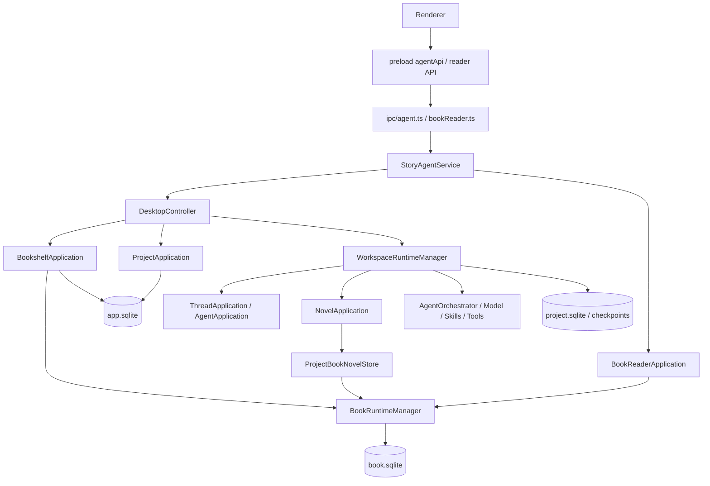
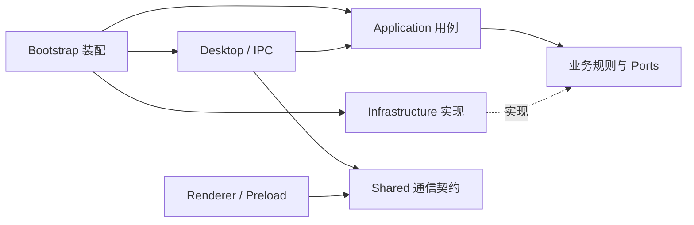

# StoryOS 后端类设计与静态资源整理分析

> 分析日期：2026-09-09<br>
> 代码基线：`de463b0`，分析开始时工作区无未提交变更。<br>
> 文档性质：基于当前源码的重构设计，尚未实施。本文中的目标类名、目录及接口均为建议。<br>
> 范围：Electron 主进程、preload/shared 通信边界、应用服务、Agent、SQLite、文件生命周期及随应用发布的资源。

> 最新调整（2026-09-09）：本分析保留最初设计依据。按用户最新要求，agent 为通用引擎，业务外置并通过接口接入。当前目录与边界以 [引擎边界调整记录](backend-agent-engine-boundary.md) 和 [实施记录](backend-refactoring-implementation-log.md) 为准。

## 1. 结论与重构方向

StoryOS 的“后端”是 Electron 主进程中的本地应用服务，不是独立 HTTP 服务。当前已经具备较完整的类设计：应用服务、存储接口、模型网关、工具注册表、运行时租约、编排策略和故障恢复服务均已存在。

下一步最有价值的工作，是把已有能力按业务和生命周期重新组织，缩小大类的职责，显式表达依赖、事务与资源所有权。单纯把函数改写成类，或新增统一的 `BaseService` / `BaseRepository`，不能解决目前的问题。

建议采用以下方向：

1. **按业务模块组织应用服务**：书籍、项目、会话、传输、Agent、技能各自暴露小而明确的入口；桌面层只处理 IPC、窗口和系统能力。
2. **类负责状态和副作用，接口负责边界**：运行时、导入导出会话、审批等待、仓储使用类；文本转换、校验、模板拼接保留纯函数。
3. **优先使用组合**：延续现有 Repository、Strategy、Adapter、Facade 等模式；继承仅用于已有且稳定的数据库公共机制。
4. **优先保障正确性**：保留修订冲突、草稿版本、事务、书库租约、模型任务快照和文件补偿语义，再逐步拆分实现。
5. **资源按消费者和发布方式分类**：品牌与桌面图标、渲染资源、提示词、导出模板、技能包、许可证、文档素材分别管理。

推荐先实施“契约独立化 + IPC 分域 + 生命周期收口”，再处理传输策略和存储接口拆分。事件持久化错误处理应作为前置的独立修复项。

## 2. 分析依据与边界

### 2.1 当前规模

以下数字来自本次工作区扫描，行数包含空行与注释，只用于定位职责集中点，不作为代码质量评分。

| 指标 | 当前结果 |
| --- | ---: |
| `src/main` 下 TypeScript 文件 | 210 |
| `src/main` TypeScript 总行数 | 28,018 |
| 包含 `export default class` 或 `export class` 的主进程文件 | 85 |
| 本地 `tests` 下 `*.test.ts` 文件 | 44 |
| Git 跟踪的 `tests` 文件 | 0 |

| 文件 | 行数 | 需要关注的职责 |
| --- | ---: | --- |
| `BookTransferService.ts` | 999 | 格式分派、预览会话、解析、快照、导入落库、导出发布 |
| `SqliteNovelStore.ts` | 833 | 书籍、卷章、草稿、修订、阅读清单、数据映射 |
| `AgentApplication.ts` | 781 | 运行状态、审批、流式分块、事件、检查点、退出 |
| `DesktopController.ts` | 757 | 多业务转发、项目生命周期、章节操作、桌面能力 |
| `ipc/agent.ts` | 722 | 多业务通信、校验、注册、事件广播 |
| `ProjectArchiveService.ts` | 587 | 打包、文件发布、恢复、登记和补偿 |
| `WorkspaceRuntimeManager.ts` | 529 | 激活队列、运行时装配、模型、技能、数据库和释放 |
| `StoryAgentService.ts` | 426 | 配置、装配、维护暂停、订阅和关闭 |

### 2.2 与既有存储设计的关系

应以当前源码和 [Phase A 实施记录](database-vnext/04-phase-a-implementation.md) 为现状基线。[早期书籍存储方案](../todo/book-storage-architecture-refactor.md) 中关于表结构、归档和数据重置的部分内容已被后续实现更新，不能直接当成当前待办清单。

本轮类封装建议延续既有三类业务数据库：

- 应用库：项目与书籍登记、绑定、目录投影、阅读状态、操作登记等。
- 项目库：会话、运行、会话事件和文本索引等；全局对话也具有独立的工作区运行时。
- 书籍库：正文结构、修订元数据、正文文档、草稿及 `book_changes`。

LangGraph 检查点仍有自己的持久化边界。本方案不把它与业务库合并，也不要求重建当前版本 100 的数据库。

### 2.3 本次验证

| 检查 | 结果 |
| --- | --- |
| `npm run typecheck` | 通过，退出码 0 |
| `npm run lint:agent` | 通过，退出码 0 |
| 两份 SVG Logo 的 SHA-256 | 一致，均为 `CC3DCCA01DA7AE0B32248B32ED88341355EF095FFDA72B906551814D31837368` |
| 工作区、构建配置、资源引用和主要生命周期调用链 | 已静态核对 |
| 全量行为测试、故障注入、桌面启动与打包 | 本次未执行 |

本次交付只有分析文档。`npm test` 的前置脚本会重建 `better-sqlite3` 为 Node ABI；为文档分析运行全量测试、改动本地原生依赖或访问实际用户数据库没有必要。既有文档中的历史测试结果不代表当前工作区的测试结果。

## 3. 当前调用结构与已有优点



这不是完整依赖图，重点展示桌面入口如何汇集业务能力。值得保留的设计包括：

| 现有机制 | 实际价值 | 后续处理 |
| --- | --- | --- |
| `NovelPersistence`、`BookRegistry`、项目/会话 ports | 为应用服务与持久化提供边界 | 按消费者缩小接口，逐步减少具体类依赖 |
| `ModelGateway`、`LangChainModelGateway`、`LiveModelConnection` | 隔离模型调用，支持任务级配置快照 | 保留热切换语义，不引入平行模型管理体系 |
| `ToolRegistry`、`ToolResolver`、`ToolPolicy`、`GuardedTool` | 注册、选择、审批和执行保护已有区分 | 扩展元数据与组合，避免每个工具套一套基类 |
| `TaskPlanner`、`ResultReviewer`、`AnswerSynthesizer` 及 ports | 编排角色已经可替换 | 延续策略接口，先整理依赖与提示词 |
| `BookRuntimeLease` | 有引用计数与幂等释放 | 明确由谁持有、何时释放，保留书籍独立生命周期 |
| `SqliteDatabase` 及三个具体数据库类 | 统一连接配置、版本检查、迁移、关闭 | 保留稳定继承关系，不再向基类塞业务 SQL |
| 归档恢复、永久清理的操作登记与归属检查 | 为跨库、跨文件系统操作提供补偿基础 | 整理职责时保留阶段与恢复语义 |
| 修订事务、草稿版本、`book_changes` | 已具备并发检查与权威变更记录 | 作为后续拆分的强约束 |

## 4. 主要问题与优先级

优先级表示实施顺序：P0 是重构前的验证基础，P1 是正确性或核心边界问题，P2 是扩展性与可维护性。下表的“风险”是由源码推导的影响，不代表已经通过故障复现。

| 编号 | 优先级 | 源码事实与定位 | 影响及建议 |
| --- | --- | --- | --- |
| A01 | P0 | [`.gitignore`](../../.gitignore) 忽略 `/tests/`、`*.test.*`、`*.spec.*`；`git ls-files tests` 为空 | 本地回归基础不能随仓库交付；先审查并纳入可重复运行的测试源码，继续忽略测试产物 |
| A02 | P1 | [`AgentApplication.emit`](../../src/main/agent/application/AgentApplication.ts) 对 recorder 使用 `Promise.allSettled`，未检查结果，随后通知订阅者 | 持久化失败可能表现为前端已收到事件、重启后缺少记录；区分可靠记录与尽力通知 |
| A03 | P1 | [`BookRuntimeManager.acquire`](../../src/main/agent/runtime/BookRuntimeManager.ts) 通过 `Proxy` 和 `/^(create\|update\|delete\|save)/` 推断目录刷新，单独排除 `saveDraft` | 新增写方法可能漏刷新；改为显式变更通知或具名装饰器，并保留重建投影机制 |
| A04 | P1 | [`StoryAgentService`](../../src/main/agent/StoryAgentService.ts) 同时装配全局服务、处理配置、维护暂停和释放；初始化 catch 直接关闭应用库 | 全局资源所有权分散，后期初始化失败的清理路径需要覆盖；引入运行时工厂和资源作用域 |
| A05 | P1 | [`WorkspaceRuntimeManager`](../../src/main/agent/runtime/WorkspaceRuntimeManager.ts) 同时负责串行激活、构造整套依赖和资源关闭 | 类很难独立验证；提取装配工厂，保留管理器的激活队列和切换规则 |
| A06 | P1 | [`shared/agent/contracts.ts`](../../src/shared/agent/contracts.ts) 大量从 `main/agent` 导入内部类型，包括服务状态、应用 DTO、工具和技能类型 | 类型层依赖方向倒置；通信契约迁入 shared，主进程依赖契约。`import type` 本身并不意味着主进程代码被打进前端 |
| A07 | P1 | [`ipc/agent.ts`](../../src/main/ipc/agent.ts) 与 [`DesktopController`](../../src/main/agent/electron/DesktopController.ts) 汇集多业务；通用 handle 丢弃 `_event`，reader 入口另有 owner/frame 管理 | 新入口不断扩张，来源校验和资源归属不一致；按业务拆控制器并复用有上下文的注册器 |
| A08 | P1 | [`BookTransferService`](../../src/main/agent/application/BookTransferService.ts) 用两个 Map 持有预览；导入目录在提交/取消时删除；未定义整体 dispose、owner 或 TTL | 窗口异常关闭、维护重建后的临时资源生命周期缺少统一出口；需要传输会话管理与启动清理策略 |
| A09 | P2 | [`BookTransferFormatRegistry`](../../src/main/agent/application/book-transfer/BookTransferFormatRegistry.ts) 只登记描述与能力；解析和导出分支仍位于服务中 | 新格式需要同时修改注册表和多处分支；建立格式策略的单一注册点 |
| A10 | P2 | [`PdfBookAdapter`](../../src/main/agent/application/book-transfer/formats/PdfBookAdapter.ts) 在 application 目录直接创建 `BrowserWindow` | 应用层依赖 Electron；将 PDF 打印作为桌面基础设施适配器 |
| A11 | P2 | [`SqliteNovelStore`](../../src/main/agent/storage/book/SqliteNovelStore.ts) 同时实现多个聚合操作与读取模型 | 接口和变更范围偏大；按章节写入、目录读取、草稿和修订查询拆分，保留事务边界 |
| A12 | P2 | [`StoryAgentService`](../../src/main/agent/StoryAgentService.ts) 构造时写 `process.env`；路径与配置辅助函数读取环境变量 | 多实例和测试隔离受全局状态影响；启动时生成显式环境对象，再注入消费者 |
| A13 | P2 | `tsconfig.json` 有 `noImplicitAny`，未开启 `strict`；ESLint 的目录依赖限制主要面向 renderer | 当前类型检查通过不等于具备完整空值检查或后端分层约束；按模块渐进启用 |
| A14 | P2 | Logo 重复；提示词、导出 HTML/CSS、资源路径分散 | 容易产生内容漂移和打包路径错误；按第 8 节分类治理 |

### 4.1 事件记录必须区分“存储成功”和“界面收到”

`WorkspaceRuntimeManager.createRuntime` 当前把运行摘要和会话事件 recorder 组合起来，`AgentApplication.emit` 则忽略 recorder 拒绝结果。现有会话事件存储内部已有投影逻辑，不能简单地再加一条消息写入制造双写。

建议抽出 `RunEventPublisher`，明确两步：

1. 对要求持久化的事件，等待 `ApplicationEventRecorder.record` 成功，再通知 UI。
2. 对窗口关闭、单个订阅者异常，隔离失败并记录诊断，不撤销已经提交的数据。

记录失败时应停止继续推进该运行的正常成功路径，报告可识别的持久化错误；错误报告不能再次完全依赖同一个失效 recorder，否则可能形成递归失败。这里不应承诺撤销已经成功执行的业务工具写入。

运行摘要、会话事件和 `message_views` 哪些更新必须同事务，应逐事件确认；它们并非每次都同时更新。如果需要合并同库写入，在基础设施层提供同步事务操作，然后对外返回 Promise。不能直接将多个异步 `record()` 包进 `better-sqlite3.transaction(async () => ...)`。

### 4.2 类拆分不能破坏现有保存事务

`SqliteNovelStore.saveRevision` 已把修订、正文、当前修订指针及符合版本要求的草稿删除放在事务里，并检查修订和版本冲突。拆成多个仓储后，这些操作仍应使用同一连接和同一事务。

推荐将“保存一版章节”保留为一个业务原子方法，内部组合小型 SQL 组件。不要让应用层依次调用 `revisionRepository.insert()`、`chapterRepository.updatePointer()`、`draftRepository.delete()` 并分别提交。

应用库投影刷新属于另一个数据库的操作；继续以书籍库为权威、失败后可重建。已有 `book_changes` 为后续按序追赶提供基础，但当前行级 `operation_id` 不等同于完整的业务命令幂等标识。

### 4.3 性能问题先测量再决定技术方案

主进程包含同步 SQLite、同步文件复制/读取、完整书籍快照、ZIP 和格式转换。它们可能影响大书导入导出时的主进程响应，但本次没有测出延迟、内存或吞吐瓶颈。

先测量大书导入/导出的事件循环延迟、峰值内存、耗时与取消响应。需要时只把格式转换或重 CPU 工作移到 worker；数据库连接仍由明确的所属线程创建和管理。PDF 隐藏窗口继续由 Electron 适配层持有。不要把“全部改成 async”当成消除阻塞的方案。

## 5. 目标模块与依赖规则

### 5.1 目标目录

下面是逐步演进后的目标骨架，不要求第一阶段一次性搬迁，也不要求创建所有空目录。

```text
src/
  shared/
    contracts/
      settings/ projects/ books/ conversations/ transfers/ skills/ reader/
      errors.ts
    book/                         # 跨进程复用的纯数据与正文算法
    window/
  main/
    app.ts                        # Electron 生命周期入口
    bootstrap/
      createApplication.ts        # 唯一顶层装配点
      ApplicationRuntimeFactory.ts
      ApplicationHost.ts
    desktop/
      ipc/
        IpcRegistrar.ts
        SettingsIpcController.ts
        ProjectIpcController.ts
        BookIpcController.ts
        ConversationIpcController.ts
        TransferIpcController.ts
        ReaderIpcController.ts
      printing/ElectronPdfRenderer.ts
      editor/RendererEditorToolBridge.ts
      file-browser/
    modules/
      books/
        application/              # 书架、正文、草稿、阅读
        domain/                   # 已存在的规则、版本冲突、值类型
        infrastructure/           # 书库 SQL 实现与目录投影
        ports.ts
      projects/
        application/              # 创建、绑定、归档、恢复等
        infrastructure/
        ports.ts
      conversations/
        application/              # 会话、运行记录、消息读取
        infrastructure/
        ports.ts
      transfers/
        application/              # 导入导出流程与预览会话
        formats/                  # 编解码策略，按实现规模组织文件
        ports.ts
      agent/
        application/              # AgentApplication / 运行生命周期
        runtime/                  # AgentRuntime、执行器、编排器
        model/ security/ tools/
      skills/
    runtime/
      WorkspaceRuntimeManager.ts
      WorkspaceRuntimeFactory.ts
      BookRuntimeManager.ts
    infrastructure/
      sqlite/                     # 连接、schema 版本与公共 SQL 机制
      filesystem/                 # 原子发布、路径与归属校验
      resources/                  # 发布资源位置解析
    foundation/
      ResourceScope.ts
      BusinessAccessGate.ts
    resources/
      prompts/
      export/
        pdf/
        epub/
  preload/
```

`foundation` 只收纳已经被多个生命周期使用的少量能力。不要建立包含任意工具的 `common/services/utils` 大杂烩。`domain` 目录只在确有独立规则时落地，DTO 不必为目录对称而变成实体类。

### 5.2 依赖规则



- `shared` 不导入 `main`、`renderer`、Electron、SQLite 或 LangChain；通信 DTO 与内部模型之间允许显式映射。
- 应用用例依赖实际需要的 port，不接收整个 `StoryAgentService` 或随意读取运行时容器。
- 模块之间只使用对方公开入口/port，避免导入内部 SQLite 实现。
- Electron 窗口、`shell`、`ipcMain`、打印和 renderer 工具桥接留在 desktop。
- SQLite 类型、句柄、SQL 行映射留在基础设施实现；查询接口返回业务数据，而非裸数据库。
- 构造函数 `new` 集中在装配点与具体工厂；已有小型纯数据对象可直接构造，不需要 DI 容器。
- 目录名统一小写语义，类文件使用 PascalCase；将 `agent/Agent`、`Memory` 的命名迁移作为独立机械提交处理。

## 6. 主要类与设计模式方案

### 6.1 应用装配与生命周期：Factory + Resource Scope

| 建议类/组件 | 单一职责 | 依赖与生命周期 |
| --- | --- | --- |
| `ApplicationRuntimeFactory` | 装配应用库、书籍运行时、业务服务和工作区管理器 | 接收环境和适配器；返回一套应用运行时 |
| `ApplicationHost` | 管理启动、运行、维护暂停、恢复、关闭状态 | 持有当前运行时；替代 `StoryAgentService` 的生命周期部分 |
| `BusinessAccessGate` | 接收/拒绝请求、统计正在运行的业务请求、关闭入口 | 应用级；保留开发者维护互斥行为 |
| `ResourceScope` | 逐项登记 disposer，初始化失败或关闭时逆序释放 | 每个装配作用域一份；关闭幂等 |
| `WorkspaceRuntimeFactory` | 构造项目库、模型会话、技能、工具和 Agent | 每个工作区一份资源作用域 |
| `WorkspaceRuntimeManager` | 工作区选择、串行激活和切换规则 | 应用级；不再包含长串依赖构造 |

装配顺序建议为：环境与配置 → 应用库 → 书籍运行时 → 项目/书架/传输服务 → 工作区运行时 → 桌面注册。每获取一项资源，立即登记清理函数，不能等整个初始化完成后再补登记。

资源清理要求：

- `ResourceScope` 在某个 disposer 失败后仍尝试释放其他资源，并汇总错误。
- 工作区 owns 项目库、模型会话、Agent 与其订阅；业务请求只借用书库 lease。
- 应用 owns `BookRuntimeManager`，先关闭工作区与 reader/传输会话，再关闭书库管理器，最后关闭应用库。
- 多个消费者引用同一资源时，只登记一个真正的 owner；消费者释放租约，不重复关闭共享数据库。
- 维护暂停必须先关闭业务入口，再确认活跃请求、AI 运行及会话资源状态，关闭资源成功后交给开发者编辑服务。
- 暂停失败保持入口关闭并提供恢复结果，不默默重新允许写入。

`StoryAgentService` 第一阶段可保留为兼容门面，把内部职责逐步委托出去。无需在第一步改动全部 IPC 调用者。

配置建议引入不可变 `ApplicationEnvironment`，明确 `agentHome`、`bundledSkillRoot`、资源根等。环境变量只在启动适配层读取。模型配置更新继续由现有 `LiveModelConnection` 保证运行中任务与新任务的配置边界。

当前书架和 reader 的初始化跟随模型配置成功。是否让未配置模型时仍可进行本地书籍操作属于产品行为调整，可单独设计；本轮结构重构默认保留当前语义。

### 6.2 桌面入口：分域 Facade + 有类型的 IPC 注册

`DesktopController` 的方法可以分为三类：

| 当前方法范围 | 目标位置 |
| --- | --- |
| 书架、会话、技能等简单转发 | 对应模块应用入口；IPC 控制器直接调用 |
| 创建/重命名/删除项目、恢复归档时关闭和重新激活运行时 | `ProjectLifecycleApplication`，依赖工作区切换 port |
| 章节保存、草稿、工作区快照映射 | `BookWorkspaceApplication` 与纯映射函数 |
| `shell.openPath`、系统对话框、窗口事件 | desktop 适配器 |

`IpcRegistrar` 负责通道注册/注销、请求上下文、错误映射与业务入口 gate；各域控制器提供 schema 和 handler。保留现有通道字符串和 preload 方法签名，先改变内部组织。

请求一律作为 `unknown` 进入并在边界校验，应用层仍验证书籍身份、版本和路径等业务规则。TypeScript 类型标注不能替代运行时校验。来源校验应覆盖可信应用窗口和主 frame；当前 reader 的主 frame 检查可复用，但单独检查主 frame 不等于完成全部来源验证。

下面是接口示意，类型名称仅说明职责：

```ts
interface DesktopRequestContext {
  readonly ownerId: number;
  readonly requestId: string;
}

interface IpcRegistrar {
  handle<Input, Output>(
    channel: string,
    parse: (value: unknown) => Input,
    execute: (input: Input, context: DesktopRequestContext) => Promise<Output>,
  ): void;
  dispose(): void;
}
```

旧多参数 IPC 可用显式适配器保留，不必一次改为单对象参数。业务事件初期保持原有分发语义；后续按照会话 scope 和 owner 建立订阅路由，尤其要避免 PDF 隐藏窗口自动加入业务广播。

reader 已有 owner 关闭机制，应纳入统一注册基础设施。导入导出预览、编辑器工具请求也需要明确归属，窗口销毁时可定向清理。

### 6.3 导入导出：Strategy + Registry + Session

建议先提取三个组件，只有实际职责仍偏大时再继续拆分：

1. `BookFormatRegistry`：登记“能力 + 实现”；格式展示与实际支持能力从同一来源派生。
2. `TransferSessionManager`：管理导入/导出快照、状态、所属窗口、过期与清理。
3. `BookTransferApplication`：组织预览、提交、取消；把文件发布和书库落地交给明确的协作者。

格式接口按能力分离，避免让仅支持导出的 PDF/EPUB 实现一个总是抛错的 `import()`：

```ts
// 仅用于 main；Buffer 不进入 shared 通信 DTO。
interface BookExportStrategy {
  readonly format: BookTransferFormat;
  export(snapshot: BookExportSnapshot, options: ExportBookOptions): Promise<Buffer>;
}

interface PortableBookImportStrategy {
  readonly format: 'text' | 'markdown' | 'docx';
  parse(content: Buffer, fileName: string): Promise<PortableBookDraft>;
}
```

StoryOS 原生包保留修订历史与数据库快照，不能强制降级为 `PortableBookDraft`。它使用独立 `NativeBookPackageCodec` 和原生导入路径，注册信息仍由同一个 registry 提供。Markdown 的 ZIP/单文件输出类型、扩展名和能力限制也必须保持。

PDF 策略依赖 `PdfRenderer` port；`ElectronPdfRenderer` 负责隐藏窗口、临时 HTML 文件、打印和 finally 清理。HTML 生成与转义是可独立测试的纯函数。

会话状态至少明确：`prepared → committing → completed/failed`，以及 `prepared → cancelled/expired`。提交开始即占用会话，不能等待异步格式渲染完成后才删除 Map；重复提交应返回确定结果或明确拒绝，避免两个请求同时发布。

导入当前已有受控副本和 fingerprint，导出已有固定预览快照、临时文件与发布逻辑，应保留这些行为。export 当前已有最多 8 个待处理预览的限制；新管理器应统一容量策略，并为 import 补充相应限制。

过期时间和窗口关闭时的提交行为需要明确约定：未提交预览可取消；提交中的任务应由宿主接管或等待结束，不可把正在使用的目录当成废弃目录删除。启动清理只处理具有归属凭证且不处于活动操作中的临时目录。

增加新格式后，预计只需新增策略、注册项和对应行为测试；不应再修改主服务的多处分支。

### 6.4 书籍存储：Repository + 窄接口 + 显式投影

可以从现有 `NovelPersistence` 中提取以下消费者接口，初期仍由原 `SqliteNovelStore` 实现：

| 建议接口 | 主要消费者 | 约束 |
| --- | --- | --- |
| `BookStructureReader` | 书架、导航、工作区 | 读取目录和摘要，不默认加载全部正文 |
| `BookStructureWriter` | 书籍编辑用例 | 卷章位置、版本、所属关系仍在事务中验证 |
| `ChapterRevisionWriter` | 保存正文、Agent 持久化写入 | 一次保存包含完整原子操作 |
| `ChapterRevisionReader` | 历史修订与导出 | 元数据查询与正文查询分开 |
| `ChapterDraftStore` | 编辑器草稿 | 保留设备、基线及草稿版本语义 |
| `BookReaderSource` | 阅读快照 | 不暴露写入方法或数据库句柄 |

不建议先增加通用 CRUD 仓储。当前存在软删除、同书约束、章节排序、乐观锁和正文版本语义，通用 CRUD 会把这些规则隐藏掉。

对投影刷新，短期采用显式 `CatalogUpdatingBookStore` 装饰器或 mutation callback，列明哪些写操作影响目录；长期在需要时由 `book_changes` 驱动追赶，并维护消费位置与源世代。两种路径都保留启动修复、读取时校验和可重建特性。

不要把“刷新投影失败”返回成“正文保存失败”，因为正文可能已成功提交。可记录投影待修复状态并向查询端表达过期状态，避免用户重试生成重复修订。

### 6.5 Agent 应用：运行状态 + 审批会话 + 事件组件

`AgentApplication` 保留 `startRun / cancelRun / waitForRun / shutdown` 门面，逐步提取：

| 建议组件 | 承接职责 | 不应承接的职责 |
| --- | --- | --- |
| `RunStateStore` | 运行内存状态、每线程活动运行索引、保留策略 | 不直接执行模型或写数据库 |
| `ApprovalSessionManager` | 等待审批、消费决定、取消时拒绝等待 | 不重新实现 `ToolPolicy` |
| `ConversationEventAssembler` | answer/reasoning 分块和事件序列 | 不决定持久化失败策略 |
| `RunEventPublisher` | 可靠记录与订阅通知的顺序 | 不保存第二份正文或会话消息 |
| `CheckpointRecovery` port | 捕获/恢复特定会话检查点 | 不暴露 SQLite 路径给应用门面 |

先提取事件发布和检查点 port，再拆状态组件，避免一次改变取消、超时、审批和流式显示四条链路。

有限状态采用 TypeScript 联合类型和合法转换函数即可。当前没有必要为每个状态创建独立 State 子类，也不需要引入通用工作流引擎。

### 6.6 统一错误模型与诊断

保留已有 `AgentFailure`、`BookRuntimeOpenError` 的结构化能力，逐步为业务错误补充稳定 code，例如版本冲突、资源占用、维护暂停、格式不支持和持久化失败。

内部错误保留 `cause`，IPC 输出仅包含可序列化且允许展示的字段。旧 API 通过错误映射兼容；不要在纯结构重构中把所有返回值一次切换为新的 Result 包装。

日志记录 `requestId / runId / bookId / projectId / operationId` 中实际具备的字段，以及耗时、失败阶段和资源关闭失败。避免默认记录 API Key、完整用户正文或整段模型输入。诊断是定位失败的工具，不应成为旁路业务存储。

## 7. 不推荐的抽象方式

| 做法 | 不推荐的原因 | 更合适的处理 |
| --- | --- | --- |
| 所有函数改成类 | 无状态工具只增加实例和样板代码 | 转义、文本切分、路径规范化、映射保留纯函数 |
| 巨大的 `BaseService` | 生命周期、日志、仓储和权限被迫共用继承树 | 按需注入小型协作者 |
| 泛化 `BaseRepository<T>` | 无法自然表达章节事务和跨实体规则 | 按业务原子操作设计接口 |
| 每个配置项和 DTO 都建立实体类 | 通信本质是可序列化数据 | DTO 使用 type/schema，规则复杂时才引入值对象 |
| 全局 Service Locator | 从任意位置取服务，依赖变得不可见 | 构造注入与明确的装配点 |
| 通用事件总线承载全部跨模块调用 | 关键调用顺序和错误结果不明确 | 关键业务用直接调用，事实通知用事件 |
| 一次性换目录、改协议、改表结构 | 失败后难以定位和回退 | 按阶段拆分机械迁移与行为调整 |
| 为未来云同步/RAG 建空表和万能模块 | 当前用途与协议尚不明确 | 只保留现有数据边界和可消费的变更记录 |

## 8. 静态资源分类与整理方案

### 8.1 当前资源清单

| 当前位置 | 当前内容/消费者 | 判断 |
| --- | --- | --- |
| `assets/icons/` | PNG、ICO、ICNS；窗口和 Forge | 属于发布资源，多个格式不是重复冗余 |
| `assets/licenses/` | three、react-three-fiber 许可与 reader notices | 必须随现有发布规则保留 |
| `public/storyos-logo.svg` | README 引用，Vite public 输入 | 与 renderer 中 Logo 内容相同 |
| `src/renderer/assets/storyos-logo.svg` | `StoryLogo.tsx` 静态 import | 与 public 版本重复 |
| `skills/create-skill/SKILL.md` | 随应用发布的技能包 | 由启动路径、SkillBootstrap 和 checksum 机制管理 |
| `agent/model/prompts/system.ts` | 基础系统提示词 | 文案仍包含旧项目/命令行身份，需要单独审校 |
| 编排类、`builtInAgents.ts`、`SkillDraftService.ts` 等 | 内嵌提示词 | 文本与角色逻辑混排，可分类提取 |
| `PdfBookAdapter.ts`、`EpubBookAdapter.ts` | HTML/XML/CSS 模板 | 固定样式与动态渲染逻辑混排 |
| renderer 各 feature 的 CSS | 阅读、书架、编辑器、封面等样式 | 大部分已按功能组织，应维持就近管理 |
| `docs/pdf`、`docs/architecture`、`docs/todo` | 论文、设计图、说明 | 文档资产，不属于运行时静态资源 |
| `prototype/` | 独立原型页面和脚本 | 开发参考，保持与生产资源分开 |

### 8.2 推荐分类

```text
assets/
  branding/storyos-logo.svg       # Logo 唯一规范源
  icons/storyos.png|ico|icns      # 桌面与安装器产物
  licenses/                     # 随包许可、声明
  README.md                     # 来源、消费者、生成方式、发布方式

src/main/resources/
  prompts/
    base-system.prompt.ts
    planning.prompt.ts
    review.prompt.ts
    synthesis.prompt.ts
    chapter-generation.prompt.ts
  export/
    pdf/styles.ts
    epub/styles.ts

src/renderer/assets/             # 仅渲染界面专用图片、纹理等
public/                         # 仅保留必须使用固定公开 URL 的资源
skills/                         # 保留技能包发现边界
docs/                           # 保留文档及相邻图示
```

第一阶段提示词和样式可用普通 TypeScript 文本常量文件，随现有代码打包，避免同时引入文件读取和新复制流程。若后续改为 `.md` / `.css` 文件，可选择构建期 raw import，但必须验证 main 构建配置、类型声明与打包产物；不要在每个请求里根据 `process.cwd()` 读取源文件。

固定文本与动态上下文要分开：提示词正文可以静态管理，`PromptCompiler` 的用户输入、章节内容和技能注入仍通过有类型的动态拼接实现。保留变量检查与内容转义，不能仅靠字符串替换隐藏数据来源。

### 8.3 具体迁移清单

| 编号 | 调整 | 同步更新点 | 验收 |
| --- | --- | --- | --- |
| R01 | 两份 Logo 合并到 `assets/branding/storyos-logo.svg` | `StoryLogo.tsx` import、README 图片路径；确认其他固定 URL 消费者后删除重复文件 | 首页与 README 正常显示，生产 renderer 产物中资源引用有效 |
| R02 | 保留 `assets/icons`，补充图标来源及生成说明 | Forge 图标配置、窗口图标解析 | 开发、打包应用和安装包均显示正确图标；不把文件改扩展名当作格式转换 |
| R03 | 提取基础/规划/审查/汇总/章节提示词 | 所属类只导入静态文本并组合动态参数 | 第一轮字节/语义不变；旧身份文案另做明确行为变更和验证 |
| R04 | 提取 PDF/EPUB 固定样式与模板纯函数 | 导出策略、HTML 转义、PDF 适配层 | 固定内容样例的章节顺序、分页选项、样式与导出内容一致 |
| R05 | 增加统一资源路径解析 | `app.ts`、`window/index.ts`、`SkillPaths.ts` | 不依赖 cwd，开发与打包路径分别可验证 |
| R06 | 保留技能包目录，补齐来源与版本清单 | SkillBootstrap、checksum、安装/缓存路径 | bundled、system、user、project 技能语义不变 |
| R07 | 文档素材继续按文档主题组织 | 将来移动时同步所有 Markdown 引用 | 不进入安装包，文档链接有效 |
| R08 | 扩充资源清单说明 | `assets/README.md` 或专门清单 | 每类资源能找到 owner、来源、消费者及发布规则 |

如果保留 public Logo 的固定 URL 具有实际用途，可以从规范源生成该副本并校验 hash；不要继续维护两份独立源文件。README 可以直接引用规范源，无需为了文档额外生成一份。

### 8.4 打包路径必须与资源分类一起验证

当前 `forge.config.ts` 只允许 `.vite`、`assets`、`skills` 及少量 SQLite 原生依赖目录进入发布，并通过 `unpackDir: '{skills,assets}'` 配置解包。这是资源迁移的关键约束。

- renderer 静态 import 资源由 Vite 处理；`public` 内容经 renderer 构建进入 `.vite`，不要求将整个 public 根目录额外打包。
- TypeScript 提示词和模板常量跟随 main bundle；若新增需要运行时按文件读取的资源根，必须同步更新打包白名单和解包规则。
- `assets` 与 `skills` 的真实路径统一交给 `ResourceLocator`；调用者声明资源类别，不自行拼 `../../` 或 `app.asar.unpacked`。
- 保留 `app.ts` 当前对解包技能路径的处理语义，并为图标建立相同的开发/发布路径模型。不能仅凭源码相对路径推断 Windows 安装包中的实际可访问性。
- 运行时临时目录、书籍库、归档和用户配置是可写数据，不属于随包静态资源；禁止因为整理 assets 而移动这些数据。
- 不把所有许可证和提示词都复制进 public；public 面向 renderer 的公开资源 URL，并非后端资源仓库。

### 8.5 资源治理的扩展边界

当前没有必要引入资源管理平台、CDN 或动态模板插件系统。资源清单使用可阅读的说明即可；只有构建校验确实需要时再增加机器可读 manifest。

提示词未来可增加版本标识，便于测试和定位行为变化；版本不能替代内容校验。内置技能继续使用已有 checksum 体系，避免与资源清单生成第二套互不一致的版本机制。

## 9. 分阶段实施与回退

阶段按依赖排序，不以固定工期承诺。每个阶段应形成独立可审查提交，目录搬迁和行为变化尽量分开。

| 阶段 | 内容 | 交付与完成条件 |
| --- | --- | --- |
| P0：验证基础 | 审查本地测试并纳入版本控制；记录当前测试失败；建立后端 lint/依赖基线 | 新 checkout 能获得测试源码；区分已有失败和新回归；不提交数据库和测试产物 |
| P1a：可靠事件 | 提取记录/通知边界，补充 recorder 失败场景 | 失败不会被当成持久化成功；不会递归记录错误；不重复保存消息 |
| P1b：契约与 IPC | shared DTO 独立化；按业务拆 IPC；保持旧 channel/preload 兼容 | shared 不再依赖 main；新增入口统一校验与注销；主要桌面流程通过 |
| P2：生命周期 | 工厂、资源 scope、业务 gate、传输会话清理 | 初始化任一点失败可释放已获取资源；维护与退出保持互斥 |
| P3：传输策略与资源 | 格式 registry、PDF adapter、提示词和模板分类、Logo 去重 | 新格式只新增策略和注册；开发/打包资源路径一致 |
| P4：书籍存储 | 窄 port、仓储内部拆分、显式目录投影 | 正文/草稿事务保持；投影可修复；跨库补偿行为不变 |
| P5：Agent 与目录收敛 | 审批、分块、检查点组件化；最终模块迁移；渐进严格类型检查 | 运行取消、超时、切换模型、工作区隔离与回滚测试通过 |

建议首批提交边界：测试来源修正、事件错误修复、shared 契约迁移、IPC 文件拆分分别独立。不要在第一批同时修改 schema、导出格式内容和系统提示词含义。

回退以代码提交为单位。第一轮保持数据库版本、IPC 名称、现有导出格式版本不变；若后续确需数据迁移，应提供独立迁移与验证设计。旧路径 re-export 和 `StoryAgentService` 兼容门面可以暂时保留，但需要列出调用者清单及移除条件，避免永久双层代理。

## 10. 行为验证与验收标准

### 10.1 必须覆盖的行为

| 范围 | 关键场景 | 已有基础/实施时入口 |
| --- | --- | --- |
| 应用生命周期 | 并发初始化、初始化中途失败、重复关闭、关闭时存在任务 | `StoryAgentServiceLifecycle.behavior.test.ts`、`AgentApplicationLifecycle.behavior.test.ts` |
| 工作区 | 并发激活、项目切换、全局与项目隔离、绑定切换 | `WorkspaceRuntimeManager.behavior.test.ts`、`WorkspaceIsolation.test.ts` |
| 书籍保存 | 当前修订、row version、draft version 冲突；失败时草稿和正文保持 | `NovelStorage.behavior.test.ts`、Phase A 存储验证脚本 |
| 运行事件 | recorder 失败、通知者失败、重复事件、重启恢复、分页顺序 | SQLite/Agent 现有测试基础上补故障注入 |
| 模型 | 正在运行任务保留配置快照，新任务使用新配置 | `LiveModelConnection.behavior.test.ts`、模型路由相关测试 |
| 审批与取消 | 待审批时取消、超时、关闭；等待 Promise 全部结束 | AgentApplication/Executor 相关行为测试 |
| 书籍租约 | reader、项目和导出同时使用同书；重复释放；永久清理时仍在使用 | `BookRuntimeArchitecture.behavior.test.ts`、生命周期测试 |
| 导入导出 | 原生历史保留、便携格式降级、重复提交、窗口关闭、目标已存在、失败清理 | `BookTransferService.behavior.test.ts` 与打包业务验证 |
| 归档恢复 | 阶段中断、重复恢复、路径归属不匹配、补偿失败 | `ProjectArchiveService.behavior.test.ts` |
| 开发者维护 | 活跃任务拒绝暂停、关闭失败保持 gate、恢复失败、备份后编辑 | `DeveloperMaintenance.test.ts` 等 |
| 发布资源 | Logo、图标、技能、提示词、模板、许可证在产物中可用 | reader packaged / packaged smoke / business 脚本 |

以上测试文件目前只在本机存在。实施时先核对其内容、当前结果及独立性，再作为仓库交付基础；不能仅列出文件名就认定已有充分覆盖。

### 10.2 工程约束

- 将 `shared → main`、业务应用 → Electron、跨模块内部存储导入等边界转化为 ESLint 限制，按已迁移目录启用。
- 扩展后端 lint 范围，覆盖 `main/app`、reader IPC、developer、desktop 及 preload/shared 相关目录；当前 `lint:agent` 不包含全部后端文件。
- 对迁移模块先开启空值检查，再逐步收敛到 `strict`；评估 `noUncheckedIndexedAccess` 等选项时不应靠批量断言消除错误。
- 文件超过约 400 行、构造依赖超过约 6 项时进行职责复查；它们是评审提示，不是必须拆类的硬指标。
- 为跨线程/跨库调用记录真实事务边界，不把 Promise 并发误认为事务或线程并行。
- 不要求所有逻辑都走模拟仓储；SQL 约束和冲突规则需要真实临时 SQLite 验证。

### 10.3 阶段完成的可衡量结果

1. `shared` 不再导入主进程内部类型，preload 对外行为保持兼容。
2. 增加一个 IPC 业务用例只改对应域控制器与契约；增加一种便携格式不改中央服务分支。
3. 每个数据库、隐藏窗口、订阅、预览目录和运行时都有明确 owner 与释放入口。
4. 可靠事件记录失败不会静默呈现为已持久化成功，投影失败不误报权威正文写入失败。
5. 章节保存事务、草稿冲突、工作区隔离、模型热切换及归档补偿通过回归。
6. 品牌 Logo 只有一个规范源，发布资源路径无需各模块自行猜测。
7. 新 checkout 可获得必要测试并复现阶段检查；打包验证在明确的 Node/Electron ABI 切换后执行。

## 11. 本轮采用的默认决策

本方案按“保留当前业务行为，渐进重构”制定。以下决策可以直接作为实施默认值：

- 继续使用 TypeScript、Electron、现有 SQLite 与 Agent 技术体系。
- 采用构造注入与显式工厂，不引入通用 DI 框架。
- 以组合和窄接口为主，保留纯函数，不追求类数量。
- 保留数据库物理边界和 schema 100，不执行数据清理。
- 保留 IPC/导出格式兼容性，新增错误 code 通过适配逐步暴露。
- 先以编译内联文本整理提示词和模板；技能根路径、用户数据目录保持既有语义。

离线书架初始化、worker 性能改造、提示词身份修订、跨设备同步和动态插件机制属于需要单独验证的后续工作，不混入本轮机械封装。当前实施起点应是可重复验证的测试基础、事件可靠性、契约边界和生命周期。
