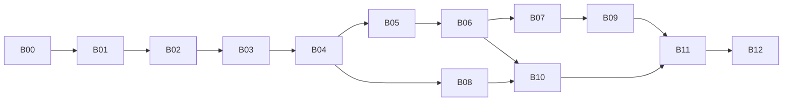

# StoryOS 后端重构执行修改方案

> 最新边界调整（2026-09-09）：agent 仅作为通用引擎，StoryOS 业务移至 main/story，通过接口接入；本约定取代先前“所有后端代码收回 agent”的方案。详见 [引擎边界调整记录](backend-agent-engine-boundary.md)。


> 制定日期：2026-09-09<br>
> 依据：[后端类设计与静态资源整理分析](backend-refactoring-and-resource-organization-analysis.md)<br>
> 源码参考基线：`de463b0`；实施前重新记录实际提交与工作区差异。<br>
> 当前状态：B00—B12 已实施并通过验收；实际范围和验证结果见 [实施记录](backend-refactoring-implementation-log.md)。

## 1. 执行目标与交付边界

本方案把分析文档中的 A01—A14 问题和 R01—R08 资源任务拆成文件级修改包，供后续编码、验证和评审使用。采用“先修正错误边界，再提取职责，最后集中迁移目录”的顺序，保持每批变更可验证、可回退。

完成后的具体结果：

1. shared 通信契约独立于 main 内部实现，原 preload API 与 IPC 通道保持兼容。
2. `StoryAgentService`、`DesktopController`、`WorkspaceRuntimeManager` 和 `AgentApplication` 的职责分别收敛到明确入口与协调逻辑。
3. 应用、工作区、书籍租约、审批和传输会话具有明确的创建者、所有者及释放路径。
4. 事件持久化失败可被识别并正确结束运行，书籍投影刷新不再依赖方法名前缀。
5. 导入导出由格式策略、会话管理和发布操作组成，新增格式无需修改中央分派逻辑。
6. 品牌资源、桌面图标、提示词、导出模板、技能与文档资源各有固定归属和发布规则。
7. 必要测试随仓库交付，阶段验收能在独立测试目录和新 checkout 中复现。

本轮保持数据库 schema 100、三类业务数据库边界、检查点存储、导出包版本、工作区路径和模型热切换语义。离线书架初始化、模型提示词含义调整、worker 性能改造、云同步和新业务功能另行实施。

## 2. 执行约定

### 2.1 文件与命名约定

- 文中相对路径均相对仓库根目录。新增文件路径是计划路径，实施前不存在属于正常情况。
- B01—B10 优先在当前模块周边提取代码；B11 统一整理到本方案更新后的引擎与业务目录，避免多次修改同一组 import。
- 新增类只在有状态、资源或副作用时使用；映射、模板、校验和文本转换保留函数。
- 接口沿用现有业务参数与返回语义。文中新增名称用于明确职责，不要求生成同名空壳。
- 一个实现只保留一个规范源。旧路径通过单向 re-export 兼容，禁止拷贝两份实现。
- 不新增通用 DI 容器、Service Locator、`BaseService` 或泛化 CRUD 仓储。

### 2.2 每个修改包的固定流程

1. 核对目标文件、调用者及当前测试结果；保留用户已有修改。
2. 对涉及行为修正的路径补充能暴露问题的测试；机械搬迁和普通资源移动不新增照抄实现的测试。
3. 提取新组件并由旧入口委托，先保持外部调用方式。
4. 将指定消费者切换至新接口，再移除旧内部逻辑。
5. 运行该包规定的检查，记录失败、原因、结果和实际改动范围。
6. 形成独立可审查变更；不要把下一包的行为修改混入当前批次。

所有测试使用临时目录或显式测试 home。不得把 `storage:reset` 当成重构前置步骤。实现后需要 Git 提交时，按文件选择实际交付内容，不使用全目录添加将本地数据库、录屏或私有 fixture 一并纳入。

## 3. 执行包与依赖关系

| 执行包 | 内容 | 前置条件 | 对应分析项 |
| --- | --- | --- | --- |
| B00 | 测试来源、基线和验证入口 | 无 | A01、A13 |
| B01 | 可靠事件发布与运行收尾 | B00 | A02 |
| B02 | shared 契约独立化 | B01，避免同时移动事件定义 | A06 |
| B03 | IPC 分域、上下文与注销 | B02 | A07 |
| B04 | 应用装配、资源所有权、维护 gate | B03 | A04、A05、A12 |
| B05 | 桌面控制器用例下沉 | B04 | A07 |
| B06 | 传输会话与格式策略 | B03、B04、B05 | A08、A09、A10 |
| B07 | 书籍窄接口与显式目录投影 | B04、B05、B06 | A03、A11 |
| B08 | Agent 状态、审批、分块和检查点组件 | B01、B02、B04 | A02、A05 的后续收敛 |
| B09 | 归档服务职责整理 | B04、B05、B07 | 跨库与文件补偿边界 |
| B10 | 品牌、提示词、模板与资源路径 | B04、B06；提示词提取在 B08 后 | A14、R01—R08 |
| B11 | 最终目录迁移、兼容层清理、严格约束 | B00—B10 | A06、A13 及目标目录 |
| B12 | 全链路、打包与交付验证 | B11 | 全部 |



图中展示主干，完整前置条件以上表为准。推荐按编号执行；拆包是为了控制评审范围，不意味着必须同时开展多条实现分支。

## 4. B00：建立可重复验证的基线

**修改文件**：`.gitignore`、`package.json`、`.eslintrc.json`、经审查的 `tests/agent` 与 `tests/developer`；新增 `docs/architecture/backend-refactoring-implementation-log.md` 记录实际结果。

执行步骤：

1. 记录 `git status --short`、提交号、Node/Electron 版本和原生依赖当前使用场景。原分析中的检查结果仅作历史参考。
2. 审查本地 44 个测试文件的依赖、fixture、绝对路径和外部请求，挑选现有后端回归所需源码纳入版本控制。
3. 删除或精确收窄 `.gitignore` 中阻止测试源码交付的规则；保留 `test-results`、coverage、录屏、临时数据库和构建产物的忽略规则。
4. 确认测试使用独立临时 home、测试项目和假模型；将机器绑定路径改为 fixture/参数，实际模型调用不进入默认离线测试。
5. 新增 `lint:backend`，建议覆盖 `src/main src/preload src/shared tests/agent tests/developer --ext .ts`。先记录新增范围暴露的已有问题，再定向修复，不通过全局禁用规则绕过。
6. 新增 `check:backend`：类型检查、后端行为测试、后端 lint。现有 `check` 和 `lint:agent` 先保留，B11 统一调整。
7. 运行初始回归，记录已有失败的测试名、断言、原因与处理方式。默认后端检查应最终达到全绿，不建立永久“允许失败”清单。

**完成条件**：后端测试源码与必要 fixture 可随仓库获得；测试不依赖个人数据；新 checkout 可以安装依赖并运行后端检查。未运行的检查明确记为未执行，不使用历史统计填充。

**回退边界**：此包只调整验证来源与入口，不改变业务行为；忽略规则变化需逐文件审查新增可见文件。

## 5. B01：事件可靠性与运行清理

**修改文件**：

| 操作 | 文件 |
| --- | --- |
| 新增 | `src/main/story/application/conversations/events/RunEventPublisher.ts` |
| 新增 | `src/main/story/application/conversations/events/EventPersistenceError.ts` |
| 修改 | `src/main/story/application/conversations/AgentApplication.ts`、`runPorts.ts` |
| 修改 | `src/main/story/runtime/WorkspaceRuntimeManager.ts` 的 recorder 装配 |
| 按事务核对结果修改 | `storage/project/SqliteRunStore.ts`、`SqliteConversationEventStore.ts`、`conversationProjection.ts` |
| 新增行为测试 | `tests/agent/RunEventPublisher.behavior.test.ts` |

### 5.1 必须一起调整的顺序

当前 `executeRun()` 的 `run_started`、`user.message.created`、`turn.started` 在 `try/finally` 之前发送，成功状态也在结束事件持久化之前写入内存。若只将 `emit()` 的 `allSettled` 改为直接 `await`，初始化事件失败可能使线程一直显示有活动任务。

执行步骤：

1. 将完整运行过程纳入同一 `try/catch/finally`，包括开始事件；无论在哪个阶段失败都释放线程活动标记、审批等待和文本分块状态。
2. `RunEventPublisher.publish(event)` 先等待 recorder，成功后再通知监听者；监听者失败只记录诊断，不推翻已提交事实。
3. 持久化异常转换为 `EventPersistenceError`，保留失败事件类型、run/thread 标识及原始 cause；不包含正文或密钥。
4. 内存中的 `completed` 只在必要的结束记录成功后设置。持久化失败使 `waitForRun()` 明确拒绝，不返回正常成功内容。
5. 对存储失败使用独立收尾分支：停止生产新事件、拒绝审批等待、通知 runner 停止继续工作、释放运行资源。诊断通道不再次依赖失败的 recorder。
6. 一般模型/工具失败仍记录正常失败事件；若记录失败，再进入持久化失败分支。禁止 catch 内无限重试相同存储操作。
7. 分别捕获检查点恢复和收尾失败，保留最初错误与附加诊断；不承诺回滚已执行的文件或书籍写入。

对同库原子性采用明确规则：一条会话事件与其 `message_views` 投影保持现有事务；运行摘要与会话终态的联动逐事件核对。需要合并的同步 SQL 提取到基础设施事务方法中，禁止使用异步 SQLite transaction 回调。部分事件已提交的情况必须通过重启恢复测试覆盖，不能宣称整轮运行具有单一事务。

### 5.2 验证

- 开始事件失败：模型未启动，线程活动标记释放，等待方收到失败。
- 文本事件失败：后续正常流停止，不继续广播为已持久化事件。
- 结束事件失败：不返回成功，运行内存状态不会保留为 completed。
- 一个订阅者抛错：其他订阅者仍有机会收到已提交事件。
- recorder 与检查点恢复同时失败：清理仍执行，原始错误可追踪。
- 重启后不会因重复记录同一事件生成第二份消息；不复制会话存储已有的投影逻辑。

**完成条件**：错误路径和成功路径都可结束运行；事件类型、通道和正常显示顺序保持兼容。此包不扩大为完整 Agent 状态重写。

## 6. B02：通信契约从主进程内部脱离

### 6.1 迁移清单

| 现有定义来源 | 新规范位置 | 处理方式 |
| --- | --- | --- |
| `StoryAgentService.ts` 中配置请求和状态 | `src/shared/contracts/settings/contracts.ts` | 移动纯 DTO；服务 type re-export |
| `projectContracts.ts`、导航 DTO、归档桌面 DTO | `src/shared/contracts/projects/contracts.ts` | 只迁通信数据，内部 Record/Store 留在 main |
| `bookWorkspaceContracts.ts`、`bookshelfContracts.ts`、novel DTO | `src/shared/contracts/books/contracts.ts` | 保留现有字段、可选/null 语义和状态取值 |
| thread/conversation DTO、通信事件、运行快照 | `src/shared/contracts/conversations/` | 按 contracts/events 拆分，避免循环导入 |
| `bookTransferContracts.ts` 中预览与请求/结果 | `src/shared/contracts/transfers/contracts.ts` | 原生包 Buffer 与内部 codec 模型不进入 shared |
| 技能详情/快照、线程技能状态 | `src/shared/contracts/skills/contracts.ts` | 只迁已公开字段，剥离服务引用 |
| editor tool 请求/结果、审批决定 | `src/shared/contracts/editor/contracts.ts` | 保留现有序列化形状；策略实现仍在 main |
| reader/window/developer 已有 shared 契约 | 暂保留当前位置 | 没有内部依赖则不为目录一致性强制搬迁 |

`src/shared/agent/contracts.ts` 保留为兼容聚合出口，继续导出 `AgentDesktopApi` 和 `AGENT_IPC_CHANNELS`。该文件改为只引用 shared，不从 main 导入任何类型。

执行步骤：

1. 从 preload 暴露方法开始列出真正跨进程的类型，再沿类型依赖逐层展开。
2. 先迁移叶子类型和状态联合，再迁组合 DTO 与事件，最后调整 API 聚合出口。
3. 确实存在内部 Date、Buffer、数据库记录等差异时，使用已有映射或明确新映射；不通过宽泛 `as` 把内部对象伪装为通信 DTO。
4. main 原定义位置只做类型 re-export，消费者分批改为新规范路径。
5. 更新 `src/preload/agentApi.ts` 和 renderer 的类型引用时，不改变方法参数和 UI 行为。
6. 加入 shared 禁止依赖 main/renderer/Electron/SQLite/LangChain 的规则；同时检查相对路径和 `@/` 别名。

**验证与完成条件**：类型检查、preload API 类型兼容检查和主要 DTO 样例通过；shared 无反向依赖；原 IPC 字符串、事件名和格式版本无变更。通信 schema 可以由类型附近模块提供，但 main 的输入校验职责不能因此删除。

## 7. B03：IPC 按业务拆分

**新增目录**：`src/main/desktop/ipc/`。

| 新组件 | 从当前 IPC 承接的内容 |
| --- | --- |
| `IpcRegistrar.ts` | handle/on 注册、重复检测、请求上下文、统一注销、输入校验入口 |
| `SettingsIpcController.ts` | status、configure |
| `ConversationIpcController.ts` | 会话、线程、运行、审批和事件订阅 |
| `ProjectIpcController.ts` | 项目管理、导航、归档恢复 |
| `BookIpcController.ts` | 书架、书籍结构、章节、草稿、回收站 |
| `TransferIpcController.ts` | 格式列表、导入导出预览、提交和取消 |
| `SkillIpcController.ts` | 技能列表、读取、启用和停用 |
| `ReaderIpcController.ts` | 原 reader 请求、owner 及窗口销毁清理 |
| `EditorToolIpcController.ts` | 编辑器工具响应与可信来源核对 |

执行步骤：

1. `src/main/ipc/agent.ts` 首先仅负责装配各域控制器并返回统一 disposer，保留外部 `registerAgentIpc` 签名。
2. 为每个入口提供 `DesktopRequestContext`，至少含 `ownerId`、`requestId`；owner 从 Electron event 派生，不能使用 renderer 自报值。
3. 注册器在调用前验证受信任应用 WebContents 和 main frame；PDF 隐藏窗口不自动获得业务权限。可信窗口集合由窗口宿主显式登记。
4. 输入以 unknown 进入，既有多参数调用使用 tuple/适配函数保持兼容。校验后先复用当前 `runBusinessRequest` 追踪所有异步业务操作，B04 再替换为独立业务 gate。
5. reader 的 destroyed listener、业务事件订阅和编辑器响应 listener 纳入 disposer。部分注册失败时释放已注册项。
6. 每个 owner 销毁只清理自身资源；维护暂停和应用退出由宿主执行全量清理。
7. 事件分域迁移先保持现有前台业务窗口行为；细化 scope 订阅时单独测试，不能把前端刷新机制一起重写。

首阶段控制器可以使用旧 `DesktopController` 的小型 `Pick` 接口，B05 再注入真正应用入口。不要将整个 service 容器暴露给每个 controller。

**验证**：通道名称/参数不变；重复注册和中途失败可恢复；iframe、未登记窗口和伪造 owner 被拒绝；窗口销毁后无悬挂 listener；reader 快照仍按 owner 关闭。

**完成条件**：`ipc/agent.ts` 不再承载业务字段校验和长串路由；新增某域入口只改该域控制器与相关契约。

## 8. B04：应用与工作区生命周期收口

### 8.1 文件与职责

| 操作 | 文件/组件 | 改动 |
| --- | --- | --- |
| 新增 | `src/main/bootstrap/ResourceScope.ts` | 命名 disposer、逆序释放、幂等关闭、错误汇总 |
| 新增 | `src/main/bootstrap/BusinessAccessGate.ts` | 接收状态、活跃请求计数、停止接收及等待收尾 |
| 新增 | `src/main/agent/environment/AgentEnvironment.ts` | 启动环境的不可变值 |
| 新增 | `src/main/bootstrap/ApplicationRuntimeFactory.ts` | 从 service 提取依赖装配与初始化补偿 |
| 新增 | `src/main/bootstrap/StoryAgentService.ts` | 启动、暂停、恢复、关闭状态转换 |
| 新增 | `src/main/story/runtime/WorkspaceRuntimeFactory.ts` | 从 manager 提取工作区装配 |
| 修改 | `StoryAgentService.ts`、`WorkspaceRuntimeManager.ts`、`src/main/app.ts` | 保留入口并委托新组件 |
| 修改 | `config/index.ts`、workspace/skill 路径消费者 | 逐步显式注入，减少运行期环境读取 |

`ResourceScope` 最小接口为 `add(name, disposer)` 与 `close(): Promise<void>`。closing/closed 后拒绝登记；异步创建与关闭竞态必须由宿主协调，新获取资源若无法交付给 scope，应立即释放。一个作用域不因清理失败而跳过剩余 disposer。

### 8.2 明确所有权

| 资源 | Owner | 借用者 | 释放顺序/规则 |
| --- | --- | --- | --- |
| 应用数据库 | 应用 runtime scope | 注册表、投影、阅读状态、归档登记 | 最后关闭 |
| `BookRuntimeManager` | 应用 runtime scope | 工作区、reader、导入导出 | 所有消费者释放后关闭 |
| 项目数据库、模型会话、Agent | 工作区 runtime scope | 会话/书籍用例 | 停止运行与事件记录后释放 |
| 书籍 lease | 获取 lease 的用例或会话 | 具体操作 | 在 finally/dispose 中幂等释放 |
| reader 快照 | Reader application，附 owner | reader IPC | owner 销毁或维护/退出时释放 |
| 传输预览 | B06 session manager | transfer application | 明确 prepared/committing 状态后清理 |
| PDF 窗口与临时 HTML | PDF renderer 的操作 scope | PDF export strategy | 打印完成或失败后释放 |
| IPC/订阅 | desktop registration scope | 前台窗口 | 停止接收新请求后注销 |

### 8.3 具体迁移步骤

1. 先实现 ResourceScope 并测试逆序释放、多次关闭和错误汇总，再替换工作区嵌套 finally。
2. 提取 `WorkspaceRuntimeFactory.create()`，保留 manager 的串行激活队列、全局/项目双运行时和现有模型连接。
3. 提取应用工厂，每获取数据库、manager、runtime、reader 或订阅即登记；工厂失败按 scope 清理，不能仅关闭应用库。
4. **同时调整双重所有权**：当前 `WorkspaceRuntimeManager.shutdown()` 会调用 `bookRuntimes.closeAll()`。应用工厂接管后，注入共享 manager 的工作区管理器不得再关闭它；旧自建 manager 的重载要显式标记 owns/borrowed，B11 删除该重载前不能模糊处理。
5. 引入 host 状态：`idle / starting / running / pausing / paused / resuming / stopping / stopped / failed`。同类并发启动或关闭共享 Promise，互斥转换明确拒绝。
6. 维护暂停采用先停止接收、再检查活动请求/AI/提交会话的顺序。忙碌导致尚未开始释放时可恢复 running 并返回 busy；若已开始释放但失败，保持 gate 关闭，进入 failed。
7. 恢复时先重建全部必要资源并重新绑定订阅，成功后才开放业务入口。
8. 普通退出先关闭入口，再等待/取消活动运行并关闭消费者，最后释放书库管理器和应用库；具体退出行为维持现有语义，不丢弃正在发布的文件。
9. 构造环境对象，将 config、workspace 和 skill path 的隐式 home 读取改为注入；测试可构造两套不同 home 的独立实例。
10. 模型配置仍通过 `LiveModelConnection` 更新。迁移环境读取不能改变“旧任务保留快照、新任务使用新模型”的捕获时机。

**验证**：在每一个资源获取阶段注入失败；并发初始化、关闭中初始化、维护暂停/恢复、窗口销毁同时退出；检查重复订阅、资源重复关闭和遗留句柄。

**完成条件**：每个资源只有一个 owner，service 中不再包含应用装配长方法，manager 中不再包含工作区依赖构造长方法。

## 9. B05：DesktopController 的业务用例下沉

**新增**：`src/main/story/application/books/BookWorkspaceApplication.ts`、`ProjectLifecycleApplication.ts`；对会话只在存在实际协调逻辑时新增 `ConversationApplication.ts`。纯 DTO 映射提取到相邻函数文件。

| 现有方法组 | 修改目的地与规则 |
| --- | --- |
| `getBookWorkspace/createBook/createBookChapter/createBookVolume/...` | BookWorkspaceApplication，协调 NovelApplication、项目上下文和快照映射 |
| `getBookChapterContent/saveBookChapterContent/chapterDraft` | 同一应用入口，保留修订/草稿参数和事件 |
| `createProject/renameProject/deleteProject/switchProject/removeProject` | ProjectLifecycleApplication，通过 runtime port 执行关闭/激活 |
| `restoreProjectArchive` | 项目生命周期用例协调归档服务、书籍策略和运行时激活 |
| 书架、传输、技能简单转发 | IPC 直接依赖现有 application 的窄入口 |
| `openProjectDirectory` | desktop 文件系统适配器，业务侧依赖打开目录 port |

执行步骤：先按方法组复制行为到新入口并由旧方法委托，再迁 IPC 注入，最后删除无调用者的旧方法。项目“删除”“移除登记”“归档”和“书籍永久删除”保持不同语义，不能因为合并生命周期而共用一个模糊 remove 方法。

工作区切换 port 只暴露用例需要的操作，如 `hasActiveRun`、`closeForProjectMutation`、`activate`，不让业务服务获取任意 runtime 内部字段。若需要读取当前 book/thread，提供对应上下文读取接口。

**验证与完成条件**：章节与项目全流程行为一致；`DesktopController` 不再直接转换书籍工作区数据或协调项目资源关闭。暂存兼容门面在 B11 统一删除。

## 10. B06：传输策略、预览会话与 PDF 适配

### 10.1 文件修改

| 新增/修改 | 路径与职责 |
| --- | --- |
| 新增 | `application/book-transfer/BookFormatRegistry.ts`：能力与实现单一注册点 |
| 新增 | `application/book-transfer/TransferSessionManager.ts`：会话状态与 owner |
| 新增 | `application/book-transfer/ports.ts`：import/export/PDF 所需接口 |
| 新增 | `application/book-transfer/BookExportSnapshotReader.ts`：权威快照读取 |
| 提取 | `application/book-transfer/BookImportWriter.ts`：原生/便携内容发布到托管书库 |
| 提取 | `application/book-transfer/ExportFilePublisher.ts`：输出路径、覆盖与临时文件发布 |
| 修改 | `application/BookTransferService.ts`：收敛为流程门面 |
| 修改 | `application/book-transfer/formats/*Adapter.ts`：适配现有纯函数或实现策略 |
| 新增 | `src/main/desktop/printing/ElectronPdfRenderer.ts`：隐藏窗口打印 |

以上 application 组件属于 StoryOS 业务，当前按职责放在 `src/main/story/application/`。通用引擎通过接口调用，不引入这些业务实现。

### 10.2 注册与格式能力

1. registry 中每个格式条目关联 capability 与实际 importer/exporter；启动时校验格式 ID、扩展名歧义及 capability/实现匹配。
2. TXT、Markdown、DOCX 导入返回 `PortableBookDraft`；StoryOS 原生包保留专用校验和历史恢复路径，不转成便携格式。
3. PDF/EPUB 只注册 exporter，不提供一个始终抛错的 importer。
4. `listFormats` 和格式检测从同一 registry 派生，移除主服务中的格式 if/else。
5. HTML 生成与转义独立于 Electron；PDF renderer 接收已构建内容并负责窗口/临时目录。
6. Markdown ZIP/单文件、原生备份完整历史、目标覆盖确认与发布策略保持既有行为。

### 10.3 会话规则直接固化

| 操作/状态 | 默认执行规则 |
| --- | --- |
| prepare | 分配 owner、session ID、快照和时间；导入先创建受控副本 |
| commit | 同步验证 owner 并占用会话，然后才进入异步转换；仅 prepared 可转 committing |
| 重复 commit | committing 时返回明确 busy；终态或已移除返回无效会话，不再次发布 |
| cancel | 仅取消 prepared；committing 返回 busy，不能删除执行中的临时目录 |
| owner 销毁 | prepared 自动清理；committing 由应用宿主继续持有至终态，不再向已销毁窗口发送结果 |
| 维护暂停 | 有 committing 会话时返回 busy；prepared 可在正式暂停后清理 |
| 正常退出 | 停止接收新 prepare/commit，等待已进入提交的操作收尾后释放资源 |
| 容量/过期 | 保留现有导出上限 8；首版导入上限同为 8，prepared 默认 30 分钟过期；均通过构造策略参数配置和假时钟验证 |
| 重启清理 | 只删除带本应用操作归属凭证、确认无活动 owner/进程的临时资源；旧无凭证目录只报告，不猜测删除 |

TTL 是本执行方案选定的默认参数，不是当前已有行为；可在实际使用验证后调整。大文件预览的实际内存占用另行测量，不以容量上限证明内存足够。

已有 `operationOwnership.ts` 可复用其路径和归属校验，不建立第二套不一致的目录删除逻辑。涉及多进程时不能只凭文件年龄判断无活动操作；必须具备互斥或可验证的 owner 机制后才启用启动清理。

**验证**：并发 commit、跨 owner 使用、窗口关闭、维护切换、输出存在、打印失败、导入失败、过期、文件发布后清理失败。外部最终文件已成功发布时，清理失败不能诱导自动重复提交。

**完成条件**：每种格式在一处注册；服务不持有裸 session Map；所有临时资源有明确释放路径；加入一个便携格式无需改中央流程分支。

## 11. B07：书籍仓储与投影刷新

### 11.1 先拆接口，再拆 SQL 实现

1. 从 `application/novelPorts.ts` 提取 `BookStructureReader/Writer`、`ChapterRevisionReader/Writer`、`ChapterDraftStore`，原 `NovelPersistence` 暂组合这些接口。
2. `SqliteNovelStore` 初期继续实现全部接口，先让 reader、导航、草稿、正文用例只依赖自己需要的能力。
3. 在 `storage/book/` 提取 `BookStructureQueries`、`ChapterRevisionQueries`、`ChapterDraftQueries` 和 `rowMappers` 等内部组件；不要求每张表一个类。
4. 保留一个 `saveRevision` 原子入口，内部各 SQL 组件使用同一连接、同步事务；日期、可选版本和冲突信息保持原义。
5. `ProjectBookNovelStore` 继续负责项目绑定到书库的适配和 lease，业务接口不暴露 BookDatabase。

### 11.2 替换 Proxy

新增 `storage/book/CatalogUpdatingBookStore.ts`，明确实现需要刷新目录的写方法；对正常读取和 `saveDraft` 不刷新。每个方法先完成权威写入，再调用刷新协作者，返回原始写入结果。

运行时当前还通过具体存储调用 `readReaderManifest`。替换为装饰器时，应通过独立读取 port 保留这一能力，或让运行时分别持有只读源与写装饰器；不能把对象缩窄为 `NovelPersistence` 后遗漏阅读入口，也不能再用类型断言恢复具体类依赖。

执行顺序：列出全部写方法及目录影响 → 建立对应测试 → 替换 Proxy → 删除正则方法名判断。刷新失败记录 book ID 和诊断，并使该书投影保持可重试状态；下一次读取或 reconcile 能修复。

需一起检查 `BookRuntimeManager.release()`：当前释放时会更新文件 fingerprint。若刷新失败后仍把 fingerprint 更新为最新，读取逻辑可能误以为缓存已同步。修改时必须区分“源文件已观察”与“投影已成功更新”，只有成功投影才更新有效缓存标记，或显式保留 dirty 状态。

第一版保留已有投影修复机制，不额外实现完整 `book_changes` 消费调度。显式装饰器解决隐式写方法识别；增量消费属于有性能数据后再设计的能力。

**验证**：正文保存冲突全回滚；草稿版本保留；排序/软删除不变；每个目录相关写入触发刷新；投影失败不误报正文失败，release 后仍可修复；多消费者租约正确释放。

**完成条件**：无基于写方法名称的 Proxy；业务消费者不依赖超出需要的大接口；保存事务没有被拆成多次独立提交。

## 12. B08：Agent 内部职责拆分

产品运行协调组件放在 `src/main/story/application/conversations/run/`，事件 publisher 直接复用 B01；通用检查点接口位于 `src/main/agent/checkpoints/`：

| 顺序 | 组件 | 承接方法/状态 |
| --- | --- | --- |
| 1 | `CheckpointRecovery` port 与 SQLite adapter | capture/restore 及路径依赖 |
| 2 | `ApprovalSessionManager` | pendingApprovals、request/resolve/reject |
| 3 | `ConversationEventAssembler` | answer/reasoning block、计数及 sequence |
| 4 | `RunStateStore` | runs、activeRunIdsByThread、快照和淘汰 |

具体约束：

- `AgentApplication` 保留运行编排、取消/超时判定与最终返回；不再直接操作 SQLite 检查点函数。
- `ApprovalSessionManager` 不判断工具风险，继续使用 `ToolPolicy`。同一审批只消费一次，取消/退出必须结束等待 Promise。
- 审批决定记录失败时不能继续释放工具执行。当前 `resolveApproval` 先 resolve 再记录，迁移时需改为“原子占用 → 记录决定 → 确认运行仍可执行 → resolve”；记录失败或取消竞态走 deny/结束等待，并返回明确错误。
- 分块组件处理事件形状，publisher 处理可靠顺序，不重复持有两套序列计数。
- 状态转换使用联合类型与明确方法，不为每种状态生成一个子类。
- 构造注入使用实际需要的 clock/id generator 或 port，避免为所有基础函数增加抽象。
- 保留 `withRunContext` 在首个异步事件之前捕获模型配置的现有时机。

**验证**：开始/流式/结束事件、审批与取消竞态、超时、检查点恢复、线程隔离、运行淘汰、切换模型；重复检查 B01 存储故障场景，防止提取时恢复吞错逻辑。

**完成条件**：AgentApplication 只协调协作者；四类状态各有唯一归属；取消后没有永远等待的审批或任务 Promise。

## 13. B09：归档服务职责整理

已有 `ProjectArchiveRecoveryService` 和 `ProjectArchivePackage` 继续使用，不重写恢复协议。目标是缩短 `ProjectArchiveService` 的文件操作和阶段协调代码。

执行步骤：

1. 将 `toDto` 等映射移到纯函数；版本来源统一读取已有应用版本信息，而不是新建一份硬编码常量。
2. 将封包、校验和受控发布组织为 `ProjectArchivePublisher`，复用 package 与 operationOwnership 中已有功能。
3. 服务保留 archive/restore/reconcile 门面；复杂恢复继续委托现有 recovery service，文件策略通过小型接口注入。
4. 记录每个阶段的数据库提交与文件发布先后关系，原有操作 ID、归属凭证、目标路径验证和补偿顺序不变。
5. 已发布但登记失败、登记成功但清理失败分别返回可恢复结果；不能因提取类而统一处理为“重新执行整个归档”。

**验证与完成条件**：原归档和恢复行为测试通过；逐阶段中断后可恢复；不会删除无归属资源；无 schema/包版本变化。单纯拆文件不改变用户数据。

## 14. B10：静态资源实施清单

### 14.1 文件级调整

| 步骤 | 文件调整 | 消费者调整 | 验证 |
| --- | --- | --- | --- |
| S1 | 新建 `assets/branding/storyos-logo.svg` 规范源 | `src/renderer/components/StoryLogo.tsx`、README | 内容 hash、开发页面和 renderer 产物 |
| S2 | 删除确认无消费者的两份旧 SVG | 搜索 public 固定 URL、README 和 import | 不留失效引用；需要兼容 URL 时生成副本并校验来源 |
| S3 | 新建 `assets/README.md` | 记录品牌、图标、许可证来源及发布方式 | `.png/.ico/.icns` 保留，说明派生关系 |
| S4 | 通用提示词放在 `src/main/agent/prompts/`，产品提示词放在 `src/main/story/resources/prompts/` | system、编排角色、builtInAgents、技能草稿、章节生成 | 产品提示词由适配层注入，保持产品行为 |
| S5 | 提取 `src/main/story/resources/export-templates/pdfStyles.ts`、`src/main/story/resources/export-templates/epubStyles.ts` | PDF/EPUB 内容生成函数 | 格式结构、选项、样式和转义不变 |
| S6 | 新建 `src/main/resources/ResourceLocator.ts` | app、window、SkillPaths 和应用工厂 | 开发/asar/解包资源路径矩阵 |
| S7 | 保留 `skills`、`assets/licenses`，补充来源清单 | Forge 与 skill bootstrap | 发布包有完整技能和许可内容 |
| S8 | 核对 docs/prototype 分类及引用 | 只在确有分类必要时移动文档素材 | 未进入运行时发布包，文档链接可打开 |

S4 只提取内容，不修订旧项目身份文字、不重写规则；内容变化另做可识别的行为提交。动态参数、章节文本和用户输入继续在现有编译/组合函数中处理。

### 14.2 路径解析设计

`ResourceLocator` 在启动时接收明确的 appRoot、发布模式与解包根，按资源类别返回路径。调用者不读取 cwd，不自行猜测 `../../assets`。当前布局继续使用 Forge 既有 `assets/skills` 白名单和解包配置。

| 场景 | 资源处理 |
| --- | --- |
| 开发 renderer | 静态 import 由 Vite 解析品牌/界面图片 |
| 生产 renderer | 使用构建产物中的资源 URL，不回查源码目录 |
| 开发 main | 根据明确应用根解析 assets 和 bundled skills |
| 打包 main | 根据实际 app.asar 与解包布局解析；对需要真实文件路径的 API 使用对应真实路径 |
| 提示词/样式常量 | TypeScript import 随 bundle；没有额外文件复制步骤 |
| 用户技能/缓存/书库 | 通过环境与用户数据路径管理，禁止解析为安装目录 |

当前不引入 raw import 或独立模板复制任务。若后续改用 `.md/.css` 文件读取，需要单独验证 Vite 配置、声明、白名单和打包资源清单。

**完成条件**：资源规范源明确，Logo 无独立重复源；图标、技能、模板和许可证在开发与发布中均可用；资源整理没有修改文档之外的用户数据目录。

## 15. B11：最终目录与兼容层清理

先完成行为拆分，再进行路径迁移。每次迁移一个模块，并同步本地测试、脚本、lint 路径和入口引用。

| 当前区域 | 最终区域 | 说明 |
| --- | --- | --- |
| 通用执行、编排、模型、工具、技能、检查点 | `src/main/agent/` | 八个模块，仅依赖引擎与 shared/engine 契约 |
| 书籍、章节、项目、会话、传输用例 | `src/main/story/application/` | books/projects/conversations/transfers 四组 |
| 产品上下文、业务工具、权限与写入规则 | `src/main/story/integration/` | 通过输入、清单和策略接入通用引擎 |
| 业务运行时、数据库、工作区、配置 | `src/main/story/{runtime,storage,workspace,config}/` | 产品状态不进入引擎 |
| 应用生命周期与资源装配 | `src/main/bootstrap/` | StoryAgentService 是产品入口，不是通用引擎入口 |
| Electron 平台适配 | `src/main/desktop/` | IPC、编辑器桥、文件浏览、PDF |
| 通用提示词 | `src/main/agent/prompts/` | 无产品命名或章节规则 |
| 产品提示词、导出样式 | `src/main/story/resources/` | 保持现有产品行为 |
| 引擎共享数据 / 业务 DTO | `src/shared/engine/` / `src/shared/contracts/` | 数据契约不依赖实现 |

实施细节：

1. 先移动叶子模块，再移动消费者；文件名大小写变化在 Windows 上通过中间路径完成，并检查 Git diff 是否正确识别。
2. schema 常量可集中留在基础设施统一装配，避免 global 数据库类反向依赖某个业务 application。
3. 更新构建入口 `src/main.ts` / `src/preload.ts` 相关 import，不因目录迁移修改 Forge entry 名称。
4. 收敛 `Model.ts`、旧 contracts、旧 IPC 注册与 service facade 的 re-export，移除标准是生产代码、测试和 scripts 均无旧消费者。
5. 公共 preload API 的兼容出口可以保留；内部兼容层不能为了目录看起来简洁而提前删除。
6. 启用后端依赖约束，覆盖相对路径与 alias；禁止 shared → main、application → Electron、业务跨模块导入内部 SQLite。
7. 对已迁模块逐步开启严格空值检查；独立 tsconfig 的 import 会把被依赖文件纳入检查，不能假设 `include` 能隔离全部类型问题。
8. 每批消除实际类型问题，不批量添加非空断言、`any` 或默认空对象。全局 strict 只有在依赖链可以正确检查时才开启。

**完成条件**：目标目录符合本节更新后的通用引擎与业务边界约定；不存在业务双实现、过期 import 或无人负责的兼容层；后端 lint 入口与新目录匹配。

## 16. B12：验证命令、场景与证据

### 16.1 按运行时分组执行

以下是实施阶段的命令，不代表本次文档制定已执行。先检查脚本前置条件与测试路径；Node 和 Electron 原生依赖切换不能并行运行。

**Node 检查组**：

```powershell
npm run typecheck
npm run native:node
npx vitest run tests/agent tests/developer
npm run lint:backend
```

`lint:backend` 由 B00 新增后才能执行。日常按变更选择测试；B12 还需运行 `npm test` 覆盖其他现有测试，`npm test` 自身已经有 Node ABI 重建前置步骤，不需要再次手动重建。

**Electron 存储与桌面组**：

```powershell
npm run native:electron
npm run test:storage:phase-a
npm run test:reader:storage
npm run test:storage:desktop
```

当前两个 storage 的 `.mjs` 包装器使用 Electron 的 Node 模式执行，因此放在 Electron ABI 组。不是所有带 storage 名称的脚本都使用系统 Node。

**发布组**：

```powershell
npm run native:electron
npm run package
npm run test:packaged:smoke
npm run test:packaged:business
```

需要 reader 专用打包验证时，先确认 `test:reader:packaged` 期望的 `app.asar` 路径；它当前默认指向单独 reader-package 目录，应通过该脚本支持的 `STORYOS_READER_ASAR` 指向实际产物或按其构建前置准备。不能因脚本名匹配就认为 `npm run package` 自动满足它的所有前置条件。

回归完成后恢复 Electron ABI，确保接下来的桌面开发可运行。记录最终依赖运行时状态即可，不反复重跑已经通过且不受新改动影响的检查。

### 16.2 最低验收矩阵

| 场景组 | 必须证明的结果 |
| --- | --- |
| 初始化/维护/退出 | 中途失败无遗漏释放；忙碌时不进入数据库编辑；恢复失败不开放 gate |
| 会话与 Agent | 存储失败可结束运行；取消和审批无悬挂；事件不重复投影；模型热切换不污染旧任务 |
| 正文与草稿 | 修订、row/draft version 冲突回滚；同书外键、排序与软删除保持 |
| 多消费者书库 | 工作区、reader、导出同时访问正常；共享 manager 不被某一消费者提前关闭 |
| 传输 | 同一预览不能并发提交；owner 校验生效；异常/过期清理不影响提交中的目录 |
| 投影 | 刷新失败后正文仍为权威，读取/重启能修复，不被 fingerprint 误判为已同步 |
| 归档 | 各阶段中断可恢复；补偿只操作归属明确的目标 |
| 资源 | 真实产物中的图标、Logo、技能、提示词、导出样式和许可证均可用 |
| 依赖与契约 | shared 无 main 依赖；preload API/通道/包版本兼容；不存在业务重复实现 |

性能验收记录使用相同数据集与机器，对比重构前后的导入导出耗时、峰值内存和主进程响应。建立基线后再确定合理阈值；不在未测量时填写“提升百分比”。

## 17. 提交、回退与实施记录

### 17.1 建议提交单元

| 范围 | 建议提交内容 |
| --- | --- |
| B00 | 测试源码与基线入口单独提交 |
| B01 | 故障测试、可靠事件与清理修复作为完整行为提交 |
| B02 | 叶子契约迁移、组合契约迁移分别提交 |
| B03 | 注册基础设施、分域控制器、来源/owner 校验分别提交 |
| B04 | 资源 scope、工作区工厂、应用工厂/host、环境注入分别提交 |
| B05—B09 | 按一个业务职责提取和消费者切换提交，避免混入目录批量移动 |
| B10 | Logo/路径、提示词提取、导出模板提取分别提交 |
| B11 | 每个业务模块一次机械迁移，再单独清理兼容与类型约束 |
| B12 | 最终验证记录与必要的交付修正 |

回退依赖提交时按逆序处理，不能只撤销某个已经被消费者采用的新接口。兼容文件与消费者切换尽量保持在同一可回退单元。数据库版本和包格式未改变时，代码回退无需数据重置。

若某包需要改变 schema、导出格式版本或用户操作语义，先从当前包拆出独立设计和迁移任务，保留当前已通过部分；不扩大原重构范围掩盖失败。

### 17.2 实施日志模板

实际实施时，在 B00 创建的日志中为每包填写：

```text
执行包：Bxx
状态：未开始 / 进行中 / 已完成 / 阻塞
开始基线：提交号 + 已有工作区修改说明
实际修改：文件列表 + 行为变化
兼容层：保留项、调用者、移除条件
验证：命令、运行时、退出结果、关键场景
未完成项：原因与后续位置
偏离方案：原因、替代设计、影响
回退单元：关联提交或明确变更集合
```

### 17.3 最终完成清单

- [x] B00—B12 各包满足完成条件，实际结果有记录。
- [x] 原分析 A01—A14 与 R01—R08 均能对应实际修改或明确保留理由。
- [x] 数据库/检查点/临时目录/窗口/订阅的 owner 与释放方式可从代码直接看出。
- [x] 原 IPC、通信形状、书籍版本冲突、模型任务快照和归档补偿语义通过回归。
- [x] 无静默吞掉的可靠事件记录失败，无基于方法名推断写操作的投影 Proxy。
- [x] shared、应用层和桌面适配层依赖方向由工具约束。
- [x] 静态资源规范源、生成方式和发布位置有记录，实际发布包验证通过。
- [x] 测试与文档可随仓库交付，未把本地用户数据或测试产物提交。

本方案已实施。实际组件命名、保留理由、验证结果与性能测量边界见 [实施记录](backend-refactoring-implementation-log.md)；后续修改从当前模块入口继续。
