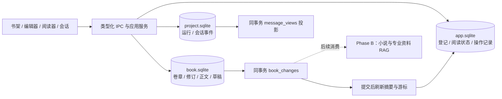
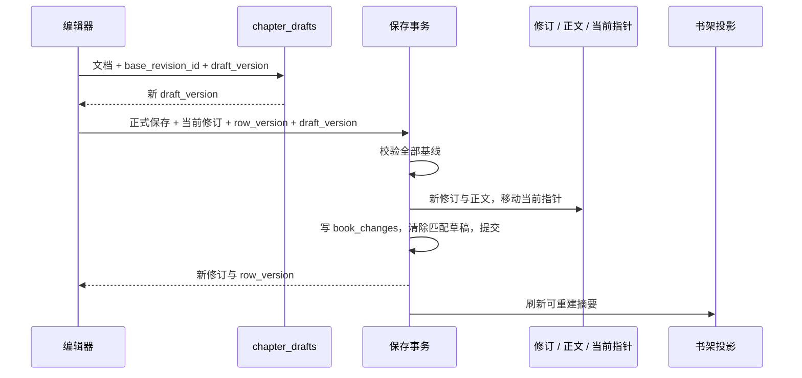

# 第一部分实施记录

> 2026-09-09 · Phase A · 数据库基线版本 100
>
> 对应 [现有业务重设计](./01-existing-business.md)。本轮实现现有业务存储，向量数据库与 Agent RAG 仍按第二部分另行实施。

## 1. 已落地的结构

| 存储 | 权威数据与派生数据 | 实现入口 |
|---|---|---|
| `app.sqlite` | 项目、书籍登记、唯一项目绑定、本机身份、阅读状态、归档和存储操作；书架摘要与消费游标 | `src/main/agent/storage/global/applicationSchema.ts` |
| 每书 `book.sqlite` | 单书身份、卷章、不可变修订、正文、设备草稿、变更日志 | `src/main/agent/storage/book/bookSchema.ts` |
| 每工作区 `project.sqlite` | 会话、技能绑定、Agent 运行、权威会话事件；可重建消息视图 | `src/main/agent/storage/project/projectSchema.ts` |

新业务表使用 STRICT、检查约束和外键；工作区原有全文索引与框架检查点继续使用原协议。三个库分别承担事务，不宣称跨文件提交具有原子性。



书籍登记 ID 与书库内部 `books.id` 统一。导入或以归档快照恢复为新书时赋予新书籍 ID；复制保留内部卷章及修订 ID，因此跨库引用必须包含书籍作用域，不能仅凭章节 ID 全局查找。登记的 `source_generation` 与变更序号共同标识投影来源。

## 2. 编辑、保存与恢复

目录通过一次章节/修订元数据联表查询返回小字段，排序序号在结果集内计算；不再逐章补查位置和修订。选择章节后再加载正文和当前设备草稿。编辑器输入停止 300 ms 后合并保存草稿，停止 5 秒后提交正式修订；Ctrl+S 或失焦立即请求正式保存。

正式保存采用当前修订、章节 `row_version` 和草稿 `draft_version` 校验。修订元数据、正文、当前指针、变更日志与已提交草稿的删除位于同一个书库事务；任一版本不符时回滚，保留草稿供用户处理。同章前端写入也经过串行队列。

正文按规范化 Tiptap JSON 保存；对象键排序保持哈希稳定，节点与标记数组顺序不变。正文哈希、纯文本哈希、字数来自实际文档解析。历史修订及正文拒绝原地更新；恢复历史会新增修订，同时记录当前父版本和被恢复的版本。



重启后，同基线草稿自动回填编辑器；基线已经变化时展示冲突提示，允许复制草稿或明确选择继续编辑，保留已有正文历史。草稿落盘前的 300 ms 输入窗口仍可能因进程异常退出而丢失，不将防抖保存描述为逐键持久化。

卷章排序使用间距为 1024 的整数位置。普通插入/移动只改必要行，间距不足时在事务中用临时负位置重平衡同组。卷章删除使用墓碑，删除卷会将其中章节移到无卷区，保留历史内容。

## 3. 读取、会话与文件操作

| 流程 | 现在的行为 |
|---|---|
| 书架 | 查询登记与持久化摘要；摘要缺失或文件发生变化时检查并重建，缺失/损坏可识别 |
| 阅读 | 固定修订清单、按需正文与有界缓存；阅读状态以本机 profile/device 和版本 CAS 防止旧窗口覆盖 |
| 导出 | 所有格式在预览时固定快照；StoryOS 格式保留当时的一致性数据库快照，确认时直接发布该快照 |
| 导入 | 验证数据库类型、版本、外键与修订正文完整性，新书使用新身份；旧版原生数据库包被明确拒绝 |
| 归档恢复 | 保留阶段、目标和书籍策略；发布文件携带操作归属标记，恢复与补偿前检查真实路径和归属 |
| 永久清理 | 先记操作再移动到受控暂存区；删除登记后仍保留清理详情，已具备归属凭证的中断任务可重放 |
| 会话 | 按会话顺序和 run 内顺序追加权威事件，同事务更新消息视图；重复事件验证一致性，不重复投影 |
| 开发者维护 | 退出编辑前校验外键及修订正文完整性，再恢复运行时并刷新派生摘要 |

会话运行摘要保留兼容用途，消息不再由结束回调重复保存。被事件或子运行引用的 Agent run 不会被普通保留策略删除。工作区激活串行化，避免并发 IPC 初始化两个同项目运行时后错误替换已绑定的书库。

## 4. 当前实现的边界

- 书架接口采用游标分页，当前前端仍逐页取齐以保留既有搜索和统计体验；长会话也分批取齐再还原，尚未增加“加载更早消息”和列表虚拟化。
- 摘要刷新只扫描元数据，不加载正文；当前仍在主进程于源事务提交后同步刷新。启动时逐本校验可用书库、修复摘要，因此并未完成后台消费调度或启动大书架性能优化。
- `book_changes` 由行级触发器与源数据同事务追加，当前 `operation_id` 标识单行变化，并未将多实体操作分组为可跨设备重放的业务命令。Phase B 可按来源序号读取最新权威状态；云同步还需独立设计命令幂等、冲突与墓碑保留协议。
- 运行、修订已具备来源字段；当前工具上下文没有完整传递 run/章节基线时允许为空，不能宣称已具备端到端 Agent 写作审计链。
- 自动清理不越过归属检查；中断发生在归属标记建立前的操作会保留错误记录，不自动删除同路径文件。此类任务需重新发起或经维护处理。
- 永久修订暂不做自动裁剪；向量索引、专业资料库、RAG 检索、云同步、多人协作均未在本轮接入。

## 5. 验证与复现

| 检查 | 结果 |
|---|---|
| TypeScript | `npm run typecheck` 通过 |
| Agent ESLint | `npm run lint:agent` 通过 |
| 存储专项 | `npm run test:storage:phase-a`：7 组检查通过，覆盖身份、CAS、正文规范化、草稿冲突、稀疏排序、修订约束、导出快照、事件重建、恢复与清理 |
| 阅读器专项 | `node scripts/verify-reader-storage.mjs` 通过 |
| 全量行为测试 | 308 项，306 通过；2 项为改造前已有的审批策略断言差异（期望 ask，实际 allow） |
| 生产打包与桌面验证 | 通过：生产打包、实际 IPC、按需正文、草稿提交与进程强制终止后的重启恢复 |

全量测试在 Electron 的 Node 运行模式下执行，避免为系统 Node 重编译原生 SQLite 依赖后破坏桌面运行。现有 `tests/` 受仓库忽略规则管理；新增专项验收脚本位于受版本管理的 `scripts/`。

可复现桌面检查：先执行 `npm exec --no -- electron-forge package`，再执行 `npm run test:storage:desktop`。脚本使用隔离目录和测试配置，不调用外部模型。

千章元数据目录的 20 次暖查询，在最终专项本机运行中得到 P50 1.24 ms、P95 2.05 ms。样本不含大正文，不涵盖冷启动、UI 渲染或真实长期运行负载，也没有旧版对照；仅作为专项回归记录，不代表总体性能提升倍数。

## 6. 显式重建

三个业务库的新基线均为 `user_version=100`。日常启动只初始化新库或拒绝不兼容旧库，不自动删除旧数据。

关闭 StoryOS 后运行：

```powershell
npm run storage:reset
npm run storage:reset -- --apply
```

第一条只输出绝对路径计划；第二条执行清理并初始化新库。可用 `--agent-home <绝对路径>` 指定测试目录。

清理范围为应用数据库、托管书库、项目归档、运行日志，以及已发现项目 `.storyos` 中的数据库、检查点、全文索引与临时数据。配置、技能包、项目源文件和项目元数据文件保留。每个目标在删除前验证其受控父目录和真实路径，拒绝符号链接或重定向目标；完成记录写到用户数据目录 `storage-reset-v100.json`。

已于 2026-09-09 14:52（Asia/Shanghai）执行本机重建：`C:\Users\Administrator\.mini-agent` 的应用库及两个已发现工作区库均为版本 100，业务表为空，`quick_check` 和 `foreign_key_check` 通过。清理前后核对了 7 个保留文件的 SHA-256，全部一致。项目文件夹仍在，原书籍、会话、阅读状态、归档和日志已按授权清除；以后需要时可重新链接项目目录。
