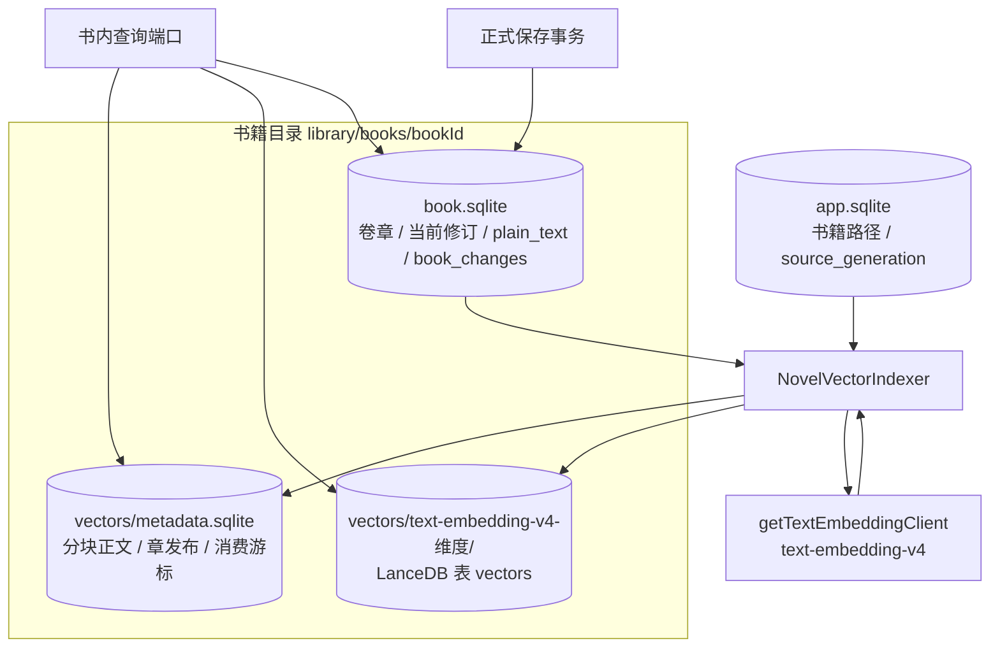
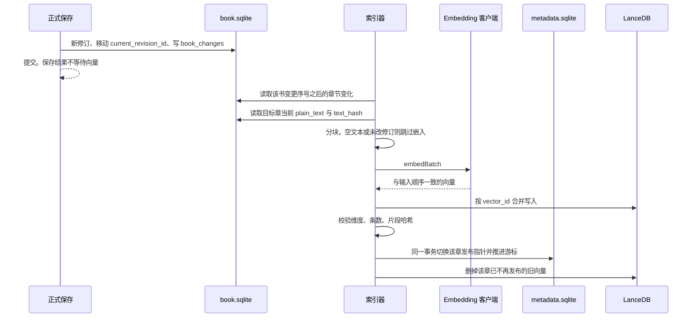

# 小说向量库：落地架构与实现步骤

> 2026-09-22 · 实现设计  
> 引擎按 [第二部分](./02-vector-rag.md) 采用嵌入式 LanceDB。落盘位置按当前已实施的书籍目录，不另建全局 `rag/` 树。  
> 专业资料库、混合召回和 Agent 上下文仍以第二部分为准，不在本文件的实现步骤里。

本文件只解决一件事：把一本书当前已保存的章节正文，做成可按书删除、可整书重建的向量索引。片段检索和相似度检索以后读的是这里发布出来的同一套向量。

## 1. 和现有三库的关系

Phase A 已经落地，版本均为 `user_version = 100`：

| 库 | 路径 | 本步怎么用 |
|---|---|---|
| `app.sqlite` | 应用数据目录 | 只读 `book_registry.source_generation`、书籍路径和可用状态。不改表 |
| `book.sqlite` | `{agentHome}/library/books/{bookId}/book.sqlite` | 权威正文。读当前修订的 `plain_text`、`text_hash`、墓碑和 `book_changes`。不改表 |
| `project.sqlite` | 工作区 `.storyos` | 不读、不写。其中的 `text_chunks` 是项目文件全文索引，不是小说向量 |

书籍永久删除会把整个书籍根目录改名到 `library/.deleting/` 再移除（`BookLifecycleService`）。因此向量必须放在这个根目录里面，删除书籍时一起消失，不必再做一套向量回收协议。

```text
{agentHome}/library/books/{bookId}/
  book.sqlite
  vectors/
    metadata.sqlite
    text-embedding-v4-{dimensions}/
      vectors.lance
```

`StoryOS` 书籍包只包含 `manifest.json`、`book.sqlite`、`checksums.json`。向量不打进导入导出包。导入得到新的 `book_id` 和新的 `source_generation`，到新目录后按当前正文重建。

现有三库的表结构足够作为来源，本步不升 `user_version`，也不执行 `storage:reset`。若实施中发现必须改这三库的表，按 Phase A 已有约定整库删除后重建，不做字段迁移，也不为这次升级另做备份。向量目录本身不兼容时直接删掉 `vectors/` 再建，同样不迁移。

## 2. 架构



读路径先看已发布的章，再在 LanceDB 里按这些章的 `revision_id` 做过滤后的向量查询，最后回到 `book.sqlite` 核对当前修订。对不上的命中作废。



模块放在 `src/main/story/`。通用引擎只通过已有的 `getTextEmbeddingClient()` 把文本变成向量，不出现书籍、章节或 LanceDB。渲染进程不新增取向量的 IPC。

## 3. 索引什么

索引对象是 `deleted_at IS NULL` 且 `current_revision_id` 非空的章节。正文取 `revision_documents.plain_text`，修订身份取 `chapter_revisions.text_hash`。

一条向量是该纯文本上的一个片段，身份字段为：

| 字段 | 来源 |
|---|---|
| `book_id` | 书籍登记与 `books.id` |
| `chapter_id` | `chapters.id` |
| `revision_id` | `chapters.current_revision_id` |
| `start_offset` / `end_offset` | 该修订 `plain_text` 的 UTF-16 下标，与 JavaScript 字符串下标一致 |
| `text_hash` | 该修订已有的 `text_hash` |
| `content_hash` | 片段自身的 SHA-256 |

`vector_id` 由 `book_id`、`revision_id`、起止偏移、`content_hash`、`space_id` 按固定顺序拼接后做 SHA-256。同一修订的同一片段重复写入时合并到同一行。

不进入索引的内容：未提交草稿、历史修订、会话、检查点、技能、书架摘要、阅读器生成页、项目文件、书名、简介、卷摘要。

## 4. 两个文件各自存什么

SQLite 与 LanceDB 没有共同事务。读者只认 `metadata.sqlite` 里已经发布的章。LanceDB 里多出来的行，在发布完成前不能被查询端口读到。

### 4.1 `vectors/metadata.sqlite`

新库，`application_id` 与三份业务库都不同，`user_version = 1`。打开时版本不符就删除整个 `vectors/` 再重建。

```sql
CREATE TABLE index_meta (
  singleton INTEGER PRIMARY KEY CHECK (singleton = 1),
  source_generation TEXT NOT NULL,
  last_sequence INTEGER NOT NULL,
  space_id TEXT NOT NULL,
  model_name TEXT NOT NULL,
  dimensions INTEGER NOT NULL,
  metric TEXT NOT NULL,
  chunker_version INTEGER NOT NULL,
  state TEXT NOT NULL CHECK (state IN ('building', 'published', 'failed')),
  error_message TEXT,
  updated_at INTEGER NOT NULL
) STRICT;

CREATE TABLE chapter_publications (
  chapter_id TEXT PRIMARY KEY,
  revision_id TEXT NOT NULL,
  text_hash TEXT NOT NULL,
  chunk_count INTEGER NOT NULL CHECK (chunk_count >= 0),
  published_at INTEGER NOT NULL
) STRICT;

CREATE TABLE novel_chunks (
  id TEXT PRIMARY KEY,
  chapter_id TEXT NOT NULL,
  revision_id TEXT NOT NULL,
  ordinal INTEGER NOT NULL CHECK (ordinal >= 0),
  start_offset INTEGER NOT NULL CHECK (start_offset >= 0),
  end_offset INTEGER NOT NULL CHECK (end_offset > start_offset),
  content_hash TEXT NOT NULL,
  content TEXT NOT NULL,
  UNIQUE (chapter_id, revision_id, ordinal)
) STRICT;
```

`index_meta` 只有一行。`chapter_publications` 是查询白名单。`novel_chunks.content` 是检索返回用的片段文本，不写回 `revision_documents`。

`space_id` 固定为 `text-embedding-v4-{dimensions}`，例如 `text-embedding-v4-1024`。`model_name` 只能是 `text-embedding-v4`。`metric` 固定为 `cosine`。`chunker_version` 固定为 `1`。这四项有任何一项和当前实例不一致，就按新空间整书重建，建完后删除旧的空间目录。

### 4.2 LanceDB 表 `vectors`

每个 `space_id` 目录一张表。维度由该空间固定，写入时逐条核对。

| 列 | 类型 | 用途 |
|---|---|---|
| `vector_id` | 字符串 | 与 `novel_chunks.id` 相同，合并写入的键 |
| `book_id` | 字符串 | 防止复制后的章节 ID 串到另一本书 |
| `chapter_id` | 字符串 | 预过滤 |
| `revision_id` | 字符串 | 预过滤到已发布修订 |
| `start_offset` / `end_offset` | 整数 | 回读原文 |
| `text_hash` / `content_hash` | 字符串 | 与元数据互相核对 |
| `space_id` | 字符串 | 核对模型和维度 |
| `vector` | 固定维度 Float32 | 距离计算 |

表上不放片段正文。LanceDB 的普通写入不保证 `vector_id` 唯一，所以上传后要按 `vector_id` 合并，发布前再数一遍该章的行数。本步使用精确检索，不建 ANN 索引。单书片段量在几千到几万，精确距离够用。

## 5. 分块

`chunker_version = 1` 的规则写死，便于同一修订得到同一批 `vector_id`：

1. 只切 `plain_text`，不改书库里的原文。
2. 段落是两个换行之间的非空文本。连续空行不产生片段。
3. 按原文顺序把相邻段落装进同一片段，片段之间不重叠。装入下一段后，片段字符数（UTF-16 长度，含段落之间原有的那一个换行）不得超过 800。
4. 单段已超过 800 时，按 800 个 UTF-16 码元硬切，仍不重叠。
5. 偏移是原字符串上的半开区间 `[start_offset, end_offset)`。`plain_text.slice(start, end)` 必须等于 `content`。

800 是这一版分块器的字符预算，不是 embedding 接口的 token 上限，也不是召回效果的验收值。要改预算就升 `chunker_version` 并整书重建。

## 6. 发布

一本书同一时间只有一个索引任务。任务在正式保存提交之后排队，不进入保存事务。

对 `book_changes` 中 `entity_type = 'chapters'` 且 `local_sequence` 大于游标的记录：

1. 再读这本书的当前章。墓碑或没有当前修订：删掉该章的发布行和片段行，再删掉 LanceDB 里该章的向量。
2. 已发布的 `revision_id` 与 `text_hash` 都没变：只推进游标，不调用 embedding。
3. 否则分块。零片段时发布 `chunk_count = 0`。
4. 调用 `embedBatch`。返回条数、顺序和维度必须与输入一致，否则该章保持旧发布，`index_meta.state` 记为 `failed`。
5. 合并写入新 `vector_id`。核对行数与 `content_hash`。
6. 在 `metadata.sqlite` 的一个事务里替换该章 `novel_chunks`、更新 `chapter_publications`、推进 `last_sequence`，并把 `state` 写成 `published`。
7. 事务成功后，删除该章不在新发布集合里的 LanceDB 行。

第 6 步提交前进程退出：查询仍看到旧章，下次从原游标重做。第 6 步已提交而第 7 步未做：查询过滤的是新 `revision_id`，旧向量不会被读到，下次任务清掉它们。

`source_generation` 与 `index_meta` 不一致时，删除 `vectors/` 下的空间目录和元数据，从序号 0 全量重建。卷标题、书名、简介的变更不触发嵌入。

实例还没有可用的阿里云文本向量配置时，不创建 `vectors/`。编辑、阅读、导入导出和 `search_book_chapters` 保持原样。配置补齐后，下次打开这本书再建立索引。更换 API Key 或 Base URL 且模型与维度不变时，不重建。

## 7. 查询端口

本步在主进程提供书内查询，不把向量交给渲染进程，也不在这一步注册新的 Agent 工具。

```ts
type NovelVectorHit = {
  readonly bookId: string;
  readonly chapterId: string;
  readonly revisionId: string;
  readonly startOffset: number;
  readonly endOffset: number;
  readonly content: string;
  readonly contentHash: string;
};

searchNovelFragments(bookId: string, queryText: string, limit: number): Promise<readonly NovelVectorHit[]>
searchSimilarFragments(bookId: string, sourceText: string, limit: number): Promise<readonly NovelVectorHit[]>
```

两个函数都是：用当前空间把输入变成一条向量，在 LanceDB 中预先过滤到本书已发布的 `chapter_id + revision_id`，按余弦距离取有限条，再用 `book.sqlite` 核对章未删除且修订仍是当前修订。`limit` 由调用方传入，本端口不替调用方决定召回策略。

索引不存在、正在全量重建或 `state = failed` 时，查询抛出明确错误，调用方继续使用字面搜索。不把过期章节当成结果返回。

## 8. 实现步骤

按顺序做。前一步的检查没过，不进入下一步。

### 步骤 1：确认 LanceDB 能在 Electron 里打开

安装 `@lancedb/lancedb`，锁定到含 Windows x64 预编译包的版本。在 `vite.main.config.ts` 的 `external` 中加入 `@lancedb/lancedb`，与 `better-sqlite3` 一样不打进主进程包。在 `forge.config.ts` 的 `packagedRuntimeRoots` 中加入：

- `/node_modules/@lancedb/lancedb`
- `/node_modules/@lancedb/lancedb-win32-x64-msvc`

冒烟只做三件事：在临时目录创建 1024 维表、写入一行、按标量过滤查回，然后删除该目录。分别在 `electron-forge start` 和 `electron-forge package` 的产物里跑通。这一步不调用阿里云。

### 步骤 2：摆好书籍目录里的向量位置

在 `BookLayout` 旁增加只读路径函数，根目录仍是 `getBookLayout` 的 `rootPath`：

- `vectors/metadata.sqlite`
- `vectors/{spaceId}/`

路径必须落在该书根目录内。符号链接拒绝使用。不要把这些文件写进 `StoryOSBookPackage` 的文件清单。

### 步骤 3：建立 `metadata.sqlite`

新增 `src/main/story/storage/vectors/`，模式照 `BookDatabase`：独立 `application_id`、`user_version = 1`、STRICT。版本不符或完整性检查失败时删除 `vectors/` ，由索引器重建。不写迁移脚本。

### 步骤 4：实现分块器

纯函数，输入 `plain_text`，输出带偏移和 `content_hash` 的片段。测试覆盖：空文本、单段、跨段封顶 800、超长段硬切、`slice` 往返、相同输入得到相同 `vector_id` 材料。

### 步骤 5：实现 LanceDB 读写

`src/main/story/storage/vectors/LanceNovelVectorStore.ts` 只接受第 4.2 节的列。提供按 `vector_id` 合并、按章删除、按已发布修订预过滤的精确查询。维度不符直接失败，不截断、不补零。

### 步骤 6：实现索引器

`src/main/story/application/vectors/NovelVectorIndexer.ts` 接收书库只读连接、元数据连接、LanceDB 存储，以及调用方注入的 `AliyunTextEmbeddingClient`。它不读取 `config.json`，也不创建 embedding 客户端。

行为就是第 6 节。正式保存的返回路径只负责在事务提交后把 `bookId` 放进该书队列。队列抛错时记录 `index_meta.state = failed`，不回滚已经提交的修订。

全量重建的触发条件：目录不存在、`source_generation` 变化、`space_id` 或 `chunker_version` 变化。

### 步骤 7：接到现有生命周期

- 章节正式保存成功后入队。草稿保存不入队。
- 启动时对状态为可用的书各做一次追赶。追赶失败不阻止书架和编辑器打开。
- 书籍根目录被 `BookLifecycleService` 移走时，向量目录自然跟着离开，不单独删除。
- 实例 embedding 配置保存成功后，比较新的 `space_id`。变化则把已打开的书标记为需要重建。

### 步骤 8：实现查询端口

按第 7 节实现两个函数，放在 `src/main/story/application/vectors/`。测试使用假的 embedding 客户端和临时目录，不访问网络。

此步骤到查询端口为止。片段如何放进 Agent 提示、界面如何展示，另做。

### 步骤 9：定向验证

- 分块器往返与 800 字边界。
- 同一修订第二次索引不再调用 `embedBatch`。
- 墓碑章立即从查询结果消失。
- 书库修订已变、向量还是旧修订时，命中被丢弃。
- `source_generation` 变化后旧空间目录不存在。
- 维度从 1024 改为 768 时使用新目录，查询不再读旧目录。
- embedding 抛错时，正式保存的修订已经在 `book.sqlite` 中，且查询不会返回半截新章。
- 打包后的 Electron 主进程能完成步骤 1 的冒烟。

存储检查用现有的书库测试方式，针对 `src/main/story/storage/vectors` 与 `src/main/story/application/vectors`。不把这次改动扩大成全量 `npm run check`，除非步骤 1 改动了打包配置并且窄测试盖不住主进程加载。

## 9. 本步不做的事

- 不建 `knowledge.sqlite`、全局 `rag.sqlite`，也不把小说片段写进 `project.sqlite`。
- 不把向量列加进 `revision_documents`。
- 不索引草稿、历史修订和项目文件。
- 不从设置页或渲染进程发起 `embed` / `embedBatch`。
- 不建 ANN 索引，不做关键词混合召回，不改 `search_book_chapters`。
- 不把检索片段写入会话，也不新增 Agent 工具。
