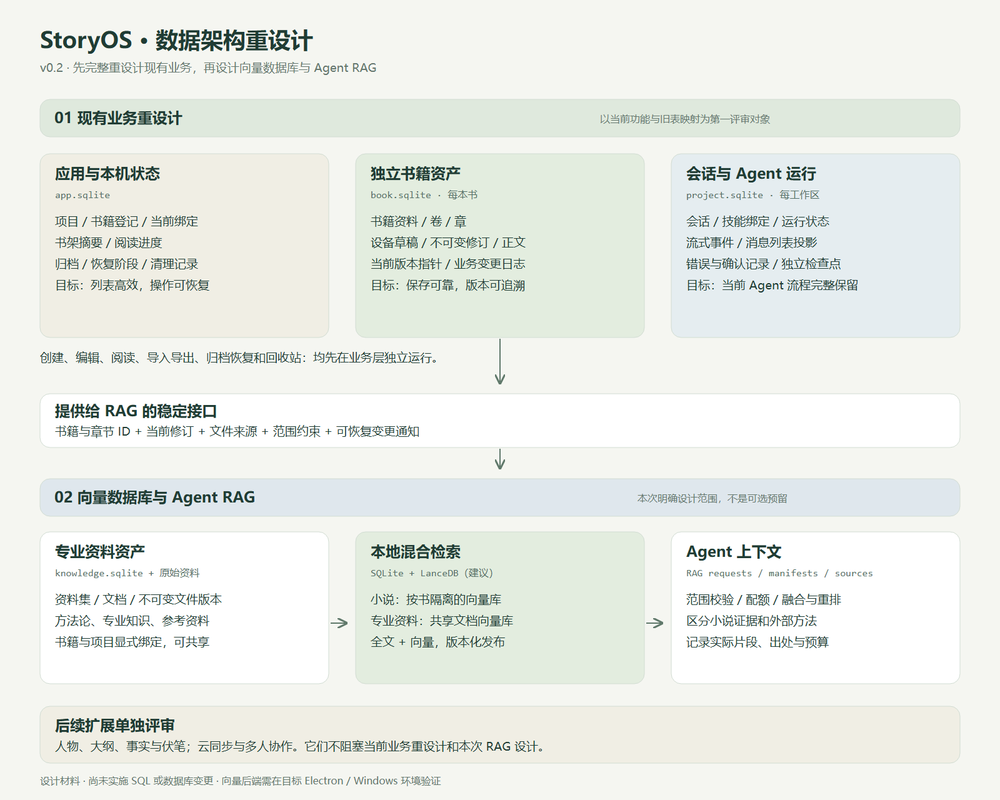
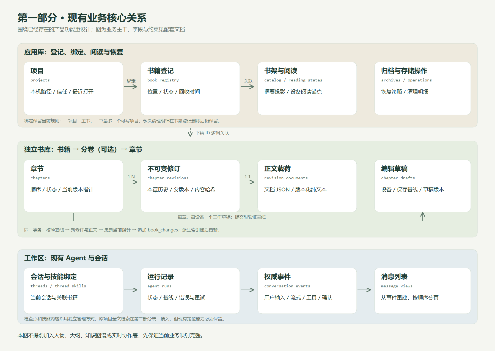
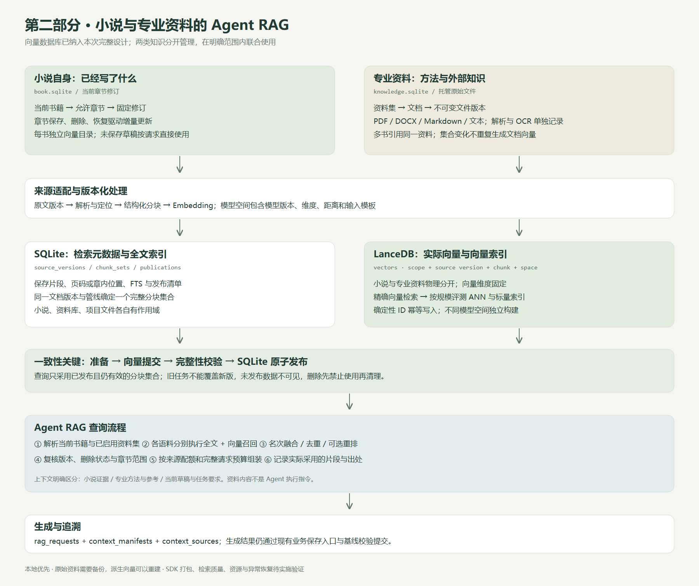

# StoryOS 数据架构重设计

> v0.3 · 2026-09-09 · 第一部分已实施
> 已确认：本地优先，预留云同步与协作；允许重建数据库、舍弃旧数据。  
> 第一部分已获批准并实施；第二部分仍为设计稿。实现边界和验证结果见[实施记录](./04-phase-a-implementation.md)。

## 1. 本版按两个主任务展开

**第一，完整重设计现有业务表结构。第二，在该业务模型上设计小说与专业资料的向量数据库，为下一步 Agent RAG 提供支撑。**

两个任务都属于本次设计范围。设计与实施的依赖顺序是先业务、后 RAG；向量数据库已经纳入明确设计，不再是上一版的可选预留。

人物、大纲、事件、伏笔和实时协作等后续业务单独列出，不作为当前表重设计的前提。

## 2. 建议阅读顺序

| 文档 | 主要内容 | 本轮重点 |
|---|---|---|
| [第一部分：现有业务重设计](./01-existing-business.md) | 现有业务清单；旧表 → 新表逐项映射；字段、键、状态与读写流程 | 项目、书架、卷章、修订、阅读、导入导出、归档、回收站、会话、Agent 和技能绑定完整覆盖 |
| [第二部分：向量数据库与 Agent RAG](./02-vector-rag.md) | 小说向量库；专业资料资产与共享向量；模型空间、索引、发布一致性、Agent 查询与追溯 | 向量从首版 RAG 参与检索；两类来源分别管理与使用 |
| [小说向量库落地架构](./05-novel-vector-store.md) | 在现有三库上使用嵌入式 LanceDB；书籍目录内的元数据与向量；分块、发布和实现步骤 | 只做当前修订正文。专业资料和 Agent 检索不在该实现里 |
| [后续业务边界](./03-future-business.md) | 人物大纲等叙事实体，以及云同步与协作的接口方向 | 与本次主线分开，避免扩大当前重设计范围 |

第一部分业务表已按版本 100 落地；[实施记录](./04-phase-a-implementation.md)列出具体行为、验证与尚存边界。小说向量的落盘和实现步骤见 [小说向量库落地架构](./05-novel-vector-store.md)。写作时用这些向量对照已写正文的工具建议见 [写作时对照本书已写内容](../../todo/novel-writing-recall.md)。专业资料与 Agent RAG 仍为设计建议，尚未做兼容性测试。

## 3. 总体架构

[查看 SVG 总览](./architecture.svg)

| 层次 | 数据所有权 | 推荐存储 |
|---|---|---|
| 现有业务 | 项目登记、本机状态、书籍正文、修订、会话和恢复记录 | 沿用 app.sqlite、每书 book.sqlite、每工作区 project.sqlite |
| 新增专业资料业务 | 资料集、文档版本、托管原始文件与使用绑定 | knowledge.sqlite + 原始资料文件 |
| RAG 元数据与全文检索 | 来源版本、分块、发布清单、任务、检索配置 | SQLite；分作用域管理可重建数据 |
| RAG 向量数据库 | 固定模型空间中的向量与检索索引 | 建议采用嵌入式 LanceDB；实施前验证 Electron / Windows 兼容性 |
| Agent 上下文 | 实际检索请求、采用片段、出处和请求预算 | 工作区内新增 RAG 记录表 |

LanceDB 官方提供 TypeScript SDK 和本地嵌入式目录模式，这是推荐它作为向量层候选基线的依据；项目集成效果仍需验证。[官方快速开始](https://docs.lancedb.com/quickstart)

## 4. 先评审现有业务关系

[查看 SVG 业务关系](./relationships.svg)

这一层的目标是让当前功能有清晰的数据来源和可靠的状态变化：

- 书架读摘要，目录读元数据，打开章节才读正文。
- 正文草稿、不可变修订和当前指针各有职责。
- 归档、恢复和物理清理保留完整阶段与归属信息。
- 会话事件作为消息来源，消息列表可以重建。
- 向量库未启动或重建时，现有编辑、阅读、导出与恢复仍可运行。

## 5. 再评审小说与专业资料 RAG

[查看 SVG RAG 架构](./rag-architecture.svg)

**小说库回答“已经写了什么”；专业资料库提供“方法、理论与外部知识”。** 两类证据在上下文中保留各自身份。

小说以当前章节修订作为来源，按书籍隔离；专业资料拥有独立文件版本与资料集，多本小说可以引用同一份资料。向量不复制成为正文权威来源，正文与原始资料更新后，通过完整批次验证和发布切换使检索追上。

Agent 在已确定的范围内执行全文 + 向量召回，再融合、重排、校验版本与预算；记录真正发送的片段和出处。专业资料中的文本是检索数据，不自动成为 Agent 的执行指令。

## 6. 相较上一版的调整

| 上一版 | 本版 |
|---|---|
| 总目录中混合了现有业务与未来叙事模块 | 第一部分只围绕当前业务逐项重设计；后续叙事模块移到独立说明 |
| 向量是“后续按效果加入”的简略预留 | 向量数据库是本次完整设计项，包含实际向量列、模型空间、索引与发布协议 |
| 主要聚焦小说与项目文件 | 新增独立专业资料库、资料版本、共享资料集和书籍/项目使用绑定 |
| 项目关系表提前预留多书模式 | 现有业务阶段保留当前一项目一主书和唯一可写绑定规则 |
| 导出定版、设定与新业务表一并展开 | 当前预览和阅读会话继续允许内存管理；长期稿件定版等新业务后续再做 |

## 7. 设计后的实施顺序

1. 完成现有业务字段、约束和接口评审，实施新库初始化与现有流程回归。
2. 实施专业资料管理、小说及资料向量索引、混合检索和 Agent 上下文追溯。
3. 再按产品需求引入人物大纲、云同步和协作等扩展。

允许舍弃旧数据，省去逐字段旧数据迁移负担；数据库重建仍应是明确的一次操作，与日常启动分离。本机重建结果及命令见[实施记录](./04-phase-a-implementation.md#6-显式重建)。
