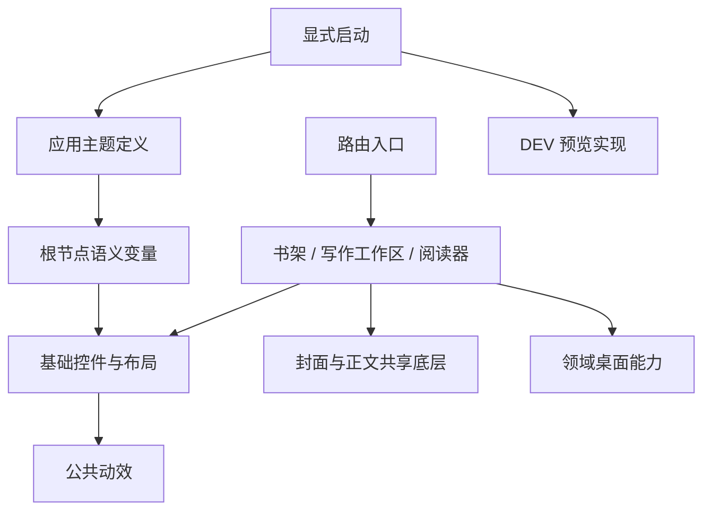

# StoryOS 前端模块化与主题体系实施记录

> 实施日期：2026-09-09。依据：[前端分析文档](./frontend-modularization-and-theme-analysis.md)。
> 对照基线：`835f938`。本文记录实际改动、扩展约定与验证范围。

## 1. 实施结果

已落地分析文档阶段 1～5 的核心改动，并完成阶段 6 中的编辑器保存会话和分页指令拆分。公共控件、主题、布局与业务模块现在有独立入口；书籍工作区、书架、阅读器从页面目录迁入各自功能模块。

本轮只涉及前端结构和交互。对话界面的改动是语义颜色替换、错误展示复用和前端页面协调代码整理；Agent 编排、RAG、主进程、preload 协议和数据库结构没有改动。

| 分析阶段 | 已完成内容 |
| --- | --- |
| 0：基线 | 原始类型检查、源码规模记录；使用现有预览脚本建立交互回归，补充最终截图 |
| 1：基础控件 | Button、IconButton、Input、Textarea、NativeSelect、FormField、InlineNotice、Toast；设置和新建书籍作为真实消费者 |
| 2：交互容器 | 复用 AnimatedDialog；抽取标题、页脚和确认弹窗；统一项目/书架操作菜单；抽取编辑器/阅读器 Select |
| 3：页面编排 | PageSurface/PageHeader、共享 resize Hook；工作区导航、布局、会话协调与页头拆分；书架视图返回状态独立 |
| 4：依赖边界 | 下移封面、正文 schema 与分页底层；保留薄路由入口；预览启动迁到 bootstrap；书架桌面能力薄适配 |
| 5：主题 | 浅色/深色/跟随系统、持久化、语义 token、外观设置、portal 继承；阅读纸张和封面版本参与纹理 key |
| 6：编辑器 | 保存会话、编辑器桥接和分页指令拆分；连续写入、revision、草稿恢复与冲突、撤销和路由保存回归 |

“原始截图像素级对比”和完整性能基准未建立，因此不将视觉完全等价或性能提升比例作为本次结论。

## 2. 当前目录与依赖方向

```text
src/renderer/
  app/
    bootstrap.ts                  # 显式启动与 DEV 预览开关
    theme/                        # token 契约、偏好、外观设置
  components/
    ui/                           # 无路由、无领域、无 Electron 依赖的控件
    layout/                       # 页面外壳与通用面板尺寸交互
    motion/                       # 既有动效、弹窗与焦点机制
  features/
    book-presentation/            # 封面绘制、封面皮肤注册表
    book-content/                 # 正文扩展、共享分页模型/引擎/测量
    book-workspace/               # 写作页面、目录、编辑器、工作区协调
    bookshelf/                    # 书架、归档、导入导出、回收站
    reader/                       # 阅读会话、排版、场景与纹理缓存
  platform/
    desktop/                      # 按领域收窄的桌面能力入口
    preview/                      # 浏览器预览 API 与数据
  lib/                            # 错误归一化、快捷键目标判断
  pages/                          # 路由入口；书籍相关入口只转交 feature
```



`book-content` 共享正文 schema、格式扩展、纯分页模型和 DOM 测量；编辑器分页控制器、阅读缓存和阅读锚点仍各自归属业务模块。编辑器与阅读器没有合并为同一套状态机。

新增 ESLint 边界规则：`components/ui`、`components/layout` 禁止引用 pages、features、platform 和 router；封面与正文共享层禁止反向引用 pages。新增 `npm run lint:frontend`，不依赖只覆盖 Agent 的原有 lint 命令。

## 3. 公共组件如何使用

| 入口 | 负责什么 | 调用方保留什么 |
| --- | --- | --- |
| [Button.tsx](../../src/renderer/components/ui/Button.tsx) | 语义 variant、尺寸、disabled/loading、键盘与原生按钮属性 | 业务动作、提交前校验 |
| [Field.tsx](../../src/renderer/components/ui/Field.tsx) | 输入外观、label/control 关联、帮助/错误描述与 aria | 表单状态、校验规则、保存协议 |
| [Notice.tsx](../../src/renderer/components/ui/Notice.tsx) | 语义反馈与展示结构 | 何时展示、多久展示、错误属于哪个流程 |
| [Dialog.tsx](../../src/renderer/components/ui/Dialog.tsx) | 标题、页脚、同步确认结构 | 业务内容、确认后导航或动作 |
| [ActionMenu.tsx](../../src/renderer/components/ui/ActionMenu.tsx) | 定位、portal、方向键、Home/End、焦点恢复、禁用项 | 菜单项、异步错误与业务权限 |
| [Select.tsx](../../src/renderer/components/ui/Select.tsx) | 列表选择、定位、键盘、浮层；可保留编辑器选区 | 选项集合、当前值、应用格式命令 |
| [PageSurface.tsx](../../src/renderer/components/layout/PageSurface.tsx) | 页面表面与标题区域的基础布局 | 页头内容、工具栏和业务布局 |
| [useResizablePanel.ts](../../src/renderer/components/layout/useResizablePanel.ts) | 尺寸限幅、指针捕获、键盘调宽、偏好持久化 | 当前容器宽度、左右面板预算 |

基础按钮使用 `primary / secondary / ghost / danger`，不按页面命名变体。图标按钮必须提供 `aria-label`。保留了具有领域视觉意义的原生按钮，并未机械替换所有 `<button>`。

表单推荐组合：

```tsx
<FormField label="书籍名称" error={titleError}>
  {(control) => (
    <Input {...control} value={title} onChange={event => setTitle(event.target.value)} />
  )}
</FormField>
<Button type="submit" variant="primary" loading={saving}>保存</Button>
```

`ActionMenu` 使用通用 `triggerData` 扩展测试标识，不接收 bookId 或项目对象。书架和项目适配组件只构造菜单项。异步操作仍由对应业务 Hook 负责错误反馈，公共菜单不吞并领域错误策略。

### 3.1 弹窗生命周期

新建书籍、创建项目、删除书籍条目、导入、归档列表、归档恢复、永久删除，以及设置离开确认、开发者确认都接入同一弹窗基础机制。原有导出和重命名继续复用该机制。

- 用户关闭、取消、Escape、遮罩使用 render prop 的 `close`；`onClose` 在退出与资源清理完成后执行。
- 新建书籍成功后，可返回“打开创建项目弹窗”的 continuation；由 `close(afterClose)` 在上一弹窗退出后执行，避免两个弹窗交叉抢焦点。
- `busy` 拦截用户关闭；异步提交失败时由表单保留输入并展示错误，成功提交使用开始提交时传入的关闭回调。
- `ConfirmDialog` 确认分支执行 `onConfirm`，取消分支执行 `onClose`；确认后调用方负责卸载或导航，避免路由 blocker 先 reset 再 proceed。
- 焦点逻辑识别 `aria-modal` 和已打开的原生 dialog；Select 在弹窗内部使用对应 portal 宿主。
- 删除旧的 `useBookshelfDialogFocus` 和无调用的 `ConfigurationDialog`。

复杂记录编辑器 `RecordEditor` 保留原生 dialog 与原有未保存记录会话；其中确认弹窗已兼容原生顶层容器。项目会话切换器、设置启动器是非模态浮层，继续按各自交互处理。

## 4. 可扩展主题的实现与约定

### 4.1 应用主题

[themeModel.ts](../../src/renderer/app/theme/themeModel.ts) 定义 `ThemeDefinition`、完整 `AppSemanticTokens` 和 `THEMES` 注册表。当前提供“经典”配色的浅色与深色两套值，默认跟随系统。

[themeStore.ts](../../src/renderer/app/theme/themeStore.ts) 在 React 启动前读取偏好并写入根节点 `--app-*` 变量；同时设置 `data-appearance` 与 `color-scheme`，监听系统模式和跨窗口 storage 变化。偏好结构为：

```json
{ "version": 1, "appearance": "system", "paletteId": "default" }
```

存储键为 `storyos.appearance.v1`。非法 JSON、未知版本和无效配色在读取边界归一化。外观设置独立于 AI 配置的 dirty/save 状态，更改主题不会提交或清空尚未保存的模型配置。

CSS 使用 `@theme inline` 将 Tailwind 语义颜色映射到 `--app-*`；公共 Menu/Select 样式位于 `components` layer，调用方可用 utility 类调整尺寸。应用颜色按 surface、foreground、border、accent、danger、success、warning 等角色管理。

设置页的界面模式、配色和模型服务统一使用自定义 Select，不使用系统原生下拉。表单场景通过 `size="md"` 保持 42px 高度和全宽展示，并接收 FormField 的 id、帮助描述和错误属性；键盘选择与 Escape 焦点恢复沿用公共实现。

新增应用配色步骤：

1. 在 `THEMES` 增加一个稳定 id 的 `ThemeDefinition`，提供完整的 light/dark token。
2. 保持 token 的语义角色一致，不在业务组件中增加主题名称判断。
3. 配色多于一种时，外观设置自动显示“配色”选择框。
4. 运行模型检查和主题 UI 回归，检查输入、disabled、错误提示与 portal。

本次未提供任意 JSON/CSS 主题导入或在线主题市场；可扩展指的是代码注册表和统一契约。

### 4.2 封面、纸张与正文

| 范围 | 所有者 | 变化策略 |
| --- | --- | --- |
| 应用 chrome、表单、菜单、侧栏 | `app/theme` | 更新根节点变量，不更改页面/编辑器 key |
| 封面渐变、装饰和字色 | [coverThemes.ts](../../src/renderer/features/book-presentation/coverThemes.ts) | 独立封面皮肤，更新视觉定义时递增 `COVER_THEME_VERSION` |
| 阅读纸张与墨色 | [readerThemes.ts](../../src/renderer/features/reader/readerThemes.ts) | paper/dark 注册表，修改配色时递增该主题 version |
| 用户正文颜色、字号、段落属性 | 正文文档 | 保留内容意义，不由应用主题覆盖 |

ReaderStage 的纹理标识包含阅读主题 id/version 和封面版本，避免同一几何尺寸下复用旧配色纹理。全局深色不会把封面、编辑纸张或用户写入的正文格式强行反色。

导入导出的格式标识也保留独立的高饱和配色，并与反白文字成对定义；不把状态文字 token 用作实色背景。一般选中态使用 accent/accent-foreground 配对，避免浅色 accent 背景叠加白色文字。

## 5. 页面与保存链路的拆分

### 5.1 写作工作区

- [useBookNavigation.ts](../../src/renderer/features/book-workspace/useBookNavigation.ts)：当前章节、页目标与请求编号、页面增删移动动作。
- [useBookWorkspaceLayout.ts](../../src/renderer/features/book-workspace/useBookWorkspaceLayout.ts)：目录/助手显隐、实际容器测量、左右面板宽度；助手预算使用目录的实际宽度。
- [useBookConversations.ts](../../src/renderer/features/book-workspace/useBookConversations.ts)：现有会话 API 到页面的适配、URL 查询参数同步、发送前 flush。未变更 Agent 协议。
- [BookWorkspaceHeader.tsx](../../src/renderer/features/book-workspace/components/BookWorkspaceHeader.tsx)：只接收展示字段和操作，不访问整个 workspace。
- [useBookshelfView.ts](../../src/renderer/features/bookshelf/useBookshelfView.ts)：阅读返回的搜索、列表模式、滚动位置和焦点恢复。

规模对照包含空行与注释，反映主文件职责的减少，不代表总代码行数减少或运行性能提高：

| 文件 | 原始行数 | 当前行数 |
| --- | ---: | ---: |
| BookWorkspacePage | 914 | 512 |
| ChapterRichTextEditor | 665 | 391 |
| BookCatalogPanel | 475 | 391 |
| ChapterEditorToolbar | 412 | 309 |
| BookshelfPage | 292 | 277 |

### 5.2 编辑器会话

[ChapterSaveSession.ts](../../src/renderer/features/book-workspace/editor/ChapterSaveSession.ts) 统一拥有 pending/saved content、revision、定时保存与串行 Promise 链；[useChapterPersistence.ts](../../src/renderer/features/book-workspace/editor/useChapterPersistence.ts) 将其生命周期绑定到单个章节编辑器。

- 每次写入执行时读取上一笔成功写入的 revision，连续 flush 不并发使用旧 revision。
- 旧请求完成不能清空较新的输入；写入失败保留 pending，后续 flush 可重试。
- 与当前 revision 匹配的草稿可恢复；不同基线的草稿不会静默覆盖正文。
- 卸载 flush 进入同一条队列，避免与在途写入竞争。
- 现有书籍数据层的 row/draft 版本检查和按章节写入顺序继续保留。
- 页指令分离至 `useChapterPageCommands`，桥接分离至 `useChapterEditorBridge`；编辑器 key 继续绑定章节身份。

工作区离开到设置/开发者页面时先 flush，再放行路由。此次拆分没有把编辑器保存降级为通用 `useAsync`，也没有重建正文 Store。

### 5.3 桌面与异步边界

[bookshelfApi.ts](../../src/renderer/platform/desktop/bookshelfApi.ts) 用现有 `AgentDesktopApi` 的 `Pick` 收窄书架能力，接口缺失时返回明确错误。其余复杂导入导出、编辑器和阅读协议保留现有调用方式，避免包装成另一个巨型 API。

预览实现迁入 `platform/preview`，仅在 DEV 且 `?preview=1` 时经 bootstrap 动态载入，不再由 WorkspaceLayout import 触发。生产构建未产出 preview API chunk。

文件浏览器为目录请求增加代次检查，旧结果和卸载后的结果不再覆盖新状态；这属于忽略过期结果，不代表取消主进程请求。快捷键共用输入目标与模态层判断，尊重 IME 和已处理事件。

## 6. 验证记录与复现

基础验证命令：

```powershell
npm run typecheck
npm run lint:frontend
npm run test:frontend:models
node scripts/verify-reader-v2-model.mjs
npx vitest run src/renderer/features/book-content src/renderer/features/book-workspace --reporter=dot
npx vite build --config vite.renderer.config.ts
```

交互验证使用隐藏 Electron 窗口与内存预览 API：

```powershell
# 一个终端启动预览服务
node node_modules/vite/bin/vite.js --config vite.renderer.config.ts --host 127.0.0.1 --port 4320 --strictPort

# 另一个终端运行；不要在测试期间编辑源码触发 HMR
$env:STORYOS_READER_TEST_URL='http://127.0.0.1:4320/?preview=1'
node scripts/verify-shared-motion.mjs
node scripts/verify-bookshelf-actions.mjs
node scripts/verify-export-dialog-motion.mjs
node scripts/verify-frontend-foundations.mjs
node scripts/verify-book-workspace-ui.mjs
node scripts/verify-reader-v2.mjs
```

| 验证 | 覆盖内容 |
| --- | --- |
| 类型检查、前端 lint | 搬迁后的导入、组件契约、公共层依赖限制 |
| frontend-models | 非法主题偏好、系统模式、token 完整性；串行 revision、较新输入保留、重试、草稿恢复与冲突 |
| 原有前端 Vitest | 12 个测试文件、49 个用例：正文目标、事务、分页、工作区模型等 |
| reader-v2-model | 阅读索引、目录、导航、跨页跳转模型 |
| shared-motion | 页面身份与中断、对话框焦点、busy、重命名、窄窗口和减少动态效果 |
| bookshelf-actions | 菜单键盘与禁用项、单一 portal、焦点恢复、网格/列表、125%～200% 缩放 |
| export-dialog-motion | 稳定进度阶段、保存取消、成功、失败重试、文件夹反馈、窄窗口 |
| frontend-foundations | 主题重启恢复与系统变化、未保存模型输入、portal 深色、连续弹窗、封面独立、窄窗口导入 |
| book-workspace-ui | 主题/布局后编辑器身份和撤销记录、键盘格式化、Select 选区、面板限幅、取消删除焦点、路由保存与重新打开 |
| reader-v2 | 3D/文本、纸张主题、纹理更新、字号/缩放重排、跨页导航、返回、图形上下文丢失和重复会话 |
| renderer build | 生产构建成功；保留大 chunk 提示，未通过调高阈值掩盖 |

以上命令及场景在本轮执行通过。

截图位于 `test-results/frontend-foundations`、`test-results/book-workspace-ui`、`test-results/reader-v2` 等目录，遵循仓库已有忽略规则。新增长期可运行检查使用 `scripts/*.mjs`，不依赖被忽略的临时分析脚本。

本轮未执行完整打包安装流程、真实系统文件选择器与原生存储端到端回归；未声称覆盖所有中文输入法组合事件、剪贴板来源和性能指标。已验证的是上述具体场景，preview 的写入验证不能替代真实数据库/IPC 验收。

## 7. 保留的后续工作

以下为原文中的可选或测量后再决定项，不作为本次基础重构缺口：

- 根据 React Profiler 数据决定是否收窄 WorkspaceOutlet 的订阅和拆 Context。
- 按实际调用重复继续扩展 desktop 薄接口，不强制一次包装全部 IPC。
- 复杂记录编辑器的统一容器迁移，需单独覆盖未保存数据与嵌套焦点。
- 富文本输入法/粘贴和真实桌面保存的更广回归。
- 生产包体积和长列表性能优化，需要独立测量；本次不引入通用树、CRUD、全局表单或命令总线。

后续新增页面优先组合公共控件和语义变量，新增领域能力落入对应 feature；不要为了展示动画或主题变化改变编辑器/路由的身份 key。
