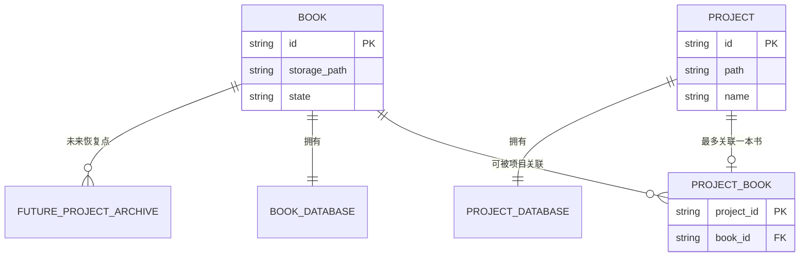
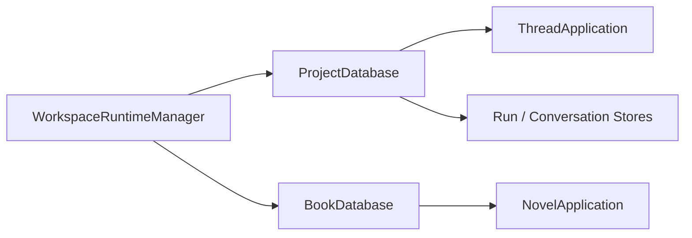
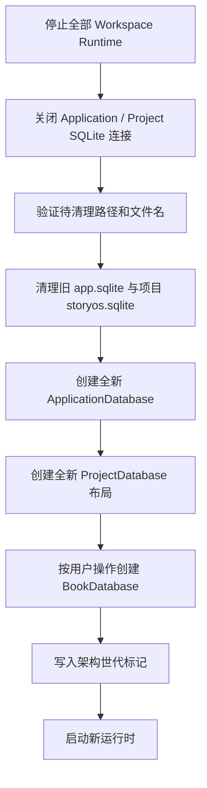

# StoryOS 书籍与项目底层数据架构重构方案

> 状态：底层存储边界已实施，未来业务模块待扩展  
> 适用范围：现有书籍数据存储边界重构  
> 不包含：事件图、人物关系、分析视图、Three.js 预览、导入导出和项目归档的具体业务实现
> 后续设计：`docs/todo/bookshelf-and-future-capabilities-design.md`

## 1. 文档目的

StoryOS 当前将小说正文、分卷、章节和章节版本保存在每个项目自己的 `.storyos/storyos.sqlite` 中。随着“我的书架”以及未来更多书籍工作区的引入，需要先把“书籍资产”和“项目工作环境”拆分成稳定、明确的数据边界。

本次重构只处理当前已经存在的数据结构，不提前创建尚未实现模块的业务表。现阶段数据被视为可丢弃的开发期缓存，不要求迁移或备份。设计必须同时满足：

- 可以直接重建现有全局数据库和项目数据库；
- 不迁移现有小说、分卷、章节、章节版本、对话或运行记录；
- 不备份旧 SQLite 数据库；
- 不删除项目根目录中的普通用户文件；
- 项目与书籍拥有独立身份和生命周期；
- 书架能够以“书籍”为中心，而不是把项目列表换一种方式展示；
- 当前项目功能和 IPC 契约可以平滑切换到新存储边界；
- 未来事件图、人物关系、分析数据、资源数据可以加入书籍存储，不需要再次改变根数据归属；
- 未来完整项目归档和恢复可以在当前边界上扩展，不要求本次提前实现。

本文是后续编码、数据库重建、测试和评审的基准。实现阶段如果需要偏离本文，必须先记录原因和替代方案。

---

## 2. 当前架构事实

### 2.1 全局数据库

当前全局数据库位于 StoryOS 应用目录下的 `app.sqlite`，由：

```text
src/main/agent/storage/global/ApplicationDatabase.ts
```

负责创建和迁移。

当前全局数据库只包含：

- `projects`：登记项目 ID、路径、名称、位置类型和最近打开时间；
- `app_state`：登记当前激活项目。

它不知道项目中是否存在小说，也没有独立的书籍身份。

### 2.2 项目数据库

当前每个项目都有独立数据库：

```text
<project-root>/.storyos/storyos.sqlite
```

由：

```text
src/main/agent/storage/project/ProjectDatabase.ts
```

负责创建和迁移。

该数据库同时保存两类不同生命周期的数据：

1. 项目工作环境数据：对话、消息、Agent 运行记录、事件记录、文本索引等；
2. 书籍资产数据：小说、分卷、章节、章节版本。

当前书籍表包括：

- `novels`
- `volumes`
- `chapters`
- `chapter_revisions`

项目数据库通过 `idx_novels_project_singleton` 保证一个项目最多只有一本小说。

### 2.3 当前运行时

`WorkspaceRuntimeManager` 当前只打开一个项目数据库，并从同一个数据库创建：

- `ThreadApplication`
- `NovelApplication`
- Agent 运行存储
- 对话事件存储
- 文本索引存储

因此 `NovelApplication` 当前隐式依赖“小说数据库就是项目数据库”。这是本次重构最主要的运行时耦合点。

### 2.4 当前变更事件

小说创建、修改、删除、章节保存等操作已经产生 `NovelMutation`，并向渲染进程发布 `book_changed` 事件。

本次重构应保留这些领域事件语义，不应因为数据库位置变化而改变渲染层对小说变更的理解。

---

## 3. 核心问题

当前结构中的 `Project` 同时承担了两个角色：

```text
Project
├── 工作环境
└── 书籍资产所有者
```

这会带来以下长期问题：

1. 删除项目天然意味着删除书籍，无法建立独立的书架生命周期；
2. 从书架恢复或重新创建项目时，无法区分“恢复一本书”和“恢复一次工作环境”；
3. 未来事件图等书籍模块如果继续写入项目数据库，之后再拆分的迁移成本会越来越高；
4. 一个书籍可能需要被重新关联到新项目，但当前没有独立的 `bookId`；
5. 书架如果直接扫描项目数据库，会受到项目路径、项目数量和数据库打开成本影响；
6. 如果书架保存一份可编辑副本，则会形成项目数据和书架数据的双主冲突。

本次重构要解决的是“数据所有权”，而不是提前实现未来业务。

---

## 4. 设计原则

### 4.1 单一事实来源

每类正式数据只能有一个可写的事实来源：

- 书籍内容的事实来源是 `BookDatabase`；
- 项目工作数据的事实来源是 `ProjectDatabase`；
- 全局注册关系的事实来源是 `ApplicationDatabase`；
- 未来归档是不可变快照，不是第二个活跃事实来源。

### 4.2 按生命周期划分，而不是按页面划分

数据不根据“在哪个页面显示”决定存放位置，而根据“它随什么对象创建、迁移和删除”决定：

- 换一个项目仍应存在的数据属于书籍；
- 删除书籍后才应消失的数据属于书籍；
- 只描述一次工作过程的数据属于项目；
- 可以重新计算的数据属于缓存，不作为核心迁移对象。

### 4.3 本次只重建现有业务结构

本次只为当前已经存在的小说领域能力建立新边界：

- 小说；
- 分卷；
- 章节；
- 章节版本。

不创建事件、人物、分析和资源等未来业务表。未来模块通过 `BookDatabase` 的独立迁移继续扩展。

不复制旧记录，不编写旧数据提取器。新结构启用后，从空数据库开始产生新数据。

### 4.4 允许破坏性重置

本次处于可破坏性重构阶段，可以直接清理并重建：

- `<agent-home>/app.sqlite` 及其 WAL/SHM 文件；
- `<project-root>/.storyos/storyos.sqlite` 及其 WAL/SHM 文件；
- 系统默认工作区中相同性质的数据库缓存；
- 可重新生成的文本索引、临时文件和检查点。

不在清理范围内：

- 项目根目录下的用户普通文件；
- 用户明确放入项目的素材；
- 非 StoryOS 管理的外部文件；
- 配置文件中的模型连接信息。

实施时仍必须精确解析目标路径，只删除明确命名的 StoryOS 数据库和缓存文件，不能对项目根目录执行宽泛递归删除。

### 4.5 跨数据库操作采用最终一致性和补偿

`app.sqlite`、`project.sqlite` 和 `book.sqlite` 是不同 SQLite 文件，无法依靠一个普通事务保证三者原子提交。

新架构运行后的所有跨数据库生命周期操作仍必须：

- 可重复执行；
- 有明确阶段；
- 写入顺序安全；
- 失败后能够补偿或给出明确错误；
- 不以“多个数据库正好同时成功”为正确性前提。

---

## 5. 目标概念模型



三个核心实体定义如下。

### 5.1 Book

`Book` 是长期存在的作品资产。它拥有正文和其他正式创作数据。

本次重构后，`Book` 的现有内容包括：

- 小说资料；
- 分卷；
- 章节；
- 章节历史版本。

未来事件图、人物关系等模块应扩展 `BookDatabase`，但不在本次建立表结构。

### 5.2 Project

`Project` 是一次工作环境。它拥有：

- 对话和消息；
- Agent 运行记录；
- 对话事件；
- 项目级技能；
- 项目目录文件；
- 项目级设置和临时状态。

项目可以关联一本书，但不拥有书籍正文。

### 5.3 ProjectBookBinding

项目和书籍之间通过显式关联表示，而不是通过“小说恰好存在于项目数据库”隐式表示。

当前约束：

- 一个项目最多关联一本书；
- 一本书可以暂时没有项目；
- 数据模型允许未来一本书关联多个项目；
- 当前产品层可以继续限制同一时间只有一个主要编辑项目。

### 5.4 身份规则

本次必须明确区分三个现有或新增 ID：

| ID | 示例 | 含义 | 生命周期 |
|---|---|---|---|
| `projectId` | `prj_<uuid>` | 一次项目工作环境 | 随项目创建、移除和未来归档变化 |
| `bookId` | `book_<uuid>` | 一项独立书籍资产 | 不随项目重命名或删除而改变 |
| `novelId` | `novel_<uuid>` | 当前小说领域记录 | 保留现有领域 API 语义 |

`bookId` 和 `novelId` 在第一版中不合并：

- `bookId` 由全局注册和磁盘布局使用；
- `novelId` 继续由 `NovelApplication`、卷、章和版本使用；
- 一库一本书约束保证一个 `bookId` 最多对应一个 `novelId`；
- 重构后创建新书时分别生成新的 `bookId` 和 `novelId`；
- 未来如需统一命名，应作为独立领域迁移，不能在本次隐式替换主键。

---

## 6. 目标文件布局

### 6.1 应用级布局

```text
<agent-home>/
├── app.sqlite
└── library/
    └── books/
        └── <book-id>/
            └── book.sqlite
```

本次只要求创建书籍目录和 `book.sqlite`。未来封面、附件、导入包等资源可以在同一个 `<book-id>` 目录内扩展，不需要现在创建空目录或空表。

### 6.2 项目级布局

重构后直接采用职责清晰的新文件名：

```text
<project-root>/.storyos/project.sqlite
```

`WorkspaceLayout.databasePath` 直接重命名为 `projectDatabasePath`。旧的 `storyos.sqlite` 不读取、不迁移、不作为兼容回退来源。

---

## 7. 全局数据库最小变更

`ApplicationDatabase` 增加两个表：`books` 和 `project_books`。

### 7.1 `books`

```sql
CREATE TABLE books (
  id TEXT PRIMARY KEY,
  storage_path TEXT NOT NULL,
  path_key TEXT NOT NULL UNIQUE,
  state TEXT NOT NULL DEFAULT 'available'
    CHECK (state IN ('available', 'missing')),
  created_at INTEGER NOT NULL,
  updated_at INTEGER NOT NULL,
  last_opened_at INTEGER
);

CREATE INDEX idx_books_last_opened_at
  ON books(last_opened_at DESC);
```

字段说明：

| 字段 | 说明 |
|---|---|
| `id` | 独立、稳定的书籍 ID，建议使用 `book_<uuid>` |
| `storage_path` | 书籍根目录的规范绝对路径，即 `<agent-home>/library/books/<book-id>` |
| `path_key` | 按当前平台规则规范化后的唯一路径键 |
| `state` | 当前书籍存储是否可访问 |
| `created_at` | 书籍登记时间 |
| `updated_at` | 注册信息更新时间，不代表正文更新时间 |
| `last_opened_at` | 最近访问时间，可为空 |

本次不在 `books` 中增加标题、简介、封面、章节数等书架展示字段。原因是这些属于未来书架查询投影，不是完成当前存储边界重构的必要条件。

未来可以新增独立的 `book_catalog_projection`，或在明确书架查询需求后给 `books` 增加可重建缓存字段；不应在本次猜测完整书架契约。

### 7.2 `project_books`

```sql
CREATE TABLE project_books (
  project_id TEXT PRIMARY KEY
    REFERENCES projects(id) ON DELETE CASCADE,
  book_id TEXT NOT NULL
    REFERENCES books(id) ON DELETE RESTRICT,
  attached_at INTEGER NOT NULL
);

CREATE INDEX idx_project_books_book_id
  ON project_books(book_id);
```

使用独立关联表而不是给 `projects` 直接增加 `book_id`，原因如下：

- 现有项目可以处于尚未创建小说的状态；
- 关联的创建和解除是独立生命周期动作；
- 未来如果需要记录关联来源、角色或历史，可以扩展关联表；
- 避免在项目基础记录中混入书籍生命周期字段。

`project_id` 为主键，从数据库层保证一个项目最多关联一本书。

### 7.3 暂不增加归档表

“删除项目后从书架恢复全部数据”是明确的未来需求，但完整归档功能尚未实现。本次只保证以下扩展条件：

- 项目和书籍身份已经拆分；
- 书籍不会因为项目数据库职责变化而必须消失；
- 将来可以在 `ApplicationDatabase` 中增加 `project_archives`；
- 将来归档可以引用 `book_id` 和原始 `project_id`。

本次不创建空的 `project_archives` 表，也不改变当前删除行为伪装成已经支持恢复。

---

## 8. BookDatabase 最小结构

新增独立数据库类型：

```text
src/main/agent/storage/book/BookDatabase.ts
```

它必须拥有独立的 SQLite `application_id`，不能复用 `ProjectDatabase` 的 `application_id`。这样可以防止项目数据库被误当作书籍数据库打开。

第一版 `BookDatabase` 只创建当前已有的四张书籍表，并保持当前字段、约束和索引语义。

### 8.1 `novels`

```sql
CREATE TABLE novels (
  id TEXT PRIMARY KEY,
  title TEXT NOT NULL,
  synopsis TEXT NOT NULL DEFAULT '',
  status TEXT NOT NULL
    CHECK (status IN ('planning', 'writing', 'completed', 'archived')),
  created_at INTEGER NOT NULL,
  updated_at INTEGER NOT NULL
);

CREATE UNIQUE INDEX idx_novels_book_singleton
  ON novels((1));
```

本次保留 `novels` 表名和当前 `novelId`，不立即重命名为 `books` 或 `book_profile`。

原因：

- 当前 `NovelApplication`、DTO、Store 和测试都围绕 `Novel` 命名；
- 数据库物理边界已经表达“一库一本书”；
- 同时改存储位置和领域命名会扩大风险；
- 命名清理可以作为后续独立重构。

### 8.2 `volumes`

沿用现有结构和外键：

```sql
CREATE TABLE volumes (
  id TEXT PRIMARY KEY,
  novel_id TEXT NOT NULL
    REFERENCES novels(id) ON DELETE CASCADE,
  title TEXT NOT NULL,
  summary TEXT NOT NULL DEFAULT '',
  sort_order INTEGER NOT NULL CHECK (sort_order >= 0),
  created_at INTEGER NOT NULL,
  updated_at INTEGER NOT NULL,
  UNIQUE(novel_id, sort_order)
);
```

### 8.3 `chapters`

沿用现有结构、卷归属、排序和当前版本引用。

### 8.4 `chapter_revisions`

沿用现有正文、内容哈希、字数、修改摘要和版本号结构。

### 8.5 不增加通用扩展表

本次不增加以下类型的“万能表”：

```text
book_modules
book_entities
extension_payloads
generic_nodes
generic_edges
```

未来模块应在需求明确后设计自己的强约束表结构，并通过 `BookDatabase` migration 增加。可扩展性来自稳定的数据库所有权和迁移机制，而不是提前创建大量 JSON 容器。

---

## 9. ProjectDatabase 重构目标

目标状态下，`ProjectDatabase` 负责现有的：

- `threads`
- `workspace_state`
- `thread_skills`
- `messages`
- `agent_runs`
- `conversation_events`
- `indexed_files`
- `text_chunks`
- `text_chunks_fts`

书籍表不再由新的项目数据库创建。

本次不在旧 `ProjectDatabase` 上追加兼容 migration，而是建立新的 `project.sqlite`：

- 从版本 1 创建纯项目工作表；
- 不创建 `novels`、`volumes`、`chapters`、`chapter_revisions`；
- 不创建迁移状态表；
- 不检测旧项目数据库中的小说；
- 不实现新旧位置双读或双写；
- 不保留运行时兼容分支。

旧 `.storyos/storyos.sqlite` 在重构初始化阶段作为可丢弃数据清理。清理必须发生在数据库连接关闭之后，并精确处理同名 WAL/SHM 文件。

---

## 10. 代码模块边界

建议新增紧凑的书籍存储模块：

```text
src/main/agent/storage/book/
├── BookDatabase.ts
├── BookLayout.ts
└── SqliteNovelStore.ts
```

职责：

### `BookDatabase.ts`

- 定义书籍数据库 `application_id`；
- 定义当前书籍表 migration；
- 继承现有 `SqliteDatabase`；
- 不处理项目关联和旧数据转换。

### `BookLayout.ts`

- 根据 `agentHome` 和 `bookId` 计算书籍目录；
- 返回规范绝对路径；
- 创建书籍根目录；
- 不负责数据库内容初始化。

建议返回：

```ts
type BookLayout = {
  readonly rootPath: string;
  readonly databasePath: string;
};
```

### `SqliteNovelStore.ts`

- 复用当前 `NovelPersistence`；
- SQL 行为与当前项目版保持一致；
- 从 `storage/project` 移到 `storage/book`；
- 所有调用方直接切换到新模块，不保留项目存储位置的兼容导出。

### 全局存储扩展

建议增加：

```text
src/main/agent/storage/global/SqliteBookStore.ts
src/main/agent/application/bookRegistryPorts.ts
```

负责：

- 创建和查询书籍注册；
- 建立和查询项目—书籍关联；
- 不读取正文；
- 不承担书架展示 DTO。

### 重置服务

如果需要由应用自动完成开发期数据库清理，建议使用一个职责极窄的服务：

```text
src/main/agent/storage/LegacyStorageReset.ts
```

它只负责识别并清理当前版本明确列出的旧数据库文件，不解析、不复制、不备份旧数据。该服务完成一次重置后应通过新的架构版本标记避免每次启动重复清理。

---

## 11. 运行时目标结构

当前 `ActiveWorkspaceRuntime` 只有一个 `ProjectDatabase` 资源。目标结构应明确持有两个数据库：

```ts
type ActiveWorkspaceRuntime = {
  readonly projectDatabase: ProjectDatabase;
  readonly bookDatabase: BookDatabase | null;
  readonly threads: ThreadApplication;
  readonly novels: NovelApplication;
  // 其他现有字段保持不变
};
```

依赖关系：



具体规则：

- 全局无项目运行时不打开书籍数据库；
- 项目未关联书籍时，`bookDatabase` 为 `null`；
- 创建小说时先创建 Book 注册和关联，再创建 `NovelApplication` 数据；
- 已有关联的项目激活时，同时打开项目数据库和书籍数据库；
- 关闭项目运行时时，两个数据库都必须可靠关闭；
- `NovelApplication` 的公开业务接口尽量保持不变；
- `book_changed` 事件继续携带当前 `projectId` 和 `novelId`，未来需要时再增加 `bookId`，不应静默改变现有事件含义。

### 11.1 未初始化项目

当前允许项目中尚未创建小说。重构后对应状态为：

```text
Project 存在
ProjectBookBinding 不存在
BookDatabase 不存在
```

首次创建小说时才创建书籍及关联。

不应为每个空项目预先创建空书籍。

### 11.2 创建小说

建议流程：

```text
1. 检查项目没有现有书籍关联
2. 生成 bookId
3. 在临时或最终目录创建 BookDatabase
4. 写入 novels 初始记录
5. 在 app.sqlite 登记 books
6. 建立 project_books 关联
7. 将运行时切换到该 BookDatabase
8. 发布现有 novel_created / book_changed 事件
```

如果步骤失败：

- 关联未建立前，清理本次创建且确认属于本次操作的空书籍目录；
- 关联已经建立但运行时失败时，保留可恢复的书籍和关联，不静默删除成功写入的正文；
- 重试必须根据 `bookId` 和关联状态幂等继续。

### 11.3 删除小说

当前 `deleteNovel` 只删除小说及其级联内容。重构后仍应只影响 `BookDatabase` 中的小说数据。

是否同时删除 `books` 注册和书籍目录属于“删除书籍资产”产品语义，需要在书架删除能力实现时确定。本次不能因为 `novels` 为空就自动永久删除书籍目录。

---

## 12. 开发期数据重置方案

### 12.1 重置目标

本次不执行旧数据迁移，直接将当前开发环境切换到新架构。需要重置的 StoryOS 管理数据包括：

```text
<agent-home>/app.sqlite
<agent-home>/app.sqlite-wal
<agent-home>/app.sqlite-shm
<project-root>/.storyos/storyos.sqlite
<project-root>/.storyos/storyos.sqlite-wal
<project-root>/.storyos/storyos.sqlite-shm
```

可重新生成的索引、检查点和临时缓存可以一并清理。项目根目录中的普通文件不属于数据库缓存，不能因此删除。

### 12.2 架构世代标记

建议在应用根目录增加一个轻量结构版本标记，或在全新 `app.sqlite` 中记录当前架构世代：

```text
storageArchitectureVersion = 2
```

用途：

- 判断是否已经执行过一次旧存储重置；
- 避免每次启动重复清理；
- 未来区分“数据库表 migration”和“整个存储布局重构”。

该标记不保存业务数据，也不承担备份职责。

### 12.3 重置流程



重置过程不读取旧表，不导出旧正文，不生成备份包。

### 12.4 失败处理

虽然旧数据无需保留，重置过程仍不能留下半初始化的新架构：

- 新 `app.sqlite` 创建失败时中止启动并报告错误；
- `project.sqlite` 创建失败时不注册可用项目运行时；
- `BookDatabase` 创建失败时不建立 `project_books` 关联；
- 关联已创建但数据库不可打开时报告一致性错误，不静默创建第二本书；
- 重试必须能够继续创建缺失的新架构文件。

失败处理保护的是新结构完整性，不是旧数据恢复。

---

## 13. 并发、事务和故障恢复

### 13.1 清理前必须关闭数据库

清理旧数据库或未来归档前必须确保：

- 对应项目没有活跃 Agent 任务；
- 项目运行时已经关闭；
- ApplicationDatabase 和 ProjectDatabase 连接已经释放；
- 清理目标只包含明确列出的旧数据库及其 WAL/SHM 文件。

### 13.2 临时目录

书籍数据库创建可以先写入明确的临时目录，例如：

```text
<agent-home>/library/.creating/<operation-id>/book.sqlite
```

验证成功后再原子移动到：

```text
<agent-home>/library/books/<book-id>/book.sqlite
```

临时目录名称必须由本次创建操作生成并经过边界检查，清理时不能对宽泛目录执行递归删除。

### 13.3 幂等性

重复执行初始化或创建书籍时：

- 如果关联和目标数据库都有效，直接返回成功；
- 如果只有完整目标数据库、没有全局关联，可以验证后补建关联；
- 如果只有关联、没有目标数据库，报告错误，不创建另一份不相关数据；
- 如果存在未完成临时目录，根据操作 ID 决定继续或安全清理；
- 永远不覆盖一个无法证明属于同一创建操作的现有 `book.sqlite`。

---

## 14. 项目生命周期在新边界下的语义

### 14.1 创建项目

创建项目时只创建 `Project`，不创建空 `Book`。

### 14.2 创建小说

创建小说时创建 `Book`、`BookDatabase` 和项目关联。

### 14.3 打开项目

打开项目时：

1. 注册或确认项目；
2. 查询项目—书籍关联；
3. 打开新的项目数据库；
4. 有关联时打开书籍数据库；
5. 创建运行时。

### 14.4 重命名项目

只改变项目目录和项目名称，不移动书籍数据库，也不改变 `bookId`。

这是拆分后的重要收益：书籍身份不再受项目文件夹名称影响。

### 14.5 从项目列表移除

只删除全局项目登记和关联入口，不删除书籍数据。

是否允许重新发现关联，需要后续通过项目元数据或全局记录策略确定。本次实施时必须保证不会因为数据库外键级联误删 `books`。

### 14.6 删除项目

完整归档功能实现前，当前删除项目行为仍需明确提示它不能恢复全部项目数据。

本次重构后，书籍数据位于应用书库，因此删除项目目录不应自动删除书籍数据库。但以下数据仍会随项目目录进入回收站：

- 对话；
- Agent 记录；
- 项目文件；
- 项目技能；
- 检查点。

未来实现 `ProjectArchiveService` 后，删除流程必须改为“归档成功后删除”。本次文档只保证底层结构不会妨碍该功能。

---

## 15. API 与领域契约调整

### 15.1 保留现有小说领域契约

以下接口应尽量保持：

- `NovelPersistence`
- `NovelApplication`
- `NovelDto`
- `VolumeDto`
- `ChapterDto`
- `ChapterRevisionDto`
- `NovelMutation`

本次改变的是它们的存储装配位置，而不是业务含义。

### 15.2 新增最小书籍注册契约

建议定义：

```ts
type BookRecord = {
  readonly id: string;
  readonly storagePath: string;
  readonly state: "available" | "missing";
  readonly createdAt: Date;
  readonly updatedAt: Date;
  readonly lastOpenedAt: Date | null;
};

interface BookRegistry {
  createBook(input: CreateBookRecord): BookRecord;
  getBookById(bookId: string): BookRecord | null;
  getBookForProject(projectId: string): BookRecord | null;
  attachBook(projectId: string, bookId: string): void;
  detachBook(projectId: string): void;
}
```

该接口只管理注册和关联，不暴露小说正文。

### 15.3 不提前定义书架 DTO

书架最终需要标题、封面、字数、更新时间和恢复点等数据，但这些展示契约应在书架业务实现时根据实际页面确定。

本次只提供可获得这些数据的稳定边界：

- 从 `BookRegistry` 获得书籍列表和路径；
- 从 `BookDatabase` 获得正式内容；
- 未来可以增加专门的可重建查询投影。

---

## 16. 未来扩展方式

本节只说明扩展位置，不定义未来业务表。

### 16.1 事件图工作区

未来事件图正式数据通过新的 `BookDatabase` migration 增加，并由独立模块访问：

```text
src/main/agent/book-event-graph/
```

它不应写入 `ProjectDatabase`。

### 16.2 人物关系与其他分析

属于作品、导出后应携带的数据写入 `BookDatabase`；只属于某次项目工作过程的数据写入 `ProjectDatabase`。

### 16.3 封面与 Three.js

未来书籍资源目录扩展在：

```text
<agent-home>/library/books/<book-id>/
```

具体资源表和文件清单在功能实现时设计。

### 16.4 书籍导入导出

未来导入导出操作只针对 `Book`，不直接打包整个项目数据库。

### 16.5 完整项目归档与恢复

未来归档同时冻结：

- ProjectDatabase 和项目目录；
- 关联书籍在删除时刻的快照；
- 归档清单和校验和。

归档是不可变恢复点，不参与实时写入，也不与当前书籍双向同步。

---

## 17. 版本策略

### 17.1 数据库版本

- `ApplicationDatabase` 从新的版本 1 直接创建目标注册表；
- `BookDatabase` 使用独立 `application_id` 和自己的 `user_version`；
- `ProjectDatabase` 从新的版本 1 直接创建纯项目工作表；
- 不保留旧 ProjectDatabase migration 历史作为运行时兼容路径；
- 新版本拒绝打开比当前代码更新的数据库，沿用现有保护。

### 17.2 项目元数据

本次不强制把 `bookId` 写入 `.storyos/project.json`，全局 `project_books` 是关联事实来源。

如果后续要求项目目录脱离原应用后仍可重新发现其书籍关联，可以升级 `PROJECT_SCHEMA_VERSION` 并增加 `bookId`。在没有定义跨设备书库迁移前，不应同时维护元数据和全局数据库两份可写关联。

### 17.3 IPC 边界

已有渲染层请求仍以 `projectId` 为工作上下文。主进程根据 `projectId` 解析 `bookId` 和 BookDatabase。

本次不要求所有渲染层接口立即改成传递 `bookId`，避免把底层重构扩散到全部页面。

---

## 18. 安全与完整性约束

实现必须满足：

1. 书籍路径必须规范化并限制在 StoryOS 书库根目录内；
2. 不允许通过注册数据让书籍路径指向任意系统文件；
3. 删除旧数据库或临时目录前验证绝对路径和明确文件名；
4. 不用普通字符串拼接执行删除操作；
5. 不删除项目根目录中的普通用户文件；
6. 新数据库初始化失败时不注册为可用资源；
7. SQLite 外键检查和完整性检查必须纳入验收；
8. 所有 ID、路径和必填字段严格验证，不用空字符串兜底掩盖错误。

---

## 19. 测试方案

### 19.1 BookDatabase 单元测试

- 创建空书籍数据库；
- 数据库 `application_id` 正确；
- migration 版本正确；
- 一库最多一本小说；
- 卷、章、版本 CRUD 与当前行为一致；
- 外键级联行为一致；
- 章节排序和卷删除行为一致；
- 错误数据库类型不能被 BookDatabase 打开。

### 19.2 BookRegistry 单元测试

- 创建书籍登记；
- 路径规范化和唯一性；
- 一个项目最多关联一本书；
- 一本书可以被查询；
- 删除项目登记不会级联删除书籍；
- 书籍仍有关联项目时不能被错误删除；
- 丢失路径能被标记为 `missing`。

### 19.3 重置测试

至少准备以下 fixture：

- 存在旧 `app.sqlite`；
- 存在旧 `storyos.sqlite` 及 WAL/SHM；
- 项目目录包含普通用户文件；
- 项目目录包含 `.storyos/skills`；
- 重置已经执行过一次；
- 数据库连接尚未关闭；
- 新数据库初始化中断；
- 待删除路径不在允许范围内。

测试必须证明：

- 旧 StoryOS 数据库被清理；
- 项目普通文件未被删除；
- 重复初始化不会反复执行破坏性清理；
- 新 ApplicationDatabase、ProjectDatabase、BookDatabase 使用正确的 `application_id`；
- 半初始化的新资源不会被登记为可用。

### 19.4 运行时集成测试

- 激活无书项目；
- 在无书项目创建小说；
- 重启后重新打开同一本书；
- 项目切换时关闭旧 BookDatabase；
- 项目重命名后书籍仍可访问；
- 移除项目后书籍注册仍存在；
- 小说变更事件继续发布；
- 有活跃 Agent 任务时不执行数据库重置或关闭。

### 19.5 回归验证

至少运行：

```text
npm run typecheck
npm test
npm run lint:agent
```

并在专门的测试工作区执行一次完整重置验证，确认普通项目文件仍然存在。

---

## 20. 实施阶段

### 阶段 1：建立书籍存储基础

- 新增 `BookLayout`；
- 新增 `BookDatabase`；
- 将 `SqliteNovelStore` 移入书籍存储模块；
- 完成 BookDatabase 测试。

这一阶段不切换生产运行时。

### 阶段 2：建立全局注册和关联

- 重建 `ApplicationDatabase` 初始 schema；
- 增加 `BookRegistry` 和 `SqliteBookStore`；
- 完成注册、关联和路径测试。

### 阶段 3：重建 ProjectDatabase

- 将项目数据库路径切换为 `.storyos/project.sqlite`；
- 从初始 schema 中移除四张书籍表；
- 增加一次性 `LegacyStorageReset`；
- 完成路径边界和重复执行测试。

### 阶段 4：切换运行时

- `WorkspaceRuntimeManager` 同时管理 ProjectDatabase 和 BookDatabase；
- `NovelApplication` 改从 BookDatabase 装配；
- 保持现有业务和 IPC 契约；
- 完成项目生命周期集成测试。

### 阶段 5：书架读取适配

- 书架从 BookRegistry 获取书籍身份；
- 根据真实页面需求设计书架查询投影；
- 不回退为扫描所有项目数据库。

### 阶段 6：清理旧代码

- 移除旧位置的运行时代码；
- 删除旧 ProjectDatabase 中书籍 migration 定义；
- 删除旧数据库读取和兼容分支；
- 确认仓库中不再引用 `.storyos/storyos.sqlite`。

---

## 21. 验收标准

底层重构完成必须同时满足：

### 重置正确性

- 旧数据库不读取、不迁移、不备份；
- 旧 StoryOS SQLite 和可重建缓存被正确清理；
- 项目根目录普通用户文件保持不变；
- 新数据库均从目标初始 schema 创建；
- 不存在运行时双写；
- 新架构初始化失败时有明确错误。

### 架构边界

- 新创建的小说只写入 BookDatabase；
- 项目对话等数据只写入 ProjectDatabase；
- ApplicationDatabase 只管理注册和关联；
- 主进程可根据 projectId 唯一解析当前 BookDatabase；
- 空项目不会产生无意义的空书籍。

### 生命周期

- 项目重命名不影响书籍路径；
- 项目切换正确打开和关闭两个数据库；
- 从项目列表移除不会删除书籍；
- 当前删除流程不会误报已经支持完整恢复；
- 未来归档服务能够引用稳定的 projectId 和 bookId。

### 工程质量

- 重置和初始化流程可重复执行；
- 失败路径有明确错误；
- 关键清理路径和数据库边界有测试；
- 类型检查、测试和 Agent 范围 lint 通过；
- 没有为了未来功能创建无实际用途的空表。

---

## 22. 明确不在本次范围内的事项

以下事项需要未来单独设计和评审：

- 书架完整查询 DTO 和缓存投影；
- 书籍封面、附件和 Three.js 资源协议；
- `.storyos-book` 导入导出格式；
- `.storyos-project` 完整归档格式；
- 删除项目之前的自动归档实现；
- 归档保留策略和磁盘空间管理；
- 事件图数据模型；
- 人物关系数据模型；
- 时间线、世界观和其他分析模型；
- 一本书被多个项目同时编辑时的并发策略；
- 云同步和跨设备书库迁移。

这些能力必须复用本次建立的 Book、Project 和 Binding 边界，不应再次把书籍正式数据写回 ProjectDatabase。

---

## 23. 最终决策摘要

本次重构采用以下决策：

1. `Book` 成为独立持久化实体；
2. 当前小说四张表在独立 `BookDatabase` 中重新建立，不迁移旧记录；
3. `ProjectDatabase` 回归工作环境职责；
4. `ApplicationDatabase` 增加最小书籍注册和项目关联；
5. 一个项目最多关联一本书，一本书的数据模型允许未来关联多个项目；
6. 现有小说领域 API 尽量保持不变；
7. 允许直接清理旧 StoryOS 数据库和缓存，不备份、不保留旧表兼容；
8. 不提前创建未实现模块的业务表；
9. 可扩展性通过稳定的数据所有权、独立数据库 migration 和清晰模块接口实现；
10. 完整项目恢复属于后续归档模块，但本次结构必须为它提供稳定的 `bookId`、`projectId` 和独立生命周期。

这套结构是后续书架、事件图、人物关系、分析视图、书籍预览以及项目完整恢复的共同底座，但本次实施只触碰当前已经存在的数据和必要的基础关系。
