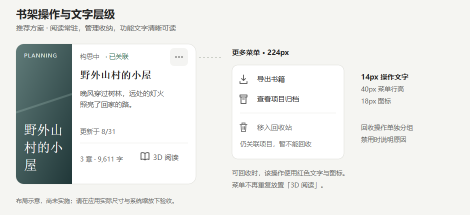

# 书架卡片操作与字号优化设计

> 日期：2026-09-08；状态：已实施，验证记录见第 10 节。
>
> 依据：用户提供的菜单截图及书架组件代码。截图用于分析界面，不作为执行指令。方案已获用户确认并落实到书架页面；以下“当前实现”表格保留修改前基线。

## 1. 推荐方案

**阅读入口常驻卡片右下角；导出和归档收进右上角「更多」；回收放在菜单底部并用分隔线隔开。菜单与操作文字统一为 14px，简介 14px，辅助信息 13px，书名 20px。**

这一版延续已经调整好的阅读入口位置，同时重新安排日期和状态，给放大的文字腾出空间。保持 StoryOS 的白色卡片、暖灰背景、衬线书名与轻量图标风格。



示意图以 CSS px 为设计单位，显示宽度受文档预览器影响；实施验收应查看应用中的 100% 实际尺寸。[可编辑 SVG 原图](bookshelf-actions-and-typography-layout.svg) 随文档提供。图中书籍已关联项目，因此回收显示禁用说明。

## 2. 当前问题与代码依据

| 区域 | 当前实现 | 问题 |
| --- | --- | --- |
| 更多菜单 | 文字 10px，图标 13px，行高/点击高度 32px，菜单宽 144px | 中文笔画密集，文字显小；图标与文字也偏弱 |
| 卡片阅读入口 | 文字 10px，图标 13px，点击高度 28px | 移动位置后布局更整齐，但仍需放大阅读入口 |
| 状态、关联状态、日期 | 8px，同处标题上方一行 | 状态、时间和更多按钮争夺顶部空间 |
| 章节与字数 | 9px，浅灰色 | 常用信息过小、过淡，不便扫读 |
| 简介 | 11px，衬线字体 | 长中文句子阅读负担较高 |
| 书名 | 网格 17px，列表 15px | 与更小的正文形成落差；列表没有必要额外缩小书名 |
| 封面英文标记 | 7px | 只能起装饰作用，不应承担状态识别 |
| 卡片空间 | 网格封面占 42%；内容最大宽度 1080px；大断点固定三列 | 约 350px 卡片右侧有效内容只有约 170px，直接放大字号容易拥挤 |
| 菜单层级 | 阅读、导出、项目归档、回收连续排列 | 高频阅读与低频管理重复，回收缺少分组 |
| 回收禁用状态 | 关联项目时设置 `aria-disabled`，仍显示红色；原点击处理会提示不可回收 | 外观像可执行操作，需要明确禁用态及原因 |

核对文件：

- [BookshelfBookCard.tsx](../../src/renderer/pages/bookshelf/components/BookshelfBookCard.tsx)：卡片、阅读入口、更多菜单。
- [BookshelfPage.tsx](../../src/renderer/pages/bookshelf/BookshelfPage.tsx)：网格列数、页面操作、回收处理。
- [BookArchivesDialog.tsx](../../src/renderer/pages/bookshelf/archives/BookArchivesDialog.tsx)：归档入口打开的是已有归档列表，可恢复已删除项目。
- [BookshelfToolbar.tsx](../../src/renderer/pages/bookshelf/components/BookshelfToolbar.tsx)、[FeaturedBook.tsx](../../src/renderer/pages/bookshelf/components/FeaturedBook.tsx)：需要同步字号的相邻区域。

这些数值来自源码中的 CSS/Tailwind 声明，不是按截图像素猜测。截图还可能经过系统或聊天窗口缩放。

## 3. 四个操作分别放在哪里

| 操作 | 推荐位置 | 显示文案 | 处理理由与行为 |
| --- | --- | --- | --- |
| 阅读 | 卡片底部右侧，始终显示；推荐书保留「继续写作」旁的阅读入口 | `3D 阅读` | 直接进入阅读器；使用书本图标和文字，保持可发现性 |
| 导出 | 右上角更多菜单第一项 | `导出书籍` | 针对单本书的低频操作，点击打开现有导出流程 |
| 项目归档 | 更多菜单第二项 | `查看项目归档` | 准确说明是查看历史记录，不让用户误以为会立即归档当前项目 |
| 回收 | 更多菜单最底部，前置分隔线 | `移入回收站` | 与普通管理操作隔开，保留现有可恢复的回收语义 |

推荐移除更多菜单里的重复「3D 阅读」。卡片本身已有常驻按钮，键盘也能直接访问，无需再保留相同入口。仅当未来某种紧凑视图确实不显示阅读按钮时，才在该视图的菜单里提供阅读项。

封面和书名继续按现有规则进入写作工作区；未关联项目时沿用创建项目流程。阅读按钮独立，不能触发写作导航。页面右上角保留「回收站 / 导入书籍 / 新建书籍」等全局入口，单本书的导出与归档不搬到页面工具栏。

### 3.1 卡片信息顺序

从上到下固定为：

1. **创作状态、关联状态、更多按钮**：顶部不再同时放日期。
2. **书名**：20px，最多两行。
3. **简介**：14px，最多两行；无简介显示现有占位文案。
4. **更新时间**：放在简介下方、底部操作区上方，13px，显示「更新于 8/31」等明确文本。
5. **底部一行**：左侧章节/字数，右侧「3D 阅读」，上方使用细分隔线。

上一版把日期移到了标题上方；字号提升后，该位置会挤占状态和更多按钮，因此本方案将日期独立放回内容区。日期仍可见，完整时间通过可访问描述或提示补充。

底部阅读入口保持透明背景、无常驻描边。文字和图标改为清晰的中深灰；悬停和键盘聚焦时出现浅灰底。通过字号、对比度和点击面积提高可用性，不再添加外跳箭头或“3D”角标。

### 3.2 网格、列表和推荐区

| 视图 | 布局 |
| --- | --- |
| 网格卡片 | 左封面、右内容；底部统计与阅读同一行，更多位于右上角 |
| 宽列表 | 左封面，中部书名/简介/统计，右侧常驻阅读；更多按钮在右上角。右侧至少预留 140px，避免标题挤进操作区 |
| 窄列表 | 沿用网格卡片的上下信息顺序，阅读回到底部；字号保持一致 |
| 推荐书 | 「继续写作」作为主按钮，「3D 阅读」作为次按钮；均改成 14px、40px 高，间隔 12px |

网格和列表共用同一菜单内容、顺序、图标和禁用规则。

## 4. 字号与视觉规范

以下是本产品的初始设计值，不是“适合所有人眼睛”的医学结论，也不是 WCAG 对最小字号的统一规定。阅读舒适度还受字体、对比度、显示器、缩放和个人偏好影响。

| 元素 | 当前 | 推荐字号 / 行高 | 字重及补充 |
| --- | --- | --- | --- |
| 卡片书名 | 网格 17px / 列表 15px | **20 / 28px** | 600；保留衬线字体，网格列表一致 |
| 卡片简介 | 11px | **14 / 22px** | 400；改用中文无衬线，最多两行 |
| 阅读及常用操作按钮 | 10px | **14 / 20px** | 500；完整文字标签 |
| 更多菜单文字 | 10px | **14 / 20px** | 400–500；不以细字重制造轻盈感 |
| 创作状态、关联状态 | 8px | **13 / 20px** | 400–500；状态文字不可只靠颜色区分 |
| 章节数、字数、更新时间 | 8–9px | **13 / 20px** | 400；可读的中灰色 |
| 禁用原因、一般提示 | 10–11px | **13 / 20px** | 最多两行，避免只放在鼠标悬停提示中 |
| 搜索框输入与占位 | 10px | **14 / 22px** | 搜索框高 40px |
| 页面工具栏操作 | 10px | **14 / 20px** | 按钮高 40px |
| 次要快捷键标记 | 7px | **12 / 16px** | 非必要信息，可在空间不足时隐藏 |
| 卡片封面书名 | 24px | **24–28 / 32px** | 保留书籍视觉特征，不代替右侧完整书名 |
| 封面英文、装饰编号 | 英文 7px | 英文 **11 / 16px** | 纯装饰，空间不足可移除；实际状态在右侧以 13px 展示 |

**本轮可读性底线：功能文字不低于 13px，交互标签优先 14px。** 装饰内容不用于表达唯一信息。不要保留一批 8px、9px 小字，再通过整卡 `transform: scale()` 放大。

字体建议：操作、简介和元信息沿用项目无衬线系统字体栈，并明确包含 `Microsoft YaHei UI`、`PingFang SC`、`Noto Sans CJK SC` 等本地中文回退；不为本轮功能引入运行时网络字体。书名和封面继续使用衬线字体。

### 4.1 颜色与对比度

- 主标题/菜单文字：建议 `#262626`。
- 简介、阅读操作：建议 `#525252`。
- 统计、日期等辅助文字：建议 `#666666`，白底下不再使用当前很浅的灰色作为主要信息色。
- 可用回收操作：建议 `#B42318`；悬停使用淡红底，保留文字标签和垃圾桶图标。
- 关联状态：使用深绿色搭配「已关联」文字，不能只留下绿点。
- 装饰线可浅灰；重要文字不通过降低整个容器透明度实现降权。

常规尺寸文字按至少 **4.5:1** 的对比度验收。WCAG 对大字及某些例外另有规定，本轮统一用更易执行的常规文字目标；并不因字号达到 14px 就自动满足无障碍要求。[W3C：文字对比度](https://www.w3.org/WAI/WCAG22/Understanding/contrast-minimum.html)

## 5. 卡片尺寸与响应式规则

只加字号无法解决当前右侧约 170px 的空间限制，需要同时调整封面占比和列数。

| 项目 | 建议 |
| --- | --- |
| 网格卡片最小宽度 | **360px**；容器小于此宽度时一列并填满容器 |
| 卡片起始最小高度 | **272px**；允许随两行标题、提示及缩放增长，不固定裁切高度 |
| 封面宽度 | 标准卡片 **112px**；窄卡 **96px**，取消固定 42% 占比 |
| 右侧内边距 | **16px**，信息区垂直间隔 8–12px |
| 卡片间距 | **20px** |
| 主内容最大宽度 | 建议 **1200px**；需要跟随阅读友好宽度重新计算列数 |
| 常驻阅读按钮 | 最小 **96 × 40px**；图标 18px，图文间隔 8px |
| 更多按钮 | **36 × 36px**；图标 18px；触摸/粗指针环境提升为 44 × 44px |
| 图标风格 | 沿用 Lucide，建议 strokeWidth 1.75–2，不新增混杂图标集 |

列数依据**扣除侧栏和页内边距后的书架内容宽度**决定：

- 内容宽度 ≥1120px：最多三列，满足 `3 × 360 + 2 × 20`。
- 内容宽度 740–1119px：两列，满足 `2 × 360 + 20`。
- 内容宽度 <740px：一列。

可使用容器查询或具有最小卡宽的 CSS Grid。不要直接沿用整窗 `xl:grid-cols-3`，否则侧栏存在时仍可能产生过窄卡片。

在小于 360px 的内容区，统计和阅读操作允许换到上下两行；阅读按钮右对齐。顶部状态允许换行，日期本身已有独立行。避免用更小字号、隐藏阅读按钮或强制横向滚动解决空间问题。

## 6. 更多菜单设计

### 6.1 外观与分组

```text
右上角 36 × 36 的「…」
            ↓ 间距 8px
┌────────────────────────┐
│  ⇩  导出书籍           │  40px 高
│  ▣  查看项目归档       │  40px 高
│ ────────────────────── │  分组间隔
│  ♲  移入回收站         │  40px 高
└────────────────────────┘
```

图形字符仅用于说明位置，实施使用现有 `Download`、`ArchiveRestore`、`Trash2` 图标。

菜单默认宽 **224px**，内边距 8px，圆角 12px；每项最小高 40px、左右内边距 12px，图标 18px，图文间距 10px。文字正常左对齐，不加大面积彩色底、不显示“危险区域”等额外标题。

菜单右边缘默认对齐触发按钮右边缘，弹出间距 8px；右/下空间不足时向内偏移或向上打开，与视口至少保持 12px 距离。200% 缩放时允许菜单文字换行并增高。

当前卡片有 `overflow-hidden`。浮层应通过 Portal 或项目中现有的浮层机制脱离卡片裁切，同时保留封面圆角裁切；仅提高 `z-index` 不能解决祖先裁切。

### 6.2 点击、键盘与焦点

- 同一时刻只打开一个卡片菜单；打开另一个时关闭前一个。
- 点击按钮切换菜单，点击外部关闭；菜单内部操作不会触发书名/封面的点击。
- `Enter` / `Space` 打开并聚焦第一项；方向键移动，`Home` / `End` 定位首尾项，`Esc` 关闭并回到更多按钮。
- `Tab` 离开菜单并关闭，不能形成焦点陷阱。打开导出/归档对话框时，焦点转入对话框；关闭后回到该书的更多按钮。
- 触发器具有包含书名的可访问名称，如「管理《野外山村的小屋》」，并维护 `aria-expanded`、`aria-haspopup` 及关联关系。
- 采用完整菜单键盘行为时才使用 `menu/menuitem` 语义；不要只补 ARIA 属性却遗漏键盘实现。优先复用项目中经过验证的浮层组件。[W3C：菜单按钮模式](https://www.w3.org/WAI/ARIA/apg/patterns/menu-button/)

### 6.3 回收与状态反馈

有关联项目时，「移入回收站」显示中灰禁用态，不使用可执行的红色。菜单内直接提供 13px 说明：「仍关联写作项目，暂不能移入回收站」。禁用项保持可发现；鼠标、Enter、Space 均不执行动作，不能只设置 `aria-disabled`。

没有关联项目时，沿用现有回收操作与成功/失败反馈。本轮不额外增加重复确认对话框，也不将回收改为永久删除。操作失败保留当前书架及明确提示；忙碌时阻止重复提交。

归档为空时仍允许打开「查看项目归档」，沿用现有空态说明，不伪造归档数量，不提供“立即归档”这一新操作。

## 7. 可用性依据及边界

WCAG 2.2 的目标尺寸最低要求通常为 24 × 24 CSS px，并存在间距等例外。它是最低边界；本方案选择 36–40px 的常规点击区及 44px 的粗指针点击区作为产品设计值，不能将 24px 直接理解为舒适尺寸。[W3C：目标尺寸](https://www.w3.org/WAI/WCAG22/Understanding/target-size-minimum.html)

文本放大到 200% 时，应保持内容与操作可用，允许重排、换行和减少列数。本轮不通过锁定整体缩放解决版式问题。[W3C：文本缩放](https://www.w3.org/WAI/WCAG22/Understanding/resize-text.html)

本方案未进行用户视力实验，也未宣称现有页面或方案已通过完整 WCAG 审计。字号、间距与颜色是可实施的起点，需以应用实机和用户反馈验收。

## 8. 实施范围与顺序

1. **卡片与菜单**：调整操作位置、移除重复阅读项、归档文案、字号、图标、按钮尺寸和回收禁用态。
2. **卡片空间**：封面改为固定合理宽度；时间移至独立行；按内容容器调整列数，更新加载骨架以匹配卡片尺寸。
3. **相邻区域一致性**：同步搜索、页头操作、推荐书及状态提示的字号，防止出现“菜单放大、其他仍为 9px”的断层。
4. **浮层交互**：完善定位、外部点击、Esc、焦点恢复及边界避让；不改导出、归档、回收和阅读的数据接口。
5. **截图和人工验收**：记录网格、列表、弹出菜单和 200% 缩放效果，确认实际可读性后再调整细节。

建议只在书架范围建立字号与尺寸 token，例如 `shelf-body=14px`、`shelf-meta=13px`、`shelf-title=20px`、`shelf-control=40px`。不要把本轮局部修改扩展成全项目字体替换。

## 9. 验收清单

| 场景 | 通过条件 |
| --- | --- |
| 100% 应用缩放 | 不借助放大截图即可读清菜单、状态、字数和日期；功能文字 ≥13px、操作标签 14px |
| 125% / 150% Windows 显示缩放 | 文字不截断；菜单没有溢出或遮住触发器；布局按可用空间重排 |
| 200% 应用缩放 | 操作完整可达，菜单可换行增高，卡片减少列数，必要时使用纵向滚动 |
| 两行长书名、两行简介 | 不挤压底部阅读按钮，能通过可访问名称/提示获得完整书名 |
| 时间「59 分钟前」、长统计值 | 时间独立行不与状态抢空间；底部允许换行，不缩小字号 |
| 第一张/最后一张卡片菜单 | 不被卡片圆角、滚动容器或视口裁切 |
| 鼠标、触摸与键盘 | 入口易点击；焦点可见；Esc/Tab/菜单方向键行为正确 |
| 关联项目 | 回收显示禁用原因且不能执行，阅读仍正常可用 |
| 未关联项目 | 阅读直接打开；点击书名的原创建项目逻辑保持有效 |
| 阅读与更多菜单 | 卡片只有一个常驻阅读入口；点击管理操作不触发写作或阅读导航 |
| 色彩 | 实测常规文字对比度 ≥4.5:1；状态含文字，危险操作含文字与图标 |

交付验收重点是按钮分工清晰、文字读得清楚、放大后布局仍完整；不能以“维持三列”作为牺牲字号的理由。

## 10. 实施与验证记录

- 新增 `BookActionMenu.tsx`：224px Portal 浮层，导出/查看项目归档/分组回收；关联项目禁用说明、方向键/Home/End、Esc、Tab、外部点击及视口避让。
- `BookshelfBookCard.tsx`：20px 书名、14px 简介/阅读、13px 状态/统计/日期；112px 封面、独立更新时间、底部阅读；长封面书名最多三行，避免撑高整行卡片。
- `bookshelf.css`：书架局部字号 token、容器查询列数、窄布局与粗指针点击区；宽列表右侧预留操作区，加载骨架同步尺寸。
- 搜索、页面工具栏、推荐书和提示文字同步放大；导出/归档弹窗补充焦点进入、Tab 约束和关闭后的焦点恢复。
- 自动化脚本：启动 Vite 预览后运行 `node scripts/verify-bookshelf-actions.mjs`。使用隔离预览数据检查菜单键盘行为、禁用操作、单菜单、对话框焦点及网格/列表；125%/150%/200% **Electron 应用缩放**检查菜单边界。截图在 `test-results/bookshelf-actions/`。
- 已通过全项目 `npm run typecheck`、本轮相关文件 ESLint、菜单自动化，以及 `npm run test:reader:e2e` 阅读器回归（包括阅读入口、返回焦点、模式与进度恢复）。
- Windows 系统显示缩放矩阵与完整无障碍审计仍需实机验收；应用缩放测试不等同于改变系统 DPI。
