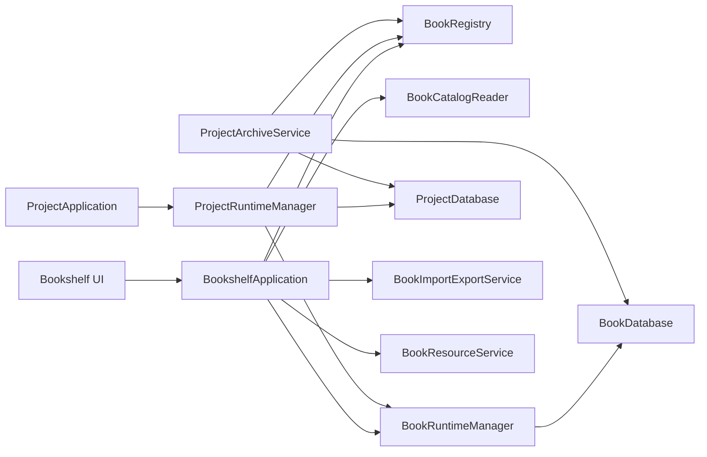
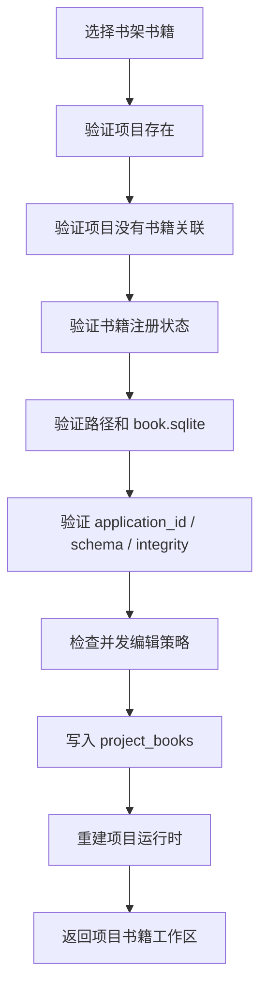
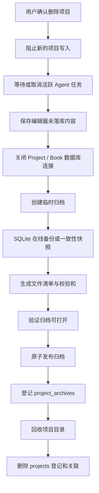

# StoryOS 书架核心架构与恢复能力补全设计

> 状态：设计草案，等待按阶段实施  
> 前置文档：`docs/todo/book-storage-architecture-refactor.md`  
> 适用基线：ApplicationDatabase、ProjectDatabase、BookDatabase 三库边界已经落地  
> 当前范围：A 类全局架构闸门，以及关联、导入导出、恢复、删除生命周期相关的 B 类局部闸门  
> 明确排除：Three.js、封面资源、事件图、人物关系，以及全部 C 类优化

## 1. 文档目的

现有底层重构已经将书籍资产从项目工作环境中分离：

- `ApplicationDatabase` 保存项目、书籍注册和项目—书籍关联；
- `ProjectDatabase` 保存对话、Agent 运行、项目索引等工作数据；
- `BookDatabase` 保存小说、卷、章和章节历史版本。

这一边界已经解决“书籍和项目谁拥有正文”的根问题，但它仍然只是存储底座。当前实现尚不能完整支撑以下产品目标：

1. 工作区创建的书自动出现在“我的书架”；
2. 新建项目可以关联书架中的已有书籍；
3. 书籍可以安全导入和导出；
4. 删除项目后，可以从书架恢复删除前的全部项目数据；
5. 数据库丢失、路径损坏或跨库操作中断后，可以检测并恢复到明确状态。

本文在现有三库架构上定义当前必须解决的模块边界、关联、生命周期、导入导出和恢复顺序。Three.js、封面资源、事件图、人物关系和 C 类优化不进入本轮设计与实施计划，后续出现明确需求时另行立项。

---

## 2. 当前实现基线

### 2.1 已经成立的数据边界

```text
<agent-home>/
├── app.sqlite
│   ├── projects
│   ├── books
│   ├── project_books
│   └── app_state
├── library/
│   └── books/
│       └── <book-id>/
│           └── book.sqlite
└── workSpaceRoot/
    └── <project>/
        └── .storyos/
            ├── project.sqlite
            ├── project.json
            ├── checkpoints/
            └── skills/
```

当前 `BookDatabase` 已经保存：

- `novels`；
- `volumes`；
- `chapters`；
- `chapter_revisions`。

当前 `ProjectDatabase` 已经保存：

- `threads`；
- `workspace_state`；
- `thread_skills`；
- `messages`；
- `agent_runs`；
- `conversation_events`；
- `indexed_files`；
- `text_chunks`；
- `text_chunks_fts`。

### 2.2 已验证的实际行为

当前工作区创建一本小说时，系统已经能够：

1. 生成独立 `bookId`；
2. 在书库目录创建 `book.sqlite`；
3. 在 `books` 中登记书籍；
4. 在 `project_books` 中建立项目关联；
5. 将卷、章和正文版本只写入 `BookDatabase`；
6. 将对话、工具调用和 Agent 运行记录只写入 `ProjectDatabase`。

因此“工作区中的书自动进入书架”不应实现为项目数据向书架复制，而应实现为书架读取同一个 `Book`。

### 2.3 当前实现缺口

| 能力 | 数据基础 | 应用服务 | 页面能力 | 当前结论 |
|---|---|---|---|---|
| 工作区创建书后进入书架 | 已有 | 部分已有 | 未实现 | 底层成立 |
| 书架列出书籍 | 已有 `listBooks` | 信息不足 | 空白页 | 未完成 |
| 新项目关联已有书籍 | 关联表支持 | 缺少 attach 接口 | 未实现 | 未完成 |
| 按 `bookId` 打开书籍 | 物理库支持 | 当前仍偏项目中心 | 未实现 | 未完成 |
| 书籍导入导出 | 独立目录支持 | 未实现 | 未实现 | 未完成 |
| 删除项目后保留书籍 | 已有 | 已有基础行为 | 未展示 | 部分完成 |
| 删除项目后恢复完整项目 | 不足 | 未实现 | 未实现 | 未完成 |

---

### 2.4 变更分级：架构闸门与普通演进

后续工作不能只按功能名称排序，必须先判断一个问题属于哪一类。

#### A 类：全局架构闸门

这类问题如果不先解决，书架、关联、导入导出和恢复能力会继续依赖错误的入口或数据语义。后续功能越多，返工范围越大。A 类问题必须在继续开发书架业务前完成。

| 架构闸门 | 当前状态 | 不先解决的后果 | 是否需要再次重做三库 |
|---|---|---|---:|
| 以 `bookId` 为入口的书籍运行时 | 未实现 | 所有新模块继续通过项目访问书籍，未关联项目的书无法工作 | 否 |
| 统一书籍应用入口和模块边界 | 未实现 | 页面、IPC、导入各自直接打开 SQLite，连接和校验逻辑重复 | 否 |
| 项目关联已有书籍的正式生命周期操作 | 未实现 | “从书架创建项目”只能通过复制或临时绕路实现 | 否 |
| 跨数据库操作协议 | 只有局部补偿 | 关联、导入、归档中断后产生半注册、半文件状态 | 否，但必须先统一流程 |

A 类完成后的稳定入口应为：

```text
BookRegistry       管身份、路径、状态和项目关联
BookRuntimeManager 按 bookId 打开和关闭 BookDatabase
BookshelfApplication 编排书架业务，不直接执行 SQL
NovelApplication  管现有小说、卷、章和版本领域数据
```

这四个边界一旦确定，后续模块只能依赖它们或模块自己的应用服务，不能重新从 `projectId` 推导一切，也不能由渲染层直接访问数据库路径。

#### B 类：功能局部架构闸门

这类问题不阻塞整个书架开发，但在进入对应功能前必须先设计好。否则该功能的数据一旦产生，就会造成困难迁移。

| 功能 | 必须先确定的局部架构 | 可以推迟到什么时候 |
|---|---|---|
| 项目完整恢复 | 不可变项目归档、书籍快照或版本锚点、恢复冲突策略 | 可以在书架只读和关联功能之后，但必须早于“可恢复删除”上线 |
| 书籍导入导出 | 包 manifest、版本、校验和、临时目录和 ID 冲突策略 | 必须早于第一版真实导入导出 |
| 多项目编辑同一本书 | 单写策略、只读策略或写入租约 | 必须早于允许第二个项目同时写同一本书 |
| 书籍永久删除 | 解绑、回收站、永久删除和活跃任务检查 | 必须早于提供永久删除按钮 |

B 类不是“现在全部实现”，而是“开发该能力时先过本能力的架构闸门”。例如可以先完成书架列表，再设计项目归档；但不能先上线项目可恢复删除，再补归档数据结构。

#### C 类：本轮暂不考虑

C 类通常是可重建、可局部迁移或只影响页面体验的演进项。本轮不设计、不建表、不排期，也不把它们作为 A、B 类验收条件。包括但不限于：

- 书架目录投影；
- 排序、筛选和分组优化；
- 缩略图缓存；
- `lastOpenedAt` 的精细策略；
- 卡片统计字段扩充；
- 健康检查页面的体验优化。

Three.js、封面资源、事件图和人物关系不是从 B 类降到 C 类，而是整体移出当前文档范围。

#### 当前必须立即完成的最小架构批次

在继续实现书架页面、导入导出和恢复能力前，只要求完成以下最小批次：

1. `BookRuntimeManager`：可以独立按 `bookId` 打开、复用和关闭书籍库；
2. `BookshelfApplication`：书架统一业务入口，渲染层不直接拼接数据库操作；
3. `BookRegistry.attachExistingBook`：正式支持项目关联已有书籍；
4. 跨库操作执行约定：验证、写入顺序、操作 ID、补偿和故障状态；
5. 书籍访问契约统一携带 `bookId`，避免领域 ID 脱离书籍上下文；
6. 对上述边界建立测试，证明未关联项目的书也能读取。

本批次不要求立即创建：

- 项目归档表；
- 导入导出包格式实现；
- 多项目协同编辑协议。

因此，当前不需要再进行一次类似“三库拆分”的大规模数据库重构。真正必须先做的是把已经正确的书籍数据边界提升为稳定的书籍级应用边界。完成后，其余能力可以按各自的局部架构闸门逐步推进。

---

## 3. 继续设计的核心原则

### 3.1 不再复制活跃正文

项目和书架只能访问同一个活跃 `BookDatabase`。不得建立：

- 项目正文副本；
- 书架正文副本；

允许存在的派生数据包括：

- 不可变导出包；
- 不可变项目归档。

### 3.2 区分“关联”“导入”和“恢复”

三个动作不能混用：

| 动作 | 含义 | 是否复制书籍 | 是否创建项目 |
|---|---|---:|---:|
| 关联已有书籍 | 当前安装内的新项目使用书架中的书 | 否 | 是或使用已有项目 |
| 导入书籍 | 将外部 `.storyos-book` 加入本地书库 | 是，复制进本地书库 | 否 |
| 恢复项目 | 从项目归档恢复工作环境和删除时状态 | 是，从不可变归档还原 | 是 |

页面文案和 API 命名必须保持这一区分。

### 3.3 书籍资产与工作过程继续分离

判断规则保持不变：

- 换项目仍然应该存在的数据属于 `BookDatabase` 或书籍资源目录；
- 只属于某次工作过程的数据属于 `ProjectDatabase`；
- 删除时刻的完整恢复点属于项目归档；

### 3.4 跨数据库操作必须可恢复

`app.sqlite`、`project.sqlite` 和 `book.sqlite` 不能使用一个 SQLite 事务覆盖。所有跨库操作必须具备：

- 明确阶段；
- 安全写入顺序；
- 幂等操作 ID；
- 中断检测；
- 补偿或继续执行能力；
- 不覆盖无法证明属于同一操作的文件。

---

## 4. 目标应用结构



### 4.1 `BookshelfApplication`

书架业务的统一入口，不直接执行 SQL。职责包括：

- 列出书籍卡片；
- 获取书籍详情；
- 按 `bookId` 打开书籍；
- 为项目关联已有书籍；
- 解绑书籍；
- 发起导入和导出；
- 查询书籍健康状态；
- 发起书籍回收、恢复和永久删除；
- 查询与书籍相关的项目和项目归档。

### 4.2 `BookRuntimeManager`

当前书籍访问主要通过项目运行时完成。书架需要一个真正以 `bookId` 为入口的运行时管理器。

建议接口：

```ts
interface BookRuntimeManager {
  open(bookId: string): Promise<BookRuntime>;
  withBook<T>(bookId: string, action: (runtime: BookRuntime) => Promise<T>): Promise<T>;
  close(bookId: string): Promise<void>;
  closeAll(): Promise<void>;
}
```

`BookRuntime` 至少提供：

```ts
type BookRuntime = {
  readonly bookId: string;
  readonly database: BookDatabase;
  readonly novels: NovelApplication;
};
```

规则：

- 书架打开一本未关联项目的书时仍能访问；
- 同一进程内相同 `bookId` 不应重复创建不受控连接；
- 所有路径必须通过 `BookLayout` 推导并验证；
- 注册路径与标准书库路径不一致时拒绝打开；
- 数据库类型、版本和完整性不正确时返回明确健康状态。

### 4.3 `BookCatalogReader`

负责读取书架卡片所需数据。它不是正文存储接口，也不修改小说。本轮直接按需打开 BookDatabase 读取最小卡片信息，不设计目录投影。

---

## 5. 书架查询契约

### 5.1 第一版书架卡片 DTO

```ts
type BookshelfBookCard = {
  readonly bookId: string;
  readonly title: string;
  readonly status: "planning" | "writing" | "completed" | "archived";
  readonly storageState: BookStorageState;
  readonly volumeCount: number;
  readonly chapterCount: number;
  readonly characterCount: number;
  readonly linkedProjectCount: number;
};
```

第一版页面不需要的字段不应加入 DTO。目录投影、更多统计和排序字段属于 C 类，本轮不设计。

---

## 6. 项目关联已有书籍

### 6.1 注册接口补全

当前注册接口需要增加：

```ts
interface BookRegistry {
  registerBookForProject(input: RegisterNewBookInput): BookRecord;
  attachExistingBook(projectId: string, bookId: string): void;
  detachBook(projectId: string): void;
  getBookById(bookId: string): BookRecord | null;
  getBookForProject(projectId: string): BookRecord | null;
  listBooks(): readonly BookRecord[];
  listProjectIdsForBook(bookId: string): readonly string[];
  updateStorageState(bookId: string, state: BookStorageState): void;
  touchOpened(bookId: string): void;
}
```

### 6.2 关联流程



写入顺序应先验证 BookDatabase，再创建全局关联。运行时重建失败时：

- 保留已经验证有效的书籍；
- 可以删除本次新建的关联作为补偿；
- 不删除书籍目录；
- 重试同一个关联操作必须是幂等的。

### 6.3 产品语义

项目创建页面提供两种互斥选择：

```text
创建空项目
使用书架中的书籍创建项目
```

不得复制正文进项目目录。用户选择书架书籍后，项目只是获得一个关联入口。

---

## 7. 书籍生命周期

### 7.1 状态模型

当前只有 `available` 和 `missing`。书架实现生命周期后，建议扩展为：

```ts
type BookStorageState =
  | "available"
  | "missing"
  | "importing"
  | "trashed"
  | "corrupted";
```

含义：

| 状态 | 含义 | 是否可写 |
|---|---|---:|
| `available` | 路径和数据库健康 | 是 |
| `missing` | 注册存在但书籍目录丢失 | 否 |
| `importing` | 导入尚未原子完成 | 否 |
| `trashed` | 已进入书架回收站 | 否 |
| `corrupted` | 数据库类型、版本或完整性异常 | 否 |

`novels.status = archived` 是作品创作状态，不能代替存储生命周期状态。

### 7.2 删除层级必须明确

| 操作 | 影响范围 | 是否保留正文 |
|---|---|---:|
| 删除章节 | 一个章节及其版本 | 否 |
| 删除小说领域记录 | 当前 BookDatabase 内的小说层级 | 否 |
| 从项目解绑 | 删除 `project_books` 关联 | 是 |
| 移到书架回收站 | 书籍不可编辑，资源保留 | 是 |
| 永久删除书籍 | 删除注册、数据库和资源 | 否 |
| 删除项目 | 删除或回收项目工作环境 | 书籍保留 |

不得继续使用一个模糊的“删除”同时表达这些动作。

### 7.3 `BookLifecycleService`

建议独立负责：

- 移入书架回收站；
- 从回收站恢复；
- 永久删除；
- 检查关联项目；
- 关闭活跃 BookRuntime；
- 验证删除目标位于书库范围；
- 记录不可恢复操作；
- 在失败时保持注册和磁盘状态可解释。

永久删除前必须满足：

- 用户明确确认；
- 没有活跃写入任务；
- 没有项目关联，或用户明确处理这些关联；
- 路径严格位于 `<agent-home>/library/books/<book-id>`；
- 删除目标 `bookId` 与目录名一致。

---

## 8. 项目删除与完整恢复

### 8.1 当前能力边界

当前删除项目会把项目目录移入系统回收站，然后删除全局项目登记。由于 `project_books` 对项目使用级联删除，关联会消失，但 `books` 和书籍目录仍然存在。

因此当前只能保证：

- 小说正文仍在书架资产中；
- 项目对话、Agent 运行、项目文件、技能和检查点不能由书架直接恢复；
- 系统回收站不是稳定的应用归档协议。

### 8.2 恢复目标

“从书架恢复删除前的所有数据”必须恢复：

- 项目身份和名称；
- `project.sqlite`；
- 项目普通文件；
- 项目技能；
- 必要检查点；
- 删除时的项目—书籍关系；
- 删除时刻对应的书籍内容状态。

### 8.3 不可变项目归档

建议归档布局：

```text
<agent-home>/archives/projects/<archive-id>/
├── manifest.json
├── project/
│   ├── project.sqlite
│   ├── project.json
│   ├── files/
│   ├── skills/
│   └── checkpoints/
├── book-snapshot/
│   └── book.sqlite
└── checksums.json
```

归档中的书籍快照是删除时刻的不可变恢复点，不是活跃书籍的第二事实来源。

如果产品决定恢复时总是采用书架当前最新正文，可以不复制完整书籍，但仍必须在归档中保存明确的版本锚点。为了满足“删除前的所有数据”这一严格语义，推荐归档删除时刻的 BookDatabase 快照。

### 8.4 全局归档登记

当归档功能进入实施阶段，再在 `ApplicationDatabase` 增加：

```sql
CREATE TABLE project_archives (
  id TEXT PRIMARY KEY,
  source_project_id TEXT NOT NULL,
  book_id TEXT,
  archive_path TEXT NOT NULL,
  path_key TEXT NOT NULL UNIQUE,
  state TEXT NOT NULL
    CHECK (state IN ('creating', 'available', 'corrupted', 'restored')),
  format_version INTEGER NOT NULL,
  manifest_hash TEXT NOT NULL,
  created_at INTEGER NOT NULL,
  restored_at INTEGER
);
```

该表在实现归档前不应提前创建。

### 8.5 删除流程



强制规则：归档创建、校验或登记失败时，不得继续删除项目。

### 8.6 恢复流程

恢复时需要：

1. 校验归档状态、格式版本和所有哈希；
2. 检查目标项目路径冲突；
3. 检查 `projectId`、`bookId` 与现有注册冲突；
4. 恢复到临时目录；
5. 打开并迁移 ProjectDatabase；
6. 根据用户选择恢复删除时书籍快照，或关联书架当前书籍；
7. 原子移动到正式目录；
8. 重新登记项目和关联；
9. 激活运行时；
10. 仅在全部成功后标记归档已恢复。

恢复默认不覆盖现有项目或现有书籍。

---

## 9. 书籍导入导出

### 9.1 包格式

建议扩展名：`.storyos-book`。

```text
<book-title>.storyos-book
├── manifest.json
├── book.sqlite
└── checksums.json
```

`manifest.json` 建议包含：

```ts
type StoryOSBookManifest = {
  readonly format: "storyos-book";
  readonly formatVersion: number;
  readonly sourceBookId: string;
  readonly databaseApplicationId: number;
  readonly databaseUserVersion: number;
  readonly title: string;
  readonly exportedAt: string;
  readonly applicationVersion: string;
};
```

### 9.2 导出规则

导出必须：

- 先保存当前编辑器内容；
- 等待或阻止书籍写入；
- 使用 SQLite backup API 或一致性快照，不直接复制活跃 WAL 状态下的单个主文件；
- 为每个文件计算哈希；
- 先写临时包，验证后原子发布；
- 不导出项目对话和 Agent 记录。

### 9.3 导入规则

导入必须：

- 限制解压路径，防止路径穿越；
- 限制包大小、文件数量和单文件大小；
- 校验清单和哈希；
- 验证数据库 `application_id`；
- 拒绝不支持的未来 schema 版本；
- 允许迁移支持的旧 schema；
- 在 `.importing/<operation-id>` 中完成验证；
- 为本地注册生成新的 `bookId`；
- 原子移动到正式书库后再标记 `available`；
- 不自动创建项目，除非用户明确选择“导入并创建项目”。

内部 `novelId`、`chapterId` 等可保留，因为它们位于独立 BookDatabase 范围；所有跨书籍 API 仍必须携带 `bookId` 上下文，不能假定领域 ID 在整个应用中绝对唯一。

---

## 10. 并发与编辑一致性

### 10.1 当前能力

章节保存已有：

- `expectedCurrentRevisionId`；
- 正文哈希；
- 不可变版本；
- SQLite 事务。

这可以阻止章节正文被静默覆盖。

### 10.2 多项目关联同一本书

`project_books` 当前允许一本书关联多个项目。第一阶段产品策略建议：

- 同一时刻只允许一个可写项目持有书籍；
- 其他关联项目只读，或在打开时要求用户切换写入权；
- 活跃生成任务期间禁止解绑、删除、导出和归档；
- 结构修改也要使用事务和预期状态检查。

在真正出现多窗口或多设备协作需求前，不应提前实现复杂协同编辑协议。

---

## 11. 跨库健康检查与修复

### 11.1 `BookRegistryReconciler`

建议增加只负责检查和修复注册状态的服务：

```ts
interface BookRegistryReconciler {
  inspect(bookId: string): BookHealthReport;
  inspectAll(): readonly BookHealthReport[];
  markMissing(bookId: string): void;
  discoverOrphans(): readonly DiscoveredBook[];
  repairRegistration(request: RepairBookRegistrationRequest): BookRecord;
}
```

检查项：

- 注册路径是否位于标准书库根目录；
- `<book-id>/book.sqlite` 是否存在；
- 目录名是否等于 `bookId`；
- `application_id` 是否属于 BookDatabase；
- `user_version` 是否受当前应用支持；
- `integrity_check` 和 `foreign_key_check` 是否通过；
- 一库是否最多一本小说；
- 是否存在没有注册记录的孤立书籍目录；
- 是否存在关联到不可用书籍的项目。

### 11.2 自动修复边界

可以自动完成：

- 将不存在路径标记为 `missing`；
- 补充可以明确证明身份一致的注册记录。

不能自动完成：

- 覆盖损坏数据库；
- 猜测两个同名目录哪一个是正确书籍；
- 删除孤立目录；
- 将未知 SQLite 当作 BookDatabase；
- 在没有清单的情况下重写书籍 ID。

---

## 12. 数据库版本策略修正

实际实现中：

- ApplicationDatabase `user_version = 1`；
- BookDatabase `user_version = 1`；
- ProjectDatabase 当前 `user_version = 4`。

ProjectDatabase 的版本 1～4 只包含项目工作数据，没有书籍表，因此当前数据边界正确。但它与前置文档中“新 ProjectDatabase 从版本 1 直接创建目标结构”的文字不完全一致。

从现在开始已有真实书籍和项目数据，不建议为了让版本号看起来一致而重置数据库。建议采用以下决策：

1. 接受 ProjectDatabase 当前版本 4 为现实基线；
2. 后续项目数据库迁移从版本 5 开始；
3. 更新前置文档的版本描述，记录实施偏差；
4. 不重写已经创建的用户数据库版本；
5. BookDatabase 的未来业务扩展从版本 2 开始；
6. ApplicationDatabase 增加归档登记时从版本 2 开始。

数据库物理类型继续使用不同 `application_id`，不得因版本编号相同而认为三种数据库可互换。

---

## 13. IPC 和前端边界

建议增加书架专用 IPC，不让页面直接组合项目 API：

```ts
type BookshelfApi = {
  listBooks(): Promise<readonly BookshelfBookCard[]>;
  getBookDetail(bookId: string): Promise<BookshelfBookDetail>;
  attachBookToProject(request: AttachBookToProjectRequest): Promise<void>;
  importBook(request: ImportBookRequest): Promise<BookImportResult>;
  exportBook(request: ExportBookRequest): Promise<BookExportResult>;
  inspectBook(bookId: string): Promise<BookHealthReport>;
  trashBook(bookId: string): Promise<void>;
  restoreBook(bookId: string): Promise<void>;
};
```

规则：

- 所有接口以 `bookId` 为主要身份；
- 页面不接收真实数据库路径；
- 导入导出目标路径通过系统文件选择器获得；
- IPC 请求必须验证字段，不能信任渲染进程传入的路径；
- 长时间导入、导出和归档通过进度事件报告；
- 取消操作必须留下可清理的明确临时状态。

---

## 14. 实施阶段

### 阶段 0：全局架构闸门

- 实现 `BookRuntimeManager`；
- 实现 `BookshelfApplication`；
- 扩展 `BookRegistry.attachExistingBook` 和反向项目查询；
- 统一所有书籍访问携带 `bookId` 上下文；
- 定义跨库操作的阶段、操作 ID、补偿和失败状态；
- 验证未关联项目的书籍也能独立打开；
- 禁止渲染层和未来模块直接持有数据库路径。

这是继续开发高级书籍能力前必须完成的阶段。它不要求新增未来业务表，也不改变已经落地的三库数据所有权。

### 阶段 1：书架只读闭环

- 定义第一版书架卡片 DTO；
- 从 `BookRegistry.listBooks()` 获取身份；
- 按 `bookId` 读取标题和统计；
- 展示 `available`、`missing`、`corrupted` 状态；
- 完成空书架、单书和多书测试。

本阶段可以暂不创建目录投影。

### 阶段 2：项目关联已有书籍

- 增加关联前健康检查；
- 新建项目流程加入“使用书架书籍”；
- 项目运行时支持重新装配；
- 明确单写项目策略；
- 完成关联、解绑、重启和冲突测试。

### 阶段 3：书籍生命周期

- 实现 `BookRegistryReconciler`；
- 实现书架回收站；
- 区分解绑、回收和永久删除。

### 阶段 4：导入导出

- 定义 `.storyos-book` manifest；
- 实现 SQLite 一致性快照；
- 实现校验和与临时目录；
- 实现导入版本检查和原子发布；
- 完成恶意路径、损坏包、中断和重复导入测试。

### 阶段 5：完整项目归档恢复

- 定义项目归档 manifest；
- 增加 `ProjectArchiveService`；
- 增加全局归档登记；
- 删除项目改为“归档成功后删除”；
- 书架详情展示相关归档；
- 实现恢复删除时快照和关联当前书籍两种策略；
- 完成故障注入测试。

---

## 15. 测试策略

### 15.1 书架读取

- 空书架返回空数组；
- 可用书籍返回正确标题和统计；
- 未关联项目的书仍可读取；
- 丢失路径返回 `missing`，不崩溃；
- 错误数据库类型返回 `corrupted`；
- 一本损坏书不阻止其他书显示；
- 多次读取不会泄漏 SQLite 连接。

### 15.2 关联已有书籍

- 空项目成功关联已有书籍；
- 已有书籍的项目拒绝第二次关联；
- 同一书籍按产品策略处理多项目关联；
- 数据库不存在时不创建关联；
- 运行时启动失败时补偿关联；
- 项目重启后仍打开同一本书；
- 项目重命名不改变书籍路径和 `bookId`。

### 15.3 导入导出

- 导出后数据库完整性和正文哈希一致；
- 导入后获得新的本地 `bookId`；
- 包内路径穿越被拒绝；
- 文件哈希不一致被拒绝；
- 不支持的未来版本被拒绝；
- 中断不会登记半成品书籍；
- 同一个包重复导入不会覆盖现有书籍。

### 15.4 项目归档恢复

- 归档成功后才允许删除；
- 归档失败时项目保持可用；
- 项目数据库、文件、技能和书籍快照全部校验；
- 恢复后对话、运行记录和正文一致；
- 路径冲突不覆盖已有项目；
- ID 冲突有明确策略；
- 损坏归档不能恢复；
- 重复恢复是可解释且可控的。

### 15.5 数据库与迁移

- 三种数据库 `application_id` 永远不同；
- 不打开比当前实现更新的数据库版本；
- migration 中断后不留下伪成功版本；
- `integrity_check` 和 `foreign_key_check` 通过；
- ProjectDatabase 永远不重新出现书籍正文表；
- BookDatabase 永远不出现项目对话表。

---

## 16. 验收标准

### 书架基础能力

- 工作区创建书籍后，无需复制即可出现在书架；
- 书架可以读取未关联项目的书籍；
- 一册损坏书籍不会导致整个书架不可用；
- 卡片标题、章节数和字数准确；
- 书架所有业务入口以 `bookId` 工作。

### 项目关联

- 新项目可以安全关联已有书籍；
- 关联和解绑不会复制或删除正文；
- 项目重命名不影响书籍；
- 失败的关联不会留下半完成跨库状态。

### 导入导出

- 导出包是自描述、可校验、版本化的；
- 导入不信任外部路径和数据库；
- 导入失败不会污染书库注册；
- 导出不包含项目私有工作记录。

### 删除和恢复

- 删除项目不会删除活跃书籍；
- 完整项目删除必须以可验证归档成功为前置条件；
- 书架能明确区分“恢复书籍”和“恢复项目”；
- 恢复项目可以还原删除时的工作数据和书籍状态。

---

## 17. 当前明确排除的内容

以下能力不属于当前 A 类或 B 类范围，不进行数据结构设计、不创建表、不进入实施计划：

- 事件图；
- 人物关系；
- Three.js 预览；
- 封面与相关资源协议；
- 全部 C 类查询和页面优化；
- 云同步状态表；
- 多用户协作表。

这些能力未来必须重新立项和评审，不能引用本文件作为其数据结构已经确定的依据。

---

## 18. 最终决策摘要

1. 保留现有 Application、Project、Book 三库架构，不重新拆分；
2. 新增以 `bookId` 为入口的 `BookshelfApplication` 和 `BookRuntimeManager`；
3. 工作区与书架共享同一个 BookDatabase，不进行正文同步；
4. 新项目使用书架书籍属于“关联”，不是复制导入；
5. 第一版书架直接读取 BookDatabase，不引入 C 类目录投影；
6. 书籍导入导出采用带 manifest 和校验和的 `.storyos-book`；
7. 删除项目后保留 Book 只解决正文保留，完整恢复必须实现不可变项目归档；
8. 删除项目必须改为“归档校验成功后删除”，系统回收站不能替代应用归档；
9. 接受 ProjectDatabase 当前版本 4 为现实基线，后续迁移从版本 5 开始；
10. 所有跨数据库操作都必须可重试、可补偿并具有明确失败状态；
11. 下一实施优先级是：全局架构闸门 → 书架只读闭环 → 项目关联已有书籍 → 书籍生命周期 → 导入导出 → 项目归档恢复；
12. 当前 B 类只包含项目恢复、书籍导入导出、多项目写入策略和书籍永久删除；
13. Three.js、封面资源、事件图、人物关系和全部 C 类优化均不在当前范围内。

这套补全方案使现有存储底座能够逐步成长为真正以书籍为中心的 StoryOS，同时保留项目工作环境、书籍资产和不可变恢复点之间清晰且不冲突的数据边界。
