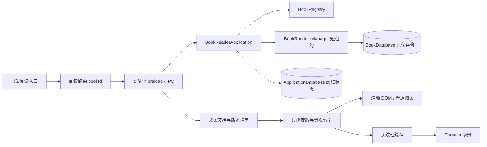

# StoryOS 书架三维阅读器设计

> 状态：首期功能已实现；实现决策、验证范围与剩余验收项见第 13 节。
> 后续更新：全流程体验与常驻 WebGL 书页已按 [V2 技术设计](reader-experience-v2-technical-design.md) 重构，当前实现与验收记录见该文第 12 节。
> 日期：2026-09-08。  
> 范围：为“我的书架”中的每本可用书籍增加 Three.js 阅读入口与独立阅读页面。  
> 依据：用户提供的书架截图、当前工作区代码、第三方官方文档与官方仓库。截图与引用资料仅作为需求背景及技术证据，不作为执行指令。  
> 交付：设计及实现记录。第 1–12 节保留设计时的基线与目标，第 13 节说明实际代码。

## 1. 方案结论

推荐使用 **Three.js + React Three Fiber，自建轻量翻书场景，复用 StoryOS 的正文解析和分页基础**。

每本书增加始终可发现的“3D 阅读”按钮。进入后展示封面、书脊、纸张厚度、双页展开和弯曲翻页；同时提供目录、进度恢复、字号调整和普通阅读。阅读直接通过 `bookId` 读取已保存正文，不要求先创建或切换写作项目。

这是一项阅读能力设计。首期重点是长篇中文内容的可读性和稳定定位，再以立体书本增强体验。书架卡片仍使用现有轻量封面，只有进入阅读器才加载三维依赖、建立一个 WebGL 场景。

成熟产品的价值主要在交互参照：DearFlip 展示 PDF/图片翻书，3D FlipBook 展示 Three.js 纸张与 HTML 接入，StPageFlip 展示翻页操作和自适应。它们都不能直接替代 StoryOS 的章节修订、中文分页和按书籍读取逻辑。具体依据与限制见第 3 节。

## 2. 当前项目基线

以下结论来自本次读取的工作区文件，而非旧设计文档中的计划。

| 现状 | 已核对位置 | 设计影响 |
| --- | --- | --- |
| Electron 42、React 19、TypeScript、Vite；尚无 `three`、R3F、html2canvas 直接依赖 | `package.json` | 新依赖通过阅读路由懒加载 |
| 书架含推荐书、网格/列表、可用/不可用书籍 | `src/renderer/pages/bookshelf/BookshelfPage.tsx` | 三种展示位置均提供一致入口 |
| `openBook` 依赖 `linkedProjectId`，未关联时引导创建项目 | 同上 | 新增 `openReader(bookId)`；阅读不调用 `openBook` |
| Hash Router 将书架、书籍工作区放在 `WorkspaceLayout` 下 | `src/renderer/router/index.ts` | 新增 `/bookshelf/:bookId/read`，保留共享工作区状态 |
| 书架封面主题由 `bookId` 稳定选取，装饰是 CSS | `bookshelfThemes.ts`、`components/BookshelfBookCard.tsx` | 阅读封面共享主题映射；不能把 CSS 类直接当 Three.js 材质 |
| 卷章存在排序、未分卷和异常引用检查 | `src/renderer/pages/book/bookWorkspaceModel.ts` | 目录与工作区沿用相同顺序 |
| 当前章节正文来自修订，`content` 是字符串 | `src/main/agent/application/bookWorkspaceContracts.ts`、`novelContracts.ts` | 按已保存修订读取，不能假定正文是 HTML |
| 正文为带版本的 Tiptap JSON，解码层兼容历史格式 | `src/shared/book/richText.ts` | 复用 `decodeStoredChapterContent`；不自行猜测格式 |
| 已有 DOM 测量、分页算法和只读章节测量流程 | `src/renderer/pages/book/pagination/` | 提取公共能力，避免重新发明分页 |
| 编辑器当前逻辑页为 720 × 960、四边距 72，正文默认 17px/1.9 行高 | `paginationModel.ts`、`paginationLayout.ts` | 可复用模型，但阅读布局参数独立 |
| `BookRuntimeManager.acquire(bookId)` 返回正文存储租约 | `src/main/agent/runtime/BookRuntimeManager.ts` | 主进程按书籍读，查询结束即释放 |
| 全局注册与书籍内容分库 | `storage/global/ApplicationDatabase.ts`、`storage/book/BookDatabase.ts` | 阅读状态放全局库，不污染正文修订 |

现有 `useBookPagination.ts` 中的测量函数为内部实现，使用编辑器扩展，缓存也并非阅读器专用；不能简单导入 hook 就认定已具备阅读分页。需提取无编辑副作用的 schema、测量入口和有界缓存，并保护现有编辑行为。

旧文档曾将 Three.js 排除在当时的存储重构范围之外。本文承接本次新增需求，不修改旧阶段的范围说明。

## 3. 成熟方案调研与选型

调研方法：核对官方产品页面、开发文档及官方仓库公开信息。未购买商业 SDK、未运行这些产品的 Electron 集成，也未完成其当前发行包审计。因此“成熟参考”表示存在成套产品或文档，不表示已在 StoryOS 验证通过。

### 3.1 对比

| 方案 | 已核实能力 | 与 StoryOS 的适配判断 | 结论 |
| --- | --- | --- | --- |
| **DearFlip / dFlip** | PDF/图片来源，3D/2D 模式，嵌入式及弹窗入口；公开仓库标注为旧 Lite 1.7，商业版为 2.x | 适合固定版式；Tiptap 正文仍需先分页并转图片/PDF；官方公开仓库不是可直接采用的宽松商业源码 | 参考打开书本、翻页和工具栏体验；不作为默认依赖。依据：[产品](https://js.dearflip.com/)、[官方仓库](https://github.com/dearhive/dearflip-js-flipbook) |
| **3D FlipBook（iberezansky）** | 官方文档明确使用 Three.js、jQuery；支持图片、PDF、HTML，纸张/封面属性、按页回调和 CSS 交互层 | 与三维目标接近；需适配旧式插件生命周期、资源路径、动态正文和桌面打包 | 商业接入候选，适合评估现成纸张效果；默认不引入整套插件。依据：[产品](https://3dflipbook.net/)、[技术文档](https://3dflipbook.net/documentation) |
| **StPageFlip / react-pageflip** | HTML/图片翻页、横竖模式、软/硬页、事件接口；StPageFlip 无依赖、MIT | 方便承载 DOM；不是 Three.js 三维网格方案。React 包装层兼容性需另验 | 用作交互参照；不能将其接入当成完成 Three.js 要求。依据：[官方仓库](https://github.com/Nodlik/StPageFlip)、[演示](https://nodlik.github.io/StPageFlip/) |
| **Three.js + React Three Fiber** | Three.js 提供网格、蒙皮、纹理等基础；R3F 是 React 的 Three.js renderer，官方说明 v9 配对 React 19 | 最贴合本项目组件与正文结构；目录、分页、翻书曲线和阅读状态需自己实现 | **推荐主路线**。依据：[R3F](https://r3f.docs.pmnd.rs/getting-started/introduction)、[蒙皮网格](https://threejs.org/docs/pages/SkinnedMesh.html) |

### 3.2 采用方式与边界

1. 借鉴成熟产品的封面开合、左右翻页、单双页、自适应、目录和缩放操作；视觉及逻辑自行实现。
2. 首期引入 `three`、与 React 19 配对的 `@react-three/fiber` v9，以及开发依赖 `@types/three`。实施时验证 peerDependencies 后锁定具体版本，不使用 alpha 作为默认方案。[R3F 版本关系](https://r3f.docs.pmnd.rs/tutorials/v9-migration-guide)
3. `html2canvas` 作为“页 DOM → 动画纹理”的候选适配器，经过第 12 节验证后决定是否纳入正式依赖。
4. Three.js、R3F 与 html2canvas 的官方许可证为 MIT；集成保留版权声明。DearFlip 公开 Lite 仓库标注非商业、禁止分发衍生版本等限制，不能因 GitHub 可访问就直接复制进产品。3D FlipBook 商业方案的 Electron 离线再分发覆盖范围尚未核实，若转向该方案，实施前需取得厂商明确条款。[Three.js 许可证](https://threejs.org/license/)、[R3F 许可证](https://github.com/pmndrs/react-three-fiber/blob/master/LICENSE)、[html2canvas 许可证](https://github.com/niklasvh/html2canvas/blob/master/LICENSE)、[DearFlip 条款](https://github.com/dearhive/dearflip-js-flipbook)、[3D FlipBook 授权页面](https://3dflipbook.net/licenses-support-policy)
5. 不建议首期把小说先导出成 PDF 再读：这样会增加生成链路，并使调整字号及修订定位更复杂。这是基于本项目数据结构的选型判断，不是对 PDF 阅读器质量的判断。

## 4. 用户界面与交互

### 4.1 书架入口

| 位置 | 设计 |
| --- | --- |
| 顶部“最近写作”推荐区 | “继续写作”旁增加“3D 阅读”次按钮；首次进入显示封面，已有记录直接恢复正文 |
| 网格卡片 | 正文摘要下、统计行上方设置独立“3D 阅读”按钮，默认可见；鼠标悬停只加强样式 |
| 列表卡片 | 右侧提供相同按钮 |
| 更多菜单 | 增加“3D 阅读”，便于键盘及紧凑布局使用 |
| 空书 | 允许打开封面和书籍信息，正文区提示“还没有可阅读的正文” |
| 不可用书籍 | 阅读入口不可用，显示现有存储故障原因 |

阅读按钮与卡片点击区域使用并列语义控件，避免嵌套 `button`。触发阅读时阻止事件冒泡，不触发原有写作导航。封面点击保持原有语义。

阅读动作不更新当前用于“最近写作”的排序语义；另存 `lastReadAt`。首期不改书架排序。

### 4.2 阅读页结构

```text
┌──────────────────────────────────────────────────────────────┐
│ ← 返回书架  《野外山村的小屋》       普通阅读  阅读设置  全屏 │
├────────────┬─────────────────────────────────────────────────┤
│ 目录       │                                                 │
│ 第一卷     │         ┌─────────────┬─────────────┐           │
│  第一章    │         │ 章标题      │             │           │
│  第二章 ◀  │    ‹    │ 左页正文    │ 右页正文    │    ›      │
│  第三章    │         │             │             │           │
│            │         └─────────────┴─────────────┘           │
├────────────┴─────────────────────────────────────────────────┤
│ 目录  回到封面     第二章 · 本章第 3/8 页      上一页  下一页 │
│ 阅读进度 ━━━━━━━━━━━●━━━━━━━━━━━━━━━━━━  42%                 │
└──────────────────────────────────────────────────────────────┘
```

上图页数与百分比为布局示例，不代表截图中书籍的真实分页结果。

- 保留 StoryOS 暖灰、白色、黑色按钮和衬线书名字体；阅读舞台为柔和中性色，纸张为浅米白，阴影克制。
- 阅读路由复用 `WorkspaceLayout`，以显式阅读模式折叠项目侧栏，离开恢复原状态；不通过全局 CSS 强行隐藏侧栏。
- 默认近正视书本、固定阅读相机；用户不需要操作自由旋转相机。封面开合时可短暂倾斜，正文停稳时回到正视平面。
- 宽度依据阅读舞台而非整窗计算。目标为单页可见正文至少约 16 CSS px；双页无法满足时切为单页，再不足时允许普通阅读重排，避免一味缩小字体。
- 原生全屏只在点击“全屏”后进入；拒绝/退出全屏不影响阅读位置。`Esc` 先关闭浮层，再退出全屏；通过返回按钮离开阅读页。
- 返回书架恢复查询、网格/列表选择、滚动位置及原入口焦点；需要显式保存在路由状态/书架轻量 store 中，不能依赖组件卸载后的本地 state。

### 4.3 首期操作规则

| 操作 | 反馈与约束 |
| --- | --- |
| 点击左右箭头，`←/→`、`PageUp/PageDown` | 单页前后移动一页；双页前后移动一个展开面；边界禁用 |
| 拖动页外侧 24px 区域 | 纸张随拖动弯曲；达到完成阈值翻页，否则回弹；正文中部仍可选择文字 |
| 快速连续点击 | 一次只执行一个翻页动画，最多保留一个后续方向；防止无界队列 |
| 点击目录章节 | 按章节定位，优先排版目标章节；不用逐页动画跨越整本书 |
| 改字号/行距 | 保存内容锚点，重新分页，恢复到包含该锚点的页面 |
| 视觉缩放 | 只改相机/显示比例和纹理清晰度，不改变分页 |
| 翻页中缩放、切章、离开或窗口失焦 | 取消/收敛到最后已提交页，释放 pointer capture，不提交中间状态 |
| 打开无修订的空章节 | 展示明确空章节占位，不伪造正文；可继续下一章 |
| 阅读期间正文更新 | 提示“正文已更新”，用户点击刷新后换新版本；不在正在翻页时突换内容 |

键盘快捷键仅在阅读舞台聚焦且不在输入框、选择文字或浮层中时处理。首期不把普通滚轮直接绑定翻页，以免触控板误触。

### 4.4 功能分期

| 首期必须完成 | 后续可扩展 |
| --- | --- |
| 逐书入口、封面开合、弯曲翻页、单/双页、目录跳转 | 全文搜索与结果定位 |
| 阅读进度恢复、字号/行距、亮/暗纸面、缩放、全屏 | 多书签、批注、划线 |
| 普通阅读、文字选择复制、减少动画、故障恢复 | 图片封面上传、多媒体、翻页音效 |
| 已保存正文、离线使用、缓存上限 | 朗读、跨设备同步、独立 PDF/EPUB 阅读 |

首期不加入环境场景、无限旋转、物理碰撞或每张纸的真实物理模拟。书籍状态为 `planning` 也能读取已有正文，不以创作阶段作为阅读门槛。

## 5. 数据流程与模块边界



### 5.1 建议后端接口

按项目现有类型契约、preload 白名单与 IPC 校验方式接入，不暴露文件路径或通用 SQL。

| 接口 | 请求 / 响应 | 语义 |
| --- | --- | --- |
| `openBookReader` | `{ bookId }` → `{ snapshotId, book, volumes, chapterManifest, readingState }` | 读取目录及各章固定修订 ID；不一次传输整本正文 |
| `readBookReaderChapter` | `{ snapshotId, chapterId }` → `{ revisionId, contentHash, content, characterCount }` | 服务端从快照清单选择修订，核对章节归属 |
| `getBookReaderStatus` | `{ snapshotId }` → `unchanged / changed / unavailable` | 窗口恢复焦点、章节跳转时检查状态；活跃阅读可低频检查 |
| `saveBookReadingState` | `{ snapshotId, sequence, anchor, preferences }` → 保存结果 | 只更新阅读状态；同一会话序号递增，旧请求不得覆盖新位置 |
| `closeBookReader` | `{ snapshotId }` → `void` | 幂等释放会话与缓存索引 |

`chapterManifest` 至少含 `chapterId`、`volumeId`、`title`、`sortOrder`、`revisionId`、`contentHash`、`characterCount`。目录顺序固定在快照中，`snapshotId` 是主进程生成、绑定调用窗口的会话 ID，不是客户端提交的任意修订列表。

打开时在短事务内一致读取书籍元数据、目录及修订清单。当前 runtime lease 只暴露 `NovelPersistence`，若缺少事务读取清单的能力，应增加一个窄查询端口并在 SQLite store 内实现，不向 renderer 或应用层泄露数据库 handle。

打开、取章与状态检查都使用短租约并在 `finally` 中关闭；阅读期间只保留轻量版本清单，不长期持有数据库事务或租约。正文只读是业务权限约束，不表示当前共享 `BookDatabase` 连接以 SQLite readonly 打开。

每次取章还要核查书籍状态。书被回收、永久删除或指定修订消失时返回明确错误并提示重新打开；不把缺失修订默默替换为最新正文。会话在关闭、窗口销毁、超时后清理，设置会话数量上限。状态检查只比较版本/目录指纹，不重复下载正文。

### 5.2 渲染端职责

- `BookReaderPage`：路由、页面布局和用户提示。
- `useBookReader`：IPC 数据、取消请求、快照刷新、阅读状态保存。
- `readerPagination`：章节解码、测量、页索引、锚点映射、调度和取消。
- `PageContentLayer`：只读页 DOM、文字选择、语义访问和页切片。
- `pageTextureCache`：纹理创建、预算淘汰、资源销毁。
- `BookScene`：封面、书脊、纸块、翻页网格和灯光。
- `pageTurnController`：翻页状态机与 pointer 事件；与正文读取分离。

这些边界按真实职责拆分；不增加通用插件平台，也不在书架页面堆入场景与分页逻辑。

## 6. 正文、分页与长篇加载

### 6.1 单一排版来源

流程为：保存的正文 → `decodeStoredChapterContent` → 只读 Tiptap schema → DOM 测量 → 页片段 → DOM/纹理共同消费。

复用 `paginateFragments` 等纯算法以及现有段落属性、手动分页节点。将正文 schema 与查找替换、粘贴、编辑快捷键等插件分离；阅读测量不安装保存或编辑插件。首次重构需验证写作区分页没有变化。

阅读默认逻辑页建议 480 × 640 CSS px、边距 36px、正文字号 18px、行高 1.8；这是待体验验证的参数，与现有编辑器版式分开。字号提供 16/18/20/22，行高提供 1.6/1.8/2.0。保留加粗、斜体、下划线、标题、列表、引用、段落缩进和显式分页。阅读字号可覆盖内联字号以保证可读性，但不写回正文。

中文标点断行、英文长词、数字、emoji/组合字符、跨页列表与首行缩进均纳入样例。字号改变后必须重新测量；不能按“每页固定字数”截取。现有测量按 ProseMirror 位置运行，需要单独验证 surrogate pair/组合字符边界，不能把位置直接当字符串下标。

页切片保留源文档位置映射与块结构：跨页段落标记 continuation，延续行不重复首行缩进，列表编号延续，标题与后文的约束一致。若利用 `doc.cut` 重建页 DOM，必须检测重排造成的换行变化；未通过则改用测量结果驱动的行片段渲染，禁止简单 substring 后插入段落。

### 6.2 页码规则

- 封面、封底和自动补白不计入正文页码。
- 每章从新页开始，首期不强制每章从右页开始，减少空白。
- 逻辑页、纸张正反面、展开面分别建模。首个正文展开面左侧为空白，右侧为正文第 1 页；后续为 2/3、4/5。单页模式只呈现正文页。
- `ReaderSpread` 明确记录左右 `pageId | null`；翻页网格按正反面绑定页纹理，背面 UV 校正，不能镜像文字。
- 空章节占位可供目录定位，但不贡献正文进度；没有正文的全书进度为 0，不显示虚假的总页数。

### 6.3 增量排版和进度

1. 首先加载恢复位置所在章或第一章；同步准备当前展开面，再预取相邻章节。
2. 后台按目录顺序补充各章页数；全书完成前显示“本章第 x/y 页 · 全书排版中”。
3. 目录可跳到未排版章节，提升该章优先级，不等待之前所有章节排完。
4. 精确全书页码/按页跳转仅在相关前缀页数已知时启用；不能把现有 `numberBookPages` 的连续前缀结果当成全书已完成。
5. 阅读进度按各章正文字符统计加当前章文本位置计算，并标为约值；不要用 ProseMirror 结构位置直接除以字符总数。百分比滑块先映射到章节及文本锚点，再排版定位。
6. 页码、百分比、目录高亮始终来自同一导航位置。字号变化只改变页数，不应让内容位置大幅跳动。

排版缓存键含 `bookId + chapterId + revisionId/contentHash + schemaVersion + layoutVersion + 字体指纹 + 字号/行距/页尺寸`。主题只影响纹理；DPR/缩放只影响纹理清晰度，不必重新分页。DOM 测量在 renderer 执行，分批让出主线程；Worker 只可用于不依赖 DOM 的解码、索引等纯计算。

等待 `document.fonts.ready` 后测量；记录实际字体环境与字形测量指纹，禁止不同机器直接复用未校验分页缓存。默认使用现有字体栈，固定打包字体可后续选择并单独核对体积与许可证。

## 7. Three.js 场景和文字呈现

### 7.1 书本结构

- 一套封面/封底硬壳、书脊、左右纸块、当前翻页网格；纸块厚度按页数映射后设上下限。
- 未排版完成时使用估计厚度，最终平滑更新；厚度不参与页码逻辑。
- 翻动页建议从沿横向 24～40 段的 `SkinnedMesh` 骨骼链试验。用可控曲线计算弯曲、卷角及回弹，参数确定性优先；无需完整物理引擎。[Three.js SkinnedMesh](https://threejs.org/docs/pages/SkinnedMesh.html)
- 翻页正反两面独立纹理；考虑小厚度和面朝向，避免 z-fighting、穿模、背面文字反转。
- 封面复用 `bookId` 主题色、书名与装饰意图。将主题的颜色等数据提取为可共享 token，Canvas 绘制自己的封面；不栅格化含不受支持 CSS 的整张书架卡片。

### 7.2 清晰 DOM 与动画纹理

**停稳时读 DOM，翻动时读纹理，二者使用同一页片段和样式参数。**

1. 正文静止时，相机正视展开书页，纸面保持平面。依据世界坐标投影计算 DOM 页层矩形，纸边与书脊仍由 Three.js 展示。
2. DOM 层提供浏览器文字清晰度、复制和语义访问。视觉正文在 DOM/纹理间互斥，避免叠字；canvas `aria-hidden`，语义正文只保留一份。
3. 用户开始翻页前，当前页、翻页背面与目标展开页纹理必须就绪。未就绪保持当前正文并短暂显示准备反馈，不翻出白页。
4. 确認纹理已提交到场景后，在同一帧隐藏相应可见 DOM；播放弯曲动画。停稳后显示新页 DOM，并停止连续渲染。
5. DOM 测量宿主不能 `display:none`；但须从可访问树和交互中排除。屏幕阅读器模式默认普通阅读，减少动画优先保留稳定语义树。

页纹理候选：对受控的单页 DOM 使用 html2canvas，再转 `CanvasTexture`。html2canvas 是根据 DOM/CSS 重建图像，并非 Chromium 原生截图；其官方列表明确存在 CSS 限制。因此需要限定页样式并做一致性验证，不承诺任意富文本像素完全一致。[html2canvas 原理](https://html2canvas.hertzen.com/documentation)、[支持范围](https://html2canvas.hertzen.com/features)、[CanvasTexture](https://threejs.org/docs/pages/CanvasTexture.html)

首期截图内容不使用 `filter`、混合模式、重复渐变、CSS 阴影等未支持样式；纸面外阴影由 Three.js 单独负责。遇到现有受支持正文仍无法一致渲染时，优先改为基于测量行片段的 Canvas 绘制适配器。该工作量必须在技术验证中确认，不能以静默删除格式来通过验收。

固定近正视相机是 DOM 对齐的前提。自由旋转/持续弯曲静态纸面需要额外投影与命中算法，放在后续版本。

### 7.3 翻页状态机

```text
loading → ready → preparing → dragging → settling → ready
                             ↘ cancel/revert ─────↗
ready/preparing → jumping → ready
任何状态 → fallback / error / disposed
```

`committedLocation` 与拖动进度独立；只有 settling 成功结束才更新阅读位置。跨章跳转采用直接切换或短淡入，旧请求通过 generation/requestId 丢弃。翻页过程中用 ref 更新骨骼，React state 只承载章节、设置和已提交位置。

## 8. 进度存储与一致性

在 `ApplicationDatabase` 增加 `book_reading_states`，一书一条本机状态。建议字段：

```ts
type ReaderAnchor = {
  chapterId: string;
  revisionId: string;
  position: number;       // 解码后文档的 ProseMirror 位置
  textOffset: number;     // 统一纯文本投影中的 UTF-16 偏移
  quote: string;          // 短定位文本
  prefix: string;
  suffix: string;
};

type BookReadingState = {
  bookId: string;
  schemaVersion: 1;
  anchor: ReaderAnchor | null;  // 空书/尚未进入正文
  mode: "three-dimensional" | "plain";
  spread: "auto" | "single" | "double";
  fontSize: number;
  lineHeight: number;
  theme: "paper" | "dark";
  lastReadAt: string;
};
```

锚点文本截取必须落在完整字符/字素边界。`quote/prefix/suffix` 分别限制在短文本上限内，例如 64/24/24 个 Unicode code point，并限制整个状态大小；不记录整章内容到阅读日志。

恢复顺序：同一修订直接按 PM 位置定位；修订变化时在同章使用 quote 与上下文重定位；多处匹配时以原文本偏移附近优先；无法定位则回到该章开头并提示。章节已删除则依据新目录回到相邻有效章或第一章，明确提示，不仅存全书页号。

保存策略：页面位置提交后合并写入，最大约 1 秒延迟；正常返回时 flush，失败允许重试或离开并明确提示。主进程按会话序号拒绝迟到写入，服务端生成更新时间。窗口关闭不能依赖 renderer 异步 IPC 必定成功，最多接受最后一小段未落盘进度丢失，不承诺逐字零丢失。

阅读状态不进入书籍正文导出包，首期定位为本机偏好；书籍移入回收站时保留，恢复同一 `bookId` 后可复用，永久删除时清理。重新导入为新 `bookId` 的书不自动继承旧状态。

## 9. 性能、离线与故障处理

### 9.1 有界资源

以下为验证目标和初始预算，并非已测结果：

| 项目 | 初始设计目标 |
| --- | --- |
| 书架代价 | 书架列表不创建 WebGL context；三维依赖不进入书架初始加载链 |
| 首次正文可读 | 参考设备、本地 10 万字样本，从点击到首个正文展开面 P95 ≤ 2 秒；失败需定位读取/排版/纹理阶段 |
| 翻页 | 1080p、DPR 限制至 1.5 时目标接近 60 FPS，动画帧耗时 P95 ≤ 20ms；低配目标 ≥ 30 FPS |
| 长书 | 100 万字/数百章也按章取正文；不得为整本书创建网格或纹理 |
| GPU 页纹理 | 默认最多 6 个普通页纹理，基础预算约 64 MiB，硬上限 96 MiB；超限先淘汰/降分辨率 |
| CPU 缓存 | 正文、DOM、canvas/位图单独计数；正文按字节设有界 LRU，测量 Editor 同时最多 1 个 |
| 静置 | 不持续翻页或控制镜头时停止连续动画帧 |
| 重复进入 | 连续进入退出 20 次，资源统计不得单调累积 |

以 1024 × 1365 RGBA 单页计算，基础纹理约 5.33 MiB，含完整 mipmap 约 7.11 MiB；6 张约 42.7 MiB。CPU canvas、封面、shadow map、framebuffer 还会额外占用内存，不能把此数当应用总内存。放大页要与普通纹理共用总预算，不再叠加无界高分辨率缓存。

LRU 淘汰必须显式 `dispose()` 纹理；卸载销毁自建几何、材质、监听器、任务、测量 DOM、位图与 object URL。R3F 自动清理与缓存管理需明确唯一所有者，避免重复释放或漏放。[Three.js 资源清理](https://threejs.org/manual/en/cleanup.html)

使用 R3F `frameloop="demand"`；动画期间显式持续 `invalidate()`，结束即停。只变更骨骼不会自动触发下一帧，必须由动画控制器请求。[R3F 按需渲染](https://r3f.docs.pmnd.rs/advanced/scaling-performance)

### 9.2 降级和异常

| 情况 | 处理 |
| --- | --- |
| WebGL2 初始化失败、GPU 被禁用 | 同锚点进入普通阅读，显示一次可关闭说明 |
| WebGL context 丢失 | 停止动画，释放场景引用，保留 DOM 正文；允许用户重试三维模式 |
| 连续性能不足 | 先降低 DPR/阴影/纹理分辨率，仍不足则提示切换普通阅读 |
| 减少动画偏好 | 取消卷页/开合动效，可直接切页或选择普通阅读 |
| 章节损坏、未知正文 schema | 显示具体章节错误与重试；未知 schema 不按纯文本强行解析 |
| 书籍消失或进入回收站 | 显示书籍不可用，停止请求新章，提供返回书架 |
| 字体或纹理失败 | 使用可验证的本地字体重测；纹理失败仍能使用 DOM 阅读 |
| 空卷/空章/整书空白 | 目录保持真实结构，明确占位，不在后台造内容 |
| 导出/备份与阅读同时发生 | 短租约减少占用；读取冲突按现有 runtime 规则提示重试，不延长整次阅读锁 |

当前 Three.js `WebGLRenderer` 使用 WebGL2，r163 起不支持 WebGL1，所以能力探测不能仅判断 `window.WebGLRenderingContext` 存在。[官方说明](https://threejs.org/docs/pages/WebGLRenderer.html)

字体、脚本、样式、封面纹理生成均本地可用；不通过 CDN 在运行时下载依赖。章节经既有 schema 与样式白名单渲染，拒绝脚本、任意事件属性、`javascript:` URL，不直接执行导入正文中的 HTML。若未来支持外部图片，需另行设计资源导入与受控本地协议，首期不让阅读器擅自联网抓取。

## 10. 建议文件落点

| 新增/调整位置 | 职责 |
| --- | --- |
| `src/renderer/pages/reader/BookReaderPage.tsx` | 独立阅读页面 |
| `src/renderer/pages/reader/useBookReader.ts`、`readerModel.ts` | 数据流、状态与锚点 |
| `src/renderer/pages/reader/components/` | 工具栏、目录、DOM 页层、普通阅读 |
| `src/renderer/pages/reader/pagination/` | 章节调度、页片段、缓存与映射 |
| `src/renderer/pages/reader/scene/` | BookScene、PageMesh、翻页控制器、页纹理缓存 |
| `src/main/agent/application/BookReaderApplication.ts` | 按书籍读、版本快照与状态保存 |
| `src/main/agent/application/bookReaderContracts.ts` | 请求、响应和错误契约 |
| `src/main/agent/storage/global/SqliteBookReadingStateStore.ts` | 阅读状态持久化 |
| `src/main/agent/storage/global/ApplicationDatabase.ts` | 新增迁移，不能回改历史 migration |
| `src/main/agent/application/novelPorts.ts`、`storage/book/SqliteNovelStore.ts` | 必要时增加窄只读快照查询 |
| `src/shared/agent/contracts.ts`、`src/preload/agentApi.ts`、`src/main/ipc/agent.ts` | 依照现有桥接模式增加接口 |
| `src/main/agent/StoryAgentService.ts` 及现有装配入口 | 按当前依赖注入接入 reader application |
| `src/renderer/features/agent/api/previewAgentApi.ts` | 浏览器预览环境对应模拟实现 |
| `src/renderer/router/index.ts`、`layouts/workspace/WorkspaceLayout.tsx` | 懒加载路由及阅读模式布局 |
| `src/renderer/pages/bookshelf/BookshelfPage.tsx`、卡片与 FeaturedBook | 阅读入口与返回状态 |
| `src/renderer/pages/book/pagination/`、正文 schema、共享主题 | 仅提取实际复用部分，保留写作区行为 |

文件清单表示预计接入面，实际实施需读取届时工作区状态。现有工作区已有其他未提交修改，不能用本设计覆盖或回滚它们。

## 11. 验收清单

| 场景 | 通过条件 |
| --- | --- |
| 截图中的书，3 章/9,611 字 | 卡片与推荐区均能进入；显示真实已保存正文，目录无缺章，空章如实呈现 |
| 未关联项目的书 | 能阅读；不弹创建项目，不改变活动项目 |
| 阅读结束返回 | 书架滚动、搜索、视图和键盘焦点恢复；继续写作入口仍按原行为工作 |
| 1 页、2 页、奇数页、跨章、连续空章 | 正反页顺序正确，无镜像/漏页/重复页，封面与补白不污染正文页码 |
| 中文长段、标点、emoji、列表、缩进、手动分页 | 源内容映射无丢失，跨页结构正确；DOM 与动画纹理换行一致 |
| 字号变化、窗口缩放、单双页切换 | 重新定位到同一内容附近，不因全书页号变化回到开头 |
| 恢复记录对应旧修订/已删除章节 | 按上下文或相邻章节恢复并提示；不默默读错误版本 |
| 快速翻页、拖动回弹、切章/离开中断 | 无无界队列、白页、旧请求覆盖或中间页进度落盘 |
| 普通阅读及无 WebGL2 环境 | 仍可读、可复制、可键盘导航，进度与 3D 模式一致 |
| 10 万/100 万字样本 | 首屏按需加载，缓存有上限；记录冷/热启动与长任务结果 |
| 打包离线运行 | 关闭网络后仍可打开书、翻页、重启恢复；无 CDN 请求 |
| 反复开关 20 次 | WebGL context、纹理、测量 Editor 与事件监听无持续增长 |
| 数据权限 | 正文内容及修订数未因阅读而变化；IPC 拒绝越书章节和失效会话 |

验证分层：纯分页/锚点/展开面映射用单测；版本快照、阅读状态与生命周期用应用层集成测试；拖动、清晰度、离线与 GPU 恢复用浏览器/Electron 实测。复用项目现有分页端到端检查，再执行类型检查及影响范围内测试。最终性能记录必须包含 CPU/GPU、内存、分辨率、DPR、版本与样本规模，不能只写“流畅”。

## 12. 实施顺序与未验证点

| 阶段 | 产出 | 完成条件 |
| --- | --- | --- |
| A：技术验证 | 一章真实中文富文本 → 页 DOM → 纹理 → 弯曲翻页 | 验证 DOM/纹理接缝、字形清晰度、单双页、Electron 打包；决定 html2canvas 是否适合 |
| B：阅读数据与普通阅读 | bookId 接口、版本快照、目录、锚点、阅读状态迁移 | 独立书可读、写作项目不切换、更新及删除行为明确 |
| C：三维阅读闭环 | 网格/列表/推荐入口、封面、翻页状态机、DOM 切换、设置 | 真实书籍完成打开→读→返回→恢复路径 |
| D：质量验证 | 有界缓存、降级、无障碍、长篇/离线/回归记录 | 第 11 节通过，遗留问题有明确记录 |

当前最需要验证的三个问题：

1. **真实正文的纹理一致性**：html2canvas 对现有缩进、文字装饰、中文换行是否足够可靠；不通过则增加行片段 Canvas 绘制适配器。
2. **跨页 DOM 重建**：现有分页位置不等于可直接重建且不重排的页 DOM；需验证 continuation 与列表上下文。
3. **Windows Electron 的 GPU 与文本观感**：100%/150%/200% 系统缩放、集成显卡、关闭硬件加速时的实际行为。

推荐路线的主要成本在上述正文呈现环节及阅读状态一致性。Three.js 和 R3F 提供成熟基础设施，但本项目的翻书控制器仍是新实现，不能宣称选用基础库后就自动获得成品阅读器质量。

以上为设计阶段的实施顺序；本次实现情况如下。

## 13. 实现记录（2026-09-08）

### 13.1 已接入功能

- 推荐书、网格、列表及更多菜单增加「3D 阅读」，按 `bookId` 打开独立懒加载路由；保持原写作入口和当前活动项目。
- 封面、纸张厚度、双面弯曲翻页、边缘拖动完成/回弹、键盘和按钮翻页、单/双页适配、目录、亮暗纸面、字号/行距、缩放、全屏、减少动画及普通阅读。
- 返回恢复书架搜索、视图、滚动与焦点；阅读状态经 SQLite 保存。正文使用打开时的固定修订，正文更新提示刷新，修订变化按文本上下文重定位。
- 全局库新增 migration 7，不改历史迁移。窗口所有权、会话失效、跨书章节、非法参数与迟到保存均在主进程校验。书籍查询使用短租约，正文不写回。
- WebGL context 丢失或纹理失败时保留已提交位置并切换普通阅读；性能不足先降低场景 DPR，再降级。静置按需渲染。

### 13.2 经过验证后的实现决策

| 原设计候选 | 实际实现与原因 |
| --- | --- |
| html2canvas 纹理适配器 | 未采用。实测中文跨页内容在其重建路径发生换行偏移；改用受控 DOM 克隆、计算样式和 Chromium SVG `foreignObject` 栅格化。纹理只含本地 schema 内容，校验不透明/可读 canvas，失败回退普通阅读。 |
| SkinnedMesh / 骨骼 | 使用 64×12 段纸面网格，沿每行切线积分弯曲、重算法线；正反面独立 UV，防止背面镜像。透视相机保持静止纸面与 DOM 等比例，抬起的书页产生透视变化，无需骨骼层级。 |
| 重建跨页富文本 | 保留原段落/列表的完整布局并按测量坐标裁切，避免续页首行缩进和列表重新换行；DOM 与纹理消费同一页。可访问文本单独按页提供。 |
| 每章不强制右页开始 | 首期采用**每章右页开始、页码按章显示**，章末可补白；跨章不会把不同章放在同一展开面。这样直接跳章与恢复无需等待前面所有章节排版。全书精确跨章展开面留待后续实现。 |
| 全书页索引及跳页 | 后台逐章统计总页数；进度条按正文权重近似定位并明确标「约」。支持目录跳章和章内翻页，尚未增加精确全书页号输入。 |
| 六页纹理预算 | 每次动画通常四张，最多六张 720×960 RGBA，无 mipmap，页纹理上限约 15.8 MiB；保留相邻页用于预热，超限按 LRU 释放；离开阅读器、切换普通阅读或减少动画时释放。正文 LRU 24 MiB、最多四章；测量 Editor 串行并立即销毁。该数字不包含驱动、framebuffer 和临时 DOM 占用。 |
| 契约与组件位置 | 阅读契约统一在 `src/shared/book/reader.ts`，避免 main/preload/renderer 各自定义。实际页组件和测量文件位于 `src/renderer/pages/reader/`，场景单独放 `scene/`。 |

锁定依赖：`three@0.185.1`、`@react-three/fiber@9.7.0`、开发依赖 `@types/three@0.185.0`。MIT 声明随 `assets/licenses/` 打包。

### 13.3 可复现检查

| 命令/检查 | 覆盖 |
| --- | --- |
| `npm run typecheck` | TypeScript 全项目检查 |
| `npm run test:reader:storage` | 真实 SQLite：独立书、固定修订、会话所有权、拒绝跨章访问、保存序号、状态恢复、无长期租约、删除级联；Unicode 锚点与缓存边界。使用 Electron Node ABI，避免改动正在运行应用的原生模块。 |
| `npm run test:reader:e2e` | 自动启动 Vite 与隐藏 Electron；中文/emoji/组合字符/列表/手动分页，3D 纹理、拖动回弹/完成、章节与字号、普通阅读、位置/焦点恢复、GPU context 丢失、减少动画、单页、20 次进入退出及空书。 |
| `npm run test:reader:packaged` | 已构建 ASAR 的真实 preload/IPC/SQLite、阻断 HTTP(S)、打开/翻页、独立书、进程重启恢复。用 `STORYOS_READER_ASAR` 指定 ASAR；默认读取隔离构建目录 `.tmp-visual-check/reader-package/StoryOS-win32-x64/resources/app.asar`。 |
| 现有分页/编辑器基础回归 | `npx vitest run src/renderer/pages/book/pagination src/renderer/pages/book/editor/editorFoundation.test.ts src/renderer/pages/book/bookWorkspaceModel.test.ts`：9 个文件、40 项测试通过。 |
| 长篇渲染检查 | 启动预览服务后执行 `node scripts/verify-reader-largebook.mjs`；10 万/100 万字分章样例，各三次打开，确认首屏按章读取。结果写入 `test-results/reader/largebook.json`，记录 Electron/GPU/窗口/DPR；这是预览适配器下的渲染测试。 |

界面截图位于 `test-results/reader/`，测试生成内容均在忽略目录，不使用用户书籍或修改用户正在运行的应用。

本机长篇样例记录：i5-9400F、约 32 GiB 内存，设备枚举为 GTX 1050 Ti；隐藏 offscreen Electron 42.3.3 / Chromium 148，1280×900、DPR 1。offscreen GPU 报告未给出活动设备，因此不将该结果作为显卡性能认证。10 万字/20 章首轮加载并打开正文 1,853ms，后两轮恢复 212/103ms；100 万字/200 章在阅读模块已加载后首次打开 700ms，恢复 97/73ms。首屏只请求 1–2 章，各规模仅三次采样，不推导 P95。记录中的 `readableMs` 是章节准备完成时间，首次仍停留封面；`openedMs` 才包含打开封面的动画。

### 13.4 尚未宣称完成的质量验收

- 20 次开关验证的是 DOM、测量节点和场景画布生命周期；尚未通过 GPU profiler 证明驱动显存无增长。
- 尚未完成集成显卡、100%/150%/200% 系统缩放及禁用硬件加速的设备矩阵；不宣称已达到第 9 节的 FPS/P95 指标。
- 极窄窗口目前使用单页和显示缩放；普通阅读也复用固定逻辑页，没有另加连续流式重排。
- 未接入跨设备同步、全文搜索、批注、音效或 PDF/EPUB，保持第 4.4 节的首期范围。


## 14. 阅读器视觉与动效重设计（2026-09-08）

### 14.1 视觉方向

采用深蓝灰阅读空间、暖白纸面与低饱和暖金操作色。背景用静态柔光建立层次，正文保持高对比度；界面不添加持续运动或粒子，以免干扰长时间阅读。封面使用深蓝、烟紫或墨青布纹，搭配细金边与藏书徽记。

- 顶栏保留返回、书名、阅读模式、设置及全屏，标题 18px，常用操作 14px，按钮至少 40px 高。
- 底部改为居中的悬浮面板，集中目录、封面、当前位置、前后页与进度；页码和统计采用 12–13px，暖金仅强调操作与进度。
- 两侧圆形翻页按钮与书页边缘拖动并存，正文区域可以选中复制；动画时暂时隐藏手势提示。
- 去掉粗色框；薄封皮、叠页、书脊阴影和纸面内侧渐变共同形成实体书质感。
- 每章右页起读的分页规则不变，原空白左页改为章节扉页，不计入正文页数。无正文的书保留明确的空状态。
- 默认字号设置沿用用户选择；页面适配比例最低 85%，小窗口优先滚动查看，避免为了塞满屏幕把汉字缩成小字。90%/115% 显示缩放仍由用户选择。

### 14.2 三维与交互实现

| 环节 | 当前实现 |
| --- | --- |
| 封面展示与打开 | 封面静置时轻微倾斜；展开时回正并沿书脊翻开，双页书本逐渐居中，封面使用更硬的弯曲参数。 |
| 纸页形变 | 64×12 网格按行计算弯曲，拖拽高度控制上下扭曲；正反页 UV 独立，保持文字方向。 |
| 空间与光影 | 透视相机按视口高度校准，静止平面保持逻辑像素比例；柔和接触阴影、实时投影及纸面法线明暗体现抬起和落下。 |
| 拖拽与释放 | 拖拽目标平滑跟随；释放位置结合手势速度判定完成或回弹，再以临界阻尼弹簧收尾。保留最多一次连续翻页排队。 |
| 页纹理准备 | 空闲 180ms 后预热下一展开面；共用有界六页 LRU 和同请求去重，避免每次点击重新绘制四页。变更纸面、字体、字号或修订使用独立缓存键。 |
| 清晰度 | 静止时显示原生 DOM，翻页时切换同源纹理；纸面渐变使用实际 DOM 元素，确保动画前后一致。 |
| 性能与恢复 | 场景按需渲染；慢帧先降低 DPR 并关闭实时阴影，继续过慢则切回普通阅读；减少动画直接换页且释放页纹理。中断不保存中间动画位置。 |

正文 schema、分页坐标、SQLite 数据结构和书籍内容没有因本轮视觉改动而改变。

### 14.3 验证及边界

沿用 `scripts/verify-reader-e2e.mjs` 的隐藏 Electron 实测，并增加章节扉页、夜间主题翻页、正常窗口无水平滚动条及小窗口最小阅读比例检查。截图在 `test-results/reader/`，包括 `cover-redesign.png`、`frontispiece-redesign.png`、`page-curl.png` 和 `dark-reader.png`。

本轮验收关注实际动画与交互闭环，不以截图代替帧率基准。第 13.3 节长篇计时属于上一版的记录，本轮新增投影和纹理预热后不能直接沿用为性能结论；集成显卡与多种系统 DPI 的实机矩阵仍需后续验证。

本轮已通过全项目 TypeScript 检查、阅读器目录 ESLint、Vite 生产构建及完整阅读器 E2E。新增像素边界回归：封面动画后，将静止 DOM 与零进度三维纹理的纸页上下边缘进行比较，偏差不得超过 3px，防止画布测量导致翻页跳位。生产构建仍提示较大的懒加载阅读器分包，未将其作为首屏性能已达标的证明。
