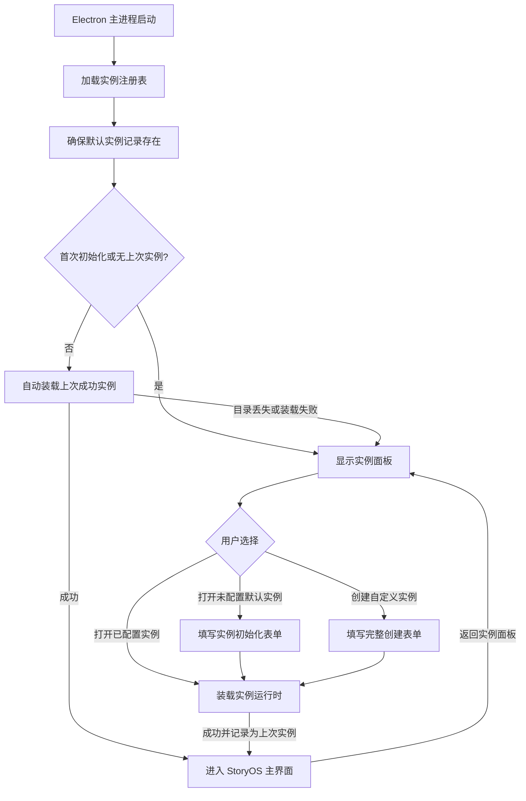
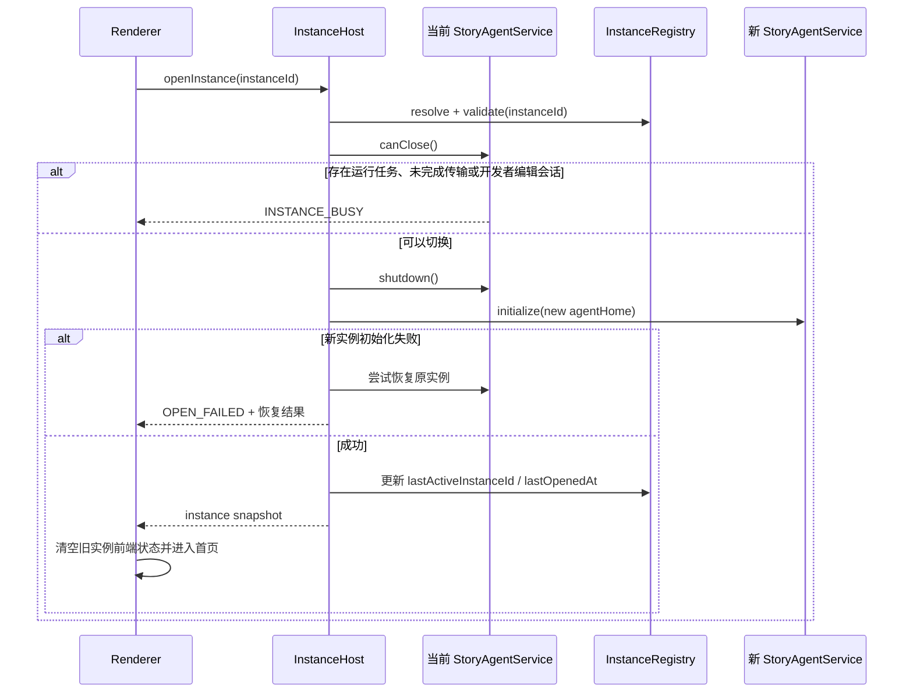

# StoryOS 实例工作空间与 Text Embedding 初始化设计

状态：实施设计，产品规则已确认
日期：2026-09-16
范围：实例选择与创建、实例级数据隔离、启动流程、初始化配置、Text Embedding 通用接口
参考界面：用户提供的 Comfy Desktop 实例面板截图

> 2026-09-17 产品规则调整：不再创建或展示系统默认实例。注册表首次为空，所有实例统一从“新建实例”产生；`%USERPROFILE%\.mini-agent` 仅作为可编辑的建议路径。旧注册表中的 `id=default` 记录会从列表移除，但不会删除对应目录。本调整优先于本文后续仍提及“默认实例”的旧设计描述。

## 1. 背景与目标

StoryOS 当前只有一套由 `agentHome` 驱动的应用数据。默认目录为 Windows 用户目录下的 `C:\Users\<user>\.mini-agent`，其中包含配置、应用数据库、书库、项目归档、Skill、日志和默认项目根。设置中的“工作区路径”只改变项目默认根目录，不会隔离 `app.sqlite`、书库、Skill 或配置，因此它还不是完整的工作空间实例。

本次改造采用破坏式数据重置，不迁移历史数据，不保留旧配置读取兼容，也不为旧数据创建备份。实施和验证环境中的旧 `~/.mini-agent`、旧实例注册表及测试数据可以直接删除，然后由新版本重新创建。该授权只适用于本次架构切换时的历史数据，不改变新系统正常运行后的删除确认和数据安全规则。

本次设计在现有业务工作区之上增加“实例”概念：

- 一个实例就是一个完整、可独立启动的 StoryOS 工作空间。
- 每个实例拥有自己的模型配置、应用数据库、书库、项目、归档、Skill、日志和临时文件。
- 默认实例仍使用 `C:\Users\<user>\.mini-agent`，但改造上线时允许清空并按新目录与配置格式重新初始化。
- 应用首次初始化启动必须经过实例面板；成功打开过实例后，后续启动自动进入上次成功使用的实例。
- 主界面持续提供“返回实例面板”入口，用户可随时查看、创建或切换实例。
- 创建或初始化实例时，在同一流程填写基本信息、存储路径、聊天模型和通用 Text Embedding 配置；Embedding 当前允许跳过。
- 后续允许在设置页修改当前实例配置，并允许安全切换实例。

本设计不把“实例”“项目工作区”和“书籍工作区”合并。三者保持层级关系：

```text
StoryOS 实例
├─ 应用级配置、数据库、Skill、日志、书库与归档
├─ 系统默认项目工作区（无项目对话）
└─ 0..N 个项目工作区
   └─ 0..1 个绑定书籍工作区
```

## 2. 术语

| 术语 | 定义 |
| --- | --- |
| 实例（Instance） | 一套完整隔离的 StoryOS 本地数据与运行时，根目录等同于该实例的 `agentHome` |
| 实例注册表（Registry） | 只记录实例 ID、名称、根路径和最近使用时间的应用级索引，不保存业务数据或密钥 |
| 默认实例（Default Instance） | 根路径固定为 `~/.mini-agent`、改造时按新格式重建的内置实例，固定 ID 为 `default` |
| 项目工作区（Project Workspace） | 当前已有的项目目录及其 `.storyos` 状态，不等同于实例 |
| 系统工作区（System Workspace） | 当前已有的 `.storyos-default`，用于无项目对话，归属于某个实例 |
| Text Embedding 配置 | 当前实例用于文本向量化的服务地址、模型与鉴权信息 |

为避免界面歧义，产品文案统一使用“实例”；代码领域类型统一使用 `StoryInstance`。现有 `WorkspaceRuntimeManager` 继续表示实例内部的项目运行时，不重命名为实例管理器。

## 3. 当前实现与改造依据

现有路径和运行时具备可复用基础：

| 当前能力 | 现状 | 设计结论 |
| --- | --- | --- |
| `getAgentHome()` | 默认返回 `~/.mini-agent`，支持环境覆盖 | 实例根目录直接作为 `agentHome` |
| `ApplicationHostOptions.agentHome` | 注入应用数据库、书库、归档等服务 | 保留该依赖注入边界 |
| `ApplicationEnvironment` | 可在异步业务请求中绑定 `agentHome` | 切换后绑定当前实例根目录 |
| `app.sqlite` | 固定在 `agentHome/app.sqlite` | 天然变为实例级数据库 |
| `config.json` | 固定在 `agentHome/config.json` | 天然变为实例级配置 |
| `library/`、`archives/`、`skills/`、`logs/` | 均位于或可归入 `agentHome` | 随实例完整隔离 |
| `AGENT_WORKSPACE` | 当前只决定项目默认根目录 | 删除旧键，由 `workspace.defaultProjectsRoot` 替代 |
| `StoryAgentService` | 同时持有配置、数据库和所有运行时资源 | 扩展为可卸载、可装载当前实例的会话宿主 |
| 模型热切换 | 新任务使用新聊天模型，运行中任务保持旧快照 | Embedding 配置采用同一“新操作生效”规则 |

核心判断：实例切换不能只修改一个路径变量。必须关闭当前实例的数据库、书籍读取器、导入导出任务、项目运行时和订阅，再使用新 `agentHome` 完整创建运行时。

## 4. 产品流程

### 4.1 启动流程



启动规则固定如下：

1. 安装或升级到该功能后的第一次启动必须显示实例面板，即使只有默认实例也不能自动跳过。
2. 用户成功打开任一实例后，注册表记录该实例；后续启动直接装载该实例并进入主界面。
3. 自动装载仅使用“上次成功打开的实例”，不能在初始化开始、配置保存前或打开失败时提前更新。
4. 上次实例不存在、目录不可访问、元数据无效或运行时创建失败时，应用回到实例面板并在对应卡片展示错误，不自动改开其他实例。
5. 主界面侧边栏底部或应用菜单提供“切换实例”入口，返回实例面板不改变下次自动打开目标；只有成功打开另一个实例后才更新目标。

为区分“从未完成首次选择”和“用户主动返回实例面板”，注册表使用 `lastActiveInstanceId` 表示上次成功实例。它为空时必须展示面板，非空时尝试自动打开。

### 4.2 实例选择面板

整体参考截图的信息架构，不复制品牌视觉：

- 顶部：StoryOS 品牌、搜索框、设置入口。
- 主区第一项：固定的“新建实例”卡片。
- 其余卡片：实例名称、根目录摘要、状态、最近打开时间和更多菜单。
- 默认实例显示“默认”标记；不可从注册表删除。
- 当前已打开实例显示“正在使用”标记，并提供“返回当前实例”操作。
- 支持按名称和路径本地过滤。
- 单击卡片打开；键盘 Enter 打开；上下文菜单提供“重命名”“在资源管理器中显示”“从列表移除”。
- “删除本地数据”与“从列表移除”必须分开，且删除数据不进入首期范围。

卡片状态：

| 状态 | 展示 | 可执行操作 |
| --- | --- | --- |
| `ready` | 正常 | 打开、重命名、显示目录、移除非默认实例 |
| `needs-setup` | 待初始化 | 继续初始化、重命名、移除 |
| `missing` | 目录不可用 | 重新定位、从列表移除 |
| `invalid` | 元数据损坏或路径冲突 | 查看错误、重新定位、移除 |
| `opening` | 正在打开 | 禁用其他打开操作，可取消前返回 |

实例根路径可能包含用户隐私，卡片默认显示截断路径，悬浮时显示完整路径。路径不可发送到遥测。

### 4.3 新建实例

用户点击“新建实例”后，直接打开一个完整创建表单。表单可以在视觉上分区或使用步骤导航，但属于一次创建事务，提交前必须能检查以下全部信息：

1. 基本信息：实例名称。
2. 存储信息：实例根目录，支持手动输入和系统目录选择器。
3. 对话模型：服务商、模型名称、Base URL、API Key，必填。
4. Text Embedding：启用开关、模型名称、完整 API URL、API Key、可选维度；本期允许关闭并跳过。

自定义实例不隐式使用默认路径。路径输入框初始可提供 `%USERPROFILE%\StoryOS\Instances\<slug>` 建议值，但必须由用户确认或修改后才能提交。名称变化可以更新尚未被用户编辑过的建议路径；一旦用户手动修改路径，就不能再自动覆盖。

默认实例不走“新建”流程。用户第一次点击默认实例且旧配置不完整时，打开同一初始化表单，其中：

- 名称固定显示“默认工作空间”。
- 存储路径自动填充为 `%USERPROFILE%\.mini-agent`，只读且不可修改。
- 已存在的聊天配置自动填充非敏感字段，已保存密钥仅显示“已配置”。
- Text Embedding 默认关闭，可直接跳过；若已有配置则按实际状态显示。

默认位置建议为 `%USERPROFILE%\StoryOS\Instances\<slug>`，允许通过系统目录选择器选择空目录或不存在的子目录。禁止：

- 选择另一个已注册实例的根目录或其子目录。
- 选择当前实例根目录的父子路径。
- 选择含现有非 StoryOS 文件的非空目录并直接初始化。
- 通过手输路径绕过与目录选择器相同的规范化与冲突检查。

点击“创建并进入”后执行一次主进程事务：严格校验全部字段和路径，创建实例目录与元数据，原子写入配置，初始化数据库与运行时，最后写入注册表并标记为上次成功实例。任何步骤失败都不能留下可被当作 `ready` 打开的记录；本期可直接删除本次创建的实例目录和临时文件，不生成失败备份。若目录中出现无法确认归属的外部文件，则停止删除并标记为 `needs-setup`。

用户在提交前取消时不写注册表、不创建目录，也不保留半成品实例。输入草稿只存在当前 renderer 会话中。

### 4.4 打开与切换实例

从实例面板打开和应用内切换使用同一主进程流程：



切换前置条件必须由主进程判断，不能只依赖前端按钮状态。以下情况拒绝切换并给出明确原因：

- Agent 任务仍在运行或等待审批。
- 书籍导入、导出、归档恢复等存储事务未完成。
- 开发者数据库编辑会话仍开启。
- 配置保存或另一实例切换正在进行。

首期不自动取消任务，也不强制中断写入。用户结束操作后重试。

### 4.5 返回实例面板

主界面必须提供稳定可发现的返回通道，建议放在侧边栏底部的当前实例菜单中，命令名为“切换实例”。应用菜单可提供同一命令作为备用入口。

返回实例面板时不立即关闭当前实例运行时：

- 先离开业务路由，实例面板将当前实例标记为“正在使用”。
- 用户选择“返回当前实例”时直接恢复主界面，不重建数据库和运行时。
- 用户打开另一个实例时，才执行 4.4 节的安全切换事务。
- 用户停留在实例面板期间不发起项目、书库、会话等业务请求，也不允许后台启动新 Agent 任务。
- 应用在实例面板被关闭时，按正常退出流程关闭当前实例。

若当前实例存在运行任务、传输或开发者编辑会话，“切换实例”入口仍可打开面板查看，但其他实例的“打开”操作禁用并显示忙碌原因；当前任务不能被静默取消。

## 5. 存储设计

### 5.1 注册表位置

实例注册表不能放进任一实例，否则尚未选择实例时无法读取。建议放在 Electron `app.getPath("userData")` 下：

```text
%APPDATA%/StoryOS/
└─ instances.json
```

注册表示例：

```json
{
  "schemaVersion": 1,
  "lastActiveInstanceId": "default",
  "firstSelectionCompleted": true,
  "instances": [
    {
      "id": "default",
      "name": "默认工作空间",
      "rootPath": "C:\\Users\\alice\\.mini-agent",
      "kind": "default",
      "createdAt": "2026-09-16T08:00:00.000Z",
      "updatedAt": "2026-09-16T08:00:00.000Z",
      "lastOpenedAt": "2026-09-16T08:00:00.000Z"
    }
  ]
}
```

约束：

- 原子写入：临时文件、刷盘、同目录替换。
- `id` 使用 UUID；默认实例固定为 `default`。
- 路径比较必须经过 `path.resolve`，Windows 下大小写不敏感。
- 注册表不保存 API Key、模型配置、项目列表或业务状态。
- `firstSelectionCompleted` 仅在用户从实例面板成功打开实例后设为 `true`；迁移到本功能后的首次启动必须保持 `false`。
- `lastActiveInstanceId` 仅在实例运行时成功装载后更新，用于后续启动自动直达；返回实例面板时不清空。
- `lastOpenedAt` 用于卡片排序，不参与首次启动判断。
- 新系统运行期间注册表损坏时停止装载并保留原文件，提示手动处理；仅首次实施时允许清除旧注册表，不自动扫描磁盘。

### 5.2 实例目录

每个实例沿用当前 `agentHome` 布局：

```text
<instanceRoot>/
├─ instance.json                # 实例身份与目录版本，不含密钥
├─ config.json                  # 当前实例模型和运行配置，权限 0600
├─ app.sqlite                   # 项目、书库、阅读状态、应用偏好
├─ workSpaceRoot/               # 默认项目根
│  ├─ .storyos-default/         # 无项目对话工作区
│  └─ <projects>/               # 创建在默认位置的项目
├─ library/
│  ├─ books/
│  ├─ .creating/
│  ├─ .deleting/
│  ├─ .importing/
│  └─ .exporting/
├─ archives/projects/
├─ skills/
│  ├─ user/
│  ├─ system/
│  └─ cache/
├─ logs/
├─ sessions/                    # 兼容通用 Agent 会话存储
└─ developer-backups/           # 现有开发者数据库功能目录，不用于本次迁移备份
```

`instance.json` 示例：

```json
{
  "schemaVersion": 1,
  "instanceId": "a6a606bd-f2b6-4cef-8315-c08f8c4308c9",
  "createdAt": "2026-09-16T08:00:00.000Z"
}
```

实例名称只属于注册表，允许重命名而不写业务目录。`instance.json` 用于检测同一路径被多个记录引用、目录被复制后身份冲突，以及重新定位时确认目标。

### 5.3 默认实例重置

本次改造不兼容旧 `~/.mini-agent` 内容，默认实例按以下规则重新建立：

1. 开发和发布切换前，关闭 StoryOS 及所有可能占用 SQLite 的进程。
2. 直接删除旧 `%USERPROFILE%\.mini-agent`，不复制、不搬迁、不生成备份。
3. 删除旧 `%APPDATA%\StoryOS\instances.json`；若开发阶段注册表使用其他测试路径，一并删除。
4. 新版本首次启动创建空注册表，仅写入固定 ID 为 `default` 的默认实例记录。
5. 默认实例卡片首次打开时创建新的 `%USERPROFILE%\.mini-agent`、`instance.json` 和新格式 `config.json`。
6. 配置提交成功后再创建 `app.sqlite`、`workSpaceRoot`、书库和其他运行目录。

不实现旧 `config.json` 解析、不迁移旧 `app.sqlite`、不复用旧 `AGENT_WORKSPACE`，也不提供旧目录自动发现。测试只验证全新目录和新格式数据。

## 6. Text Embedding 配置

### 6.1 配置目标

Embedding 配置面向 OpenAI-compatible 的通用文本向量接口，不把 DeepSeek、OpenAI、通义千问等聊天模型服务商枚举复用于 Embedding。服务商只是展示预设，运行时契约应保持通用。

推荐字段：

| 字段 | 必填 | 说明 |
| --- | --- | --- |
| `enabled` | 是 | 是否启用语义能力 |
| `modelName` | 启用时 | 服务端模型 ID，如 `text-embedding-3-small` |
| `endpointUrl` | 启用时 | 完整 Embeddings URL，如 `https://api.openai.com/v1/embeddings` |
| `apiKey` | 启用时 | 实例级密钥，只写本地配置，不回传 renderer |
| `dimensions` | 否 | 仅服务支持且用户明确配置时发送；必须为正整数 |

使用完整 `endpointUrl`，而不是含义不清的 Base URL。这样可兼容 `/v1/embeddings`、代理前缀和私有部署路径，避免客户端擅自拼接 URL。若 UI 提供服务预设，预设可以自动填充完整地址，但用户仍可编辑。

配置文件建议从扁平字段升级为带版本的结构：

```json
{
  "schemaVersion": 2,
  "chat": {
    "provider": "openai",
    "modelName": "gpt-4.1-mini",
    "baseUrl": "https://api.openai.com/v1",
    "apiKey": "<secret>"
  },
  "embedding": {
    "enabled": true,
    "modelName": "text-embedding-3-small",
    "endpointUrl": "https://api.openai.com/v1/embeddings",
    "apiKey": "<secret>",
    "dimensions": 1536
  },
  "workspace": {
    "defaultProjectsRoot": ""
  },
  "logLevel": "info"
}
```

`Configuration` 只读写该新格式。缺少 `schemaVersion: 2`、字段不完整或结构不合法时直接视为未配置或配置损坏，不回退读取旧扁平字段。

### 6.2 初始化交互

实例创建/初始化表单中的 AI 配置分为两个清晰区块：

1. 对话模型：沿用服务商、模型名称、Base URL、API Key。
2. 文本向量模型：启用开关、模型名称、完整接口 URL、API Key、高级维度。

本期明确允许跳过 Embedding。开关默认关闭，关闭时不校验模型、URL、密钥和维度，也不阻止实例创建或默认实例初始化。原因是当前代码中的文本检索使用本地 BM25，不依赖 Embedding；把尚无调用方的远程服务设为首次启动硬门槛会无必要地阻止用户进入已有功能。

关闭 Embedding 时界面说明“语义检索等能力不可用”，状态返回 `disabled`；不要自动借用聊天模型密钥或 URL。用户启用时所有必填字段必须完整。

对话模型配置当前仍是进入主工作区的必填条件。若后续产品允许完全离线使用，应另行调整现有 `StoryAgentService` 初始化门槛，不在本次实例设计中静默放宽。

密钥复用规则：

- 聊天与 Embedding 密钥分别保存、分别遮蔽。
- 即使两者 URL 相同，也不隐式复制密钥。
- 用户可点击“使用对话模型的连接信息”显式复制 URL 和当前输入中的密钥；已保存密钥永不回传，因此设置页重开后不能代替用户复制旧密钥。
- 相同 endpoint 下密钥留空表示保留已保存 Embedding 密钥；endpoint 改变后必须重新输入。

### 6.3 通用请求契约

内部端口建议定义为：

```ts
type EmbeddingConfiguration = {
  readonly modelName: string;
  readonly endpointUrl: string;
  readonly apiKey: string;
  readonly dimensions?: number;
};

interface TextEmbeddingGateway {
  embedDocuments(texts: readonly string[]): Promise<readonly (readonly number[])[]>;
  embedQuery(text: string): Promise<readonly number[]>;
}
```

OpenAI-compatible 适配器请求：

```json
{
  "model": "text-embedding-3-small",
  "input": ["first text", "second text"],
  "dimensions": 1536
}
```

请求头为 `Authorization: Bearer <apiKey>` 和 `Content-Type: application/json`。`dimensions` 未配置时完全省略，不发送猜测值。

响应必须严格校验：

- `data` 为数组，数量与输入数量一致。
- 按响应 `index` 恢复输入顺序，`index` 不得重复或越界。
- 每个 `embedding` 是非空有限数值数组。
- 同一响应中向量维度一致。
- 服务返回的密钥、原始响应体和输入文本不写日志。

首期不实现自动分批、自动截断、自动重试和模型回退。调用方必须明确批次与文本长度；后续根据真实语义索引需求在网关上层增加批处理策略。

### 6.4 配置验证和生效

保存分两级：

- 本地校验：必填项、HTTP/HTTPS URL、正整数维度。失败则不写配置。
- 可选连接测试：向 endpoint 发送一个固定短文本并校验向量响应。测试结果只表示当前连接可用，不参与配置原子提交。

保存配置成功代表配置成为后续 Embedding 操作的新连接。已开始的索引任务保持启动时快照，规则与现有聊天模型热切换一致。实例切换会关闭整个连接及其任务，不跨实例复用客户端、缓存或向量索引。

状态接口不得返回密钥，建议只返回：

```ts
type EmbeddingServiceStatus = {
  readonly enabled: boolean;
  readonly configured: boolean;
  readonly modelName?: string;
  readonly endpointUrl?: string;
  readonly dimensions?: number;
};
```

## 7. 主进程架构

### 7.1 新增职责

建议增加应用级 `InstanceHost`，位于 bootstrap 层，负责实例注册和 `StoryAgentService` 生命周期，不进入通用 Agent 引擎：

```text
src/main/
├─ bootstrap/
│  ├─ InstanceHost.ts
│  ├─ StoryAgentService.ts
│  └─ ApplicationRuntimeFactory.ts
├─ story/instances/
│  ├─ InstanceRegistry.ts
│  ├─ InstanceLayout.ts
│  ├─ InstanceApplication.ts
│  └─ instanceErrors.ts
└─ desktop/ipc/
   └─ InstanceIpcController.ts
```

职责边界：

| 模块 | 职责 |
| --- | --- |
| `InstanceRegistry` | 原子读写应用级注册表、路径去重、默认实例修复 |
| `InstanceLayout` | 解析和校验实例根、元数据路径，不打开业务数据库 |
| `InstanceApplication` | 创建、重命名、重新定位、移除实例记录 |
| `InstanceHost` | 串行化 open/close，持有当前 `StoryAgentService`，失败恢复 |
| `StoryAgentService` | 管理单一已选实例内部的配置和运行时，不关心实例列表 |
| `InstanceIpcController` | 校验 renderer 请求并调用应用服务 |

`src/main/agent/` 不应知道实例概念。它继续通过 `ApplicationEnvironment.agentHome` 获取当前业务宿主传入的目录。

### 7.2 启动装配调整

当前 `main/app.ts` 直接创建一个固定 `StoryAgentService` 和固定 `DeveloperDatabaseService`。改造后：

1. 应用启动创建 `InstanceRegistry`、`InstanceApplication` 和 `InstanceHost`。
2. IPC 注册绑定稳定的 `InstanceHost`，而不是捕获某个实例服务。
3. 业务 IPC 每次通过 host 获取当前服务；未打开实例返回 `INSTANCE_NOT_OPEN`。
4. 开发者数据库服务在实例打开后按当前根创建，切换时一并销毁。
5. renderer 编辑器桥和窗口管理器仍为应用级单例。

不要在每次切换时重复注册全部 IPC handler，否则容易产生重复监听和旧服务引用。稳定 handler 加动态服务解析更安全。

### 7.3 IPC 契约

新增共享业务契约：

```ts
type StoryInstanceDto = {
  readonly id: string;
  readonly name: string;
  readonly rootPath: string;
  readonly kind: "default" | "custom";
  readonly status: "ready" | "needs-setup" | "missing" | "invalid";
  readonly lastOpenedAt: string | null;
};

type InstanceSnapshot = {
  readonly activeInstanceId: string | null;
  readonly lastActiveInstanceId: string | null;
  readonly firstSelectionCompleted: boolean;
  readonly instances: readonly StoryInstanceDto[];
};
```

建议 IPC：

| Channel | 输入 | 输出 |
| --- | --- | --- |
| `instance:snapshot` | 无 | `InstanceSnapshot` |
| `instance:create` | `name`, `rootPath` | `StoryInstanceDto` |
| `instance:rename` | `instanceId`, `name` | `InstanceSnapshot` |
| `instance:relocate` | `instanceId`, `rootPath` | `InstanceSnapshot` |
| `instance:remove` | `instanceId` | `InstanceSnapshot` |
| `instance:open` | `instanceId` | `InstanceOpenResult` |
| `instance:close` | 无 | `InstanceSnapshot` |
| `instance:reveal` | `instanceId` | `void` |

Renderer 只能提交实例 ID，主进程必须重新从注册表解析路径，不能信任前端携带的根目录。

### 7.4 并发与一致性

- `InstanceHost` 用单一切换队列串行化打开、关闭和切换。
- 切换开始后业务访问门关闭；在完成或恢复前所有业务 IPC 返回稳定错误。
- 注册表更新发生在新实例运行时成功创建之后。
- 新实例失败时优先恢复旧实例；恢复也失败则返回实例面板，不保留半初始化服务。
- `StoryAgentService.shutdown()` 必须可幂等调用。
- 所有异步业务请求使用请求开始时捕获的服务引用，切换前必须等待请求归零。
- 文件系统大小写、符号链接和 junction 需要规范化后检查父子路径关系，避免两个实例写入同一目录。

## 8. Renderer 架构

实例选择页是独立于 `WorkspaceLayout` 的顶层路由，否则未打开实例时会触发现有 Agent 状态加载和设置页重定向。

建议路由：

```text
/instances                 实例选择
/instances/new             新建实例与初始化
/instances/:id/setup       继续初始化
/                          已打开实例的 WorkspaceLayout
```

增加 `InstanceGate`：

- 应用启动先加载实例快照；首次选择未完成时只进入实例面板，不加载项目、会话和书库。
- 首次选择已完成且存在 `lastActiveInstanceId` 时先自动打开该实例，成功后再挂载业务路由。
- 没有活动实例或自动打开失败时，所有业务路由重定向到 `/instances`。
- 打开成功后挂载 `WorkspaceLayout`，由现有 `useAgentWorkspace` 加载业务数据。
- 主动返回实例面板时卸载业务页面，但保留当前主进程实例运行时，以支持无重建返回。
- 成功切换实例后清除 Zustand/React 本地状态、阅读器层和错误提示，再挂载新实例业务路由。
- 实例状态与业务状态使用不同 store，禁止将多个实例的项目列表缓存在同一业务 store 中。

模块建议：

```text
src/renderer/features/instances/
├─ InstancePage.tsx
├─ InstanceCard.tsx
├─ CreateInstanceDialog.tsx
├─ InstanceSetupForm.tsx
├─ instanceStore.ts
├─ instanceModel.ts
└─ *.test.tsx
```

视觉上复用现有主题、`AnimatedDialog`、`motion-stagger`、按钮和表单组件。实例卡片不是主应用中的嵌套卡片；面板应在独立页面使用规则网格，窗口变窄后变为单列。不要复刻截图中的登录、云实例和 Comfy 品牌元素。

## 9. 破坏式切换策略

本次不设置配置或数据库迁移阶段，直接以新结构作为唯一事实来源：

- 删除 `Config.constant.ts` 中旧扁平配置键及其必填键集合，业务代码不再读取 `MODEL_*` 或 `AGENT_WORKSPACE`。
- `Configuration` 严格读写 `schemaVersion: 2` 的 `chat`、`embedding`、`workspace` 和 `logLevel`。
- `workspace.defaultProjectsRoot` 为空时使用 `<instanceRoot>/workSpaceRoot`；非空时只影响该实例中新建项目的默认位置。
- 删除旧数据后由现有 SQLite migration 机制创建全新数据库，不增加“从旧数据库版本迁移到实例数据库”的 migration。
- 删除或改写只为旧全局存储服务的 `LegacyStorageReset` 和相关脚本调用，不保留双轨路径。
- 测试 fixture 全部改用新配置结构和临时实例根，不再覆盖旧格式读取。

破坏式切换必须在开发任务说明和发布说明中明确列出删除命令或手动删除路径，但应用运行时不得在未确认目标路径的情况下递归删除用户任意目录。默认根可由发布前人工清理；自定义测试实例只能删除由测试创建并持有 ownership marker 的目录。

## 10. 安全与隐私

- API Key 只在主进程内处理，配置文件使用用户可读写权限，renderer 状态永不返回密钥。
- 日志禁止记录请求头、配置对象、Embedding 输入原文和原始错误响应体。
- 实例根目录所有写操作必须通过规范化后的布局对象，不接受 renderer 拼接路径。
- 打开实例前严格校验 `instance.json`；不识别没有该文件的旧目录。
- 从注册表移除实例不删除任何本地文件。
- 首期不提供递归删除实例目录，避免 junction、链接目录和误选父目录导致不可逆损失。
- Embedding 请求会把文本发送到用户配置的第三方服务，启用时必须明确提示数据外发。

## 11. 错误模型

建议使用稳定错误码，renderer 再映射中文文案：

| 错误码 | 场景 |
| --- | --- |
| `INSTANCE_NOT_FOUND` | 注册表无对应 ID |
| `INSTANCE_PATH_MISSING` | 根目录不存在或磁盘离线 |
| `INSTANCE_PATH_CONFLICT` | 与已有实例目录相同或形成父子关系 |
| `INSTANCE_METADATA_INVALID` | `instance.json` 无效或 ID 不匹配 |
| `INSTANCE_BUSY` | 存在运行任务、传输或开发者会话 |
| `INSTANCE_SWITCH_IN_PROGRESS` | 重复切换请求 |
| `INSTANCE_OPEN_FAILED` | 新运行时初始化失败 |
| `INSTANCE_RECOVERY_FAILED` | 新实例失败且旧实例恢复失败 |
| `EMBEDDING_CONFIG_INVALID` | 字段或 URL 校验失败 |
| `EMBEDDING_AUTH_FAILED` | 连接测试返回 401/403 |
| `EMBEDDING_RESPONSE_INVALID` | 向量响应 shape、顺序或维度无效 |

错误详情可包含实例名称和经过脱敏的 endpoint origin，不包含密钥、完整用户文本或数据库内容。

## 12. 逐步实施方案

以下步骤按依赖顺序执行。每一步应形成一个可审查变更单元，满足完成判据并通过对应验证后再进入下一步。除步骤 1 的主动数据清理外，不在同一步混入无关重构。

### 步骤 1：冻结新契约并清理旧数据

**目的**：先消除历史格式和真实用户数据对开发结果的干扰。

**操作**：

1. 关闭 StoryOS、开发服务器和可能持有 `better-sqlite3` 句柄的测试进程。
2. 删除开发机 `%USERPROFILE%\.mini-agent` 和 `%APPDATA%\StoryOS\instances.json`，不备份。
3. 若 `scripts/reset-storyos-storage.*` 仍用于开发重置，将其改为删除新注册表和实例根；不要保留旧数据迁移分支。
4. 在发布说明中明确该版本会重置历史本地数据；应用代码本身不自动递归删除任意自定义目录。

**完成判据**：启动前不存在旧配置、旧数据库或旧注册表；后续测试均使用临时目录。

**验证**：人工检查目标目录不存在；运行现有存储重置脚本测试时确认只触及明确目标。

### 步骤 2：定义实例、初始化和配置共享契约

**目的**：先固定主进程、preload 和 renderer 共用的最终数据 shape，避免后续重复改接口。

**新增文件**：

- `src/shared/contracts/instances/contracts.ts`
- `src/shared/contracts/instances/channels.ts`

**修改文件**：

- `src/shared/contracts/settings/contracts.ts`
- `src/shared/agent/contracts.ts`

**代码动作**：

1. 定义 `StoryInstanceDto`、`InstanceSnapshot`、`InstanceStatus`、`CreateInstanceRequest`、`OpenInstanceResult`。
2. `CreateInstanceRequest` 一次包含名称、根路径、聊天配置和可选 Embedding 配置。
3. 把配置契约改为 `schemaVersion: 2` 对应的 `chat`、`embedding`、`workspace`、`logLevel`；删除 renderer 可见的旧 `workspacePath` 歧义字段，改为 `defaultProjectsRoot`。
4. 定义实例 IPC channels，并扩展 `AgentDesktopApi` 或新增独立 `InstanceDesktopApi`。推荐独立 API，避免未打开实例时业务 API 与实例 API 生命周期混淆。
5. 错误码使用第 11 节固定集合，不把任意主进程异常对象直接作为契约。

**完成判据**：所有后续模块只依赖新契约；共享层不引用 Electron、main 或 renderer。

**验证**：`npm run typecheck`。

### 步骤 3：实现实例布局和注册表

**目的**：建立不依赖业务运行时的实例事实来源。

**新增文件**：

- `src/main/story/instances/InstanceLayout.ts`
- `src/main/story/instances/InstanceRegistry.ts`
- `src/main/story/instances/instanceErrors.ts`
- `tests/agent/InstanceRegistry.behavior.test.ts`

**代码动作**：

1. `InstanceLayout` 负责规范化根路径、解析 `instance.json`、判断 Windows 大小写等价与父子路径冲突。
2. `InstanceRegistry` 接收明确的 `registryPath`，不得在内部直接调用 Electron；生产装配传入 `path.join(app.getPath("userData"), "instances.json")`，测试传入临时路径。
3. 无注册表时创建 schema version 1 的新文件和默认实例记录；新注册表损坏时保留原文件并报错，不自动抹除已登记实例。
4. 注册表写入沿用 `Configuration.saveConfig` 的临时文件加同目录原子替换模式。
5. `instance.json` 作为 ownership marker。自定义实例目录必须为空或不存在；默认实例只允许固定路径。

**完成判据**：可在不启动 `StoryAgentService` 的情况下完成列举、创建记录、重命名、移除和路径冲突检查。

**验证**：`npm run native:node` 后运行 `npx vitest run tests/agent/InstanceRegistry.behavior.test.ts`。

### 步骤 4：替换配置存储为 schema version 2

**目的**：让单个实例拥有最终聊天、Embedding 和默认项目根配置。

**修改文件**：

- `src/main/story/config/index.ts`
- `src/main/story/config/Config.constant.ts`（删除或缩减）
- `src/main/story/config/ModelProvider.constant.ts`
- `src/main/agent/model/ModelConfiguration.ts`
- `src/main/story/workspace/index.ts`
- `src/main/story/workspace/path.ts`
- `tests/agent/SettingsConfiguration.behavior.test.ts`
- `tests/agent/ModelConfiguration.behavior.test.ts`

**代码动作**：

1. 用明确 TypeScript 类型和运行时校验替换 `Partial<Record<ConfigKey, string>>`。
2. `loadConfig()` 只接受 `schemaVersion: 2`；旧扁平配置返回配置损坏，不做字段映射。
3. `createHomeRoot()` 不再预写带空字符串的旧配置；实例创建事务负责写入完整配置。
4. `getCustomizeWorkSpace()` 改为从 `ApplicationEnvironment` 中的实例配置或显式 `defaultProjectsRoot` 获取，不读取进程环境变量和旧键。
5. 保留聊天模型热切换语义；Embedding 配置先完成保存与状态契约，真实客户端在步骤 11 接入。

**完成判据**：临时实例根可以保存、读取新配置；缺字段和旧格式均确定性失败；状态不返回密钥。

**验证**：`npx vitest run tests/agent/SettingsConfiguration.behavior.test.ts tests/agent/ModelConfiguration.behavior.test.ts`，随后 `npm run typecheck:backend`。

### 步骤 5：实现实例应用服务和创建事务

**目的**：把路径校验、目录创建、配置写入和注册表提交组织成一个业务用例。

**新增文件**：

- `src/main/story/instances/InstanceApplication.ts`
- `tests/agent/InstanceApplication.behavior.test.ts`

**代码动作**：

1. 实现 `getSnapshot`、`createInstance`、`initializeDefaultInstance`、`renameInstance`、`removeInstance`、`revealInstance`。
2. 自定义实例按“校验请求 → 创建带 ownership marker 的目录 → 写配置 → 写注册表”执行。
3. 注册表提交前失败时，只递归删除本次创建且 marker ID 匹配的目录；绝不删除调用前已存在的目录。
4. 默认实例初始化固定使用 `getAgentHome()` 当前默认值对应的 `~/.mini-agent`，请求中不接受覆盖路径。
5. `removeInstance` 只移除注册表记录，不删除正常实例数据；破坏式清理授权只用于开发切换，不成为产品删除功能。

**完成判据**：创建成功时目录、配置、元数据和注册表一致；任一注入故障都不产生 `ready` 残留。

**验证**：`npx vitest run tests/agent/InstanceApplication.behavior.test.ts`。

### 步骤 6：重构 `StoryAgentService` 为单实例服务

**目的**：保留现有业务服务能力，同时允许宿主按不同 `agentHome` 创建和销毁它。

**修改文件**：

- `src/main/bootstrap/StoryAgentService.ts`
- `src/main/bootstrap/ApplicationRuntimeFactory.ts`
- `src/main/bootstrap/ApplicationHostOptions.ts`
- `src/main/agent/environment/AgentEnvironment.ts`
- `src/main/story/runtime/WorkspaceRuntimeManager.ts`

**代码动作**：

1. 构造函数继续接收不可变 `agentHome`，但配置由实例创建阶段保证存在。
2. `initialize()` 只初始化当前实例，不再负责创建旧全局 home 或引导首次模型设置。
3. 增加 `canClose()` 或等价状态查询，统一检查 Agent run、transfer、developer session 和初始化/关闭过程。
4. `runBusinessRequest()` 始终用当前实例 `agentHome` 与 `defaultProjectsRoot` 建立 `ApplicationEnvironment`。
5. 保持 `shutdown()` 幂等并确保 `ResourceScope`、数据库、reader、transfer、订阅全部释放。

**完成判据**：测试可连续创建服务 A、关闭、创建服务 B，且路径、配置、数据库句柄不串用。

**验证**：现有 `WorkspaceRuntimeManager.behavior.test.ts`、`WorkspaceIsolation.test.ts` 和设置配置测试；然后运行 `npm run check:backend`。

### 步骤 7：引入稳定的 `InstanceHost`

**目的**：让应用只注册一次 IPC，同时动态切换当前 `StoryAgentService`。

**新增文件**：

- `src/main/bootstrap/InstanceHost.ts`
- `tests/agent/InstanceHost.behavior.test.ts`

**修改文件**：

- `src/main/bootstrap/BusinessAccessGate.ts`（仅在现有接口不足时扩展）
- `src/main/developer/DeveloperDatabaseService.ts`

**代码动作**：

1. `InstanceHost` 持有 `InstanceApplication`、当前实例记录、当前 `StoryAgentService` 和单一切换队列。
2. 提供 `getInstanceSnapshot`、`createAndOpen`、`openInstance`、`requireService`、`returnToPanel`、`shutdown`。
3. 打开其他实例前调用当前服务的忙碌检查；通过后关闭旧服务，再创建新服务。
4. 新服务打开失败时尝试按旧实例记录重新创建旧服务；恢复失败则活动实例为空并返回面板。
5. `lastActiveInstanceId` 只在新服务完整初始化后提交。
6. `DeveloperDatabaseService` 改为由 host 按当前实例动态解析或创建，不再在 `main/app.ts` 固定捕获启动路径。

**完成判据**：并发打开被串行化；忙碌时拒绝；切换和失败恢复后只有一个活动服务。

**验证**：`npx vitest run tests/agent/InstanceHost.behavior.test.ts`，并使用临时实例验证 SQLite 文件可删除，证明句柄已释放。

### 步骤 8：改造主进程 IPC 与 preload

**目的**：消除 IPC handler 对启动时固定服务实例的闭包引用。

**新增文件**：

- `src/main/desktop/ipc/InstanceIpcController.ts`
- `src/preload/instanceApi.ts`
- `src/renderer/instance-api.d.ts`

**修改文件**：

- `src/main/ipc/agent.ts`
- `src/main/desktop/ipc/IpcRegistrar.ts`
- `src/main/ipc/developerDatabase.ts`
- `src/main/app.ts`
- `src/preload/index.ts`
- `src/preload/agentApi.ts`

**代码动作**：

1. `main/app.ts` 创建 registry、application 和 host，不再立即创建固定 `StoryAgentService`。
2. 实例 IPC 直接调用 host；业务 IPC listener 在每次请求开始时调用 `host.requireService()` 获取稳定服务引用。
3. 调整 `IpcRegistrar`：实例查询/创建不经过业务 gate；业务 handler 仍通过当前服务的 `runBusinessRequest()`。
4. 事件订阅由 host 在活动服务变化时解绑旧服务并绑定新服务，避免重复发送。
5. preload 暴露独立 `window.storyOSInstances`；`window.storyOSAgent` 未打开实例时调用会得到 `INSTANCE_NOT_OPEN`。
6. `main/app.ts` 在 `before-quit` 只关闭 host，由 host 负责当前服务和开发者资源。

**完成判据**：IPC 只注册一次；连续切换后不存在旧服务调用、重复事件或重复 channel 错误。

**验证**：`npm run typecheck:backend`、`npm run lint:backend`，并增加 IPC controller 的窄测试或现有测试桩验证动态解析。

### 步骤 9：实现实例 Gate、路由和状态

**目的**：在未打开实例时完全隔离现有 `WorkspaceLayout` 和 `useAgentWorkspace`。

**新增文件**：

- `src/renderer/features/instances/InstanceGate.tsx`
- `src/renderer/features/instances/useInstances.ts`
- `src/renderer/features/instances/instanceModel.ts`
- `src/renderer/pages/instances/InstancePage.tsx`

**修改文件**：

- `src/renderer/App.tsx`
- `src/renderer/router/index.ts`
- `src/renderer/platform/preview/previewAgentApi.ts` 或新增 `previewInstanceApi.ts`

**代码动作**：

1. 应用首次渲染只获取实例快照，不挂载 `WorkspaceLayout`。
2. `firstSelectionCompleted === false` 时进入 `/instances`；否则尝试打开 `lastActiveInstanceId`。
3. 自动打开失败后停留在实例页，显示卡片级错误，不调用 Agent 业务 API。
4. 打开成功后再挂载现有业务路由，让 `useAgentWorkspace` 按当前逻辑加载状态。
5. 切换成功时通过 React 边界卸载旧 `WorkspaceLayout`，确保 hook、reader 和事件订阅清理。

**完成判据**：未选实例时浏览器控制台和主进程都没有项目、会话、书库请求；已选实例时现有页面行为不变。

**验证**：`npm run lint:frontend`、`npm run typecheck`，增加 InstanceGate 模型测试。

### 步骤 10：实现实例面板和完整创建表单

**目的**：交付截图所表达的实例选择体验和一次性初始化流程。

**新增文件**：

- `src/renderer/features/instances/InstanceCard.tsx`
- `src/renderer/features/instances/CreateInstanceDialog.tsx`
- `src/renderer/features/instances/InstanceSetupForm.tsx`
- 对应模型与组件测试

**修改文件**：

- `src/renderer/pages/instances/InstancePage.tsx`
- 现有 UI 组件仅在缺少必要能力时做最小扩展

**代码动作**：

1. 实现实例搜索、新建卡片、实例状态、当前实例标记、更多菜单和错误反馈。
2. 自定义实例表单一次填写名称、路径、聊天模型与可选 Embedding；路径支持手输和系统目录选择。
3. 默认实例初始化复用同一表单，但名称和 `~/.mini-agent` 路径只读。
4. 提交前取消不调用创建 IPC；提交后失败保留表单输入以便修正。
5. 使用 `AnimatedDialog`、现有 Field/Button/Select 和 motion token；不复制截图品牌、登录或云实例元素。

**完成判据**：键盘、焦点、加载、错误、窄窗口和长路径均可用；创建成功直接进入新实例。

**验证**：`npm run lint:frontend`、相关 Vitest；启动本地 Electron 后用 Playwright/现有 UI 验证脚本检查 1366×768、1920×1080 和窄窗口截图。

### 步骤 11：实现 Embedding 网关和设置页

**目的**：让初始化和后续设置使用同一份可执行 Embedding 配置。

**新增文件**：

- `src/main/agent/embedding/TextEmbeddingGateway.ts`
- `src/main/agent/embedding/OpenAICompatibleEmbeddingGateway.ts`
- `src/main/agent/embedding/LiveEmbeddingConnection.ts`
- `tests/agent/TextEmbeddingGateway.behavior.test.ts`

**修改文件**：

- `src/main/bootstrap/StoryAgentService.ts`
- `src/main/desktop/ipc/SettingsIpcController.ts`
- `src/renderer/pages/settings/components/ConfigurationPanel.tsx`
- `src/renderer/pages/settings/SettingsPage.tsx`
- `src/renderer/platform/preview/previewAgentApi.ts`

**代码动作**：

1. 实现第 6.3 节严格请求和响应校验，使用完整 `endpointUrl`。
2. 实现配置快照：新 Embedding 操作使用新连接，已开始操作保持旧连接。
3. 设置页增加启用开关、模型、URL、密钥、维度和可选连接测试。
4. 初始化表单与设置页复用相同校验模型，不复制字段规则。
5. Embedding 关闭时不创建客户端；不接入向量存储、索引或后台任务。

**完成判据**：配置可保存、遮蔽和热切换；测试网关可验证合法响应与所有拒绝分支；现有 BM25 不受影响。

**验证**：`npx vitest run tests/agent/TextEmbeddingGateway.behavior.test.ts tests/agent/SettingsConfiguration.behavior.test.ts`，再运行 `npm run check:agent`。

### 步骤 12：增加返回入口、完成联调并删除旧路径

**目的**：完成用户可见闭环，并确保仓库不存在双轨架构。

**修改文件**：

- `src/renderer/layouts/workspace/components/WorkspaceSidebar.tsx`
- `src/renderer/layouts/workspace/WorkspaceLayout.tsx`
- `src/renderer/features/agent/hooks/useAgentWorkspace.ts`
- `src/main/story/storage/LegacyStorageReset.ts` 及其调用点
- `scripts/reset-storyos-storage.*`
- 受旧配置类型影响的测试和 preview fixtures

**代码动作**：

1. 在侧边栏实例菜单增加“切换实例”，导航到 `/instances` 而不立即关闭当前服务。
2. 实例面板提供“返回当前实例”；打开其他实例才执行 host 切换。
3. 切换完成后确认旧 `useAgentWorkspace` 已卸载，重新订阅新实例事件并加载新快照。
4. 删除旧 `MODEL_*`、`AGENT_WORKSPACE`、固定启动 `getAgentHome()` 服务装配和兼容分支。
5. 删除不再使用的旧 reset/migration 代码、fixture 和文案；通过搜索确保没有遗漏。
6. 更新 README 或发布说明，标注一次性本地数据重置和新实例入口。

**完成判据**：首次启动、再次启动、返回面板、切换实例、创建实例、跳过/启用 Embedding 和退出应用形成完整闭环；代码只保留一套配置和实例路径。

**最终验证顺序**：

1. 定向实例、设置、运行时和 Embedding 测试。
2. `npm run check:backend`。
3. `npm run lint:frontend`。
4. `npm run typecheck`。
5. `npm run test`。
6. 手工或 Playwright 验证首次启动、二次启动、A/B 实例隔离、忙碌切换拒绝、自动打开失败回落和 UI 响应式布局。

### 实施提交边界建议

为降低跨层改造的回归定位成本，建议按以下边界提交，但不要求机械对应一个步骤一个提交：

1. 契约、配置 schema、实例 registry/application 及测试。
2. `StoryAgentService` 单实例化、`InstanceHost` 和动态 IPC。
3. preload、InstanceGate 和路由。
4. 实例面板、创建表单和返回入口。
5. Embedding 网关、设置页和最终清理。

不要在主进程动态切换尚未稳定前先合并实例 UI，也不要在旧配置兼容仍存在时开始写迁移测试。本方案明确只有新格式。

## 13. 测试与验收

### 13.1 主进程测试

- 无注册表时创建新注册表和默认实例记录，不探测旧 `.mini-agent` 内容。
- 新注册表损坏时明确报错且保留原文件，不自动丢失已登记实例。
- 注册表原子写入失败后不会留下截断文件或临时文件。
- Windows 路径大小写、相同路径、父子路径和 junction 冲突被拒绝。
- 两个实例的 `config.json`、`app.sqlite`、书库、项目、Skill 和日志互不读取。
- 有运行任务、传输或开发者会话时切换被拒绝。
- 新实例打开失败可重新创建旧实例服务；双重失败回到实例面板。
- 连续打开请求被串行化，不残留数据库句柄或 IPC 订阅。
- 默认实例无法移除，普通实例移除后磁盘数据仍存在。
- 旧扁平配置和无 `instance.json` 的目录被明确拒绝，不进入兼容路径。

### 13.2 Embedding 测试

- 完整 endpoint URL 和协议严格校验。
- 相同 endpoint 可留空复用密钥，变更 endpoint 必须提供新密钥。
- 禁用 Embedding 时不要求其他字段，且不创建客户端。
- 请求不发送未配置的 `dimensions`。
- 多输入响应按 `index` 还原顺序。
- 数量不一致、重复 index、NaN、Infinity、空向量和维度不一致均失败。
- 配置切换前开始的操作使用旧快照，之后开始的操作使用新快照。
- 状态、日志和错误不包含 API Key 或输入文本。

### 13.3 Renderer 测试

- 未打开实例时不调用项目、会话或书库 API。
- 首次启动必定显示实例面板，成功打开后再次启动直接进入上次实例。
- 上次实例自动打开失败时回到实例面板并显示对应错误。
- 搜索按名称和路径过滤，空状态和错误状态可恢复。
- 自定义实例创建表单同时校验名称、路径、对话模型和可选 Embedding；提交前取消不产生实例记录或目录。
- 默认实例初始化表单自动填写只读的 `~/.mini-agent` 路径。
- 从主界面返回实例面板后可无重建返回当前实例，选择其他实例才执行切换。
- 切换后旧项目、会话、阅读器和 Toast 状态全部清空。
- 配置表单的禁用、字段错误、密钥保留和连接测试反馈可访问。
- 1366×768、1920×1080 和窄窗口下卡片、菜单、长名称与长路径不重叠。

### 13.4 验收标准

- 用户可从实例面板创建、搜索、打开、重命名和移除非默认实例。
- 首次初始化启动必须经过实例面板；完成首次选择后，后续启动自动进入上次成功实例。
- 主界面提供返回实例面板的通道，用户可返回当前实例或安全切换到其他实例。
- 清空旧数据后，默认实例能在 `~/.mini-agent` 按新格式完成初始化。
- 在实例 A 创建的项目、书籍、会话、Skill 和模型配置不会出现在实例 B。
- 运行中的写操作不会因实例切换被静默中断。
- 新实例可在初始化时独立配置聊天模型和通用 Embedding 服务。
- 未配置 Embedding 不影响现有 BM25 检索和其他已有能力，并明确显示能力未启用。
- Embedding 配置不绑定聊天服务商，支持任意符合约定的 HTTP/HTTPS OpenAI-compatible endpoint。
- 所有密钥保持主进程本地存储，不通过状态接口回传。

## 14. 预计影响范围

| 层 | 主要改动 |
| --- | --- |
| Electron 启动 | 从固定服务改为实例宿主，窗口先进入实例面板 |
| Bootstrap | 新增实例生命周期，重构服务创建与销毁 |
| Story 业务 | 新增实例注册应用服务；现有项目和书籍模块继续接收 `agentHome` |
| Agent 引擎 | 仅新增通用 Embedding 端口/适配器；不引入 StoryOS 实例概念 |
| Shared contracts | 新增实例和 Embedding 配置/状态契约与 IPC channel |
| Preload | 暴露实例 API，保持路径操作由主进程完成 |
| Renderer | 新增顶层实例路由和初始化流程，设置页扩展 Embedding |
| 配置 | 删除旧扁平结构，只支持版本化 chat/embedding/workspace 结构 |
| 测试 | 新增注册表、切换恢复、数据隔离、Embedding 契约和实例 UI 测试 |

## 15. 已确认规则与剩余决策

已确认：

1. 首次初始化启动必须经过实例面板。
2. 成功选择实例后，后续启动自动进入上次成功实例。
3. 主界面提供返回实例面板和切换实例的通道。
4. 自定义实例创建时由用户填写名称、存储路径和全部 AI 配置。
5. 默认实例自动使用 `%USERPROFILE%\.mini-agent`，路径不可修改。
6. Text Embedding 当前允许跳过，不阻塞实例创建或初始化。

实施前仅剩一个非阻塞产品决策：自定义实例路径输入框是否默认建议 `%USERPROFILE%\StoryOS\Instances\<slug>`。本文建议提供该值作为可编辑建议，并要求用户确认；不建议默认留空，因为系统目录选择器仍可随时替换它。