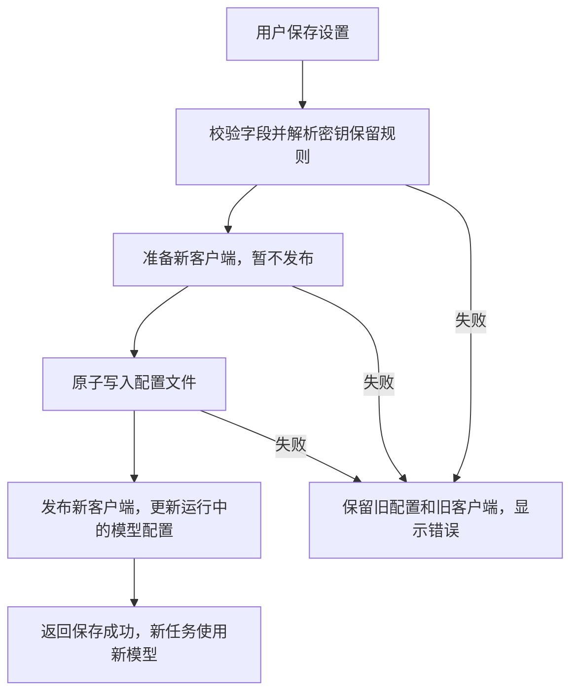

# StoryOS 模型免重启切换设计

状态：已确认，已实施。  
日期：2026-09-07  
关联方案：[设置面板改版设计](./settings-panel-redesign.md)

## 1. 结论与目标

模型配置可以做到保存后生效，无需重新启动 StoryOS。

建议采用以下规则：**保存成功后，新任务使用新模型；已经开始的任务继续使用启动时的模型，直到结束。**

例如，任务 A 正在用 DeepSeek 生成章节，此时将模型改为 OpenAI：任务 A 继续完成，随后启动的任务 B 使用 OpenAI。用户不必停止任务、关闭项目或重启应用。

本方案保留已完成的设置页布局、应用版本展示和配置表单，替换此前“模型修改后重启生效”的规则。

## 2. 为什么改版前需要重启

这源于改版前代码的运行时组织方式：

1. `StoryAgentService` 启动时读取配置，初始化工作区运行时。
2. `WorkspaceRuntimeManager` 用启动配置创建各工作区的模型对象。
3. `LangChainModelGateway` 在构造时创建并持有 `ChatOpenAI` 客户端。
4. 保存设置更新配置文件，但现有客户端仍持有原模型、地址和密钥。

因此，只写入配置文件不会改变已创建的客户端。改版前通过重启重新构造客户端来应用配置。

模型服务并不要求重启桌面应用；补充客户端更新机制即可解除这一限制。

## 3. 功能边界

| 设置项 | 拟定生效方式 |
| --- | --- |
| 模型服务商 | 保存成功后，新任务使用新配置 |
| 模型名称 | 保存成功后，新任务使用新配置 |
| Base URL | 保存成功后，新任务使用新配置 |
| API Key | 保存成功后，新任务使用新配置 |
| 工作区路径 | 仍需退出并重新打开应用后生效 |
| 应用版本号 | 保持只读展示 |

工作区路径涉及项目默认位置和本地存储，本次不做运行中的目录切换或数据迁移。仅修改模型时，页面不再显示重启提示。

仍使用一套应用级模型配置，不增加多模型配置列表、模型自动选择或任务类型分配功能。

## 4. 任务切换规则

### 生效边界

以主进程接受并创建任务的时刻为边界。任务创建时捕获模型客户端快照，必须早于事件记录、规划和其他异步等待，避免任务已显示“运行中”却被随后保存的新配置影响。

保存操作完成配置写入并发布新客户端之后创建的任务，使用新客户端。界面收到保存成功结果时，发布必须已经完成。

| 场景 | 行为 |
| --- | --- |
| 没有任务运行时保存 | 下一个任务立即使用新模型 |
| 正在流式输出时保存 | 当前输出继续使用原模型，不清空、不截断 |
| 正在规划、调用工具或等待审批时保存 | 该任务剩余步骤仍使用原模型 |
| 一个任务包含多次模型调用 | 规划、执行、审核、最终回答使用同一份任务快照 |
| 任务内部生成章节、起草技能或重试 | 继承所属任务的模型快照 |
| 独立启动的模型操作 | 在操作入口捕获快照，覆盖完整操作及重试 |
| 保存后切换到其他项目 | 该项目的新任务使用最新配置 |
| 连续保存 A → B → C | 已开始任务保持各自快照；后续任务使用最后一次成功保存的配置 |
| 保存失败 | 新任务和运行中任务都不受这次保存影响 |

同一会话的历史消息和已保存章节保持不变。保存配置不触发重新生成、任务重试或自动发送请求。

## 5. 运行时设计

### 应用级模型连接

增加一个职责单一的模型连接对象，由主进程的工作区运行时管理器持有。

它负责：

- 保存当前供新任务使用的客户端引用。
- 根据候选配置预先构造新客户端。
- 在配置持久化成功后发布新客户端。
- 为任务提供固定的客户端快照。

全局对话、当前项目和后续创建的项目运行时，共享这一连接来源。每个工作区继续保留自己的会话存储、检查点和数据库连接。

不重建整个 `DesktopController` 或工作区运行时，不关闭数据库、不清除订阅，也不改变已有任务的取消和审批机制。

### 任务级快照

建议通过 Node.js 的 `AsyncLocalStorage` 在任务入口绑定客户端，使同一任务中的异步步骤和嵌套调用读取同一客户端。没有所属任务的独立操作，也应在自身入口绑定快照。

模型网关创建一次模型调用时，优先使用任务快照；独立调用在开始时捕获当前客户端。流式操作必须覆盖整个异步迭代过程，不能在每个数据块到达时重新取最新配置。

旧客户端在相关任务结束后随引用释放。模型切换本身不主动取消或释放仍被任务使用的客户端。

实施时需验证异步上下文确实穿过规划、工具、章节生成及重试链路；不能只验证一次普通对话请求。

## 6. 保存流程与一致性

关键约束：

- 客户端准备阶段完成可能失败的本地构造工作，不影响当前连接。
- 持久化继续使用临时文件加原子替换，写入失败不能破坏原配置。
- 发布阶段仅执行预先准备好的同步引用更新，不进行网络请求或异步初始化。
- 配置写入与客户端发布之间不插入异步等待，避免新任务观察到不一致状态。
- 保存请求由主进程串行处理；初始化或关闭期间拒绝修改，并提示稍后重试。
- 模型运行配置和环境变量同步更新；工作区路径的运行值保留到重启。
- 重复保存相同配置无需替换客户端。

如果进程恰好在文件写入后、客户端发布前退出，下次启动读取已保存配置。当前进程尚未返回保存成功，不应提前显示“已生效”。

### 密钥处理

沿用现有表单规则：相同服务商与接口地址下，密钥留空可复用；更换服务商或地址需要提供密钥。

已保存密钥不回传前端，不出现在状态接口、日志或错误详情中。运行中任务仍可持有原客户端所需的密钥，直到任务结束。

## 7. 错误处理

| 错误 | 处理 |
| --- | --- |
| 模型名为空、URL 非法、缺少密钥 | 字段内显示错误，不写文件、不切换 |
| 新客户端无法完成本地构造 | 返回可读错误，旧模型继续可用 |
| 配置文件写入失败 | 不发布新客户端，表单保留输入以便重试 |
| 新模型首次调用出现鉴权错误、超时或模型不存在 | 按现有任务失败流程展示；用户可在设置中修正 |
| 原模型在切换后仍有任务失败 | 仅按该任务自己的错误处理，不改变最新配置 |

保存成功代表“配置已写入并成为后续任务的模型配置”，不代表远程接口已经验证可用。新客户端构造本身不验证账号权限或模型可用性。

本期不增加远程连接测试，不自动回退旧模型，也不自动重跑失败任务，以免模型选择和用户保存的配置不一致。

## 8. 设置页反馈

页面布局保持不变，仅调整模型配置状态和提示文案。

| 场景 | 文案 |
| --- | --- |
| 模型表单底部说明 | 模型配置保存后立即生效，正在执行的任务不受影响。 |
| 保存中 | 正在保存… |
| 仅修改模型，保存成功 | 模型配置已生效，后续任务将使用新配置。 |
| 同时修改模型与工作区路径 | 模型配置已生效。工作区路径将在重启 StoryOS 后生效。 |
| 仅工作区路径等待重启 | 状态明确显示“工作区路径待重启生效” |
| 首次配置完成 | 配置已保存，可以开始使用。 |

已有“已配置”状态继续保留，不改成未经验证的“连接成功”。保存后仍停留在设置页，撤销修改和离开提醒继续按已有规则工作。

状态接口中的重启标记只用于工作区路径；前端不可再根据该标记提示模型需要重启。若保留 `restartRequired` 字段，应在接口注释中明确新的语义。

## 9. 预计实现范围

| 文件或模块 | 调整内容 |
| --- | --- |
| 模型连接模块（新增） | 管理当前客户端、候选客户端和任务快照 |
| `LangChainModelGateway.ts` | 从共享连接和任务快照中获取客户端，保留现有调用与流式接口 |
| `WorkspaceRuntimeManager.ts` | 为各工作区提供同一连接来源，并接入配置发布 |
| `AgentApplication.ts` | 在接受任务时建立快照边界，覆盖任务完整生命周期 |
| 独立模型操作入口 | 核查技能起草、章节生成及重试是否具有正确快照边界 |
| `DesktopController.ts` | 转发模型配置准备和发布能力 |
| `StoryAgentService.ts` | 协调校验、持久化、发布和状态返回 |
| `ConfigurationPanel.tsx` | 替换重启提示，区分模型生效与工作区路径待重启 |
| `previewAgentApi.ts` | 与真实保存状态保持一致 |

不修改书籍导入导出功能、不新增数据库迁移、不改变已保存消息格式。

## 10. 验收标准

- 修改服务商、模型名称、地址或密钥后，无需重启即可被新任务使用。
- 全局对话、已有项目以及保存后创建的项目都使用最新配置。
- 保存前已开始的任务，在规划、流式输出、工具调用、审批等待和重试后仍使用原客户端。
- 同一时刻运行的新旧任务互不串用客户端、密钥或会话存储。
- 保存失败不会改变运行中的模型；输入与原配置保留。
- 快速连续保存后，后续任务使用最后一次成功发布的配置。
- 会话历史、章节内容、任务取消和审批功能保持正常。
- 仅修改模型时不出现重启提示；修改工作区路径时明确提示对应范围。
- 保存后重新打开设置，状态与实际运行配置一致；重启后配置正确恢复。

验证应包括模型连接单元测试、使用可控模拟网关的任务并发测试、工作区集成测试及设置页交互检查。测试不依赖用户真实密钥。

## 11. 审阅重点

本方案推荐确认的核心规则是：**新任务立即使用新模型，运行中任务保持原模型；仅工作区路径继续要求重启。**

本方案已获确认并实施。新增 `LiveModelConnection` 管理客户端快照，任务入口、独立调用、章节重试和流式迭代均已接入。

验证记录：8 个测试文件共 34 项测试通过，包括本地模拟模型接口的并发与流式验证、章节重试、工作区集成、配置失败回退和任务生命周期回归。设置页已验证模型修改立即生效与工作区路径待重启的独立提示。
