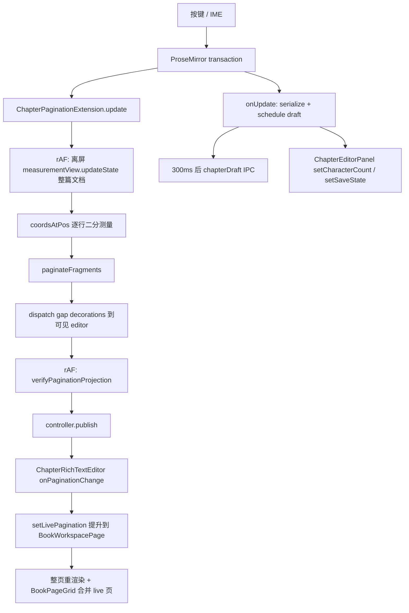
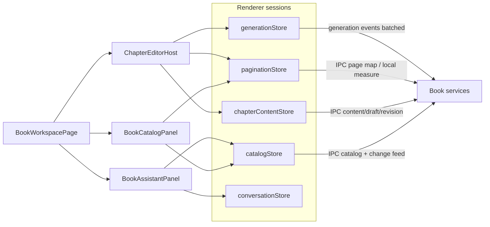

# 书籍工作区性能优化与架构重设计

> 文档状态：诊断与目标架构；实施以解决方案为准
> 生成日期：2026-09-20
> 任务分类：现有功能的性能诊断 + 架构重设计；本文不包含代码实施
> 范围：`/projects/:projectId/book` 书籍工作区（目录、分页编辑器、草稿/修订持久化、AI 助手、章节生成预览）
> 不包含：书架 UI、3D 阅读器体验、大纲叙事模块、实例切换、导入导出业务本身
> 相关文档：
> - **实施方案（编码基准）：`docs/todo/performance/book-workspace-performance-solution.md`**
> - **当前执行决策：`docs/todo/performance/book-workspace-performance-execution-plan.md`**（覆盖本文关于 token/delta 流式呈现的早期建议）
> - 存储边界：`docs/architecture/database-vnext/README.md`
> - 阅读器剩余画质验收：`docs/todo/open-items.md`
> - 大纲（独立模块，不可与目录混用）：`docs/todo/outline-module-design-analysis.md`

## 1. 结论先行

书籍工作区已经具备正确的产品骨架：三栏布局、按需加载章节正文、离屏测量的所见即所得分页、草稿与修订双轨保存、Agent 工具改书、流式章节生成。存储层也已经完成「书籍库 / 项目库 / 应用库」拆分，`getBookWorkspace` **不携带全书正文**。

当前的主要矛盾不是「SQLite 查不出目录」，而是 **高频交互路径被低频结构状态绑在一起**：

1. **输入热路径**上，每次文档变更都会对整章做离屏 DOM 测量、gap decoration 回写，再验证投影。长章写作时主线程成本随字数线性上升。
2. **AI 流式路径**上，每个 `chapter_generation_delta` 更新 `useAgentWorkspace` 的整包 `state`，经 `WorkspaceLayout` 的 Outlet 把目录、助手、页头一起重渲染，再把预览写进编辑器并触发新一轮全章分页。
3. **变更同步路径**上，任意 `book_changed` 都全量 reload 目录快照 + 项目导航；结构 CRUD 的 IPC 也一律返回完整 `BookWorkspaceSnapshot`。
4. **页面网格**用第二套 TipTap 实例逐章后台测量，且默认假设章节正文已在 renderer 内存中；这与「目录快照不含正文」的契约冲突。
5. **页面编排**集中在 `BookWorkspacePage`：加载、导航、布局、持久化回调、生成预览、编辑器工具桥、mutation 同步、对话适配都在同一层提升状态。对话子系统已经用 Zustand + 帧批处理隔离流式更新，书籍域没有跟进。

推荐目标不是重写编辑器或推翻 `book.sqlite`，而是把书籍工作区拆成四条独立变化的运行时边界，并让事件、状态、测量都按频率分层：

```text
CatalogSession     卷/章目录、元数据、字数、修订号     低频
ContentSession     当前章正文、草稿、乐观锁            中频
PaginationSession  页映射、测量、可见页                高频但可合并
GenerationSession  章节生成流式预览                    极高频，必须局部
```

对话继续复用现有 `conversationStore`。Agent 运行时继续负责工具与 run，但不再让书籍编辑热路径订阅整包 Agent state。本文后续关于 delta 的内容是诊断时现状；实现已改为普通对话完整 block 一次提交、章节正文按页发布。

分阶段优先级：

| 阶段 | 目标 | 预期收益 |
| --- | --- | --- |
| P0 隔离渲染 | 生成/对话/分页更新不再整页重渲染 | AI 流式与写作并行时 UI 不再被拖死 |
| P1 合并分页测量 | 输入时 coalescing + 脏区测量 | 长章打字延迟下降一个数量级 |
| P2 增量同步 | mutation/delta IPC，停止盲 reload | Agent 改一个标题不再重拉全书目录 |
| P3 页映射持久化 | 目录页网格读投影，不再现场造编辑器 | 打开「页面」视图不再卡顿，也不再依赖未加载正文 |
| P4 按需虚拟化 | 只保证可见页附近的 DOM 成本可控 | 万字以上章节仍可流畅编辑 |

未实测前，下文中的时长数字都是 **实施预算**，不能当作当前版本已经达标。

---

## 2. 产品场景与性能预算

书籍工作区的用户任务可以分成四类。优化必须按任务设预算，不能只优化平均 FPS。

### 2.1 任务

| 任务 | 用户动作 | 当前关键路径 | 可感知失败 |
| --- | --- | --- | --- |
| 打开书 | 从项目进入工作区 | `getBookWorkspace` → 渲染目录 | 白屏、整树卡住 |
| 打开章 | 点目录中的一章 | `getBookChapterContent` → 重建 TipTap + 首次分页 | 等待过长、先闪错页数 |
| 持续写作 | 连续输入、换行、粘贴 | ProseMirror tx → 离屏测量 → decoration → 草稿 IPC | 按键延迟、掉帧、IME 异常 |
| 浏览页网格 | 切换到「页面」视图 | 逐章隐藏 Editor 测量 | 骨架屏很久、空白页、运行时异常 |
| 问 AI | 发送助手消息、工具改文 | flush 保存 → reload → 对话事件 | 发送前停顿、编辑器被抢焦点 |
| 生成章节 | 流式续写/重写 | delta 事件 → 预览 setContent → 再分页 | 生成时整个工作区卡顿 |
| 外部变更 | Agent/另一操作改结构 | `book_changed` → 全量 reload | 光标跳动、未保存草稿被覆盖风险 |

### 2.2 建议预算

以 Windows 桌面、单项目单书、当前章 8,000 汉字、全书 80 章为「典型负荷」；以当前章 25,000 汉字、全书 200 章为「压力负荷」。

| 指标 | 典型负荷 | 压力负荷 | 测量方式 |
| --- | --- | --- | --- |
| 工作区目录首屏 | ≤ 150ms | ≤ 300ms | 路由 commit → 目录节点可见 |
| 打开已缓存章节 | ≤ 120ms | ≤ 250ms | 点击到可输入 |
| 打开未缓存章节 | ≤ 250ms | ≤ 500ms | 含 IPC + 首次分页 ready |
| 按键到字符可见 | ≤ 16ms | ≤ 33ms | `keydown` 到下一帧 |
| 分页投影稳定 | 停止输入后 ≤ 50ms | ≤ 120ms | 最后一次 docChanged → snapshot.status=`ready` |
| 草稿 IPC | 停顿 300ms 后 ≤ 40ms | ≤ 80ms | invoke round-trip |
| 修订保存 | blur/5s 后 ≤ 80ms | ≤ 160ms | 单次 saveRevision |
| 生成 delta 更新 | 不阻塞输入；目录/助手不因 delta 重渲染 | 同左 | React profiler + 交互 |
| 打开页面视图 | 当前章立即可见；其余章逐步补齐 | 不创建 N 个同步 Editor | 首屏 ≤ 100ms |
| `book_changed` 同步 | 只 patch 受影响节点 | 同左 | 不出现全书章节数组替换 |

这些预算用于阶段验收。若 P1 之后长章仍无法达到「按键 16ms」，再启动 P4 虚拟化，而不是一开始就拆 ProseMirror 文档模型。

---

## 3. 当前架构事实

### 3.1 运行时分层

```text
Renderer  BookWorkspacePage
    │  IPC invoke / agent:event
    ▼
DesktopController
    ├── BookWorkspaceApplication     书籍工作区用例
    ├── Conversation / Agent         对话与工具
    └── ChapterGenerationService     流式生成
            │
            ▼
WorkspaceRuntimeManager.resolve({ kind:"project" })
    ├── NovelApplication  → ProjectBookNovelStore → BookRuntimeManager → book.sqlite
    ├── AgentApplication  → project.sqlite
    └── BookCatalogProjection → application.sqlite
```

存储边界已经正确：

| 数据库 | 位置 | 书籍工作区用途 |
| --- | --- | --- |
| `application.sqlite` | 实例根 | 书册登记、目录投影、项目绑定 |
| `book.sqlite` | `library/books/{bookId}/` | 卷章、不可变修订、设备草稿、`book_changes` |
| `project.sqlite` | 项目 `.storyos` | 对话、run、文本索引（文件型，不是章节 FTS） |

`getBookWorkspace` 只返回书、卷、章节摘要（含 `characterCount` / `revisionNumber`），`contentLoaded: false`。正文走 `getBookChapterContent`。这是应保留的读模型。

### 3.2 前端组件与状态所有权

```text
WorkspaceLayout
  useAgentWorkspace()                    全局 Agent state 整包
  └── Outlet context
        └── BookWorkspacePage            God page
              useBookWorkspace           目录快照 + CRUD + 正文缓存
              useBookNavigation          当前章/页 + livePagination
              useBookWorkspaceLayout     面板宽与可见性
              useChapterGenerationPreview
              useBookEditorToolHandler
              useBookMutationSync
              useBookConversations
              ├── BookCatalogPanel
              │     └── BookPageGrid → useBookPagination
              ├── ChapterEditorPanel
              │     └── ChapterRichTextEditor (key=chapter.id)
              │           ├── ChapterSaveSession
              │           ├── ChapterPaginationController
              │           └── PaginatedEditorSurface  全章 EditorContent
              └── BookAssistantPanel → conversationStore
```

状态提升情况：

| 状态 | 所有者 | 更新频率 | 当前传播范围 |
| --- | --- | --- | --- |
| 项目/run/生成/bookChangeVersions | `useAgentWorkspace` 单 blob | 生成时每 token | 整个 WorkspaceLayout 子树 |
| 书籍快照 | `useBookWorkspace` | 加载、保存、CRUD、reload | 整页 |
| livePagination | `useBookNavigation` | 每次分页 settle | 整页 → 目录页网格 |
| 字数/保存态 | `ChapterEditorPanel` | 每次按键 | 编辑器面板 |
| 编辑器 live context | `editorContextRef` | 每次选区 | **已隔离，不触发渲染** |
| 分页 snapshot | `ChapterPaginationController` | 每次测量 | **已用 useSyncExternalStore 局部订阅** |
| 对话节点 | `conversationStore` | 流式 delta 按帧批处理 | 对话组件按 key 订阅 |

已经做对的隔离：

- `BookWorkspacePage` 用 ref 保存编辑器上下文，避免光标移动刷新目录和助手。
- 分页控制器是独立的 external store。
- 对话事件有 `ConversationEventBatcher`，视觉 delta 合并到同一帧。
- `applySnapshot` 在 revision 未变时保留已加载正文，避免 mutation reload 后重复拉章。

这些局部优化证明团队已经意识到热路径问题，但没有把同一原则推广到 Agent state、生成预览和 livePagination。

### 3.3 输入热路径（当前）



关键实现：

- `ChapterPaginationExtension` 在 `docChanged` 时立刻 `schedule()`，没有 debounce。
- 离屏副本每次 `EditorState.create({ doc })` 后对全文做 `coordsAtPos`。测量复杂度约等于「块数 × 行数 × 二分次数」，全部发生在主线程。
- 可见编辑器渲染 **整章** `EditorContent`，分页只是 CSS 纸张壳 + gap decoration + 横向 `translateY`。不是虚拟列表。
- `layoutKey` 含 `doc.content.size` 和 generation，因此几乎每次 settle 都会 `setLivePagination`。

### 3.4 读写与事件路径（当前）

结构变更 IPC（创建/更新/删除书、卷、章）一律返回完整 `BookWorkspaceSnapshot`。

正文路径：

1. 停顿 300ms → `chapterDraft` 写 `chapter_drafts`
2. 停顿 5s 或 blur/`Ctrl+S`/离开设置页 → 先再写一次草稿，再 `saveBookChapterContent` → `saveRevision`
3. `saveRevision` 有 contentHash 短路，内容未变可避免无意义 INSERT
4. 每次 `saveRevision` 经 `CatalogUpdatingBookStore` **同步** `refreshCatalog`

外部变更：

```text
NovelApplication.emitMutation
  → publishScopedEvent(book_changed)
    → useAgentWorkspace.bookChangeVersions[projectId]++
      → useBookMutationSync
        → Promise.all(reloadWorkspace, reloadNavigation)
```

草稿保存 **不** 发 mutation。`book_changes` 表已由 trigger 写入 `books/volumes/chapters`，但工作区同步完全没用它。

章节生成：

```text
delta/reasoning 事件（含完整累计文本在 renderer 端拼接）
  → useAgentWorkspace.setChapterGenerations
    → BookWorkspacePage 重渲染
      → useChapterGenerationPreview 重新 serialize
        → applyExternalContent
          → 再次全章分页
completed 事件携带完整 Tiptap JSON
  → saveRevision 再发一次 book_changed
    → 全量 reload
```

对话子系统已经把 `assistant.block.delta` 按动画帧批处理；章节生成 delta 没有同等待遇。

### 3.5 Agent 工具路径（当前）

| 工具 | 访问模式 | 问题 |
| --- | --- | --- |
| `get_book_outline` | 列表卷章，不含正文 | 合理 |
| `read_book_chapter` | 单章 `getCurrentRevision` | 合理 |
| `search_book_chapters` | 遍历全部章节，每章加载 `document_json` 再抽纯文本 | N+1 + 大 JSON |
| `get_book_statistics` | 同样每章 `getCurrentRevision` | 摘要查询已能提供字数，这里多余 |
| `generate/replace/rewrite` | `saveRevision(origin: agent)` | 正确写库，但会触发全量 UI 同步 |
| 编辑器工具 | IPC 到 renderer `ChapterEditorBridge` | 依赖可见编辑器；AI 专注模式不可用 |

`revision_documents.plain_text` 已经存在，搜索和统计没有走它。

---

## 4. 问题诊断：证据与推断

本节把代码事实和推断分开。推断项必须在 P0 开始前用 Profiler / 计时日志验证。

### 4.1 P0：输入时整章离屏测量

**证据**

- `ChapterPaginationExtension` 的 plugin `update`：`nextView.state.doc !== previousState.doc` 就 `schedule()`。
- `run()` 对离屏 view 执行 `paginateEditorView`，内部 `domPaginationMeasurer` 对每个 textblock 按行 `coordsAtPos` 二分。
- 可见层始终挂载完整 `EditorContent`。
- 没有按变更范围、视口或时间窗口合并测量。

**推断**

长章（数千到数万字）下，一次按键可能触发：一次全文 layout、多次几何查询、一次 decoration 事务、一次验证 rAF。这是写作卡顿最可能的主因。具体毫秒数需在典型/压力负荷下打点。

**为何不能直接删掉测量**

工作区的产品形态是「纸张分页的所见即所得编辑」，阅读器和页网格共用 `book-content` 的页规格。放弃几何测量会破坏页边界、页网格和阅读器页码一致性。优化方向是 **少测、局部测、异步测**，不是改成纯字数估页。

### 4.2 P0：AI 生成把整页变成流式订阅者

**证据**

- `useAgentWorkspace` 每次事件 `setChapterGenerations`，再组装新的 `state` 对象。
- `WorkspaceLayout` 把整个 hook 返回值放进 Outlet context。
- `BookWorkspacePage` 用 `useWorkspaceOutlet().state` 计算 `currentChapterGeneration`。
- `useChapterGenerationPreview` 每个 streaming generation 都 `plainTextToTiptapDocument` + `serializeTiptapDocument`。
- 预览写入编辑器后 `docChanged`，分页扩展再次全量测量。
- 对话 delta 已有 `ConversationEventBatcher`；生成 delta 没有。

**推断**

生成速度越快，主线程越忙：React 协调 + JSON 编解码 + 分页测量叠在一起。目录搜索框、助手历史、页头连接状态都会跟着刷新，尽管它们不消费 `generatedText`。

### 4.3 P1：livePagination 状态提升与后台第二套分页引擎

**证据**

- `onPaginationChange` 写在 `BookWorkspacePage`，调用 `setLivePagination`。
- `BookPageGrid` 无条件 `useBookPagination(orderedChapters, livePagination)`。
- `useBookPagination` 对每章 `document.createElement` + `new Editor` + 全量测量 + `destroy`。
- 缓存键是 `id + revisionId + revisionNumber + layout + content.length + content hash`。
- 目录快照里的章节 **没有** `content`；`createChapterPaginationCacheKey` 直接读 `chapter.content.length`。

**推断 / 契约冲突**

页面视图在「只打开过当前章」时，要么因 `content` 缺失抛错，要么把未加载章节当成空文档排版。后台测量既昂贵，又无法在现有读模型上得到正确页映射。这是架构错误，不只是慢。

即使用户打开过部分章节，`chapters` 数组引用变化（mutation reload）也会重启 effect；缓存可跳过未变章，但仍会把主线程切成 N 段 `new Editor`。

### 4.4 P1：粗粒度 Agent 状态与 God Page

**证据**

- `ChatWorkspaceState` 同时包含 projects、threads、runs、approvals、`bookChangeVersions`、`chapterGenerations`。
- `book-workspace` 组件树几乎没有 `React.memo`；页面层大量内联 lambda。
- `ChapterEditorPanel` 每键 `setCharacterCount` / `setSaveState`。
- `BookWorkspacePage` 同时编排 8 个以上 hook 与全部 CRUD。

**推断**

即使分页测量优化完成，生成和 run 事件仍会让页面协调成本保持很高。God page 也让后续功能（大纲、人物、一致性检查）只能继续往同一文件塞。

### 4.5 P1：盲 reload 与双 IPC 保存

**证据**

- `useBookMutationSync` 对任意 `changeVersion` 执行 `reloadWorkspace + reloadNavigation`，不看 `mutation.kind`。
- `BookWorkspaceApplication` 的结构 API 都 `createBookWorkspaceSnapshot`。
- `saveChapterContent`：`writeDraft` 后再 `saveBookChapterContent`。
- `useBookConversations.sendAssistantMessage`：即使刚 flush 过，仍 `reloadBookWorkspace` + `loadChapter`。
- `chapter_generation_completed` 事件带完整 `content`；随后 `saveRevision` 再发 `book_changed`。

**推断**

目录摘要 JOIN 对几百章仍可接受，但 IPC 序列化、React 替换章节数组、导航树刷新会在 Agent 密集改书时造成抖动。发送每条助手消息前的强制 reload 是可测的交互延迟。

### 4.6 P2：Agent 搜索/统计 N+1

**证据**

- `search_book_chapters` / `get_book_statistics` 对 `listChapters` 的每个 id 调用 `getCurrentRevision`。
- `listChapterSummaries` 已经 JOIN 出 `character_count` / `revision_number`。
- `revision_documents.plain_text` 已存纯文本。

**推断**

大书上，一次搜索会把所有章节 JSON 读进主进程内存。这会卡住 IPC 线程，表现为「AI 一搜全书，编辑器也停」。不是工作区打开时的问题，但是同一条书籍数据面。

### 4.7 P2：写路径同步刷新书架投影

**证据**

- `CatalogUpdatingBookStore.saveRevision/createChapter/...` 每次成功后立刻 `refresh()`。
- `BookRuntimeManager.refreshCatalog` 在持有书籍连接的主进程路径上执行。
- 草稿 `saveDraft` 不刷新，修订保存刷新。

**推断**

自动保存 5s 一次修订时，用户感知可能不明显；Agent 连续 `saveRevision` 或批量改结构时，投影刷新会拉长每次 IPC。书架最终一致即可，不必与修订写入同事务同步。

### 4.8 已有但未用的能力

这些是重设计应优先消费的存量，而不是新造平行系统：

| 已有能力 | 位置 | 应用方式 |
| --- | --- | --- |
| 目录摘要查询 | `SqliteNovelStore.listChapterSummaries` | 保持为 Catalog 读模型 |
| 正文按需加载 | `getBookChapterContent` | 保持；增加 revision 条件请求 |
| 修订 contentHash 短路 | `NovelApplication.saveRevision` | 保持 |
| `book_changes` | `bookSchema.ts` trigger | 作为增量 feed，替代盲 reload |
| `plain_text` | `revision_documents` | 搜索/统计/页预览文本 |
| `conversationStore` + 帧批处理 | renderer conversation | 生成 session 与书籍 store 的模板 |
| `ChapterPaginationController` | pagination extension | 升为 PaginationSession 的内核 |
| `editorContextRef` | BookWorkspacePage | 继续：高频编辑状态不进 React |
| 阅读器与工作区共用页规格 | `book-content/paginationModel.ts` | 页映射投影必须使用同一 `CHAPTER_PAGE_SPEC` |

---

## 5. 架构问题（不只是慢）

性能问题来自边界错误。如果只加 `React.memo` 或把测量 delay 50ms，P0 能缓解，但页面网格、增量同步和后续大纲模块仍会卡在同一套 God page 上。

### 5.1 一条「工作区快照」承担了四种读模型

`BookWorkspaceChapterDto` 同时表示：

- 目录行（id、标题、状态、字数）
- 正文负载（可选 `content`）
- 加载标记（`contentLoaded`）
- 草稿（`draft`）

页面网格还把「是否有内存正文」当成「是否可分页」的隐含条件。结果是：

- 目录 reload 必须小心地 merge 已加载正文（`applySnapshot` 的缓存逻辑）。
- 未加载章节没有合法的页映射。
- 类型上 `content?: string`，运行时页网格却当它一定存在。

### 5.2 高频会话状态放在低频页面上

`livePagination`、`chapterGenerations`、`saveState`、`characterCount` 的消费者都很窄，却放在 Page / Layout。`ChapterPaginationController` 证明局部 store 可行，只是没有成为默认结构。

### 5.3 事件语义不足

`book_changed` 对 renderer 只是计数器。客户端无法区分：

- 改了书名
- 新增一章
- 当前章保存了修订
- Agent 改了另一章正文

于是只能全量拉。生成完成则用 **第三条通道** 再带一遍全文。同一章内容在 delta 拼接、completed.content、reload 后的 `getBookChapterContent` 之间存在三份真相。

### 5.4 分页有两个实现，没有一个投影

| 轨 | 用途 | 输入 | 输出 |
| --- | --- | --- | --- |
| 实时轨 | 当前编辑章的纸张 UI | 可见/离屏 EditorView | snapshot + decorations |
| 后台轨 | 目录页网格 | 再造 TipTap | `BookPageSlice[]` |

两者都调用 `paginateEditorView`，但不共享测量服务，也不把结果写回 `book.sqlite`。阅读器又在 `features/reader` 走自己的分页入口。页码作为书籍资产没有一等存储。

### 5.5 书籍 IPC 与项目 Agent 运行时耦合

`BookWorkspaceApplication` 每个调用都 `runtime.resolve({ kind:"project", projectId })`。改标题、存草稿都可能卷入项目激活/切换队列。书籍 lease 已经存在于 `BookRuntimeManager`，工作区 API 仍绕路项目运行时。

`getBookWorkspace` 注册在 Conversation IPC 控制器，CRUD 在 Book 控制器，边界按历史文件划分，不按领域。

### 5.6 编辑器工具桥把主进程写路径绑在窗口 UI 上

Agent 的精细编辑依赖 renderer 当前打开的 TipTap。AI 专注模式、未打开目标章、或窗口在后台时，工具只能 fallback 成整章替换。这不是单纯性能，但会迫使生成预览和 live editor 必须同时存在，放大 4.2 的成本。

---

## 6. 目标架构

### 6.1 设计原则

1. **按变化频率拆会话，不按 UI 栏拆仓库。** 左栏目录、中间编辑器、右侧助手可以继续是三个面板，但它们不得共享一个 React state blob。
2. **读模型分离。** 目录、正文、页映射、生成预览各自有明确 DTO；禁止再用可选字段把正文塞进目录行。
3. **写模型返回 delta。** 命令成功后返回 mutation + 受影响实体；客户端 patch，不替换整棵树。
4. **高频更新不进 Layout。** 生成 delta、分页 settle、字数变化最多打到拥有它们的 session；对话已遵守，生成必须遵守。
5. **测量是服务。** 实时编辑、页网格、阅读器消费同一套页规格和同一份页映射投影；禁止第三个 TipTap 为了缩略图而启动。
6. **沿用现有先例。** renderer 用 Zustand vanilla store + selector（对标 `conversationStore`）；主进程继续 `src/main/story/application/books`，不新建平行「Workspace2」包。
7. **契约严格。** 目录行没有正文就不准分页；缺页映射就显示未知，不拿空文档冒充一页。

### 6.2 目标运行时

```text
Renderer
├── catalogStore          书/卷/章摘要、加载/错误、结构命令
├── chapterContentStore   当前章（及少量 LRU）正文、草稿版本、保存态
├── paginationStore       当前章 snapshot、全书页映射投影、测量状态
├── generationStore       当前 project 的章节生成会话（帧批处理）
└── conversationStore     已有，保持

BookWorkspacePage         只做面板组合、快捷键、路由参数
ChapterEditorHost         拥有 TipTap、SaveSession、PaginationController
BookCatalogPanel          只订目录 + 页映射
BookAssistantPanel        只订对话 + 少量目录标题

Main
├── BookCatalogService        结构读写 + BookChangeFeed
├── ChapterContentService     正文/草稿/修订
├── ChapterPaginationProjection 页映射持久化与失效
├── BookSearchService         基于 plain_text / FTS
└── ChapterGenerationService  完成事件不再携带全文
```



### 6.3 模块放置

不新增平行顶层目录。建议在现有位置内拆文件：

| 职责 | 放置 |
| --- | --- |
| 目录/正文/生成 store | `src/renderer/features/book-workspace/store/` |
| 分页测量服务（从 plugin 中抽出） | `src/renderer/features/book-workspace/pagination/measurement/`，算法继续留在 `features/book-content` |
| 页映射 DTO | `src/shared/contracts/books/` |
| Catalog/Content/Search/Feed | `src/main/story/application/books/` 下按服务拆分，`BookWorkspaceApplication` 改为 facade 或逐步消失 |
| 书籍 IPC | 全部归 `BookIpcController`；Conversation 控制器不再注册 `getBookWorkspace` |
| 生成事件 | 保持独立 event type，但 completed 瘦身；renderer 由 `generationStore` 接收，不进 `useAgentWorkspace.state` |

`useAgentWorkspace` 最终只保留项目、对话 scope、run、审批。`bookChangeVersions` 和 `chapterGenerations` 迁出。

### 6.4 页面组合根的目标形态

`BookWorkspacePage` 应变成：

- 读 `projectId`
- 挂载四个 session 的 provider/hook
- 处理目录/助手可见性与快捷键
- 把稳定的命令函数传给子面板

不应再：

- 计算 `chapterGroups` 以外的领域派生（可下放到 catalogStore）
- 持有 `livePagination`
- 订阅 `state.chapterGenerations` 整表
- 内联所有 CRUD 后立刻 `loadProjectNavigation`

导航身份建议进入 URL，与 `?conversation=` 对称：

```text
/projects/:projectId/book
/projects/:projectId/book/chapters/:chapterId
/projects/:projectId/book/chapters/:chapterId?page=3
/projects/:projectId/book/chapters/:chapterId?conversation=:threadId
```

刷新后应能回到章，而不是只回到书籍概览。页码是软状态：分页投影未就绪时允许先打开章再对齐页。

---

## 7. 读模型与写模型重设计

### 7.1 读模型

```ts
// 示意，实施时以 shared contracts 为准

type BookCatalogSnapshot = {
  state: "ready";
  book: NovelDto;
  volumes: readonly VolumeDto[];
  chapters: readonly BookCatalogChapterDto[];
  changeSequence: number; // 对应 book_changes.local_sequence
};

type BookCatalogChapterDto = {
  id: string;
  volumeId: string | null;
  title: string;
  status: ChapterStatus;
  sortOrder: number;
  currentRevisionId: string | null;
  rowVersion: number;
  characterCount: number;
  revisionNumber: number | null;
  updatedAt: string;
  // 明确禁止 content / draft / contentLoaded
};

type ChapterContentDto = {
  chapterId: string;
  revisionId: string | null;
  revisionNumber: number | null;
  rowVersion: number;
  content: string;          // Tiptap JSON
  draft: ChapterDraft | null;
  characterCount: number;
};

type ChapterPageMapDto = {
  chapterId: string;
  revisionId: string | null;
  layoutVersion: number;
  pages: readonly {
    chapterPageNumber: number;
    from: number;
    to: number;
    previewText: string;
  }[];
};
```

规则：

- `getBookWorkspace` 改名为语义上的 catalog 读取，或保留名称但返回 `BookCatalogSnapshot`。
- `getBookChapterContent` 保持按需；允许 `expectedRevisionId`，未变化时返回 `notModified`。
- 页映射是独立读取，缺省表示「未知」，UI 显示占位，不伪造 1 页。

### 7.2 写模型

| 命令 | 返回 | 客户端 |
| --- | --- | --- |
| 创建/重命名/删除卷章 | `{ mutation, catalogDelta, changeSequence }` | patch catalogStore |
| 更新书资料 | 同上 | patch book 字段 |
| `saveDraft` | `{ chapterId, draftVersion, updatedAt }` | 更新 content session，不碰目录树 |
| `saveRevision` | `{ chapterSummary, revisionId, pageMapInvalidated }` | patch 该章摘要；失效页映射 |
| 生成完成 | `{ chapterId, revisionId, revisionNumber, characterCount }` | content session 按 id 拉取正文 |

删除「结构命令返回全书 chapters 数组」。删除「completed 事件带 content」。

### 7.3 变更 feed

利用已有 `book_changes`：

1. 客户端保存 `changeSequence`。
2. `book_changed` 事件带上 `projectId/bookId/sequence/mutation.kind/entityId`。
3. 若 `sequence === local + 1`，按 payload patch。
4. 若出现缺口，再拉 `getBookChanges({ after })` 或一次性 resnapshot catalog。
5. 当前章若 `entityId` 匹配且 kind 为 `chapter_revision_saved`，只在「无本地未保存更改」时刷新正文。

草稿若产品定义为单设备本地，就继续不进 feed；若未来多窗口，再增加显式 `chapter_draft_changed`，不要把草稿 silently 塞进 `book_changed`。

### 7.4 保存路径

短期（P2）：保留 300ms 草稿 + 5s 修订，但 `saveChapterContent` 改为服务端一次事务（内部仍可先 upsert draft 再 commit revision），renderer 只 invoke 一次。

中期：评估「草稿仅内存 + Indexed 不落库，修订才落 `book.sqlite`」。这会改变崩溃恢复，需要单独产品确认，不在 P0/P1 做。

发送助手消息前：只 `flushPending()`，不要无条件 `reloadWorkspace + loadChapter`。上下文从 content session 与 editor ref 读取。

---

## 8. 分页与测量重设计

分页是工作区最大的 CPU 成本，也是与阅读器共享的领域。重设计分三层，必须按层实施，不能跳到「虚拟化」当第一刀。

### 8.1 测量服务

从 `ChapterPaginationExtension` 抽出 `ChapterPaginationMeasurer`：

```text
输入：ProseMirror Node + 页规格 + 可选脏范围
输出：ChapterPaginationSnapshot
约束：同一时刻一章只有一次 in-flight 测量；新请求合并为 latest-wins
```

Plugin 只负责：

- 在 docChanged / resize / fonts.ready 时请求测量
- 把返回的 gap decorations 应用到可见 view
- 在 IME `composing` 期间不测量

合并策略：

1. **rAF coalescing**：同一帧多次 docChanged 只测最后一次（现有 generation 计数已接近这个，但测量本身没有跳过中间帧的文档）。
2. **输入窗口**：连续按键期间发布 `status: pending` 的工作投影（已有 `publishWorkingProjection`），完整测量放到空闲：`requestIdleCallback` 或 32–48ms debounce。纸张壳高度可以按上次页数估算，避免视觉塌缩。
3. **脏区**：记录变更的文档区间。若只影响当前页及后续页，测量从脏页起点的 fragment 开始，复用前面页的 `from/to/height`。粘贴、全文替换、样式影响行宽时回退全文测量。
4. **流式生成**：保持现有 `setContentStreaming(true)` 跳过 verification 累计；测量降为「每 N 个 delta 或每 100ms 一次」，完成后强制全文测量。

可见编辑器在测量未完成时继续使用上一份稳定 gap。这与当前注释中的意图一致，只是要把「每次按键都测完」改成「按键先画字，空闲再重排」。

### 8.2 禁止第三套 TipTap

删除 `useBookPagination` 里为每章 `new Editor` 的路径。

页网格改为：

1. 当前正在编辑的章：订阅 paginationStore 的 live snapshot（previewText 在测量线程/服务里一并切出）。
2. 其他章：读 `ChapterPageMapDto`。没有投影则显示「未排版」，点击章时才加载正文并在测量服务中排一次，然后写回投影。
3. 预览文本来自投影字段，不再为了 4px 缩略图启动编辑器。

全书页码 `globalPageNumber` 在 catalog + page map 上计算。某章缺失映射时，其后章节的全局页码标记为未知，而不是把后续章提前编号。这与阅读器「分页未完成时如实显示未知」一致。

### 8.3 页映射持久化

页映射是排版结果，不是修订内容。建议存在 `book.sqlite`：

```text
chapter_page_maps
  chapter_id
  revision_id
  layout_version      -- CHAPTER_PAGE_SPEC.layoutVersion
  measurer_version
  page_count
  pages_json          -- [{chapterPageNumber, from, to, previewText}]
  updated_at
```

失效规则：

- `revision_id` 变化 → 该章映射失效
- `layout_version` 变化 → 全书失效
- 草稿未提交期间，目录页网格对当前章只用 live map，不写库
- 修订保存成功后，可用刚测好的 live map 写库；若保存时没有 live map，标记失效，后台队列补测

后台补测放在主进程或隐藏 BrowserWindow 均可，但 **不要在可见工作区 React 树里同步造 Editor**。首选：主进程不测 DOM；renderer 有一个不可见的 `PaginationWorkerHost`（普通 hidden view，不是 Web Worker——`coordsAtPos` 依赖布局）。Worker host 与编辑器进程内通信，队列化，idle 时跑。

阅读器应逐步改为消费同一投影；若阅读器仍自行测量，至少 layoutVersion 必须一致。阅读器改造可单独立项，不阻塞工作区 P3。

### 8.4 虚拟化（P4，有条件）

仅当 P1 测量合并后，压力负荷下「按键到可见」仍超过 33ms 时启动。

可选路线：

| 方案 | 优点 | 风险 |
| --- | --- | --- |
| 仍用单文档，仅虚拟化纸张壳和视口外 decoration | 改动小 | 正文 DOM 仍在 |
| 按页切片为独立 ProseMirror 文档 | DOM 小 | 跨页选区、搜索、撤销、IME、AI 工具全部变复杂 |
| 单文档 + `display:none` 或 content-visibility 隐藏视口外块 | 中等 | 测量和可见 view 必须继续用同一 layout |

推荐先做 **content-visibility / 隐藏视口外块 + 只装饰可见页附近的 gap**，尽量不拆文档。工作区的 AI 工具、查找替换、跨页移动都依赖单一文档位置。切片方案等于重做编辑器。

横向模式不要为每一页都挂完整 footer 节点以外的重 DOM；`renderPageCount` 很大时用窗口化纸张壳。

---

## 9. 生成、对话与编辑器桥

### 9.1 GenerationSession

对标对话的帧批处理：

```text
chapter_generation_delta
  → generationEventBatcher（rAF）
    → generationStore
      → 仅 ChapterEditorHost 与（可选）一条生成状态条订阅
```

规则：

- `useAgentWorkspace` 不再持有 `chapterGenerations`。
- 预览文本在 generationStore 里保存 **纯文本 buffer**，不要每个 delta 都序列化成 Tiptap JSON。
- 编辑器以不超过 10fps（或每 100ms）的频率把 buffer 刷进文档；中间 delta 只更新状态条字数。
- `completed` 不带 `content`。编辑器若无本地未保存更改，则 `getBookChapterContent` 一次；若正在预览且 buffer 已等于最终文本，可 `acceptExternal` 标记为 canonical，避免再 setContent。
- `book_changed` 与 completed 去重：同一 `revisionId` 只处理一次。

### 9.2 对话面板

`BookAssistantPanel` 已走 `conversationStore`。工作区页面不得因 `assistant.block.delta` 重渲染。检查点：`BookWorkspacePage` 移除对 `state.runs` 以外的整包依赖；运行中指示用细粒度 selector。

发送消息：

1. `flushPending()` 当前章
2. 从 content session + editor ref 组装 `ConversationTurnContext`
3. `sendMessage`
4. 禁止 reload catalog

### 9.3 编辑器工具

短期保持 renderer bridge，因为精细替换必须对 live 文档操作。

并行增加主进程 `ChapterContentService.applyTextMutation`，供专注模式/章未打开时使用，直接写修订或草稿，并走 change feed。两种路径必须共享冲突检测：`expectedCurrentRevisionId` + 若目标章正被本地编辑且有 unsaved，则拒绝或转为「请求窗口 flush」。

不要为了性能让工具静默覆盖未保存正文。

---

## 10. 主进程与 IPC

### 10.1 服务边界

| 服务 | 职责 | 明确不做 |
| --- | --- | --- |
| BookCatalogService | 摘要快照、结构命令、change feed | 不读 `document_json` |
| ChapterContentService | 读正文、草稿、保存修订 | 不返回全书 chapters |
| BookSearchService | 用 `plain_text` 或 FTS 搜索 | 不 per-chapter parse Tiptap |
| ChapterPaginationProjection | 读写页映射、失效 | 不在 Node 里用 JSDOM 冒充分页 |
| ChapterGenerationService | 流式事件、保存修订 | completed 不带正文 |

`BookWorkspaceApplication` 可以暂时做 facade，避免一次改光 preload 类型。新契约稳定后再删掉「返回完整 snapshot」的方法。

### 10.2 运行时

结构/正文 IPC 改为：

```text
BookRuntimeManager.acquire(bookId)
```

通过 `project_books` 解析 `bookId`，**不必** `WorkspaceRuntimeManager.resolve` 激活整个 Agent 工作区。对话和工具仍走项目运行时。

这样草稿自动保存不会和 `switchProject` 抢队列。

### 10.3 搜索与统计

- `get_book_statistics` 改为 `listChapterSummaries` 聚合。
- `search_book_chapters` 改为 `SELECT chapter_id, snippet FROM revision_documents JOIN chapters WHERE plain_text LIKE ...`，或为 `plain_text` 建 FTS5。FTS 是存储迁移，需单独授权；第一刀可用索引 + LIKE/`instr` 限制扫描列而不是 JSON。
- 工具返回 snippet + 位置，不返回整章 JSON。

### 10.4 投影刷新

`CatalogUpdatingBookStore.refresh` 从「每次 mutating 同步执行」改为：

- 结构变更：仍可同步（低频）
- `saveRevision`：加入 debounce 队列（例如 200ms coalescing）
- 书架以 `book_changes.local_sequence` 判断过期（现有 fingerprint 逻辑可保留）

---

## 11. 前端状态方案

### 11.1 四个 store 的订阅关系

对标 `conversationStore` 的 selector 模式：

```text
useBookCatalog()              整本目录
useCatalogChapter(id)         单行
useActiveChapterContent()     当前章正文 session
useChapterPagination()        当前章 snapshot
useBookPageMap(chapterId)     页网格单章
useChapterGeneration(chapterId)
useWorkspaceRunIndicator()    仅 running boolean
```

`WorkspaceLayout` 不再因生成 delta 更新。若暂时不能拆 `useAgentWorkspace`，至少把 `chapterGenerations` 挪到独立 `useState` 之外的 store，并停止放进 Outlet `state`。

### 11.2 组件 memo 策略

不为「全部 memo」而 memo。只在跨频率边界上阻断：

- `BookCatalogPanel` memo，props 为 catalog 数据 + 稳定 dispatch
- `BookAssistantPanel` memo
- `ChapterEditorHost` 的 page 级 props 不得包含 generation 全文、live pages 数组的新引用（改为 store 内部订阅）
- 字数和保存态留在 editor host 内部，不要提升到 page

内联 lambda 改为 store action 或 `useCallback` 放在 session hook 里一次创建。

### 11.3 编辑器生命周期

保持 `key={chapter.id}` 切章销毁实例。这是正确性选择：SaveSession、草稿冲突、分页 controller、IME 都不值得在跨章时复用出 bug。优化打开速度靠内容 LRU 和页映射缓存，不靠复用 TipTap。

当前章的 `setContent` 继续只用 `findDiffStart/End` 增量替换；生成预览降低刷入频率后，这条路径会自然变便宜。

---

## 12. 分阶段实施

每一阶段都要有可单独合并的行为变化和验收。不把 P4 与 P0 绑在同一 PR。

### 阶段 0：测量基线（1 次短迭代，不改行为）

在开发模式为以下事件打点（不要留在生产 UI）：

- `pagination.measure.ms`、fragment 数、doc.size
- `generation.delta` 到 React commit
- `getBookWorkspace` / `getBookChapterContent` / `chapterDraft` / `saveRevision` IPC ms
- `BookWorkspacePage` render 原因（可临时用 why-did-you-render 或自定义计数）

产出：一张基线表，后面每个阶段对照。没有基线不要宣称优化成功。

### 阶段 1：隔离渲染（P0）

实施：

1. `generationStore` + 帧批处理；从 `useAgentWorkspace.state` 删除 `chapterGenerations`。
2. 生成预览 100ms/10fps 刷入编辑器。
3. `livePagination` 下沉到 paginationStore；`BookWorkspacePage` 不再 `setLivePagination`。
4. 字数/保存态留在 `ChapterEditorPanel` 内部（已基本如此，切断会让父级因回调新引用而渲染的路径）。
5. Catalog / Assistant 组件边界 memo。
6. 发送助手消息去掉强制 reload。

验收：生成章节时，目录搜索输入与助手滚动不因 delta 掉帧；Profiler 中 `BookCatalogPanel` 在 delta 期间 render 次数接近 0。

### 阶段 2：合并分页测量（P0/P1）

实施：

1. 抽出 Measurer，latest-wins + 输入 debounce。
2. 流式期间降频测量。
3. 有把握时做「从脏页起复用前缀页」。
4. 横向模式纸张壳窗口化。

验收：典型负荷按键到可见 ≤ 16ms；停止输入后 50ms 内 snapshot ready；分页测试（engine/verifier/layout）保持绿。IME 组词过程中不重排，compositionend 后重排。

### 阶段 3：增量同步与保存（P1/P2）

实施：

1. 结构 API 返回 catalogDelta；renderer patch。
2. `book_changed` 带 kind + entityId + sequence；`useBookMutationSync` 按 kind 处理。
3. `saveRevision` 单次 IPC；catalog 摘要 patch 单行。
4. `getBookWorkspace` 迁到 Book IPC 控制器。
5. 统计工具改摘要查询。

验收：Agent 改标题不替换整个 chapters 数组；当前章输入不被 reload 打断；保存网络次数减半（无独立 draft-before-save 往返，或合并为一次）。

### 阶段 4：页映射投影与搜索（P1/P2）

实施：

1. 去掉 `useBookPagination` 的隐藏 Editor 扫描。
2. 页映射表 + 失效 + idle 补测 host。
3. 页网格严格区分「已映射 / 未知」。
4. `search_book_chapters` 走 `plain_text`。
5. `saveRevision` 的书架投影 debounce。

验收：从未打开过的章节在页面视图显示未排版而不是空页或抛错；打开页面视图不再出现「正在排版剩余章节…」的同步卡顿；搜索工具不再加载全部 `document_json`。

### 阶段 5：虚拟化（P4，可选）

仅在阶段 2 预算未达标时做。优先 content-visibility 与可见区 decoration。单独设计评审，因为会碰到选区、粘贴和 AI 工具。

### 明确不做

- 不把书籍工作区迁到 React Server 或 WebWorker 编辑器。
- 不把 `book.sqlite` 合并回项目库。
- 不把大纲事件树做进目录面板。
- 不引入 Redux、MobX 或新的 IPC 框架。
- 不在未授权时做修订历史 GC、FTS5 迁移、多设备草稿同步。
- 不把阅读器 3D 纹理管线塞进这次改造。
- 不为旧 snapshot 字段保留静默兼容；契约变更与版本一起切换。

---

## 13. 风险与回滚

| 风险 | 表现 | 缓解 |
| --- | --- | --- |
| 测量 debounce 导致页边界暂时错误 | 用户看到一页溢出或页脚页码跳动 | pending 时沿用上一稳定 snapshot；只更新工作纸张数量 |
| 增量 feed 漏事件 | 目录缺章/重复 | sequence 缺口则 resnapshot；保留全量 getCatalog |
| 生成降频刷入显得「慢」 | 预览不如 token 快 | 状态条实时字数；正文 10fps 足够阅读 |
| 页映射与 live 编辑不一致 | 网格页数落后 | 当前章始终用 live；其它章用投影 |
| 切分 store 改出保存竞态 | 丢草稿 | 保持 `ChapterSaveSession` 单章单队列；测试 flush-on-unmount |
| 脏区测量漏掉行高变化 | 前缀页复用错误 | 宽度/字体/缩放变化强制全文；仅插入文本才走脏区 |
| IPC 契约一次性改太大 | preload/preview/mock 全挂 | facade 过渡：旧方法内部调新服务，一到两个 PR 后删除 |

回滚单位按阶段。阶段 1 不改 SQLite，可独立回滚。阶段 4 的页映射表需要 schema 版本；按现有书籍库「显式重建、不隐式迁移」政策，若仍处于可丢弃开发数据阶段，可以直接升 schema；一旦有用户数据，必须单独立项迁移。

---

## 14. 验证计划

### 14.1 现有测试，改造时必须保持

- `paginationEngine.test.ts`、`paginationLayout.test.ts`、`paginationVerifier.test.ts`
- `domPaginationMeasurer.test.ts`、`useChapterPagination.test.ts`
- `editorUpdatePolicy.test.ts`、`pageEditorCommands.test.ts`
- `useChapterGenerationPreview.test.ts`、`bookWorkspaceModel.test.ts`
- backend：`BookWorkspaceApplication` / novel 存储相关行为测试

新增优先：

- catalog patch / changeSequence 缺口 resnapshot
- generation batcher：同一帧多 delta 只 commit 一次
- measurer latest-wins：连续 10 次 docChanged 只产生 1 次完整测量（debounce 窗口内）
- 页网格在 `content` 缺失时不抛错、不测量空文档
- `search_book_chapters` 不调用 `getCurrentRevision`

### 14.2 手工 / 性能场景

1. 8,000 字章节连续输入 30 秒，观察按键延迟与 CPU。
2. 同时打开目录「页面」视图再输入。
3. 流式生成 2,000 字，同时尝试滚动目录、输入搜索框、滚动助手。
4. 80 章书打开工作区、切换 10 个未加载章节。
5. Agent 改未打开章的标题，当前编辑章光标不得丢失。
6. 中文 IME 组词、粘贴 3,000 字、撤销/重做跨页。
7. 离开设置页时 pending 草稿仍能 flush（现有 blocker 行为）。

命令建议（按改动面选择，不默认全量）：

```bash
npm run lint:frontend
npx vitest run src/renderer/features/book-workspace src/renderer/features/book-content
npm run check:backend
```

跨 IPC 契约后再补 `npm run check`。

---

## 15. 建议的文件变化图（实施时）

仅作导航，实施阶段按需增删，避免一次性大搬家。

**Renderer 新增**

- `features/book-workspace/store/catalogStore.ts`
- `features/book-workspace/store/chapterContentStore.ts`
- `features/book-workspace/store/paginationStore.ts`
- `features/book-workspace/store/generationStore.ts`
- `features/book-workspace/store/generationEventBatcher.ts`
- `features/book-workspace/pagination/measurement/ChapterPaginationMeasurer.ts`

**Renderer 收缩职责**

- `BookWorkspacePage.tsx`：只保留组合
- `ChapterPaginationExtension.ts`：只留 plugin 胶水
- 删除或掏空 `useBookPagination.ts` 的 Editor 扫描
- `useBookMutationSync.ts`：改为 apply mutation
- `useChapterGenerationPreview.ts`：改为读 generationStore
- `useAgentWorkspace.ts`：移除书籍生成与 bookChangeVersions

**Main / shared**

- `shared/contracts/books/bookCatalogContracts.ts`（或扩展现有 bookWorkspaceContracts）
- `shared/contracts/books/bookChangeFeed.ts`
- `application/books/BookCatalogService.ts`
- `application/books/ChapterContentService.ts`
- `application/books/BookSearchService.ts`
- `application/books/ChapterPageMapStore.ts`
- `ChapterGenerationService` completed 瘦身
- `integration/tools/book/readBook.ts` 搜索/统计改查询
- IPC：`getBookWorkspace` 迁入 `BookIpcController`

---

## 16. 实施时必须先确认的契约问题

下列问题会改变阶段 3/4 的 API，实施到对应阶段前需要产品/架构确认。阶段 1–2 可以在不回答它们的情况下开始。

1. **草稿是否只属于本设备本窗口？** 若是，草稿继续无事件；若要多窗口，需要 draft feed。
2. **页映射是否允许与阅读器共享并写入 `book.sqlite`？** 若不允许写库，P3 只能做内存投影，重启后页网格仍要重测。
3. **开发期数据是否仍可丢弃？** 页映射表、可能的 FTS5 是否走「重建书籍库」还是正式迁移。
4. **URL 是否要包含 chapterId？** 影响路由与「从助手打开章」的恢复。
5. **生成预览降到 10fps 是否可接受？** 若必须 token 级同步滚动正文，则测量降频仍要做，但预览刷入不能降。

---

## 17. 核心文件索引

| 路径 | 当前职责 | 重设计后 |
| --- | --- | --- |
| `src/renderer/features/book-workspace/BookWorkspacePage.tsx` | 编排全部 | 组合根 |
| `src/renderer/features/book-workspace/useBookWorkspace.ts` | 快照 + CRUD + 正文缓存 | 拆入 catalog/content store |
| `src/renderer/features/book-workspace/useBookNavigation.ts` | 章页身份 + livePagination | 章页身份可进 URL；live 进 paginationStore |
| `src/renderer/features/book-workspace/pagination/ChapterPaginationExtension.ts` | 测量+装饰+发布 | 装饰+请求测量 |
| `src/renderer/features/book-content/domPaginationMeasurer.ts` | DOM 几何测量 | 保留，供 Measurer 调用 |
| `src/renderer/features/book-workspace/pagination/useBookPagination.ts` | 隐藏 Editor 全书测量 | 删除扫描，改读投影 |
| `src/renderer/features/book-workspace/editor/ChapterSaveSession.ts` | 300ms/5s 双轨保存 | 保留队列；IPC 合并 |
| `src/renderer/features/book-workspace/ai/useBookMutationSync.ts` | 盲 reload | mutation patch |
| `src/renderer/features/book-workspace/ai/useChapterGenerationPreview.ts` | 每个 delta 序列化 | 读 generationStore |
| `src/renderer/features/agent/hooks/useAgentWorkspace.ts` | 全局 blob | 不再包含书籍热状态 |
| `src/renderer/features/agent/conversation/store/conversationStore.ts` | 对话细粒度订阅 | 书籍 store 的模板 |
| `src/main/story/application/books/BookWorkspaceApplication.ts` | 全量 snapshot facade | 拆服务或变薄 |
| `src/main/story/application/books/ChapterGenerationService.ts` | 流式 + completed 全文 | completed 瘦身 |
| `src/main/story/storage/book/bookSchema.ts` | 修订、草稿、book_changes | 增加 page map；消费 changes |
| `src/main/story/integration/tools/book/readBook.ts` | 搜索/统计 N+1 | 走摘要/`plain_text` |
| `src/shared/contracts/books/bookWorkspaceContracts.ts` | 混合 DTO | 拆 catalog/content |

---

## 18. 一句话路线

先把 **生成、分页、目录** 从同一个 React 状态面拆开，再让 **测量跟随空闲而不是跟随每一个按键**，然后用已经存在的 **`book_changes` 和 `plain_text`** 做增量同步与搜索，最后才考虑虚拟化。存储模型大体正确；需要重设计的是工作区会话边界和页映射作为一等读模型的位置。

分阶段怎么改、取哪些外部做法、验收门禁见实施方案：`docs/todo/performance/book-workspace-performance-solution.md`。
