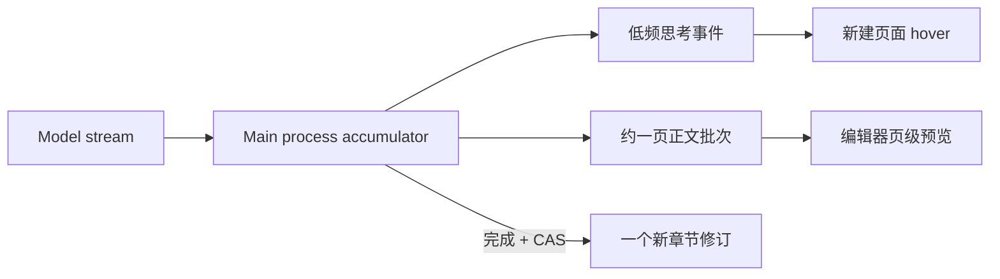

# 书籍工作区性能与非流式 AI 体验执行方案

> 文档状态：执行基准，实施前评审版
> 生成日期：2026-09-20
> 适用范围：`/projects/:projectId/book`、共用对话呈现层、章节生成、分页、目录同步与相关 IPC
> 关联文档：
> - `docs/todo/performance/book-workspace-performance-architecture.md`
> - `docs/todo/performance/book-workspace-performance-solution.md`
> - `docs/architecture/backend-refactoring-execution-plan.md`

## 实施进度（2026-09-20）

- 阶段 0 已完成：页面网格只排版已加载正文，未加载章节显示稳定占位，并补充契约测试。
- 阶段 1A 已完成：模型 chunk 仅在主进程内存累计，主进程不再持久化或发送 assistant delta；completed 事件携带完整 block，renderer 一次提交最终内容，逐字光标动画已删除。
- 阶段 1B 已按最新产品决策改为页级批量呈现：每累计约一页正文更新一次编辑器预览，生成结束后自动保存一个正式 revision，不再提供接受/丢弃步骤；“新建页面”卡片悬浮显示低频思考过程。
- 阶段 2–5 尚未开始；不得把本轮删除 AI 热路径的收益当作输入、目录和搜索优化已经完成。

## 1. 执行结论

本方案以当前代码事实和已有性能分析为基础，但调整原方案的实施优先级，并正式采用以下产品决策：

1. **取消用户可见的 AI 逐字流式输出。** 模型层仍可流式接收，以保留取消、超时、重试和连接可靠性；renderer 不再消费 token/delta 来持续改写 UI。
2. **章节生成改为页级批量呈现。** 模型 token 不直接进入 UI；主进程累计约一页后发布一次完整文档预览，生成结束后自动保存。
3. **普通对话采用“稳定等待态 + 完整答案一次呈现”。** 用户消息立即显示，助手正文在完成前不逐字增长；工具状态、取消和错误仍及时反馈。
4. **先修确定性错误，再做架构拆分。** 页面网格对未加载正文直接读取 `content` 是当前真实契约错误，必须先于页映射持久化和大规模 store 拆分修复。
5. **先有基线再宣布性能收益。** 已确认的全章同步工作属于高风险热路径，但 16ms、50ms 等数字在测量前只是验收目标，不是当前事实。
6. **不一次性引入四个新 store 和五个新服务。** 第一批只复用现有生成任务状态增加页级预览；目录、正文和页映射按后续阶段逐步拆分。

一句话路线：

```text
修页面视图契约错误并建立基线
  → 取消 token 级可视流式，生成改为页级批量呈现
  → 降低输入与分页的整章同步成本
  → 减少盲 reload 和全量快照
  → 最后再做页映射持久化、搜索优化和有条件虚拟化
```

---

## 2. 已确认的当前问题

### 2.1 确定性功能缺陷

目录快照中的章节只有摘要，`contentLoaded: false` 且没有 `content`；页面视图却会把全部章节交给 `useBookPagination`，缓存键和测量函数直接访问 `chapter.content`。

结果不是单纯“排版较慢”，而是页面视图可能在真实桌面数据下直接抛错。预览 mock 默认携带正文，现有类型检查又未启用严格空值检查，因此测试和 `tsc` 都可能漏掉该问题。

该问题必须在阶段 0 修复，不等待页映射表。

### 2.2 输入热路径

一次用户正文变更当前会触发：

```text
ProseMirror transaction
  → editor.getJSON()
  → 整章 serializeTiptapDocument
  → 整章 countTiptapCharacters
  → 草稿/修订定时器更新
  → 分页 schedule
  → 最多每动画帧一次离屏全文几何测量
  → gap decoration
  → verification
  → livePagination 回写页面状态
```

现有分页已经具备同一帧 rAF 合并，不能描述为“每个 transaction 都立即完成一次测量”；准确问题是：连续输入期间仍可能按帧执行全文 DOM 几何测量，且序列化与字数统计仍同步发生在输入回调中。

### 2.3 当前章节生成热路径

主进程已经按约 60ms 合并正文 delta、按约 150ms 合并 reasoning；但每个公开 delta 仍会造成：

```text
useAgentWorkspace 整包状态更新
  → WorkspaceLayout / BookWorkspacePage 协调
  → 累计全文转 Tiptap JSON
  → applyExternalContent
  → docChanged
  → 全文分页与验证
  → livePagination 回写
```

因此问题不在“网络 token 太多”，而在“每次可视增量都触发整章转换、编辑器变更和分页”。本方案删除这条可视增量链路，而不是继续调低刷新帧率。

### 2.4 同步与主进程扩展性

以下问题均已由当前实现确认，但优先级低于前述热路径：

- 任意 `book_changed` 都触发目录快照和项目导航 reload。
- 结构命令返回完整 `BookWorkspaceSnapshot`。
- 发送助手消息在 `flushPending()` 后仍 reload workspace 并重新读取当前章。
- `search_book_chapters`、`get_book_statistics` 逐章读取当前修订。
- `saveRevision` 后同步刷新全书书架投影。
- `BookWorkspaceApplication` 的每次书籍调用都经过项目 runtime resolve。

这些是规模放大器和维护债务，尚不能在没有计时数据时全部称为“程序未响应”的直接原因。

---

## 3. 目标用户体验

### 3.1 普通 AI 对话

用户发送消息后：

1. 用户消息立即进入对话。
2. 助手位置显示稳定等待态，例如“正在分析”“正在使用工具”“正在整理答案”。
3. 不显示逐字正文，不显示 reasoning 文本，不使用假百分比。
4. 保留取消按钮；切换章节、滚动目录和编辑其他章节不受影响。
5. 完成时用一次状态提交呈现完整答案。
6. 失败时显示错误和“重试”，不丢失用户原消息。
7. 运行超过 8 秒时提示“可以继续编辑，完成后会提醒”。

模型 chunk 只存在于主进程内存 accumulator；不得作为 durable conversation event 落库或逐条发送 IPC。主进程只在 block 结束时发布一次携带完整正文的 `assistant.block.completed`。

### 3.2 章节续写或重写

```text
用户发起生成
  → 捕获 baseRevisionId / rowVersion
  → 后台累计模型输出
  → 每形成约一页，更新一次编辑器预览和分页
  → 用户可继续浏览或切换章节
  → 完成后自动保存一个正式 revision
```

交互规则：

- 生成开始后不自动打开目标章，不抢编辑器焦点。
- 不发布 token/delta；默认累计 800 个生成字符作为一个页级批次，最后不足一页的内容在完成时发布。
- 页级事件携带截至当前页的完整序列化文档，renderer 每页最多执行一次外部正文 transaction 和一次分页稳定过程。
- “新建页面”卡片在生成中显示进度；hover 展示最多 2,000 字、500ms 最多更新一次的思考文本。
- 生成成功后自动保存正式修订，不出现接受或丢弃弹窗。
- 失败或取消时移除未保存预览，恢复 canonical 正文；已存在的用户草稿不被覆盖。

### 3.3 冲突体验

生成开始后用户或 Agent 可能修改目标章。最终自动保存仍必须使用：

```text
expectedCurrentRevisionId + expectedRowVersion
```

基线不一致时禁止静默覆盖，生成任务失败并保留用户当前正文；用户可基于最新正文重新生成。

第一阶段不实现自动三方合并。

### 3.4 Notion 参考边界

借鉴成熟产品的是后台任务状态清晰、正文更新粒度稳定、不中断当前导航和编辑。StoryOS 根据本次产品决策采用自动应用，不复制 Notion 的确认流程：

- <https://www.notion.com/help/notion-ai-faqs>
- <https://www.notion.com/en-gb/help/autofill>

StoryOS 不复制 Notion 的 block 数据模型。章节继续是一份 TipTap/ProseMirror 文档，分页继续使用现有纸张规格。

---

## 4. 目标运行时边界

### 4.1 AI 文本流



硬约束：

- token/delta 不进入 `useAgentWorkspace.state`。
- token/delta 不触发正文 React state、ProseMirror transaction 或分页测量。
- 只有页级完整文档事件可以更新编辑器预览。
- 思考过程只进入生成任务元数据，并限制频率与长度；只在“新建页面”卡片 hover 时呈现。
- 最终正文只保存一次正式 revision。

### 4.2 最小 renderer 状态

第一阶段复用现有生成任务状态：

```ts
type ChapterGenerationJob = {
  readonly generationId: string;
  readonly projectId: string;
  readonly chapterId: string;
  readonly mode: "append" | "rewrite";
  readonly status:
    | "generating"
    | "completed"
    | "failed"
    | "cancelled";
  readonly updatedAt: string;
  readonly thinkingText: string;
  readonly publishedPageCount: number;
  readonly generatedCharacterCount: number;
  readonly previewContent?: string;
  readonly revisionNumber?: number;
  readonly characterCount?: number;
  readonly error?: string;
};
```

运行态禁止包含：

- token 序号
- token 级 Tiptap JSON
- live pagination pages

页级预览只存在 renderer 内存，不写 revision；成功完成时才写一次正式 revision。

---

## 5. IPC 与事件契约

### 5.1 renderer 可见事件

保留：

```ts
type ChapterGenerationStarted = {
  type: "chapter_generation_started";
  generationId: string;
  projectId: string;
  chapterId: string;
  mode: "append" | "rewrite";
  timestamp: string;
};

type ChapterGenerationCompleted = {
  type: "chapter_generation_completed";
  generationId: string;
  projectId: string;
  chapterId: string;
  revisionNumber: number;
  content: string;
  characterCount: number;
  timestamp: string;
};
```

新增页级和低频思考事件：

```ts
type ChapterGenerationPageReady = {
  type: "chapter_generation_page_ready";
  pageNumber: number;
  content: string;
  generatedCharacterCount: number;
};

type ChapterGenerationThinking = {
  type: "chapter_generation_thinking";
  text: string;
};
```

从 renderer 公共契约删除：

- `chapter_generation_delta`
- `chapter_generation_reasoning`

主进程内部继续消费模型 chunk，但只把受控的思考快照与页级完整文档暴露给 renderer。生成完成后发送一次 `chapter_revision_saved` / `book_changed`。

### 5.3 对话呈现

主进程和项目库只记录：

```text
assistant.block.completed
```

renderer 增加 deferred presentation 层：

- completed：一次性提交最终节点。
- failed：显示失败状态，不保留未完成 token buffer。

`assistant.block.completed` 必须携带完整文本；不得依赖 renderer 累计 delta 才能重建最终答案。共享契约暂时保留旧 delta 类型只用于读取历史数据，当前 producer 禁止继续产生它。

---

## 6. 分阶段实施

### 阶段 0 — 正确性与基线

目标：修复确定性页面视图错误，建立后续优化的对照数据，不改变 AI 产品行为。

实施：

1. `BookPageGrid` / `useBookPagination` 只处理正文已加载的章节；未加载章节显示“未排版”。
2. `createChapterPaginationCacheKey` 不再接受正文可选的目录 DTO；用独立参数或严格正文类型。
3. 新增真实 catalog snapshot 测试：`content` 缺失时页面视图不抛错、不把空文档当一页。
4. 开发态打点：
   - `editor.serialize.ms`
   - `editor.characterCount.ms`
   - `pagination.measure.ms`
   - `pagination.verify.ms`
   - `bookWorkspace.render.count`
   - `generation.event.count`
   - catalog/content/draft/revision IPC 耗时
5. 建立 8,000 字、25,000 字和 80 章样本。

验收：

- 从未打开过正文的书切换“页面”视图不崩溃。
- 未加载章明确显示“未排版”。
- 性能打点只在开发环境启用。
- 保持现有分页引擎测试通过。

回滚：纯 renderer guard、类型和开发态打点，可独立回滚。

### 阶段 1 — 取消用户可见流式输出

目标：普通 AI 对话和章节生成都不再逐字更新 React UI。

#### 1A. 普通对话完整答案呈现

实施：

1. 主进程按 answer block 累计正文，`assistant.block.completed` 必须携带该 block 的完整 `content`。
2. 模型 chunk 只追加到主进程内存 accumulator，不写 SQLite、不发送 renderer IPC。
3. renderer 丢弃任何意外收到的 `assistant.block.delta`，不建立无界 buffer。
4. `assistant.block.completed` 一次性写入完整答案。
5. `TurnStatus` 保留运行态、工具态、取消和错误反馈。
6. 删除逐字光标或流式文本动画；保留普通内容渐显，但动画不能延迟业务呈现。

验收：

- 2,000 字回答生成期间，AssistantTextNode 内容不增长。
- 完成时只产生一次最终正文提交。
- 用户能随时取消，失败后能重试。
- 全局对话页和书籍助手采用一致策略；如产品只要求书籍工作区，必须通过明确 presentation policy 隔离，不能复制第二套 conversation store。

#### 1B. 章节页级批量呈现与自动保存

实施：

1. `ChapterGenerationService` 保留内部模型 stream、idle timeout 和 retry。
2. 停止向 renderer 发布 token 级 delta；按约 800 个生成字符合并为页级完整文档事件。
3. reasoning 最多每 500ms 发布一次，并截断为最近 2,000 字，只用于“新建页面”hover。
4. `useChapterGenerationPreview` 只消费页级完整文档，不消费 token。
5. 生成结束后用生成基线执行 CAS，并自动保存一个正式 revision。
6. 生成不自动打开目标章、不抢焦点；失败或取消时撤掉内存预览。

验收：

- 生成期间 transaction 和分页测量次数最多与已发布页级批次数同阶，不与 token 数同阶。
- 一页未形成前编辑器和分页保持不变。
- 完成前章节 revision 不变化，完成后只产生一条正式 revision。
- 失败、取消或 CAS 冲突不覆盖 canonical 正文。
- hover 思考文本更新不触发编辑器 transaction 和分页。

回滚：事件和 IPC 需同版本切换；保留旧代码的独立分支，不在运行时做新旧协议静默 fallback。

### 阶段 2 — 输入与分页热路径

目标：去掉 AI 热路径后，继续解决用户输入时的整章同步成本。

实施顺序：

1. 分别测量序列化、字数统计和分页，禁止只凭直觉优化分页。
2. `ChapterPaginationExtension` 抽出 latest-wins measurer。
3. 同一帧合并保留；连续输入增加有最大等待时间的 debounce，不能使用可能无限饥饿的裸 `requestIdleCallback`。
4. IME composing 期间不测，compositionend 后强制测量。
5. 将字数统计和保存序列化从“每键立即整章处理”改为可合并任务；保存仍由单章 `ChapterSaveSession` 串行化。
6. 有测试后再做从脏页起复用前缀页；字体、宽度、粘贴、全文替换回退全文测量。
7. 横向模式只渲染当前页附近的纸张壳和页脚。

验收：

- 字符必须先显示，分页随后稳定。
- 8,000 字章节目标：按键到下一帧不超过 16ms；若环境无法稳定达到，记录 P50/P95 而非伪造达标。
- 25,000 字章节目标：P95 不超过 33ms。
- 停止输入后分页有明确最大稳定时间，不能因持续 idle 延后而永久 pending。
- 中文 IME、粘贴、撤销/重做、查找替换、跨页选区行为不退化。

### 阶段 3 — 目录增量同步与保存去重

目标：一个实体变化不再替换全书状态，不再重复读取当前章。

先补契约，不能直接执行 `catalogStore.applyMutation(existingMutation)`：当前 `NovelMutation` 只有 ID，无法表达标题、状态、位置和删除分卷时的子章节迁移。

实施：

1. 定义完整 `BookCatalogDelta`：新增/更新记录、删除 ID、移动后的章节记录、最终 sequence。
2. 明确业务命令与 `book_changes.local_sequence` 的关联方式；不能假设当前 mutation ID 等于 trigger event ID。
3. 结构命令返回 delta，不再返回全书 snapshot。
4. `book_changed` 可直接带完整 delta；缺口时才读 change feed 或 resnapshot。
5. 删除 `sendAssistantMessage` 中无条件的 workspace reload 和 chapter reload；上下文来自 flush 后的 editor ref/content session。
6. 合并 revision 保存前的重复 draft IPC，但保持修订、正文、指针和草稿删除在同一 SQLite 事务内。
7. 正文保存只 patch 目标章摘要，不替换无关章节对象。

验收：

- Agent 修改另一章时，当前编辑器不渲染、不丢焦点。
- 删除分卷后，原子章节全部正确移动到未分卷分组。
- sequence 缺口触发一次恢复，不产生重复节点。
- 发送普通助手消息不再为了上下文 reload 全书。
- revision 保存的 renderer IPC 往返次数减少，原子性测试保持通过。

### 阶段 4 — 页映射与搜索

本阶段包含 schema 变更，开始前必须确认开发数据是否可重建；存在用户数据时必须单独设计迁移。

实施：

1. 增加 `chapter_page_maps`，以 revision、layoutVersion、measurerVersion 和必要的排版指纹失效。
2. 删除 `useBookPagination` 的逐章隐藏 Editor 扫描。
3. 当前章读取 live pagination；其他章读取 page map；未知明确显示“未排版”。
4. `search_book_chapters` 只扫描 `revision_documents.plain_text`，不逐章解析 JSON。
5. `get_book_statistics` 使用章节摘要聚合。
6. `saveRevision` 的书架投影刷新改为可恢复的合并队列；结构变更仍可同步刷新。

验收：

- 页网格首屏不创建逐章 TipTap。
- 页映射失效后不展示旧页码。
- 搜索不调用 `getCurrentRevision`。
- 投影延后不会让权威修订写入失败，读取时能够修复过期投影。

### 阶段 5 — 有条件虚拟化

只有阶段 2 后压力负荷仍未达标才启动。

优先顺序：

1. `content-visibility` 或等价的视口外绘制优化。
2. 只渲染可见页附近的纸张壳和 decorations。
3. 保持单一 ProseMirror 文档。

不在本阶段把一章拆成多个编辑器文档；跨页选区、撤销、搜索、IME 和 Agent 工具依赖统一文档位置。

---

## 7. 建议提交边界

每个提交/PR 必须可独立验证和回滚：

| 顺序 | 交付 | schema | 主要风险 |
| --- | --- | --- | --- |
| PR-0 | 页面网格 guard、DTO 约束、真实快照测试、开发态打点 | 否 | 低 |
| PR-1 | 对话 deferred presentation | 否 | 中：完成事件必须有完整正文 |
| PR-2 | 章节页级预览、低频思考 hover、完成自动保存/CAS | 否 | 中高：生成语义变化 |
| PR-3 | 输入序列化与分页 coalescing | 否 | 高：IME/页边界 |
| PR-4 | CatalogDelta、同步与保存去重 | 否 | 高：跨 IPC 契约 |
| PR-5 | 页映射持久化 | 是 | 高：迁移/重建 |
| PR-6 | 搜索、统计、投影刷新 | 可选 | 中 |
| PR-7 | 虚拟化，仅在数据支持时 | 否 | 高：编辑器交互 |

禁止把 PR-2、PR-4、PR-5 合成一次大改。

---

## 8. 文件落点

### 阶段 0–2

**Shared**

- `src/shared/contracts/books/chapterGenerationEvents.ts`：删除 token delta，增加低频 thinking 和 page-ready 完整文档事件。
- `src/shared/contracts/books/bookWorkspaceContracts.ts`：逐步拆 catalog summary 与 loaded content，禁止可选正文被误用。

**Main**

- `src/main/story/application/books/ChapterGenerationService.ts`：内部累计 stream，发布页级预览，完成时 CAS 自动保存一次。

**Renderer**

- `src/renderer/features/agent/conversation/store/conversationEventBatcher.ts` 或同层新 presenter：延迟发布 assistant 正文。
- `src/renderer/features/book-workspace/components/BookPageGrid.tsx`：新建页面卡片显示页级进度，hover 显示受控思考文本。
- `src/renderer/features/book-workspace/ai/useChapterGenerationPreview.ts`：只把 page-ready 完整文档写入编辑器。
- `src/renderer/features/book-workspace/BookWorkspacePage.tsx`：接入当前章页级预览。
- `src/renderer/features/book-workspace/pagination/ChapterPaginationExtension.ts`：阶段 2 抽离测量调度。

### 阶段 3–4

- `src/shared/contracts/books/bookCatalogContracts.ts`
- `src/shared/contracts/books/bookChangeFeed.ts`
- `src/main/story/application/books/BookCatalogService.ts`
- `src/main/story/application/books/ChapterContentService.ts`
- `src/main/story/application/books/BookSearchService.ts`
- `src/main/story/storage/book/bookSchema.ts`
- `src/renderer/features/book-workspace/store/catalogStore.ts`
- `src/renderer/features/book-workspace/store/paginationStore.ts`

这些文件按阶段需要新增，不提前创建空目录或 facade。

---

## 9. 验证矩阵

### 9.1 自动测试

新增：

- deferred conversation：多个 delta 不更新可见节点，completed 只提交一次完整答案。
- deferred conversation：failed/cancelled 丢弃正文 buffer 并保留错误状态。
- chapter generation：stream chunk 不产生 renderer delta 事件。
- chapter generation：不足一页不发布正文，达到页阈值后发布 page-ready。
- chapter generation：完成前不调用 `saveRevision`，完成后只创建一个 revision。
- chapter generation：revision 或 rowVersion 变化时自动保存返回冲突。
- editor：page-ready 才调用 `applyExternalContent`，thinking 事件不修改正文。
- pagination：未加载章节不生成 cache key、不创建 Editor、不抛错。
- measurer：debounce 窗口内 latest-wins；最大等待时间后必执行。
- CatalogDelta：创建、重命名、删除章、删除卷并移动子章。
- change sequence：连续、重复、缺口恢复。

保持：

- pagination engine/layout/verifier/measurer 测试。
- editor update policy、page commands、ChapterSaveSession 行为。
- conversation assembler 的持久化/重放语义。
- BookWorkspaceApplication 和 novel 存储冲突、事务测试。

### 9.2 手工与性能场景

1. 普通对话生成 2,000 字：等待期间无逐字正文，目录、编辑器滚动正常。
2. 章节续写 2,000 字：正文只按页级批次增长，不逐 token 增长。
3. 生成期间修改目标章：最终自动保存出现冲突，不覆盖修改。
4. 生成期间切换章节：完成后只显示非侵入通知，不自动跳转。
5. 取消、模型失败、重试：正文和修订数量不变。
6. 续写和重写完成后只产生一次 revision；分页次数与页批次数一致量级。
7. 8,000 / 25,000 字章节持续输入 30 秒，记录输入、序列化、分页 P50/P95。
8. 80 章书首次打开“页面”视图，未加载章节显示未排版且无异常。
9. Agent 修改未打开章，当前编辑器焦点、选区和草稿不变。
10. 中文 IME、粘贴 3,000 字、撤销/重做、跨页选区。

### 9.3 命令

按实际改动范围选择：

```bash
npm run typecheck
npm run lint:frontend
npx vitest run src/renderer/features/agent/conversation
npx vitest run src/renderer/features/book-workspace src/renderer/features/book-content
npm run check:backend
```

跨 IPC 契约或 schema 后运行：

```bash
npm run check
```

---

## 10. 阶段门禁

| 阶段 | 必须满足才能进入下一阶段 |
| --- | --- |
| 0 | 页面视图不崩溃；基线数据已记录 |
| 1A | completed 能独立提供完整答案；无 delta 可见渲染 |
| 1B | token 不进 UI；页级预览、思考 hover、自动保存和冲突保护闭环完成 |
| 2 | 输入 P50/P95 与分页稳定时间有前后对比；IME 无回归 |
| 3 | delta 能完整表达删除卷等多实体变化；缺口可恢复 |
| 4 | schema 重建或迁移策略已获确认；页映射可恢复 |
| 5 | 阶段 2 压力负荷仍未达标，并有 profiler 证据指向 DOM 规模 |

---

## 11. 实施前决策点

阶段 0–1A 无需额外产品决策。进入对应阶段前必须确认：

1. **非流式范围（已确定）：** 默认全应用的助手正文都不逐字显示；若实施时要缩小到书籍工作区，必须作为产品例外重新确认，并通过明确 presentation policy 隔离。
2. **页级阈值（已确定首版）：** 暂以 800 个生成字符作为近似页批次，后续用真实排版测量校准。
3. **schema 策略：** 现有书籍库是否仍允许重建；否则需要正式迁移。
4. **生成期间编辑（已确定）：** 目标章在 AI 页级预览期间只读，防止临时预览进入普通自动保存；其他章节仍可正常编辑。最终正文由主进程通过 CAS 自动保存。
5. **普通对话工具进度：** 保留结构化工具状态，但不展示 reasoning 和正文 token。

---

## 12. 明确不做

- 不把模型调用改成必须等待完整 HTTP 响应；内部 stream 继续用于可靠性。
- 普通对话不展示模型 reasoning；章节生成仅在新建页面 hover 展示限频、限长的思考文本。
- 不使用假进度百分比。
- 不把未完成 token 写入章节草稿或正式修订。
- 不把页级预览写成中间 revision。
- 不在第一阶段同时重写 catalog、content、pagination 和 conversation 全部状态层。
- 不把一章拆成多个 ProseMirror 文档。
- 不在 Web Worker 里伪造依赖 DOM layout 的 `coordsAtPos`。
- 不把书籍业务放入 `src/main/agent/`。

---

## 13. 完成定义

本方案全部完成时应满足：

- 用户看不到 AI 正文逐字增长，但始终能看到可信运行状态并可取消。
- 章节生成期间工作区保持可操作，正文只按页级批次更新，草稿和选区不被 token 级事件扰动。
- AI 结果完成后自动进入一个正式修订，不需要接受或丢弃步骤。
- 冲突不会静默覆盖用户内容。
- 页面视图不会对缺失正文执行分页。
- 输入热路径不再按帧无条件完成全部整章工作。
- 单实体变更不再盲目 reload 全书。
- 搜索不再逐章解析 revision JSON。
- 所有性能结论都有基线、优化后数据和可复现负荷，而不是只依据架构推断。
