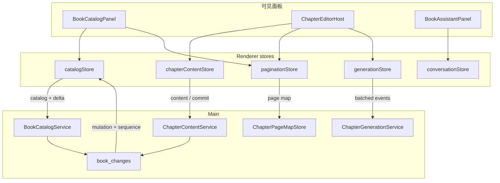

# 书籍工作区性能优化解决方案

> 文档状态：实施方案，作为后续编码的基准
> 生成日期：2026-09-20
> 诊断依据：`docs/todo/performance/book-workspace-performance-architecture.md`
> 外部参照：Notion 官方工程博客（block / RecordCache / loadPageChunk / CRDT）、Linear sync engine
> 范围：`/projects/:projectId/book` 书籍工作区的渲染隔离、分页测量、增量同步、页映射
> 本文不实施代码；实现时若偏离本文，先改文档再改代码

> 2026-09-20 决策更新：AI 展示方案以
> `book-workspace-performance-execution-plan.md` 为准。普通对话只发布完整 block，
> 章节生成只发布低频思考状态和页级完整预览，不再保留 token/delta 帧批处理方案。

配套关系：

- 分析文档回答「现在为什么慢、架构错在哪」。
- 本文回答「这次具体怎么改、改成什么样、分几步验收」。
- 产品边界仍遵守：不把一章拆成 Notion 式 paragraph block；不上 CRDT；不重写 TipTap；不推翻 `book.sqlite`。

---

## 1. 选定方案

### 1.1 一句话

把 Notion/Linear 的 **记录粒度 + 本地先应用 + 按字段订阅 + 增量同步** 接到 StoryOS 已有的章级编辑器和 `book.sqlite` 上，而不是把写作工作区改造成 Notion 编辑器。

### 1.2 从成熟产品取什么、不取什么

| 来源 | 采用 | 不采用 | 落到 StoryOS 的形态 |
| --- | --- | --- | --- |
| Notion Record | 规范化记录，一次操作只脏一小块 | 页面=递归 block 树；Enter 切段 | 记录单位是 **目录行 / 章正文 / 页映射 / 生成会话**，不是段落 |
| Notion TransactionQueue | 本地先改，持久化排队 | 云端 `/saveTransactions` | 已有 `ChapterSaveSession` 队列；合并 draft+revision 为一次 IPC |
| Notion `loadPageChunk` | 按渲染需要加载 | 深爬整棵知识树 | 保持目录不含正文；正文按章拉；页映射单独拉 |
| Notion `syncRecordValues` | version 通知后只拉过期记录 | WebSocket 多端协作 | 用已有 `NovelMutation` + `book_changes.local_sequence` 做 patch |
| Notion MessageStore 订阅 | 组件只订自己的 record | 每段落独立 contenteditable | Zustand selector：目录订 catalog，编辑器订 content/pagination/generation |
| Notion WASM SQLite 缓存 | 热路径不阻塞冷启动；磁盘与来源赛跑 | 浏览器 OPFS / SharedWorker | 主进程已有 SQLite；renderer 做内存 LRU，不重复造库 |
| Notion 离线原则 | 缺数据就显示未知，不展示假内容 | 离线 CRDT 森林 | 未加载章禁止空文档分页 |
| Notion CRDT / Peritext | — | 同段并发合并、text slice | 单人本地，继续 `rowVersion` / `expectedCurrentRevisionId` |
| Linear Object Pool | 规范化内存对象，UI 不发网络读 | 全工作区 bootstrap 进 IndexedDB | 四个 vanilla Zustand store，对标 `conversationStore` |
| Linear 字段级订阅 | 改一个 issue 只刷新相关单元格 | MobX | `useStore(store, selector)` |
| 面试文「必须虚拟化」 | 仅作压力负荷未达标时的后备 | 当作 Notion 现状或第一刀 | P4 有条件启动 |

权威来源（高置信）：

- [The data model behind Notion's flexibility](https://www.notion.com/blog/data-model-behind-notion)（2021）
- [How we sped up Notion in the browser with WASM SQLite](https://www.notion.com/blog/how-we-sped-up-notion-in-the-browser-with-wasm-sqlite)（2024）
- [How we made Notion available offline](https://www.notion.com/blog/how-we-made-notion-available-offline)
- [How Notion handles concurrent editing with CRDTs](https://www.notion.com/blog/how-notion-handles-concurrent-editing-with-crdts)（2026-09）

逆向/访谈仅作旁证，不作为「Notion 当前实现」的事实来源。

### 1.3 与分析文档的对应

分析文档里的四条会话，就是这次的目标运行时：

```text
CatalogSession      ← Notion 的 page/block 元数据，Linear 的 Issue 列表
ContentSession      ← Notion 当前正在编辑的那一个 block 的 properties
PaginationSession   ← StoryOS 独有（纸张模型）；成熟产品没有对等物，必须自建服务
GenerationSession   ← 对标 conversationStore 的流式隔离，而不是 Notion AI
```

可见层保持：

- 左栏目录、中间分页编辑器、右侧助手。
- 一章仍是一份 TipTap/ProseMirror 文档，`key={chapter.id}` 切章销毁。
- `CHAPTER_PAGE_SPEC`（720×960）与阅读器共用，不改页规格。

---

## 2. 问题到方案的对照

| 分析中的瓶颈 | 成熟产品对应做法 | 本次解决方案 |
| --- | --- | --- |
| 每次按键全章离屏测量 | Notion 把长文切成短 block，避免单文档几何成本；他们也承认长 block 会慢 | **不切章**。抽出测量服务，输入时 coalescing + 空闲测量；可见层沿用上一份稳定分页 |
| AI delta 刷新整页 | Notion 按 record 订阅；高频文本不应驱动整页状态 | 普通对话完成后一次提交；章节正文按页发布，思考状态低频更新 |
| `book_changed` 盲 reload | `syncRecordValues` / Linear `lastSyncId` | 事件带上已有 `NovelMutation` 与 `changeSequence`；catalogStore patch |
| 结构 CRUD 返回全书 snapshot | 命令返回受影响 record | IPC 返回 `{ mutation, catalogDelta, changeSequence }` |
| 页网格再造 N 个 TipTap | `loadPageChunk` 不加载用不到的正文；缺数据不假装完整 | 删除隐藏 Editor 扫描；页映射独立读模型；未知就显示未排版 |
| God page + Agent state blob | Linear 内存对象图，UI 直读 pool | `BookWorkspacePage` 只做组合；热状态退出 `useAgentWorkspace.state` |
| 发助手消息前 reload 全书 | 本地已是真相，网络只确认 | 只 `flushPending()`，从 content session + editor ref 组 context |
| 搜索/统计 N+1 读 JSON | 搜索走索引，不解析文档树 | `plain_text` 查询；统计走 `listChapterSummaries` |
| 保存双 IPC | TransactionQueue 批量提交 | `commitChapter` 一次事务：内部可写 draft 再 revision |
| 写修订同步刷书架投影 | 投影最终一致 | 结构变更可同步；`saveRevision` debounce 200ms |

---

## 3. 目标运行时

### 3.1 数据面（Record 划分）

借鉴 Notion「一切都是 record」，但 record 种类只有四种。禁止再把正文塞进目录行。

```text
BookCatalogRecord        书 / 卷 / 章摘要（无 content、无 draft）
ChapterContentRecord     当前章（及 LRU）正文 + 草稿 + rowVersion
ChapterPageMapRecord     一章在某 layoutVersion + revisionId 下的页切片
ChapterGenerationRecord  一次生成会话的纯文本 buffer + 状态
```

对应 IPC：

| Record | 读 | 写 | 同步 |
| --- | --- | --- | --- |
| Catalog | `getBookCatalog(projectId)`（可由现 `getBookWorkspace` 改返回值） | 结构命令返回 delta | `book_changed` + `getBookChanges({ after })` |
| Content | `getBookChapterContent`；可选 `expectedRevisionId` → `notModified` | `saveChapterDraft`；`commitChapterContent` | 仅当 mutation.chapterId 匹配且无本地未保存更改 |
| PageMap | `getChapterPageMap(chapterId)` | 由测量服务在修订保存后写入 | revision 变化则失效 |
| Generation | 事件流，不走 CRUD | 主进程 `ChapterGenerationService` | 不进 catalog reload |

`NovelMutation` 已具备 `kind` / `chapterId` / `revisionId`，renderer 今天只用它当计数器。解决方案是 **把已有 mutation 用起来**，不另造一套事件类型。

### 3.2 客户端会话（对标 conversationStore）

仓库先例：`src/renderer/features/agent/conversation/store/conversationStore.ts`（vanilla Zustand + selector）。

```text
src/renderer/features/book-workspace/store/
  catalogStore.ts
  chapterContentStore.ts
  paginationStore.ts
  generationStore.ts
```

订阅规则（硬约束）：

| 组件 | 允许订阅 | 禁止订阅 |
| --- | --- | --- |
| `BookWorkspacePage` | 布局可见性、路由参数、`projectId` | generation 全文、live pages、chapterGenerations |
| `BookCatalogPanel` | catalogStore、paginationStore 的 page map | content JSON、generation buffer |
| `ChapterEditorHost` | content、pagination snapshot、generation | 整包 Agent `state` |
| `BookAssistantPanel` | `conversationStore`、书名/章标题、running boolean | 分页、正文、generation delta |

`useAgentWorkspace.state` 最终删除 `chapterGenerations` 与 `bookChangeVersions`。过渡期可以把生成事件直接写入 `generationStore`，不再放进 Outlet context。

### 3.3 主进程服务

不新建平行包。在 `src/main/story/application/books/` 内按职责拆，现有 `BookWorkspaceApplication` 暂时做 facade。

```text
BookCatalogService           摘要、结构命令、change feed
ChapterContentService        正文、草稿、commit revision
ChapterPageMapStore          页映射读写与失效
BookSearchService            plain_text 搜索
ChapterGenerationService     completed 不再携带 content
```

书籍读写改为 `BookRuntimeManager.acquire(bookId)`（经 `project_books` 解析），**不要**为存草稿去 `WorkspaceRuntimeManager.resolve` 激活整个 Agent 运行时。对话和工具仍走项目运行时。

`getBookWorkspace` 从 Conversation IPC 迁到 `BookIpcController`。

### 3.4 目标数据流



本地先应用（Notion TransactionQueue 的本地半截）：

1. 用户改标题 / 新建章：catalogStore 先 patch，再 IPC；失败则回滚该 record。
2. 用户打字：只进 ProseMirror + SaveSession，不碰 catalog。
3. 修订保存成功：只 patch 该章 `characterCount` / `revisionNumber` / `rowVersion`，并标记 page map 失效。
4. Agent 改另一章：只 patch 那一行。当前编辑章若 `mutation.chapterId` 不同，编辑器零渲染。

---

## 4. 四条热路径的具体改法

### 4.1 输入：测量跟随空闲，而不是跟随每一个按键

**保持**：单一 ProseMirror 文档、离屏测量、gap decoration、IME 期间不测。

**改**：从 `ChapterPaginationExtension` 抽出 `ChapterPaginationMeasurer`。

```text
docChanged
  → generation++，latest-wins
  → 立即 publish status=pending（沿用上一份稳定 pages，可估算纸张数）
  → 若 composing：等待 compositionend
  → 否则：rAF 合并；连续输入再加 32–48ms debounce / requestIdleCallback
  → 只对最新 doc 调用 paginateEditorView
  → 验证通过后 publish ready
```

脏区（阶段 2 后半，可单独 PR）：

- 仅插入/删除文本且页宽未变：从脏页起点复用前缀页。
- 粘贴、换字体、resize、全文替换：全文测量。
- 页级生成：每个 `chapter_generation_page_ready` 最多触发一次测量；结束后对最终正文强制全文测量。

横向模式：纸张壳按可见窗口渲染，不要 `Array.from({ length: renderPageCount })` 全量 footer。

验收：典型负荷（8,000 字）按键到字符可见 ≤ 16ms；停止输入后 ≤ 50ms snapshot ready；现有 pagination 测试全绿。

### 4.2 生成：页级批量呈现

- 模型 token 只在主进程内存累计，不发送正文 delta。
- 每累计约一页发布一次 `chapter_generation_page_ready`，事件携带截至该页的完整预览文档。
- 思考过程以低频 `chapter_generation_thinking` 更新，只用于“新建页面”卡片悬浮预览。
- started / page-ready / completed / cancelled / failed 直接应用，不建立无界文本队列。

`generationStore` 只存：

```text
generationId, chapterId, mode, status
previewContent?        // 最近一次页级完整预览
thinkingText           // 有上限的低频思考摘要
publishedPageCount
revisionNumber?        // completed 后
characterCount?
```

刷入编辑器：

- 状态条每个 flush 更新字数。
- `plainTextToTiptapDocument` + `applyExternalContent` 最多 10fps。
- `completed` **删除 `content` 字段**。无本地未保存更改时 `getBookChapterContent` 一次；若 buffer 已等于最终文本，可 `acceptExternal` 而不 `setContent`。
- 与随后的 `chapter_revision_saved` 按 `revisionId` 去重，禁止再全量 reload。

验收：生成 2,000 字时，`BookCatalogPanel` 与助手滚动不因 delta 重渲染；目录搜索框可输入。

### 4.3 同步：把 mutation 当 syncRecordValues 用

当前：

```text
book_changed → bookChangeVersions++ → reloadWorkspace + reloadNavigation
```

改为：

```text
book_changed { projectId, mutation, changeSequence }
  → sequence === local+1  ?  catalogStore.applyMutation(mutation)
  → sequence 缺口          ?  getBookChanges({ after: local }) 或 getBookCatalog
  → mutation.chapterId === 当前章且无 unsaved
        ?  chapterContentStore.revalidate(revisionId)
        :  不碰编辑器
```

结构命令 IPC 不再返回完整 `chapters[]`。返回：

```ts
type BookCatalogCommandResult = {
  readonly mutation: NovelMutation;
  readonly changeSequence: number;
  readonly book?: NovelDto;
  readonly volume?: VolumeDto;
  readonly chapter?: BookCatalogChapterDto; // 创建/更新时
  readonly removedIds?: {
    readonly volumeIds?: readonly string[];
    readonly chapterIds?: readonly string[];
  };
};
```

`sendAssistantMessage`：`flushPending()` → 从 content session 与 `editorBridgeRef` 组 context → `sendMessage`。禁止 `reloadBookWorkspace` / `loadChapter`。

保存：`commitChapterContent` 在主进程一笔事务里完成「写 draft（可选）+ saveRevision + 清 draft」。renderer 只 invoke 一次。`ChapterSaveSession` 的 300ms / 5s 定时器保留。

`CatalogUpdatingBookStore`：结构变更仍同步 refresh；`saveRevision` 的书架投影 debounce 200ms。

### 4.4 页网格：独立投影，禁止假分页

删除 `useBookPagination` 里为每章 `new Editor()` 的路径。

页网格数据源：

1. 当前编辑章 → `paginationStore` 的 live snapshot（含 previewText）。
2. 其他章 → `ChapterPageMapRecord`。
3. 没有映射 → 明确「未排版」，点击该章再加载正文并测量。
4. 全局页码：某章未知则其后章节显示未知，不提前编号。这与阅读器「分页未完成时如实显示未知」一致，也符合 Notion「缺数据宁可不展示完整页」的原则。

页映射建议写入 `book.sqlite`（阶段 4，需确认开发数据可重建）：

```text
chapter_page_maps
  chapter_id
  revision_id
  layout_version
  measurer_version
  pages_json
  updated_at
```

失效：`revision_id` 变、或 `CHAPTER_PAGE_SPEC.layoutVersion` 变。草稿期间当前章只用 live map，不写库；修订保存成功后把刚测好的 live map 落库。

后台补测：renderer 内 hidden `PaginationWorkerHost`（需要真实 layout，不能 Web Worker 里 `coordsAtPos`），idle 队列，一次一章。不要在 `BookPageGrid` 的 React 树里同步造 Editor。

---

## 5. 页面组合根

`BookWorkspacePage` 变成组合根，对标 Notion「页面只负责挂载当前可见 record」，而不是持有整棵树。

保留：

- 三栏布局、快捷键 Ctrl+B / Ctrl+J
- 离开设置页前 `flushPending`
- `editorContextRef` / `editorBridgeRef`（高频状态继续不进 React）

移出：

- `setLivePagination`
- `state.chapterGenerations` 派生
- 内联 CRUD 后立刻 `loadProjectNavigation`（改由 catalog mutation 驱动导航 patch）
- `chapterGroups` 的页面级计算（放入 catalogStore 或 catalog hook 的 memo）

路由（阶段 3，需确认）：

```text
/projects/:projectId/book
/projects/:projectId/book/chapters/:chapterId
/projects/:projectId/book/chapters/:chapterId?page=3&conversation=:threadId
```

页码是软状态：page map 未 ready 时先打开章，对齐在 snapshot ready 之后做。

---

## 6. 分阶段交付

每个阶段必须可单独合并、可回滚。不把页映射表和虚拟化绑进第一批。

### 阶段 0 — 基线（不改行为）

开发态打点：

- `pagination.measure.ms`、`doc.size`、fragment 数
- generation delta → React commit
- 四条 IPC：catalog / chapter content / draft / saveRevision
- `BookWorkspacePage` 与 `BookCatalogPanel` 的 render 计数

产出：基线表。没有基线不宣布优化成功。

### 阶段 1 — 隔离渲染（对应分析 P0）

**目标：** 生成和分页 settle 不再整页刷新。这是 Notion「按 record 订阅」的最小落地。

做：

1. `generationStore` + `generationEventBatcher`；`useAgentWorkspace` 不再把生成放进 `state`。
2. 预览 10fps 刷入；store 内保持纯文本。
3. `paginationStore` 承接 live snapshot；Page 不再 `setLivePagination`。
4. Catalog / Assistant `memo`；字数和保存态留在 editor host。
5. 发送助手消息去掉强制 reload。

验收：

- 生成时目录搜索可输入、助手可滚动。
- Profiler：delta 期间 `BookCatalogPanel` render ≈ 0。
- 现有 `useChapterGenerationPreview` 测试改订 store 后仍绿。

不改：SQLite schema、IPC 返回形状、分页算法。

### 阶段 2 — 合并测量（对应分析 P0/P1）

**目标：** 长章打字不再每次按键做全文几何测量。

做：

1. `ChapterPaginationMeasurer`，latest-wins + debounce。
2. Plugin 只负责 decoration 与请求测量。
3. 流式降频；IME 仍跳过。
4. 横向纸张壳窗口化。
5. 有测试后再做脏区前缀复用。

验收：典型负荷按键 ≤ 16ms；空闲后 50ms ready；pagination 单测全绿；中文 IME 组词不重排。

### 阶段 3 — 增量同步与保存（对应分析 P1/P2）

**目标：** Agent 改一处不再替换全书目录。这是 `syncRecordValues` / `lastSyncId` 的落地。

做：

1. 结构 API 改返回 `BookCatalogCommandResult`；preload / preview mock 同步改，不做静默兼容。
2. `book_changed` 附带完整 `mutation` + `changeSequence`。
3. `useBookMutationSync` 改为 `applyMutation`；缺口 resnapshot。
4. `commitChapterContent` 单次 IPC。
5. `getBookWorkspace` 迁入 Book IPC；统计工具改摘要查询。
6. 可选：chapterId 进 URL。

验收：改标题不替换 `chapters` 数组引用以外的无关行；当前章输入不被打断；保存 invoke 次数减半。

契约变更与版本一起切换，不保留旧 snapshot 返回值。

### 阶段 4 — 页映射与搜索（对应分析 P1/P2）

**目标：** 页面视图不再现场造编辑器；搜索不再 N+1 读 JSON。

做：

1. 删除隐藏 Editor 扫描。
2. 页映射表 + 失效 + idle host。
3. 网格区分已映射 / 未排版。
4. `search_book_chapters` 走 `revision_documents.plain_text`。
5. `saveRevision` 投影 debounce。

验收：从未打开的章显示未排版，不抛 `content.length`、不测空文档；打开页面视图首屏 ≤ 100ms；搜索工具不调用 `getCurrentRevision`。

依赖：开发期书籍库可重建（需确认）。若不能写库，本阶段退化为仅内存 page map，重启后仍要按需测，但仍然禁止空文档测量。

### 阶段 5 — 虚拟化（仅当阶段 2 预算未达标）

优先 `content-visibility` 与可见区 decoration。不拆 ProseMirror 文档。单独评审选区、粘贴、查找、AI 工具。

---

## 7. 明确不做

| 不做 | 原因 |
| --- | --- |
| 把一章拆成 Notion paragraph block | 分页、跨页选区、章级 AI 工具依赖单一文档位置 |
| Yjs / CRDT | 单人本地；Notion 自己到 2025 才上，成本极高 |
| 新状态框架（Redux / MobX） | 已有 Zustand vanilla 先例 |
| 浏览器 WASM SQLite 第二缓存 | 主进程已有 `book.sqlite` |
| Web Worker 里测页 | `coordsAtPos` 需要真实 layout |
| 修订历史 GC、FTS5 | 需单独授权 |
| 阅读器 3D、大纲模块、实例切换 | 范围外 |
| 为旧 IPC 形状做 fallback | 违反仓库契约纪律 |

---

## 8. 文件落点

阶段 1–2 即可开始，不碰 schema。

**Renderer 新增**

- `features/book-workspace/store/catalogStore.ts`
- `features/book-workspace/store/chapterContentStore.ts`
- `features/book-workspace/store/paginationStore.ts`
- `features/book-workspace/store/generationStore.ts`
- `features/book-workspace/store/generationEventBatcher.ts`
- `features/book-workspace/pagination/measurement/ChapterPaginationMeasurer.ts`

**Renderer 改为薄**

- `BookWorkspacePage.tsx`：组合根
- `ChapterPaginationExtension.ts`：plugin 胶水
- `useBookMutationSync.ts`：applyMutation
- `useChapterGenerationPreview.ts`：读 generationStore
- `useBookConversations.ts`：去掉发送前 reload
- `useAgentWorkspace.ts`：移出书籍热状态
- 删除 `useBookPagination.ts` 的 Editor 扫描（阶段 4）

**Main / shared（阶段 3–4）**

- 扩展 `bookWorkspaceContracts.ts` 或拆 `bookCatalogContracts.ts`
- `book_changed` 携带 `mutation` + `changeSequence`（字段已在 `NovelMutation`）
- `BookCatalogService` / `ChapterContentService` / `ChapterPageMapStore` / `BookSearchService`
- `ChapterGenerationService` completed 去掉 `content`
- `readBook.ts` 搜索与统计
- IPC 迁入 `BookIpcController`

---

## 9. 验收预算

与分析文档第 2.2 节相同，作为阶段门禁。未实测前不是当前版本已达标值。

| 指标 | 典型负荷 | 对应阶段 |
| --- | --- | --- |
| 生成时目录/助手不因 delta 重渲染 | 必须 | 1 |
| 按键到字符可见 ≤ 16ms | 8,000 字 | 2 |
| 分页稳定 ≤ 50ms（停止输入后） | 8,000 字 | 2 |
| `book_changed` 只 patch 受影响节点 | Agent 改标题 | 3 |
| 打开页面视图 ≤ 100ms，无隐藏 Editor 风暴 | 80 章 | 4 |
| 未加载章显示未排版 | 契约 | 4 |

手工场景见分析文档第 14.2 节。命令：

```bash
npm run lint:frontend
npx vitest run src/renderer/features/book-workspace src/renderer/features/book-content
npm run check:backend
```

跨 IPC 后再 `npm run check`。

---

## 10. 实施前仍需确认（不阻塞阶段 1–2）

1. 草稿是否只属于本设备本窗口？（默认：是，无 draft 事件）
2. 页映射是否写入 `book.sqlite` 并与阅读器共享？（默认建议：写库；否则阶段 4 仅内存）
3. 当前书籍库是否仍可丢弃重建？（影响 page map schema）
4. 路由是否纳入 `chapterId`？（默认建议：纳入）
5. 生成预览 10fps 是否可接受？（默认：可接受；状态条实时字数）

---

## 11. 实施口令

先隔离订阅（学 Notion/Linear 的 record 订阅），再合并测量（承认我们有纸张模型而他们没有），再用已有 `book_changes` 做增量同步（学 `syncRecordValues`），最后才持久化页映射。不把一章拆成 block，不上 CRDT，不把虚拟化当第一刀。
