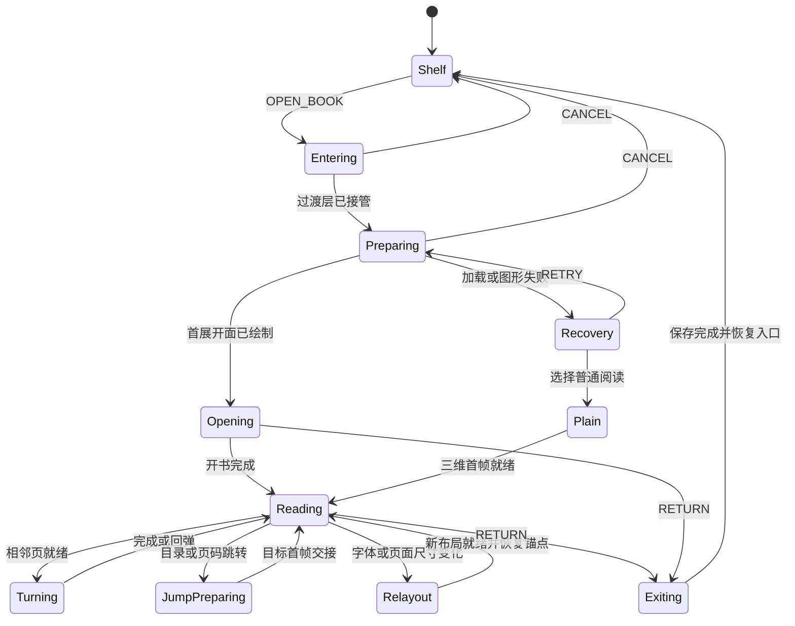

# StoryOS 3D 阅读器全流程体验技术设计 V2

日期：2026-09-08  
状态：V2 功能已落地；实现与验证记录见第 12 节。第 2 节保留改造前诊断，其余章节的性能目标不自动等于已达标。  
范围：书架入口 → 入场 → 开书/续读 → 目录与页码 → 阅读与翻页 → 设置与跳转 → 退出与恢复。

## 1. 本轮要解决的问题与决定

上一轮主要调整配色、书页形变和工具栏，尚未形成连续的阅读体验。功能测试通过，只说明操作能够完成，不能说明入场自然、文字稳定、定位清楚。

本轮采用以下设计：

1. **点击书架上的「3D 阅读」后，一次点击完成连续入场和开书。** 首读落到正文起点，续读展开到书签位置；不突然显示正文，也不强迫用户每次再点一次「开启阅读」。
2. **一本书应具有封面、扉页、完整书内目录、正文、页眉页脚及结束状态。** 同时保留随时可开的目录导航，不要求读者反复翻回书前查目录。
3. **3D 模式的可见书页统一用 WebGL 呈现，静止和翻页共用同一份高质量页纹理。** 不再每次翻页都把整本书从 DOM 换成图片再换回来。普通文字阅读作为明确的独立模式保留。
4. **全书页码、章内位置、装订位置、内容锚点分别建模。** 分页未完成时如实显示未知；字号改变后重排，不把变化的页码当永久书签。
5. **画质与流程先过验收，再增加装饰性效果。** 禁止正文景深、运动模糊、为追求帧率在一次翻页中临时降低正文分辨率。

以下时长、内存和质量数值均为实现目标或首轮调参范围，必须实测，不能引用旧版本结果宣称达标。

## 2. 现状诊断：证据与推断分开

| 用户感受到的问题 | 当前代码事实 | 结论与待验证项 |
| --- | --- | --- |
| 点击后直接跳进内容 | `BookshelfPage.tsx` 的 `openReader` 直接执行路由跳转；`useBookReader.ts` 恢复时调用 `setCover(anchor === null)` | 有锚点就直接进入正文是确定行为。入场状态与阅读位置被耦合，缺少书架到阅读器的连续交接。 |
| 冷启动像页面突然换掉 | 阅读组件懒加载；数据准备由 `busy` 遮罩覆盖；正文位置和封面状态分别更新 | 没有统一的「过渡层已经接管 → 阅读首帧已经提交」屏障。具体空白帧、时长需要在生产包逐帧记录。 |
| 翻页突然糊、停下又清晰 | `ReaderStage.tsx` 在 `sheets` 存在时隐藏整个 `.reader-book-dom`，结束后重新显示 | 整个展开面切换了文字渲染管线，连没有移动的页也会改变抗锯齿和字形观感。这是架构性问题。 |
| 放大后动画文字更软 | `renderPageCanvas.ts` 只生成 `480×640×min(devicePixelRatio,1.5)` 的纹理；场景 DPR 上限同为 1.5 | 纹理没有覆盖用户显示缩放及卷起后的透视放大。高 DPI 下可能不足；每种设置的实际放大倍数需测量。 |
| 翻页过程明暗变化过大 | `TurningSheet.tsx` 将纸面明暗乘以 `.52 + .48 * facing`；该处理覆盖已经烘焙在纸面的字迹 | 可能进一步降低细字对比度，不应将所有清晰度问题归因于分辨率。需分离纸面光照与字迹对比度验证。 |
| 运行中画质突然改变 | `ReaderStage.tsx` 的慢帧回调可执行 `setDpr(1)` | 当前没有锁定一次翻页的质量档位。是否在用户遇到的那次翻页触发，不能仅凭描述认定。 |
| 目录不像完整的一本书 | 当前目录是独立侧栏，书页本身没有完整目录页 | 缺少书籍前置结构，也缺少目录页与正文页码之间的映射。 |
| 页码难理解 | 底栏同时显示章内页码、全书页数、按字数估算的进度；没有精确页码跳转 | 显示位置与总量采用不同坐标系。用户不能靠当前数字明确判断自己在整本书的哪里。 |
| 拖进度条频繁等待 | range 的 `onChange` 直接调用 `seek`，后者触发 `jump` 和 `busy` | 拖动预览与正式跳转没有分开，会反复准备内容并覆盖阅读画面。 |
| 小窗口虽变大却要滚动书本 | 固定逻辑页 480×640，显示比例最低 85% | 这是临时可读性兜底。应按可用空间重排单页，而非将「整本书必须完整可见」与「汉字足够大」交给用户取舍。 |

代码索引（相对本文）：[入口](../../src/renderer/pages/bookshelf/BookshelfPage.tsx)、[恢复与跳转](../../src/renderer/pages/reader/useBookReader.ts)、[DOM/纹理切换](../../src/renderer/pages/reader/ReaderStage.tsx)、[纹理生成](../../src/renderer/pages/reader/scene/renderPageCanvas.ts)、[纹理缓存](../../src/renderer/pages/reader/scene/pageTextureCache.ts)、[场景](../../src/renderer/pages/reader/scene/BookScene.tsx)、[纸页形变](../../src/renderer/pages/reader/scene/TurningSheet.tsx)、[当前导航](../../src/renderer/pages/reader/BookReaderPage.tsx)。

## 3. 入场：从书架拿起这本书，再展开阅读

### 3.1 正常流程

| 阶段 | 用户看到的内容 | 技术动作 | 初始时长目标 |
| --- | --- | --- | --- |
| 点击反馈 | 被点击的书得到轻微抬升/描边，按钮立即响应 | 生成 entryId，锁定一次入场，记录书封位置、书架滚动与焦点 | 50ms 内反馈，最迟 100ms |
| 书架交接 | 同一本封面从书架位置移向阅读舞台，背景渐变为阅读空间 | 持久过渡层接管书封；并行加载路由、快照、字体、目标页布局与渲染资源 | 约 280–360ms |
| 就绪等待 | 封面稳定停留，必要时显示「正在准备书页」 | 等待目标展开面上传 GPU 并成功绘制首帧 | 由真实工作决定，不伪造进度 |
| 开书/续读 | 封面沿书脊打开，书本居中；续读可见书签标记和「接着上次阅读」 | 使用已恢复的目标位置构建开书终态；不模拟逐页翻过前面几百页 | 首读约 480–620ms；续读约 300–420ms |
| 阅读稳定 | 书页先落定，工具栏淡入，键盘焦点到阅读区域 | 提交 reading 状态，才允许翻页和保存当前正文位置 | 工具栏淡入约 120–180ms，可与收尾重叠 |

这是同一次点击的连续动作，不新增强制确认页。时间段可以重叠；资源已就绪时不人为等待一个固定加载时长。热进入的完整体验目标约 700–1000ms，续读更短。

首读自动落到第一处可读正文；完整扉页和目录实际存在于书前，可通过「书内目录」或向前翻页访问。若用户从书架明确选择「查看目录」，开书终点就是目录。不要为展示仪式感强迫每次先翻多页前言。

### 3.2 书封与空间连续性

- 书架和阅读器共同消费 `CoverSpec`：书名、真实封面图（若有）、配色、字体、排版版本。禁止书架是绿封面、入场中途突然换成紫封面。
- 从按钮所在卡片查找封面锚点，而非拿按钮矩形当书籍位置。列表视图使用缩略封面锚点；没有锚点的深链接从舞台中央淡入封面。
- 过渡层放在路由 Outlet 之外，先绘制一帧再导航；保留轻量书封与背景快照数据，不保留整个写作工作区和编辑器。
- HTML 过渡封面可以移动缩放；**WebGL 的尺寸测量容器不参与 CSS 三维变换**。交接帧由统一屏幕坐标投影校准，只有首帧就绪才移除过渡封面。
- 调整窗口、系统 DPI 或源卡片离开视口时，降为从当前画面平滑进入的过渡，不飞向过时坐标。
- 用户点击「3D 阅读」是本次会话的 3D 意图，不能被以前自动降级留下的 plain 偏好静默覆盖。能力不足时说明原因并保留普通阅读；用户主动选择的默认模式与临时故障降级分别保存。

### 3.3 慢加载、中断与无动画

| 条件 | 行为 |
| --- | --- |
| 工作在 250ms 内完成 | 不闪一下加载文字 |
| 250ms 后仍未就绪 | 在稳定封面下显示「正在准备书页」，不覆盖成空白屏 |
| 超过 2s | 提供取消/返回；当前有可读 DOM 内容时可选择普通阅读 |
| 超过 8s 或明确失败 | 显示可重试状态与错误摘要；8s 只是慢请求提示阈值，不把仍进行中的合法读取直接判成失败 |
| 连续点击同一本书 | 复用 entryId，不重复打开会话、不堆叠动画 |
| 入场时返回/Escape | 取消过渡及请求；已创建会话也须关闭；恢复入口焦点 |
| 恢复位置失效 | 先定位到可读相邻内容，再进行同一入场；完成后提示位置调整 |
| 减少动态效果 | 取消飞入、旋转、开书卷曲，用不超过 100ms 的简单切换；仍等待内容就绪，避免闪空页 |

### 3.4 统一状态机



图中仅展示主路径。实现中退出/取消可中断 Turning、JumpPreparing、Relayout；取消翻页回到最后提交位置，取消跳转保留原位置。所有异步回调检查 `{entryId, snapshotId, layoutVersion, operationId}`，过期结果只释放资源，不提交 UI。`busy` 不再承担所有阶段；恢复锚点只决定开书目标，不决定封面是否可见。

## 4. 书本结构、完整目录与导航

### 4.1 书内结构

```text
封面 → 内封/扉页 → 完整目录（可多页） → 分卷/章节 → 正文 → 阅读完成页 → 封底
```

封面不计正文页码。作者、简介等仅在书籍真实有这些字段时显示，不自动编造版权页、出版信息或作者。扉页、目录和结束页是阅读器生成页，不写入小说正文或创建修订。

| 结构 | 呈现与交互 |
| --- | --- |
| 封面 | 与书架一致的封面、书名；有记录时书签标记 |
| 扉页 | 书名、实际存在的简介等；不能用大片无信息留白代替设计 |
| 书内目录 | 完整列出分卷与章节，长目录自动分页；章名、起始页码、当前章标记；点击直达 |
| 分卷页 | 有分卷时生成，可配置为简洁的卷标题页；无分卷不造分卷 |
| 正文页 | 页眉书名/章名、清晰正文、外侧页脚页码，书脊附近不放主要文字 |
| 结束页 | 「本次阅读已到末尾」、返回书架、回到目录；不自动退出 |

书内目录的点击热区来自排版得到的矩形，不靠识别纹理文字；书页静止时使用同步投影的可聚焦 DOM 按钮覆盖相应热区，动画时禁用。目录中的每一章仍须在可访问导航列表中存在。

### 4.2 两套目录各有用途

- **书内目录**提供一本实体书的完整结构，可以正常翻页，也能点击章节。
- **导航目录**提供效率：目录按钮、快捷键打开，按卷折叠，搜索章名，标记当前章，滚到当前项；完整列表来自 manifest，不等待全书正文下载。
- 大窗口可固定侧栏；空间不足时使用覆盖抽屉，不挤压书页到小字。打开临时抽屉不触发正文重新分页。
- 选择章节后原页保持可见，目标页准备好再做一次轻量翻转/交接；远距离跳转不播放几十次翻页。
- 两者共享 `TocModel`、排序、章节目标和页码数据，不能出现目录顺序不同、章名不同或页码不同。
- 「完整」指所有分卷和章节都可访问，不等于把几百章强塞进一张书页。

### 4.3 阅读界面线框

```text
← 书架        野外山村的小屋                         文本模式   设置   全屏

[可选导航目录]          第一章 · 借宿                 书名 / 章名
                       ┌─────────────────┬─────────────────┐
                       │                 │                 │
                       │      正文       │      正文       │
                       │                 │                 │
                       │  12             │             13  │
                       └─────────────────┴─────────────────┘

                [目录]    第一章 · 借宿    第 12–13 / 248 页    [上一页][下一页]
                           ━━━━━━━●━━━━━━━━━━━━━━━━    约 8%
```

页码示意中的 248 是排版完成后的正文区总页数；准备期间按下一节规则显示。主底栏只保留一套清楚的位置表达，「回到封面」放入目录顶部或更多入口。页脚数字负责书页定位，底栏负责导航，不再并列多个含义不明的总数。

阅读稳定后可弱化外围装饰，但页码、目录入口与键盘焦点不能因自动隐藏而失去可发现性。工具栏正文 14–16px、主要点击区域至少 40px；纸页页眉/页脚按最终屏幕大小至少 12px，中文正文默认目标 18–20px，可调 16–26px。数值按有效屏幕字号验收，不只检查 CSS 原始值。

## 5. 页码系统：解决完整目录与全书定位

### 5.1 四种坐标分别建模

| 坐标 | 意义 | 是否持久作为进度 |
| --- | --- | --- |
| `contentAnchor` | chapterId、revisionId、文本位置及上下文 | 是，沿用现有锚点迁移能力 |
| `chapterPageIndex` | 当前布局下的章内文本页序号 | 否，布局改变即可能变化 |
| `bodyFolio` | 从正文区开始的连续阿拉伯页码 | 否，仅属于某个 layoutVersion |
| `bindingIndex` | 包含扉页、目录、补白在内的内页装订顺序 | 否，用于左右页与翻页几何；封面另建模型 |

正文区里的分卷页、章间补白也占装订页并计入正文区页数，可不印数字；数字不会因为换章归 1。书前页使用罗马数字或「目录 2/4」，与正文页码分区显示。工具栏总量明示「正文共 N 页」，封面/目录不伪装成正文进度。

传统装订采用正文奇数页在右、偶数页在左；章首右页策略如导致补白，该补白计数但不印数字。当前的「每章独立 -1/0 开始」必须替换成统一展开面索引，不能只改底栏标签。

### 5.2 页码未就绪时的准确表达

- manifest 到达即有完整目录条目；未知起始页显示「页码计算中」，条目仍能按 chapterId 跳转。
- 当前章已排好但前面章节未排好：显示「第一章 · 本章第 2–3 页」，不猜一个全书页码。
- 前缀章节都已排好：当前正文绝对页可用；总量未完成显示「第 42–43 页 · 总页数计算中」。
- 全部完成：显示「第 42–43 / 248 页」。页码输入此时支持完整范围；完成之前保留章节跳转，不提供未经确认的全书页号输入。
- 进度百分比保持内容权重的近似值并标「约」，不是把装订补白当阅读内容。
- 书内目录预留固定宽度页码栏；页码从未知变已知只替换数字纹理，不重排章名，避免目录页数与正文起始页相互依赖。超过保留位数时提升布局版本后整体更新。

### 5.3 可复用索引

`layoutKey = hash(排版算法版本, 正文修订清单, 字体文件指纹, 字号, 行距, 内容区宽高, 段落样式, 章首策略)`。

主题、阴影、渲染 DPR 不改变分页；影响字体度量或内容区的设置必须改变 layoutKey。字体回退也属于不同字体指纹。先完成目标章与邻页，再以低优先级分段计算其余章节；不能为一个总页数阻塞首次阅读。

每章页数和内容位置映射可独立缓存；根据有序章节维护已知前缀和。显示全书总页数前，所有相关章节状态须为 ready，失败章不能按 0 页相加。数字与跳转必须使用同一版本的索引原子发布。

非正文页停留不覆盖最后正文锚点。要恢复「上次停在目录第几页」，增加可选 `presentationLocation`，保留 `contentAnchor` 用于继续正文；正文修订变化后前者失效时仍能恢复正文。

## 6. 清晰度架构：停止每次翻页替换文字管线

### 6.1 方案取舍

| 方案 | 优点 | 代价/结论 |
| --- | --- | --- |
| 延续全 DOM ↔ 全纹理切换，只增大纹理 | 改动较小，原生选择方便 | 两套抗锯齿和采样仍会跳变；不能作为本轮最终方案 |
| 只将正在移动的一页换为纹理 | 未移动页不闪，适合过渡实验 | 移动页起落仍有切换，几何遮挡和 DOM 合成复杂；保留为对照实验 |
| **3D 可见页始终由 WebGL 绘制** | 同一页起落使用同一纹理、材质与采样，直接移除全书清晰度切换 | 必须把静态纹理也做清楚；原生选择需要独立模式。作为本轮主方案，先做质量原型验收 |
| 全文改用 SDF/MSDF 字形排版 | 放大潜力较高 | 中文字库、富文本、标点和现有分页一致性成本大；本轮不同时重写排版引擎 |

持续使用纹理并不自动等于清晰。若高 DPI 静态页达不到文字模式的可读性目标，主方案不能交付；需要回到原型阶段调整分辨率、版式或选择第二方案并单独验证接缝，不能靠降低对照 DOM 的清晰度掩盖差异。

普通「文本模式」提供原生选中、复制与连续阅读，切换保持内容锚点，用户明确操作后才换管线。3D 视图提供「选择文字」入口直接到相同段落的文本模式；这是相对当前静态页可直接选中文字的交互变化，必须在 UI 中可发现，不能暗中移除能力。隐藏的语义 DOM 为读屏提供当前页文本，Canvas 设 aria-hidden，避免重复朗读。

### 6.2 统一 PageLayout 与 PageSurface

```text
固定修订正文
    → 受控 schema / 字体就绪
    → PageLayout（文字块、坐标、页码、目录热区、语义文本）
    ├→ 文本模式 / 可访问层
    └→ 栅格化 → GPU 上传 → PageSurface
                                  ├→ 静止网格
                                  └→ 翻动网格（同一纹理实例）
```

保留现有 Chromium 中文排版与受控 DOM 栅格化路线作为首个实现适配器。DOM 只负责布局和语义，不在普通翻页前后切换可见性。SVG foreignObject 的字体资源嵌入、离线字体加载与实际字形一致性必须用样本验证，不能只等待 `document.fonts.ready` 就认为字体必然相同。

页纸、字迹、页眉页脚共享同一页布局。正文文字不参与 Bloom、景深、运动模糊。纸张光影单独控制，正常阅读角度保持对比度；落页帧的材质、曝光、色彩空间不能突然改变。

### 6.3 屏幕像素驱动纹理规格

```text
Wcss = 静止时单页屏幕宽度（CSS px）
D = 当前设备/窗口的有效像素比
M = 本次动画最大局部透视放大率（从投影估算）
Q = 超采样余量，首轮尝试 1.15–1.35
目标纹理宽度 = 向上取档(Wcss × D × M × Q)
目标纹理高度 = 按逻辑页长宽比计算
```

例如逻辑页 480×640、屏幕宽 480 CSS px、D=2、M=1.15、Q=1.2，目标宽度约 1325 像素，可选 1440×1920 的质量档。此为预算示例，不把 1440 当所有设备的固定答案。

必须同时保证画布 drawing buffer 的像素预算；高分辨率纹理画到低分辨率 Canvas 仍会变糊。读取真实 CSS 尺寸与 drawing buffer 尺寸，处理 125%/150%/200% 系统缩放、显示器切换和全屏。Three.js 官方明确区分显示尺寸与绘制缓冲尺寸，并提示高 DPI 增加像素成本，因此应按实际像素预算控制，而不是无条件拉高 DPR。[Responsive Design](https://threejs.org/manual/en/responsive.html)

纹理高分辨率不是事后 CSS 放大。官方 CanvasTexture 示例也说明栅格文字放大后会显得低分辨率；需增加源图像分辨率并控制显示尺度。[Canvas Textures](https://threejs.org/manual/en/canvas-textures.html)

### 6.4 采样、显存与质量锁定

- 对比 `LinearFilter` 与带 mipmap 的三线性缩小过滤；倾斜页测试设备支持范围内的各向异性过滤。它们改善采样，但不能补回源纹理中不存在的字形细节，也不能简单把「关闭 mipmap」定性为全部模糊的根因。[Texture](https://threejs.org/docs/pages/Texture.html)
- 新质量档使用新的纹理实例。不得在使用中的纹理上修改尺寸；释放、重建遵守 Three.js 的资源生命周期要求。[Texture](https://threejs.org/docs/pages/Texture.html)
- 页缓存改为**按字节预算 + 使用中锁定**，不继续仅凭「六张」认定安全。动画用的源页、目标页及正反面均 pin，落页后一并更新 pin 集合，才允许 LRU 淘汰。
- RGBA 基础预算为 `宽×高×4`；完整 mip 链约再加 1/3。480×640 的 2 倍分辨率每页约 6.25 MiB（含 mip），六页约 37.5 MiB；3 倍约 14.1 MiB/页，六页约 84.4 MiB。
- 初始 GPU 页纹理档位：64 MiB / 128 MiB，依据实测与用户画质设置选择，不虚构浏览器能准确获得剩余显存。阴影、framebuffer、深度缓冲另计；CPU canvas/ImageBitmap/解码副本另外计账。
- 优先减少预热页数量和装饰资源，使最低完整翻页集合能容纳；若集合仍放不下，在动画前选择整组可接受质量，或保留文字模式。不能翻到一半逐页降低清晰度。
- 未使用预览纹理不得在当前可见页进行低清→高清替换。高清当前页未就绪时保留原已提交画面；冷进入保留封面，准备完成后一次交接。
- 静止按需绘制，拖动/转场连续绘制。低性能降级顺序：减少装饰 → 降阴影成本 → 降网格复杂度 → 下次动作前选择低效果档；仍不满足正文清晰度与交互底线时提供普通阅读。一次动作的纹理档与渲染 DPR 固定。

### 6.5 首帧准备屏障

「图片已 decode」和「创建了 CanvasTexture」都不等于 GPU 已准备好。定义 `SurfaceReady`：布局完成、字体指纹确定、栅格化完成、纹理上传、必要材质编译完成、受控首帧已绘制。

可用锁定版本的 `WebGLRenderer.initTexture`、`compileAsync` 做预热，再由实际首帧确认；它们是准备手段，不等于最终呈现帧已经在屏幕上。要处理 context 丢失和编译失败。[WebGLRenderer](https://threejs.org/docs/pages/WebGLRenderer.html)

预热优先级：当前展开面及本次目标 > 指针意图方向邻页 > 反向邻页 > 全书页码。点击未缓存页时保留原画面并给边缘反馈；超过 150ms 显示局部准备提示，不用全屏 spinner 覆盖正文。hover/focus 可以加载阅读代码和已有封面资源，不提前创建需要生命周期管理的阅读会话。

## 7. 翻页、跳转、设置及退出的交互规则

| 场景 | 规则 |
| --- | --- |
| 按钮/键盘翻页 | 热页输入响应 P95 目标 ≤100ms；普通翻页建议 320–480ms；落页完成才更新提交位置、页码和保存锚点 |
| 拖动翻页 | 起手跟随手指/指针位置，释放按位移与速度决定完成/回弹；可逆拖回；失焦/取消回到最后提交页 |
| 连续输入 | 最多保留一次后续翻页；切章、退出、设置优先级高于排队，清空旧队列 |
| 第一/最后页 | 真实禁用越界；结束页提供目录与返回，不悄悄循环，也不自动退出 |
| 目录跳转 | 保留当前页直到目标 ready，再一次短过渡；不让读者目睹中间章节；失败保留原内容 |
| 进度拖动 | 拖动只更新气泡预览和章节估计；pointerup/键盘确认才发一次正式跳转，Escape 撤销；未知页码不显示假精确数字 |
| 精确页码输入 | 显示正文区范围；非法值内联提示，不静默裁成首尾页；页码索引 ready 后启用 |
| 字号/行距/宽度变化 | 冻结原可读画面、保存锚点、生成新 layoutVersion；目标布局和纹理就绪后一次交接，旧请求不能回写 |
| 主题变化 | 不重新分页；准备同档位新材质/纹理，稳定态原子切换；避免局部页先暗后亮 |
| 单双页 | 根据可用正文区与有效字号选择；窄窗口重排为单页，保持正文 16px 以上；不靠把整页缩小解决空间问题 |
| 临时目录抽屉 | 覆盖而不改变正文布局；主动固定侧栏或窗口实质尺寸变化才重排 |
| 全屏/DPI 改变 | 短暂稳住当前画面，重新计算 viewportSpec 和 textureSpec；不将分辨率变化误当正文版本变化 |
| 返回书架 | 结束/取消当前操作，保存最后提交位置；180–260ms 合书/收回可与保存并行；确认保存后恢复书架滚动和焦点 |
| 保存失败 | 留在可恢复阅读状态，明确重试或仍然返回；不能先彻底离开再丢掉失败提示 |
| 图形故障 | 用相同锚点准备普通阅读，在稳定容器交接并提示；不可留下黑色 Canvas 阻塞退出 |

极窄/极矮的窗口采用单页或文本模式，顶部/底部控件保持可操作；3D 整页模式目标是不需要纵向滚动一张书页。若窗口连最小文字版式都容纳不了，明确提供文本模式，不宣称所有尺寸都能完整展示实体书。

## 8. 组件、数据与集成边界

在现有阅读目录内部演进；不重写写作编辑器、书籍仓储或整个工作区。

| 模块 | 职责 | 对现有代码的调整 |
| --- | --- | --- |
| `ReaderEntryCoordinator` | entryId、书架锚点、路由交接、取消和焦点恢复 | 从 BookshelfPage 的直接 navigate 提取；过渡 Portal 位于稳定布局层 |
| `ReaderSessionController` | 快照、锚点、会话所有权、错误恢复 | 保留 useBookReader 数据逻辑，去掉 anchor 直接决定 cover 的耦合 |
| `ReaderExperienceMachine` | Entering/Opening/Reading/Turning/Relayout 等状态和优先级 | 替换散落的 busy/cover/preparing 组合，不把状态机放在动画帧循环里 |
| `BookLayoutService` | PageLayout、动态页面尺寸、书前页、布局版本 | 复用现有 schema 和分页引擎，增加统一内页模型 |
| `BookPageIndex` / `TocModel` | 章内页、正文页码、装订展开面、完整目录 | 替代仅每章 pageCounts + spreadIndices 的局部映射 |
| `PageSurfaceCache` | 分辨率规格、字节预算、pin、CPU/GPU 生命周期 | 替换固定六页缓存；区分 rasterReady 与 gpuReady |
| `BookScene` / `TurningSheet` | 三维书页常驻、纸张形变、光影 | 静止页也用纹理；质量不在动画中改变；控制器共享相同 Surface |
| `ReaderNavigation` / `ReaderTextMode` | 目录、页码、跳转、复制、可访问性 | 控件与语义保持 DOM，文本模式与 3D 共享锚点与布局来源 |

建议契约示意（设计，不是现有类型）：

```ts
type PageKind = 'title' | 'toc' | 'volume' | 'content' | 'blank' | 'end';
type PageRef = {
  id: string;
  kind: PageKind;
  layoutVersion: string;
  bindingIndex: number | null; // 前置索引未完成时允许暂未确定
  bodyFolio: number | null;
  chapterId?: string;
  chapterPageIndex?: number;
  anchor?: ReaderAnchor;
};
type SurfaceKey = {
  pageId: string;
  layoutVersion: string;
  fontFingerprint: string;
  theme: string;
  rasterWidth: number;
  rasterHeight: number;
  rendererGeneration: number; // context 重建后旧 GPU 资源不可复用
};
type EntryIntent = 'read' | 'resume' | 'toc';
```

正文仍通过 bookId → snapshotId → chapterId 的现有 IPC 读取，保留会话所有权、固定修订与越书校验。入场取消后必须关闭迟到创建的会话。

已有 schemaVersion 1 阅读状态继续可读。若增加 presentationLocation、用户入场偏好或分页缓存，由独立迁移演进；旧记录缺少新字段时按正文锚点恢复。分页缓存是可重建派生数据，不混入小说修订表；不要为了动画更流畅读取或改动用户未保存的编辑器内容。

## 9. 质量验收：以完整过程为对象

### 9.1 必须覆盖的旅程

| 用例 | 验收条件 |
| --- | --- |
| 首读冷进入 | 点击有反馈；封面连续交接；无空白/黑帧；只点一次即进入可读正文 |
| 有记录的热续读 | 存在完整但更短的入场；精确到恢复锚点；不强制重新经过目录，不突然裸露正文 |
| 快速连点/取消/换书 | 一次有效会话，过期响应无画面回写，退出后没有过渡层或监听残留 |
| 卡片、列表、直接链接进入 | 有源位置时连续飞入，无源位置时中央过渡；不会从错误卡片飞出 |
| 完整书内目录 | 1、3、200、1000 章均无缺项；长标题可读；分页目录和导航目录一致，可键盘跳转 |
| 全书页码 | 奇偶页、章首补白、空章、手动分页、末页均正确；目录起始页、页脚、输入跳转一致 |
| 分页未完成/某章失败 | 未知数字不伪造；当前章可读、目录可用；总页数不把失败章按 0 计算 |
| 设置和跳转 | 不出现内容覆盖闪烁；拖动进度只提交一次；变更字体后仍在相同内容附近 |
| 翻页清晰度 | 静止页不会因另一页开始翻动而换管线或降采样；落页不会突然从糊变清；字形不镜像、不重排 |
| 文本与无障碍 | 可发现的选文入口、复制正确、键盘导航、焦点恢复；读屏不重复读 Canvas 与 DOM |
| 图形降级/保存失败 | 保留最后提交锚点、能返回；故障不被无提示吞掉 |
| 退出并重启 | 恢复读到的位置，书前浏览不覆盖正文书签；阅读不创建正文修订 |

### 9.2 专门的画质证据

同一页、同一窗口、同一缩放录制开书和翻页，保存：静止、起手 0%、10%、50%、90%、落定前一帧、落定后一帧、落定后 500ms。同时记录 pageId、纹理宽高、drawing buffer、DPR、质量档、相机与布局版本。

- **未移动页**：在远离动态投影的文字区域比较相同帧，不能出现整页清晰度/字重改变；初始自动阈值可用边缘能量变化 ≤5%，排除真实遮挡和阴影区域。
- **正在移动页**：不要求近乎侧立时还能逐字阅读；检查起落近乎平面的同尺度区域。可用投影逆变换后的文字 ROI 作对照，禁止用运动模糊让差异“不明显”。
- **静态质量下限**：3D 静止文字与同字号 DOM 对照，100%/150%/200% DPI 下中文细笔画、标点、粗体、列表和 emoji 均须人工检查。建议以局部字缘锐度损失 ≤10% 作为原型初始指标，阈值需用真实样本校准，不能只靠 SSIM 总分通过。
- **落页几何**：页框和文字基线不跳位；平面交接初始目标偏差 ≤1 个物理像素。上一版 3px 纸页边缘测试不足以证明文字质量一致。
- 加载 18px 常用中文、16px 小字、22px 大字、长段落、不同字重、下划线、中文标点、组合字符和中英文混排；不得只用大标题截图验收。

### 9.3 性能与资源目标

在记录 CPU/GPU、窗口、DPI、Electron/Chromium 版本和冷/热缓存条件后统计；以下不是已达标结果。

| 指标 | 初始目标/方法 |
| --- | --- |
| 点击反馈 | ≤100ms；与内容加载完成时间分开记录 |
| 热页输入到首个动作帧 | P95 ≤100ms，至少 100 次采样 |
| 60Hz 正常档翻页 | 动画帧间隔 P95 ≤20ms，>50ms 长帧比例 <1%；用真实呈现/性能轨迹，不能把 requestAnimationFrame 计数直接当 GPU 帧率 |
| 低性能档 | 明确以约 30fps 稳定模式验收，不用临时模糊文字换取帧率 |
| 10万/100万字 | 目标页可读不依赖全书精确排完；记录冷入场、热续读、目标纹理准备和后台索引耗时 |
| 资源生命周期 | 50 次开关、100 次前后翻页后活跃会话/监听/Canvas 数恢复；结合 GPU/进程内存采样判断预算是否收敛 |
| 离线包 | 冷启动、字体、目录、翻页与重启恢复全部离线完成，无 CDN 字体依赖 |

设备矩阵至少包含集显与独显、1280×900/1920×1080/高 DPI 窗口、100%/125%/150%/200% 系统缩放、显示缩放 90%/100%/115%、单页、双页及 WebGL 失效。生产包为主要验收对象，开发服务器只用于调试。

## 10. 实施顺序与交付闸门

| 阶段 | 工作 | 必须交付的证据 |
| --- | --- | --- |
| P0：重现与基线 | 记录当前入场、续读、翻页采样和 DPI，保留原视频及元数据 | 用户报告问题可重现；区分 DOM 切换、纹理不足、降 DPR 的贡献 |
| P1：清晰度原型 | 单章常驻 WebGL、屏幕像素预算、质量锁、纹理 pin 与 readiness | 静止与翻页都清楚；同页起落无清晰度跳变；同时对照混合方案。未过此关不继续堆动画 |
| P2：完整入场 | 稳定过渡层、共享封面、首次/续读/取消/异常状态机 | 首读与续读的生产包完整录屏；一次点击闭环 |
| P3：书籍结构与定位 | 书内目录、全书正文页码、装订展开面、精确跳页及布局版本 | 目录/页脚/跳转一致性自动测试与长目录样本 |
| P4：全流程收尾 | 单页重排、设置/跳转交接、文本选择、退出保存和无障碍 | 全旅程检查、设备矩阵、资源与性能报告 |

每个阶段都允许复用现有能力，但不能把「上一版 E2E 通过」当成本阶段体验已经合格。阶段交付必须附真实过程录屏，静态美观截图仅为补充。音效、书桌道具、粒子、自由旋转等不进入本轮必要范围。

## 11. 与旧文档的关系

本文件取代旧 [3D 阅读设计](bookshelf-threejs-reader-design.md) 中与本轮相冲突的体验/渲染决定，特别是：整本 DOM/纹理交替、章内展开面作为最终页码系统、固定六页即满足预算、仅提高最小缩放处理窄窗口。

旧文档中已经实现的 bookId 数据访问、固定正文快照、SQLite 锚点恢复、模式降级和已有测试仍作为技术基础。历史测试、性能数字和截图保留其历史含义，不表示 V2 已实施或通过验收。

## 12. V2 实现与验证记录（2026-09-08）

> 后续界面调整：按用户反馈，已彻底删除底部导航组件、进度条、常驻页码输入和底部翻页提示。顶部「目录」直接打开书内目录；章节抽屉保留搜索与按页定位，翻页由书页边缘和键盘完成。以下早期底栏方案不再适用于当前界面。

> 当前版式：纸页宽高比约 0.72，按可用高度展示完整书本；分页、纹理和目录热区共用书页边距。章首页预留真实分页空间并显示章标题，正文默认首行缩进、两端对齐、段间不额外留白；书内目录按卷分组，章名使用点线连接右对齐页码。大窗口纹理按单页字节上限选择同一档位，相机距离为翻动书页保留空间。

> 本次调整验证：类型检查、ESLint、34 项分页回归、书本索引与完整阅读 E2E 通过；覆盖 1920×1080 / DPR=2 的正文画面对比检查，修复相机远移后的深度精度遮挡。更新后的离线生产包通过开书、目录点击和重启续读检查，过程录屏已同步更新。

### 12.1 已落地的代码

| 范围 | 实现结果 | 主要代码 |
| --- | --- | --- |
| 书架交接 | 共享封面从卡片移入舞台；过渡层位于 Outlet 外；首帧准备完成后对齐真实书封矩形，再自动开书；续读带书签提示 | `BookCoverArtwork`、`ReaderEntryLayer` |
| 开书与中断 | 入场独立于正文锚点；纹理准备、GPU 首帧、开书、阅读、翻页分别控制；过期操作不提交；2 秒取消、8 秒慢请求重试提示 | `ReaderStage`、`useBookReader` |
| 完整书本 | 扉页、分页完整目录、真实分卷标题页、章首右页、章间补白、正文、结束页与封底；生成页不写入正文 | `bookPresentation`、`PageContentLayer` |
| 页码与目录 | 书内目录和导航抽屉共享索引；卷标题与章间补白计入正文页码；未知前缀不猜页号；精确跳转支持生成页及留白页 | `ReaderNavigation`、`useReaderPresentation` |
| 清晰度 | 3D 静止与翻动都用 WebGL；复用相同纹理；按需绘制；不添加正文景深或运动模糊，不在翻页中降低 DPR | `BookScene`、`TurningSheet` |
| 资源准备 | 字体、栅格、纹理上传、材质编译和受控首帧形成准备屏障；异步交接完成后显式请求下一帧 | `SceneReady`、`renderPageCanvas` |
| 缓存 | 页纹理使用 128 MiB 总预算，包含保留的 CPU RGBA canvas 与 GPU mip 链估算；当前页与目标页锁定，其他页按 LRU 释放；超预算可转文本模式 | `PageTextureCache` |
| 翻页操作 | 分段纸页形变、临界阻尼落页；拖动根据位移和速度完成或回弹；反向翻页首帧初始化正确；最多保留一次后续翻页 | `TurningSheet`、`pageMotion`、`ReaderStage` |
| 重排与设置 | 实际窗口尺寸确定后再恢复位置；字号 16–26、行距、主题、单双页、90%/100%/115% 缩放；设置和窗口变化保留原内容锚点 | `BookReaderPage`、`readerPagination` |
| 文本模式 | 当前整章原生 DOM 连续滚动、选择与复制；滚动更新对应内容位置，切回 3D 保持定位；不一次挂载全书 DOM | `PlainChapter` |
| 退出与故障 | 返回前保存最后提交位置；200ms 收回淡出；恢复书架搜索、视图、滚动和焦点；图形上下文丢失保留位置转文本模式；取消后关闭迟到会话 | `BookReaderPage`、`useBookReader` |

本轮继续复用已有快照、SQLite 阅读状态和正文修订隔离。分卷页默认生成；未增加固定侧栏、用户画质档选择、持久分页缓存或可选的 `presentationLocation`。目录停留仍保留最后正文锚点，下次「3D 阅读」继续正文。当前退出使用轻量收回淡出，入场使用三维开书。

### 12.2 本地验证

- TypeScript 全项目检查通过；阅读器、共享书封与书架相关 ESLint 检查通过。
- 原分页引擎 7 个测试文件、34 项测试通过。
- 阅读状态与模型检查通过：快照固定修订、访问归属、保存序列、级联清理、会话租约、Unicode 锚点和有界缓存。
- 新书本索引检查通过：奇偶页、单双页正向/反向遍历、分卷标题页、精确留白页跳转、结束/封底、1000 章完整目录、未知前缀页码。
- 当前 V2 端到端检查覆盖：一次点击入场/续读、3D 静止不切回 DOM、短拖回弹/长拖完成、书内目录点击、全局页码、整章文字选择、字号 26 重排、夜间主题、760×700 单页、减少动画、WebGL 上下文丢失、五次往返、空书/封底、慢入场取消和迟到会话关闭。
- 同一端到端流程在 CDP 模拟 DPR=2 后通过，并校验实际 `devicePixelRatio`；90%/100%/115% 显示缩放均保持 WebGL 和完整可见的书页。
- 10 万字/20 章和 100 万字/200 章样本验证通过：目标章排版完成时只读取了 1 章，不等待全书分页。样本使用预览数据适配器，不能代替真实 SQLite 的延迟基准；运行过程与其他检查有重叠，不据此报告稳定性能指标。
- Windows 生产包构建成功。独立测试目录中使用真实 IPC 与 SQLite，阻断 HTTP(S)，验证离线 3D 开书、书内目录、页码和应用重启后的续读；未访问用户真实书库。

可复现命令：

```powershell
npm run typecheck
npm run test:reader:model
npm run test:reader:storage
npm run test:reader:e2e
node node_modules/vitest/vitest.mjs run src/renderer/pages/book/pagination
npm run test:reader:packaged
```

生产包检查默认读取 `.tmp-visual-check/reader-package/StoryOS-win32-x64/resources/app.asar`；需先构建该路径，或通过 `STORYOS_READER_ASAR` 指定已构建的 ASAR。

实际离线过程录屏：[reader-flow.mp4](../../test-results/reader-v2/packaged-recording/reader-flow.mp4)。该视频来自 Chromium 实际渲染帧与时间戳，包含书架入场、开书、翻页和书内目录，不是设计动画。录制会影响运行负载，不能用视频编码帧数代替性能基准。

### 12.3 质量验证边界

上述通过表示功能与已覆盖环境通过，不表示第 9 节所有指标都已达标。尚未完成不同实体集显/独显、系统 125%/150%/200% 缩放与跨屏切换的完整矩阵，也未完成 P95 帧时、显存峰值、长时间运行及人工字形对照验收。DPR 模拟与真实系统缩放分别记录，不能相互替代。

纹理预算是应用保留资源的估算与约束，不是驱动实际显存读数；阴影、framebuffer、深度缓冲及浏览器内部副本不包含在该页缓存预算里。当前分辨率取档为 2–3 倍，Canvas DPR 上限 2.5 且受总像素预算限制；更高 DPI 的文字观感仍需实体设备验证。


### 12.9 书页留白与封面往返修正（2026-09-08）

- 书本保持 0.72 的单页宽高比，舞台纵向预留从 96 px 缩至 56 px、横向预留从 112 px 缩至 88 px，逻辑页高上限提高至 1120 px；工具栏压缩至 60 px。窗口空间优先交给书本，字号仍遵循读者设置。
- 外侧留白为页宽的 11.5%，书脊侧为 14%，上下留白分别为页高的 10.5% 和 11%；小窗口设置最低留白。正文测量、目录排版、纹理页面和目录点击区域共用同一几何参数；页眉、页码随留白移动。
- 封面从一次性的入场素材变为正式 `cover` 导航状态，不计入正文页码。扉页向前翻可回到封面；顶部和章节抽屉提供封面入口。封面单独居中展示，可反复打开至扉页，或继续到最近正文位置。
- 重新打开封面复用现有书页预热与 Three.js 开启动画；返回封面先准备好纹理再切换，避免显示空白书页。减少动画及文本模式也支持此导航状态。
- 保存正文位置优先使用最近已提交的字符锚点，避免刚翻页便回封面、在自动保存触发前退出而丢失进度。封面、扉页、目录不会覆盖正文书签。
- 回归覆盖单/双页完整正反遍历、连续三轮封面—扉页—封面—继续阅读、DPR 2 大窗口重排、实际离线生产包封面退出与重启恢复。


### 12.10 章节连续排页（2026-09-08）

正文采用连续页序，取消此前为保证章节从右页开始而补入的空白页。章节仍另起一页，但不再强制奇数页开章；双页依据全书物理页序配对，可显示“上一章末页 + 下一章首页”，或“下一章首页 + 次页”。分卷页、扉页等独立书籍结构维持原有规则。

目录起始页码与总页数移除章节补白计数，前后翻页、目录跳转、页码跳转共用同一页序。若用户在后台索引完成前跳章，利用已测量章节缓存补齐必要的前缀页数，不能以章节内页码猜测左右页。正文进度继续保存字符锚点，重排后恢复到对应内容。

验证覆盖奇偶章节组合、单/双页正文无重复无遗漏、全书正反遍历互逆、未完成索引时跳章一致性，以及实际 WebGL 跨章展开的两页正文和连续页码。


### 12.11 书内目录视觉排版（2026-09-08）

目录使用左对齐的大标题与细分隔线，卷序和卷名分层展示，章序作为次级信息、章节名作为主要信息。章节页码采用独立的右对齐数字列，缩短并减淡引导线。保留未符合标准章序格式的原始标题，不自动编造章节编号。

目录行高随书页高度调整，较长标题增加一行空间，分页与点击区域使用相同行高；小尺寸书页采用紧凑版本。卷标题与其首条章节共同分页，避免卷标题孤悬。夜间模式使用独立的目录辅助文字和分隔线颜色。

已通过实际 WebGL 目录点击与跨章流程，以及 1000 章节、长标题、分卷标题、320–932 px 页高的行边界与完整性检查。


### 12.12 设置选择菜单与跨页动画（2026-09-08）

设置面板移除“减少翻页动画”开关；仍自动遵循系统减少动态效果偏好。字号、行距、页面、纸面、缩放采用自定义选择菜单，支持当前项标识、方向键、Enter、Esc、Tab 和点击外部关闭，选择前不触发正文重排。排版过程中控件继续响应，沿用原有取消机制，以最后的设置为准。

跨页跳转使用全书物理页位置计算方向与纸叠厚度。跨越多个页面时，多张网格共用一个连续翻动进度：整叠同时抬起、形成有限的扇形错位和弯曲，再同步合拢落到目标页。普通相邻翻页保持单页手势。根据跳跃距离显示 2–8 层纸张，限制网格数量，外露纸面复用本次翻动已准备的纹理，不额外栅格化中间章节、不改变纹理清晰度预算。

不再建立逐页跳转队列；整叠落定前保留源页和原阅读锚点，落定后只提交一次目标页。新目标、窗口失焦、重新排版和退出取消当前纸叠动画，不保存动画中间状态。文本模式和系统减少动态效果时直接定位。

验证覆盖所有纸层同步运动、扇形分离、共同起止位置、网格数量上限、实际 WebGL 单次纸叠正反翻动、取消后更换目标、选择菜单交互和生产包重启恢复。
